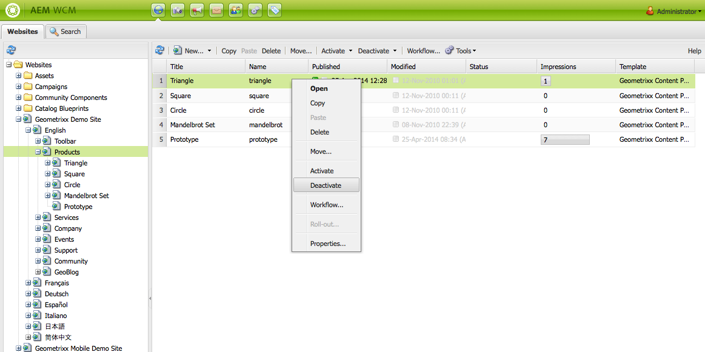
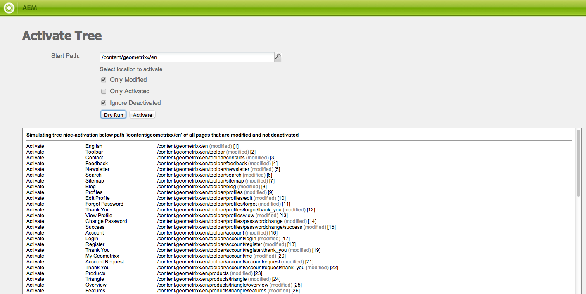

# Publicera sidor{#publishing-pages}

När du har skapat och granskat ditt innehåll i författarmiljön är målet att göra det tillgängligt på din offentliga webbplats (din publiceringsmiljö).

Detta kallas att publicera en sida. När du vill ta bort en sida från publiceringsmiljön kallas det för att avpublicera. När sidan publiceras och avpubliceras är den fortfarande tillgänglig i redigeringsmiljön för ytterligare ändringar tills du tar bort den.

Du kan även publicera/avpublicera en sida direkt eller vid ett fördefinierat datum/tid i framtiden.

>[!NOTE]
>
>Vissa termer om publicering kan vara förvirrade:
>
>* **Publicera/avpublicera**
   >  Detta är de primära villkoren för de åtgärder som gör innehållet tillgängligt för allmänheten i publiceringsmiljön (eller inte).
   >
   >
* **Aktivera/inaktivera**
   >  Dessa termer är synonyma med publicera/avpublicera.
   >
   >
* **Replikering/replikering**
   >  Detta är de tekniska termer som beskriver hur data (t.ex. sidinnehåll, filer, kod, användarkommentarer) flyttas från en miljö till en annan, t.ex. vid publicering eller omvänd replikering av användarkommentarer.
>

>[!NOTE]
>
>Om du inte har behörighet att publicera en viss sida:
>
>* Ett arbetsflöde kommer att utlösas för att meddela lämplig person om din begäran om publicering.
>* Ett meddelande om detta visas (under en kort tidsperiod).
>

## Publicera en sida {#publishing-a-page}

Det finns två metoder för att aktivera en sida:

* [från webbplatskonsolen](#activating-a-page-from-the-websites-console)
* [från sidosparken på själva sidan](#activating-a-page-from-sidekick)

>[!NOTE]
>
>Du kan också aktivera ett underträd med flera sidor med [Aktivera träd](#howtoactivateacompletesectiontreeofyourwebsite) på verktygskonsolen.

### Aktivera en sida från webbplatskonsolen {#activating-a-page-from-the-websites-console}

Du kan aktivera sidor i webbplatskonsolen. När du har öppnat en sida och ändrat innehållet återgår du till webbplatskonsolen:

1. Markera den sida som du vill aktivera i webbplatskonsolen.
1. Välj **Aktivera**, antingen på den översta menyn eller på den nedrullningsbara menyn på det markerade sidobjektet.

   Om du vill aktivera innehållet på sidan och alla dess undersidor använder du [**verktygskonsolen **](/help/sites-classic-ui-authoring/classic-page-author-publish-pages.md#howtoactivateacompletesectiontreeofyourwebsite).

   

   >[!NOTE]
   >
   >Om det behövs begär AEM att du aktiverar eller återaktiverar alla resurser som är länkade till sidan. Du kan markera eller avmarkera kryssrutorna för att aktivera dessa resurser.

1. Om det behövs begär AEM att du aktiverar eller återaktiverar alla resurser som är länkade till sidan. Du kan markera eller avmarkera kryssrutorna för att aktivera dessa resurser.

   

1. AEM WCM aktiverar det valda innehållet. Den eller de publicerade sidorna visas i [webbplatskonsolen](/help/sites-classic-ui-authoring/author-env-basic-handling.md#page-information-on-the-websites-console) (markerat som grön) med information om vem som aktiverat innehållet samt datum och tid för aktiveringen.

   

### Aktivera en sida från Sidekick {#activating-a-page-from-sidekick}

Du kan också aktivera en sida när du har den öppen för redigering.

När du har öppnat sidan och ändrat innehållet i den:

1. Klicka på fliken **Sida** i sparken.
1. Klicka på **Aktivera sida**.
Ett meddelande visas längst upp till höger i fönstret som bekräftar att sidan har aktiverats.

## Avpublicera en sida {#unpublishing-a-page}

Om du vill ta bort en sida från publiceringsmiljön inaktiverar du innehållet.

Så här inaktiverar du en sida:

1. Markera den sida som du vill inaktivera i webbplatskonsolen.
1. Välj **Inaktivera**, antingen på den översta menyn eller på den nedrullningsbara menyn för det markerade sidobjektet. Du ombeds bekräfta borttagningen.

   

1. Uppdatera [webbplatskonsolen](/help/sites-classic-ui-authoring/author-env-basic-handling.md#page-information-on-the-websites-console) och innehållet är markerat med rött, vilket anger att det inte längre är publicerat.

   

## Aktivera/inaktivera senare {#activate-deactivate-later}

### Aktivera senare {#activate-later}

Så här schemalägger du aktiveringen en senare tid:

1. Gå till menyn **Aktivera** i webbplatskonsolen och välj **Aktivera senare**.
1. I den dialogruta som öppnas anger du datum och tid för aktiveringen och klickar på **OK**. Då skapas en version av sidan som aktiveras vid den angivna tidpunkten.

   

När du aktiverar senare startas ett arbetsflöde för att aktivera den här versionen av sidan vid den angivna tidpunkten. Omvänt gäller att om du inaktiverar senare startas ett arbetsflöde för att inaktivera den här versionen av sidan vid en viss tidpunkt.

Om du vill avbryta aktiveringen/inaktiveringen går du till [arbetsflödeskonsolen](/help/sites-administering/workflows-administering.md#main-pars_title_3-yjqslz-refd) och avslutar motsvarande arbetsflöde.

### Inaktivera senare {#deactivate-later}

Så här schemalägger du din inaktivering en senare tid:

1. Gå till menyn **Inaktivera** i webbplatskonsolen och välj **Inaktivera senare**.

1. I den dialogruta som öppnas anger du datum och tid för inaktiveringen och klickar på **OK**.

   

**Om du inaktiverar** senare startas ett arbetsflöde för att inaktivera den här versionen av sidan vid en viss tidpunkt.

Om du vill avbryta inaktiveringen går du till [arbetsflödeskonsolen](/help/sites-administering/workflows-administering.md#main-pars_title_3-yjqslz-refd) och avslutar motsvarande arbetsflöde.

## Schemalagd aktivering/inaktivering (på/av-tid) {#scheduled-activation-deactivation-on-off-time}

Du kan schemalägga tider för en sida som ska publiceras/avpubliceras med **På-tid** och **Fråntid** som kan definieras i [Sidegenskaper](/help/sites-classic-ui-authoring/classic-page-author-edit-page-properties.md).

### Bestämmer sidpubliceringsstatus {#determining-page-publication-status-classic-ui}

Statusen visas i [webbplatskonsolen](/help/sites-classic-ui-authoring/author-env-basic-handling.md#page-information-on-the-websites-console). Färgerna anger publiceringsstatus.

## Aktivera ett komplett avsnitt (träd) av webbplatsen {#activating-a-complete-section-tree-of-your-website}

På fliken **Webbplatser** kan du aktivera de enskilda sidorna. När du har angett eller uppdaterat ett stort antal innehållssidor, som alla finns på samma rotsida, kan det vara enklare att aktivera hela trädet i en åtgärd. Du kan också köra en torr körning för att emulera en aktivering och markera vilka sidor som ska aktiveras.

1. Öppna **verktygskonsolen** genom att markera den på sidan **Välkommen** och dubbelklicka sedan på **Replikering** för att öppna konsolen ( `https://localhost:4502/etc/replication.html`).

   

1. På **replikeringskonsolen** klickar du på **Aktivera träd**.

   Följande fönster ( `https://localhost:4502/etc/replication/treeactivation.html`) visas.

   

1. Ange **startsökvägen**. Detta anger sökvägen till roten för det avsnitt som du vill aktivera (publicera). Den här sidan och alla underliggande sidor kan aktiveras (eller användas i emuleringen om en torr körning har valts).
1. Aktivera urvalskriterierna efter behov:

   * **Endast ändrad**: bara aktivera sidor som har ändrats.
   * **Endast aktiverad**: bara aktivera sidor som har (redan) aktiverats. Fungerar som en form av omaktivering.
   * **Ignorera inaktiverade**: ignorera sidor som har inaktiverats.

1. Välj den åtgärd som du vill utföra:

   1. Välj **Torr körning** om du vill kontrollera vilka sidor som *skulle* aktiveras. Detta är bara en emulering, inga sidor aktiveras.

   1. Välj **Aktivera** om du vill aktivera sidorna.
