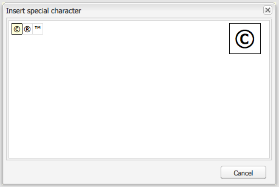

# RTF-redigerare {#rich-text-editor}

RTF-redigeraren är en grundläggande byggsten för inmatning av textinnehåll i AEM. Den utgör grunden för olika komponenter, bland annat

* Text
* Textbild
* Tabell

## RTF-redigerare {#rich-text-editor-1}

Dialogrutan för WYSIWYG-redigering innehåller många olika funktioner:

>[!NOTE]
>
>De tillgängliga funktionerna kan konfigureras för enskilda projekt, så de kan variera för din installation.

## Direktredigering {#in-place-editing}

Förutom det dialogbaserade läget för textredigering i Rich Text, innehåller AEM även redigeringsläget på plats, som gör det möjligt att redigera texten direkt när den visas i layouten på sidan.

Klicka två gånger på ett stycke (ett långsamt dubbelklick) för att gå in i redigeringsläget (komponentens kantlinje är nu orange).

Du kan redigera texten direkt på sidan i stället för i ett dialogrutefönster. Gör bara ändringarna så sparas de automatiskt.

>[!NOTE]
>
>Om du har innehållshanteraren öppen visas ett verktygsfält med formateringsalternativen för textredigering överst på fliken (se ovan).
>
>Om innehållssökaren inte är öppen visas inte verktygsfältet.

För närvarande är läget Redigering på plats aktiverat för sidelement som genereras av komponenterna **Text** och **Titel** .

>[!NOTE]
>
>Komponenten [!UICONTROL Title] är utformad för att innehålla en kort text utan radbrytningar. När du redigerar en titel i läget för infogad redigering öppnas en ny **textkomponent** under titeln när du skriver en radbrytning.

## Funktioner i RTF-redigeraren {#features-of-the-rich-text-editor}

RTF-redigeraren innehåller ett antal funktioner, som [beror på den enskilda komponentens konfiguration](/help/sites-administering/rich-text-editor.md) . Funktionerna är tillgängliga för både pekoptimerade och klassiska användargränssnitt.

### Grundläggande teckenformat {#basic-character-formats}

Här kan du formatera markerade tecken (markerade); Vissa alternativ har även kortkommandon:

* Fet (Ctrl-B)
* Kursiv (Ctrl-I)
* Understruken (Ctrl-U)
* Nedsänkt
* Upphöjd

Alla fungerar som en växlingsknapp, så om du väljer det tas formatet bort.

### Fördefinierade format och format {#predefined-styles-and-formats}

Installationen kan innehålla fördefinierade format och format. De är tillgängliga i listrutorna **[!UICONTROL Format]** och **[!UICONTROL Format]** och kan användas på text som du har valt.

Ett format kan användas på en viss sträng (ett format korrelerar till CSS):

Ett format tillämpas på hela textstycket (ett format är HTML-baserat):

Ett visst format kan bara ändras (standardformatet är **[!UICONTROL Stycke]**).

Ett format kan tas bort; placera markören i texten som formatet har tillämpats på och klicka på ikonen Ta bort:

>[!CAUTION]
>
>Markera inte om någon text som formatet har tillämpats på eller så inaktiveras ikonen.

### Klipp ut, Kopiera, Klistra in {#cut-copy-paste}

Standardfunktionerna i **[!UICONTROL Klipp]** ut och **[!UICONTROL Kopiera]** är tillgängliga. Flera varianter av **[!UICONTROL Klistra]** in finns tillgängliga för olika format.

* Klipp ut (Ctrl-X)
* Kopiera (Ctrl-C)
* PasteDetta är standardmekanismen för inklistring (Ctrl-V) av komponenten. vid installation utanför ramarna är detta konfigurerat att [!UICONTROL klistra in från Word].

* Klistra in som text: Tar bort alla format och formatering så att endast oformaterad text klistras in.

* Klistra in från Word: Innehållet klistras in som HTML (med viss nödvändig formatering).

### Ångra, Gör om {#undo-redo}

AEM sparar information om dina senaste 50 åtgärder i den aktuella komponenten, i kronologisk ordning. Dessa åtgärder kan ångras (och sedan göras om) i strikt ordning om det behövs.

>[!CAUTION]
>
>Historiken sparas bara för den aktuella redigeringssessionen. Den startas om varje gång du öppnar komponenten för redigering.

>[!NOTE]
>
>Femtio är standardantalet uppgifter. Detta kan vara annorlunda för din installation.

### Justering {#alignment}

Texten kan antingen vara vänsterjusterad, centrerad eller högerjusterad.

### Indrag {#indentation}

Indraget för ett stycke kan ökas eller minskas. Det markerade stycket dras in och ny text som matas in behåller den aktuella indragsnivån.

### Listor {#lists}

Du kan skapa både punktlistor och numrerade listor i texten. Välj listtyp och börja skriva eller markera texten som ska konverteras. I båda fallen startar en radmatning ett nytt listobjekt.

Du kan skapa kapslade listor genom att dra in ett eller flera listobjekt.

Du kan ändra formatet på en lista genom att placera markören i listan och sedan välja det andra formatet. En underlista kan också ha ett annat format än innehållslistan. Detta kan användas när underlistan har skapats (med indrag).

### Länkar {#links}

En länk till en URL-adress (antingen på din webbplats eller på en extern plats) skapas genom att markera texten och sedan klicka på hyperlänkikonen:

I en dialogruta kan du ange mål-URL; även om den ska öppnas i ett nytt fönster.

Du kan:

* Skriv in en URI direkt
* Använd webbplatskartan för att välja en sida på webbplatsen
* Ange URI:n och lägg sedan till målankarpunkten;t.ex. `www.TargetUri.org#AnchorName`
* Ange endast en ankarpunkt (för att referera till&quot;den aktuella sidan&quot;);Till exempel: `#anchor`
* Söka efter en sida i innehållssökaren och dra och släpp sidikonen i hyperlänksdialogrutan

>[!NOTE]
>
>URI:n kan prepended med något av de protokoll som är konfigurerade för din installation. I en standardinstallation är dessa `https://`, `ftp://`och `mailto:`. Protokoll som inte har konfigurerats för din installation kommer att avvisas och markeras som ogiltiga.

Om du vill bryta länken placerar du markören var som helst i länktexten och klickar på ikonen [!UICONTROL Bryt länk] :

### Fästpunkter {#anchors}

Du kan skapa en ankarpunkt var som helst i texten genom att antingen placera markören eller markera text. Klicka sedan på ikonen **Ankarpunkt** för att öppna dialogrutan.

Ange namnet på ankaret och klicka sedan på **OK** för att spara.

Fästpunkten visas när komponenten redigeras och kan nu användas inom ett länkmål.

### Sök och ersätt {#find-and-replace}

AEM tillhandahåller både en **Sök** - och en **Ersätt** -funktion (sök och ersätt).

Båda har en **Sök efter nästa** knapp för att söka efter den angivna textens öppna komponent. Du kan också ange om du vill att skiftläget (övre/nedre) ska matchas.

Sökningen startar alltid från den aktuella markörpositionen i texten. När komponentens slut nås visas ett meddelande om att nästa sökåtgärd kommer att starta uppifrån.

Med alternativet **Ersätt** kan du **söka** och sedan **ersätta** en enskild instans med den angivna texten eller **ersätta alla** instanser i den aktuella komponenten.

### Bilder {#images}

Du kan dra bilder från innehållssökaren för att lägga till dem i texten.

>[!NOTE]
>
>AEM erbjuder också specialkomponenter för mer detaljerad bildkonfiguration. Komponenterna **Bild** och **Textbild** är till exempel tillgängliga.

### Stavningskontroll {#spelling-checker}

Stavningskontrollen kontrollerar all text i den aktuella komponenten.

Felaktiga stavningar kommer att markeras:

>[!NOTE]
>
>Stavningskontrollen fungerar på webbplatsens språk antingen genom att använda underträdets language-egenskap eller genom att extrahera språket från URL:en. Till exempel kontrolleras `en` grenen för engelska och den för tyska för `de` grenen.

### Tabeller {#tables}

Tabeller är tillgängliga båda:

* Som **tabellkomponenten**

   

* I **Text** -komponenten

   

   >[!NOTE]
   >
   >Även om tabeller är tillgängliga i textredigeraren bör du använda **tabellkomponenten** när du skapar tabeller.

I både **Text** - och **Table** -komponenterna är tabellfunktionaliteten tillgänglig via snabbmenyn (oftast högermusknappen) som klickas i tabellen. till exempel:

>[!NOTE]
>
>I **tabellkomponenten** finns det också ett specialverktygsfält, som innehåller olika RTF-redigeringsfunktioner och en delmängd av tabellspecifika funktioner.

Tabellspecifika funktioner är:

* [Tabellegenskaper](#table-properties)
* [Cellegenskaper](#cell-properties)
* [Lägg till eller ta bort rader](#add-or-delete-rows)
* [Lägg till eller ta bort kolumner](#add-or-delete-columns)
* [Markera hela rader eller kolumner](#selecting-entire-rows-or-columns)
* [Sammanfoga celler](#merge-cells)
* [Dela celler](#split-cells)
* [Kapslade tabeller](#creating-nested-tables)
* [Ta bort tabell](#remove-table)

#### Tabellegenskaper {#table-properties}

Tabellens grundläggande egenskaper kan konfigureras innan du klickar på **OK** för att spara:

* **Bredd**: Tabellens totala bredd.

* **Höjd**: Tabellens totala höjd.

* **Kant**: Tabellkantens storlek.

* **Cellutfyllnad**: Detta definierar det tomma utrymmet mellan cellinnehållet och dess kanter.

* **Cellmellanrum**: Här definierar du avståndet mellan cellerna.

>[!NOTE]
>
>Vissa cellegenskaper, som Bredd och Höjd, kan definieras som pixlar eller som procentvärden.

>[!CAUTION]
>
>Du bör ange en bredd för tabellen.

#### Cellegenskaper {#cell-properties}

Egenskaperna för en viss cell, eller serie med celler, kan konfigureras:

* **Bredd**
* **Höjd**
* **Vågrät justering** - vänster, mitten eller höger
* **Lodrät justering** - Överkant, Mitten, Underkant eller Baslinje
* **Celltyp**- Data eller rubrik
* **** Använd för: En cell, Hela raden, Hela kolumnen

#### Lägg till eller ta bort rader {#add-or-delete-rows}

Rader kan läggas till antingen ovanför eller under den aktuella raden.

Den aktuella raden kan också tas bort.

#### Lägg till eller ta bort kolumner {#add-or-delete-columns}

Du kan lägga till kolumner till vänster eller höger om den aktuella kolumnen.

Den aktuella kolumnen kan också tas bort.

#### Markera hela rader eller kolumner {#selecting-entire-rows-or-columns}

Markerar hela den aktuella raden eller kolumnen. Särskilda åtgärder (t.ex. sammanslagning) är då tillgängliga.

#### Sammanfoga celler {#merge-cells}

 

* Om du har markerat en grupp celler kan du sammanfoga dessa till en.
* Om du bara har markerat en cell kan du sammanfoga den med cellen till höger eller nedanför.

#### Dela celler {#split-cells}

Markera en enskild cell för att dela den:

* Om du delar en cell vågrätt skapas en ny cell till höger om den aktuella cellen, i den aktuella kolumnen.
* När du delar en cell lodrätt genereras en ny cell under den aktuella cellen, men inom den aktuella raden.

#### Creating Nested Tables {#creating-nested-tables}

Om du skapar en kapslad tabell skapas en ny, fristående tabell i den aktuella cellen.

>[!NOTE]
>
>Viss ytterligare beteende är webbläsarberoende:
>
>* Windows IE: Använd Ctrl+primär-musknapp-klicka (vanligen vänster) för att markera flera celler.
>* Firefox: Markera ett cellområde genom att dra pekaren.

#### Ta bort tabell {#remove-table}

Använd alternativet för att ta bort tabellen från **[!UICONTROL Text]** -komponenten.

### Specialtecken {#special-characters}

Specialtecken kan göras tillgängliga för textredigeraren; de kan variera beroende på installationen.

Använd muspekaren för att se en förstorad version av tecknet och klicka sedan för att det ska tas med på den aktuella platsen i texten.

### Källredigeringsläge {#source-editing-mode}

I källredigeringsläget kan du visa och redigera komponentens underliggande HTML-kod.

Så texten:

Ser ut så här i källäge (källan är ofta mycket längre, så du måste rulla):

>[!CAUTION]
>
>När du lämnar källäget gör AEM vissa valideringskontroller (till exempel ser du till att texten finns korrekt i/kapslas i block). Detta kan leda till ändringar i dina redigeringar.
