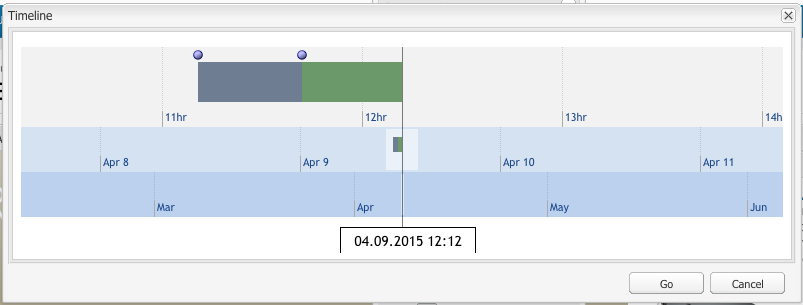

# Arbeta med sidversioner{#working-with-page-versions}

Versionshantering skapar en ögonblicksbild av en sida vid en viss tidpunkt. Med versionshantering kan du utföra följande åtgärder:

* Skapa en sidversion.
* Återställ en sida till en tidigare version så att du kan ångra en ändring som du har gjort på en sida.
* Jämför den aktuella versionen av en sida med en tidigare version med skillnader i markerad text och bild.

## Skapa en version {#creating-a-new-version}

Skapa en version av en sida:

1. Öppna sidan som du vill skapa en version för i webbläsaren.
1. I Sidekick väljer du fliken **Versioning** och sedan underfliken **Skapa version** .

   

1. Ange en **kommentar** (valfritt).
1. Om du vill ange en etikett för versionen (valfritt) klickar du på knappen **Mer >>** och anger namnet på **Label** för versionen. Om etiketten inte är inställd blir versionen ett automatiskt ökande nummer.
1. Klicka på **Skapa version**. Ett grått meddelande visas på sidan, till exempel:
Version 1.2 skapad för: Skisser.

>[!NOTE]
>
>En version skapas automatiskt när sidan aktiveras.

## Återställa en sidversion från Sidekick {#restoring-a-page-version-from-sidekick}

Så här återställer du sidan till en tidigare version:

1. Öppna sidan som du vill återställa en tidigare version för.
1. I sidosparken väljer du fliken **Version** och sedan underfliken **Återställ version**.

   

1. Markera den version som du vill återställa och välj **Återställ**.

## Återställa en sidversion från konsolen {#restoring-a-page-version-from-the-console}

Den här metoden kan användas för att återställa en sidversion. Den kan även användas för att återställa sidor som tidigare har tagits bort:

1. Gå till sidan som du vill återställa i konsolen **Webbplatser** och markera den.
1. I den övre menyn väljer du **Verktyg** och sedan **Återställ**:

   

1. Om du väljer **Återställ version..** visas versioner av dokument i den aktuella mappen. Även om en sida har tagits bort visas den senaste versionen:

   

1. Markera den version som du vill återställa och klicka på **Återställ**. AEM återställer de versioner (eller träd) som du väljer.

### Återställa ett träd från konsolen {#restoring-a-tree-from-the-console}

Den här metoden kan användas för att återställa en sidversion. Den kan även användas för att återställa sidor som tidigare har tagits bort:

1. Gå till mappen som du vill återställa i konsolen **Webbplatser** och markera den.
1. Välj **Verktyg** på den översta menyn och sedan **Återställ**.
1. Om du väljer **Återställ träd..** öppnas dialogrutan så att du kan välja det träd som du vill återställa:

   

1. Klicka på **Återställ**. AEM återställer trädet som du har valt.

## Jämföra med en tidigare version {#comparing-with-a-previous-version}

Så här jämför du den aktuella versionen av sidan med en tidigare version:

1. I webbläsaren öppnar du sidan som du vill jämföra med en tidigare version för.
1. I Sidekick väljer du fliken **Version** och sedan underfliken **Återställ version** n.

   

1. Markera den version som du vill jämföra och klicka på knappen **Diff** .
1. Skillnaderna mellan den aktuella versionen och den valda versionen visas enligt följande:

   * Text som har tagits bort är röd och genomstruken.
   * Text som har lagts till är grön och markerad.
   * Bilder som har lagts till eller tagits bort är gröna ramar.

   

1. I Sidekick väljer du underfliken **Återställ version** och klickar på knappen **&lt;&lt;Bakåt** för att visa den aktuella versionen.

## Timewarp {#timewarp}

Timewarp är en funktion som har utformats för att simulera en sidas ***publicerade***-läge vid en viss tidpunkt.

Syftet är att du ska kunna spåra den publicerade webbplatsen vid den valda tidpunkten. Detta använder sidaktiveringarna för att avgöra status för publiceringsmiljön.

Så här gör du:

* Systemet söker efter den sidversion som var aktiv vid den valda tidpunkten.
* Det innebär att den visade versionen skapades/aktiverades *före* den tidpunkt som valdes i Timewarp.
* När du navigerar till en sida som har tagits bort återges även den, så länge som de gamla versionerna av sidan fortfarande är tillgängliga i databasen.
* Om ingen publicerad version hittas återgår Timewarp till sidans aktuella läge i författarmiljön (detta för att förhindra ett fel/404-sida, vilket innebär att du inte kan bläddra längre).

>[!NOTE]
>
>Om versioner tas bort från databasen kan inte Timewarp visa rätt vy. Om elementen (till exempel kod, css och bilder) för återgivning av webbplatsen har ändrats skiljer sig vyn från den ursprungliga vyn, eftersom dessa objekt inte versionsindelas i databasen.

### Använda tidskonturkalendern {#using-the-timewarp-calendar}

Timewarp är tillgängligt från sidosparken.

Kalenderversionen används om du har en viss dag att visa:

1. Öppna fliken **Versionshantering** och klicka sedan på **Timewarp** (nära sidsparkens nederkant). Följande dialogruta visas:

   

1. Använd väljarna för datum och tid för att ange önskat datum/tid och klicka sedan på **Gå**.

   Timewarp visar sidan som den var i publicerat läge före/på det datum du valde.

   >[!NOTE]
   >
   >Timewarp fungerar bara helt om du tidigare har publicerat sidan. Om inte, visar Timewarp den aktuella sidan i författarmiljön.

   >[!NOTE]
   >
   >Om du navigerar till en sida som har tagits bort eller tagits bort från databasen, återges den korrekt om äldre versioner av sidan fortfarande är tillgängliga i databasen.

   >[!NOTE]
   >
   >Du kan inte redigera den gamla versionen av sidan. Det är bara tillgängligt för visning. Om du vill återställa den äldre versionen kan du göra det manuellt med [restore](/help/sites-classic-ui-authoring/classic-page-author-work-with-versions.md#restoring-a-page-version-from-sidekick).

1. När du är klar klickar du på:

   * **Avsluta Timewarp** om du vill avsluta och återgå till den aktuella författarsidan.
   * [Visa tidslinjen](#using-the-timewarp-timeline) så att du kan visa tidslinjen.

   

### Använda tidslinjen för tidsförvrängning {#using-the-timewarp-timeline}

Tidslinjeversionen används om du vill se en översikt över publiceringsaktiviteterna på sidan.

Om du vill visa tidslinjen i dokumentet:

1. Gör något av följande om du vill visa tidslinjen:

   1. Öppna fliken **Versionshantering** och klicka sedan på **Timewarp** (nära sidsparkens nederkant).

   1. Använd dialogrutan för sidsparning som visas efter [med hjälp av Timewarp-kalendern](#using-the-timewarp-calendar).

1. Klicka på **Visa tidslinje** - dokumentets tidslinje visas, till exempel:

   

1. Markera och flytta (håll ned och dra) tidslinjen för att flytta genom dokumentets tidslinje.

   * Alla rader visar publicerade versioner.
När en sida är aktiverad börjar en ny rad. Varje gång dokumentet redigeras visas en ny färg.
I exemplet nedan anger den röda linjen att sidan redigerades under tidsramen för den ursprungliga gröna versionen. Den gula raden anger att sidan har redigerats någon gång under den röda versionen, och så vidare.

   

1. Klicka:

   1. **Gå** om du vill visa innehållet på den publicerade sidan vid den valda tidpunkten.
   1. När du visar innehållet använder du **Avsluta tidsförvrängning** för att avsluta och återgå till den aktuella författarsidan.

### Begränsningar för Timewarp {#timewarp-limitations}

Med Timewarp kan du göra ett bra försök att återskapa en sida vid en viss tidpunkt. På grund av komplexiteten i den kontinuerliga redigeringen av innehåll i AEM är detta dock inte alltid möjligt. Dessa begränsningar bör beaktas när du använder Timewarp.

* **Timewarp fungerar baserat på publicerade sidor** - Timewarp fungerar bara helt om du tidigare har publicerat sidan. Om inte, visar Timewarp den aktuella sidan i författarmiljön.
* **Timewarp använder sidversioner** - Om du navigerar till en sida som har tagits bort/tagits bort från databasen återges den korrekt om gamla versioner av sidan fortfarande är tillgängliga i databasen.
* **Borttagna versioner påverkar Timewarp** - Om versioner tas bort från databasen kan inte Timewarp visa rätt vy.

* **Timewarp är skrivskyddat** - du kan inte redigera den gamla versionen av sidan. Det är bara tillgängligt för visning. Om du vill återställa den äldre versionen kan du göra det manuellt med [restore](#main-pars-title-1).

* **Timewarp baseras bara på sidinnehåll** - Om element som kod, css och bildresurser - för återgivning av webbplatsen har ändrats, skiljer sig vyn från den ursprungliga vyn. Orsaken är att dessa objekt inte versionshanteras i databasen.

>[!CAUTION]
>
>Timewarp är utformat för att hjälpa författare att förstå och skapa sitt innehåll. Den är inte avsedd som en revisionslogg eller för juridiska ändamål.
