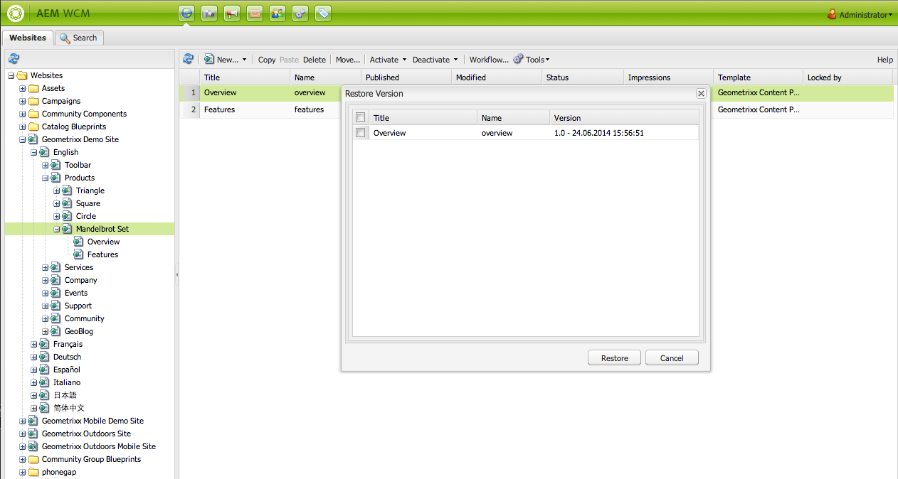
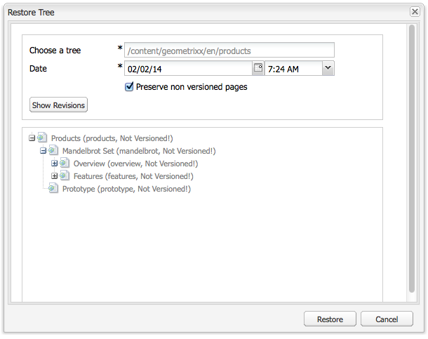

# Arbeta med sidversioner{#working-with-page-versions}

Versionshantering skapar en ögonblicksbild av en sida vid en viss tidpunkt. Med versionshantering kan du utföra följande åtgärder:

* Skapa en version av en sida.
* Återställ en sida till en tidigare version för att ångra en ändring som du har gjort på en sida, till exempel.
* Jämför den aktuella versionen av en sida med en tidigare version med skillnader i markerad text och bild.

## Skapa en ny version {#creating-a-new-version}

Så här skapar du en ny version av en sida:

1. Öppna sidan som du vill skapa en ny version för i webbläsaren.
1. I Sidekick väljer du **Versionshantering** -fliken och sedan **Skapa version** underflik.

   

1. Ange **Kommentar** (valfritt).
1. Om du vill ange en etikett för versionen (valfritt) klickar du på **Mer >>** och ange **Etikett** för att namnge versionen. Om etiketten inte är inställd blir versionen ett automatiskt ökande nummer.
1. Klicka **Skapa version**. Ett grått meddelande visas på sidan. till exempel: Version 1.2 har skapats för: Skruvar.

>[!NOTE]
>
>En version skapas automatiskt när sidan aktiveras.

## Återställa en sidversion från Sidekick {#restoring-a-page-version-from-sidekick}

Så här återställer du sidan till en tidigare version:

1. Öppna sidan som du vill återställa en tidigare version för.
1. I sidosparken väljer du **Versionshantering** -fliken och sedan **Återställ version** underflik.

   

1. Välj den version som du vill återställa och välj **Återställ**.

## Återställa en sidversion från konsolen {#restoring-a-page-version-from-the-console}

Den här metoden kan användas för att återställa en sidversion. Den kan även användas för att återställa sidor som tidigare har tagits bort:

1. I **Webbplatser** navigera till sidan som du vill återställa och markera den.
1. På den övre menyn väljer du **verktyg** sedan **Återställ**:

   

1. Markera **Återställ version...** visar versioner av dokument i den aktuella mappen. Även om en sida har tagits bort visas den senaste versionen:

   

1. Välj den version som du vill återställa och klicka på **Återställ**. AEM återställer de versioner (eller träd) som du väljer.

### Återställa ett träd från konsolen {#restoring-a-tree-from-the-console}

Den här metoden kan användas för att återställa en sidversion. Den kan även användas för att återställa sidor som tidigare har tagits bort:

1. I **Webbplatser** navigera till mappen som du vill återställa och markera den.
1. På den övre menyn väljer du **verktyg** sedan **Återställ**.
1. Markera **Återställ träd..** öppnar dialogrutan där du kan välja det träd som du vill återställa:

   

1. Klicka **Återställ**. AEM återställer det markerade trädet.

## Jämföra med en tidigare version {#comparing-with-a-previous-version}

Så här jämför du den aktuella versionen av sidan med en tidigare version:

1. I webbläsaren öppnar du sidan som du vill jämföra med en tidigare version för.
1. I Sidekick väljer du **Versionshantering** -fliken och sedan **Återställ version** en underflik.

   

1. Välj den version du vill jämföra och klicka på **Diff** -knappen.
1. Skillnaderna mellan den aktuella versionen och den valda versionen visas enligt följande:

   * Text som har tagits bort är röd och genomstruken.
   * Text som har lagts till är grön och markerad.
   * Bilder som har lagts till eller tagits bort är gröna ramar.

   

1. I Sidekick väljer du **Återställ version** underfliken och klicka på **&lt;&lt;back span=&quot;&quot; id=&quot;3&quot; translate=&quot;no&quot; /> för att visa den aktuella versionen.**

## Timewarp {#timewarp}

Timewarp är en funktion som simulerar ***publicerad*** en sidas status vid en viss tidpunkt tidigare.

Syftet är att du ska kunna spåra den publicerade webbplatsen vid den valda tidpunkten. Detta använder sidaktiveringarna för att avgöra status för publiceringsmiljön.

Så här gör du:

* Systemet söker efter den sidversion som var aktiv vid den valda tidpunkten.
* Detta innebär att den visade versionen skapades/aktiverades *före* den tidpunkt som valts i Timewarp.
* När du navigerar till en sida som har tagits bort återges även den, så länge som de gamla versionerna av sidan fortfarande är tillgängliga i databasen.
* Om ingen publicerad version hittas återgår Timewarp till sidans aktuella status i redigeringsmiljön (detta för att förhindra ett fel/404-sida, vilket innebär att du inte kan bläddra längre).

>[!NOTE]
>
>Om versioner tas bort från databasen kan inte Timewarp visa rätt vy. Om element (som kod, css, bilder osv.) för återgivning av webbplatsen har ändrats, skiljer sig vyn från den ursprungliga, eftersom objekten inte versionsindelas i databasen.

### Använda tidskonverteringskalendern {#using-the-timewarp-calendar}

Timewarp är tillgängligt från sidosparken.

Kalenderversionen används om du har en viss dag att visa:

1. Öppna **Versionshantering** och sedan klicka **Timewarp** (nära sidesparkens nederkant). Följande dialogruta visas:

   

1. Använd datum- och tidsväljare för att ange datum/tid och klicka **Gå**.

   Timewarp visar sidan som den var i publicerat läge före/på det datum du valt.

   >[!NOTE]
   >
   >Timewarp fungerar bara helt om du tidigare har publicerat sidan. I annat fall visas den aktuella sidan i författarmiljön.

   >[!NOTE]
   >
   >Om du navigerar till en sida som har tagits bort/tagits bort från databasen kommer den att återges korrekt om äldre versioner av sidan fortfarande är tillgängliga i databasen.

   >[!NOTE]
   >
   >Du kan inte redigera den gamla versionen av sidan. Det är bara tillgängligt för visning. Om du vill återställa den äldre versionen måste du göra det manuellt med [återställ](/help/sites-classic-ui-authoring/classic-page-author-work-with-versions.md#restoring-a-page-version-from-sidekick).

1. När du är klar med visningen av sidan klickar du på:

   * **Avsluta tidsförvrängning** för att avsluta och återgå till den aktuella författarsidan.
   * [Visa tidslinje](#using-the-timewarp-timeline) för att visa tidslinjen.

   

### Använda tidslinjen för tidsförvrängning {#using-the-timewarp-timeline}

Tidslinjeversionen används om du vill se en översikt över publiceringsaktiviteterna på sidan.

Om du vill visa tidslinjen i dokumentet:

1. Så här visar du tidslinjen:

   1. Öppna **Versionshantering** och sedan klicka **Timewarp** (nära sidesparkens nederkant).

   1. Använd dialogrutan för sidspark som visas efter [med tidskonverteringskalendern](#using-the-timewarp-calendar).

1. Klicka på **Visa tidslinje** - dokumentets tidslinje visas, till exempel:

   

1. Markera och flytta (håll ned och dra) tidslinjen för att flytta genom dokumentets tidslinje.

   * Alla rader visar publicerade versioner.
När en sida är aktiverad börjar en ny rad. Varje gång dokumentet redigeras visas en ny färg.
I exemplet nedan anger den röda linjen att sidan redigerades under tidsramen för den ursprungliga gröna versionen och den gula raden anger att sidan redigerades någon gång under den röda versionen osv.

   

1. Klicka på:

   1. **Gå** för att visa innehållet på den publicerade sidan vid den valda tidpunkten.
   1. När du visar innehållet ska du använda **Avsluta tidsförvrängning** för att avsluta och återgå till den aktuella författarsidan.

### Begränsningar för tidsförvrängning {#timewarp-limitations}

Med Timewarp kan du göra ett bra försök att återskapa en sida vid en viss tidpunkt. På grund av komplexiteten i den kontinuerliga redigeringen av innehåll i AEM är detta dock inte alltid möjligt. Dessa begränsningar bör beaktas när du använder Timewarp.

* **Timewarp fungerar baserat på publicerade sidor** - Timewarp fungerar bara helt om du tidigare har publicerat sidan. I annat fall visas den aktuella sidan i författarmiljön.
* **Timewarp använder sidversioner** - Om du navigerar till en sida som har tagits bort/tagits bort från databasen kommer den att återges korrekt om det fortfarande finns äldre versioner av sidan i databasen.
* **Borttagna versioner påverkar Timewarp** - Om versioner tas bort från databasen kan inte Timewarp visa rätt vy.

* **Timewarp är skrivskyddat** - Du kan inte redigera den gamla versionen av sidan. Det är bara tillgängligt för visning. Om du vill återställa den äldre versionen måste du göra det manuellt med [återställ](#main-pars-title-1).

* **Timewarp baseras bara på sidinnehåll** - Om element (som kod, css, resurser/bilder osv.) för återgivning av webbplatsen har ändrats, skiljer sig vyn från den ursprungliga, eftersom objekten inte versionsindelas i databasen.

>[!CAUTION]
>
>Timewarp är ett verktyg som hjälper författare att förstå och skapa sitt innehåll. Den är inte avsedd som en revisionslogg eller för juridiska ändamål.
