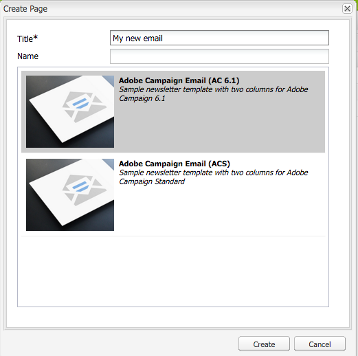
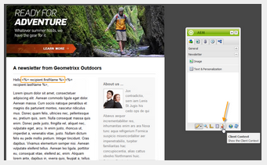
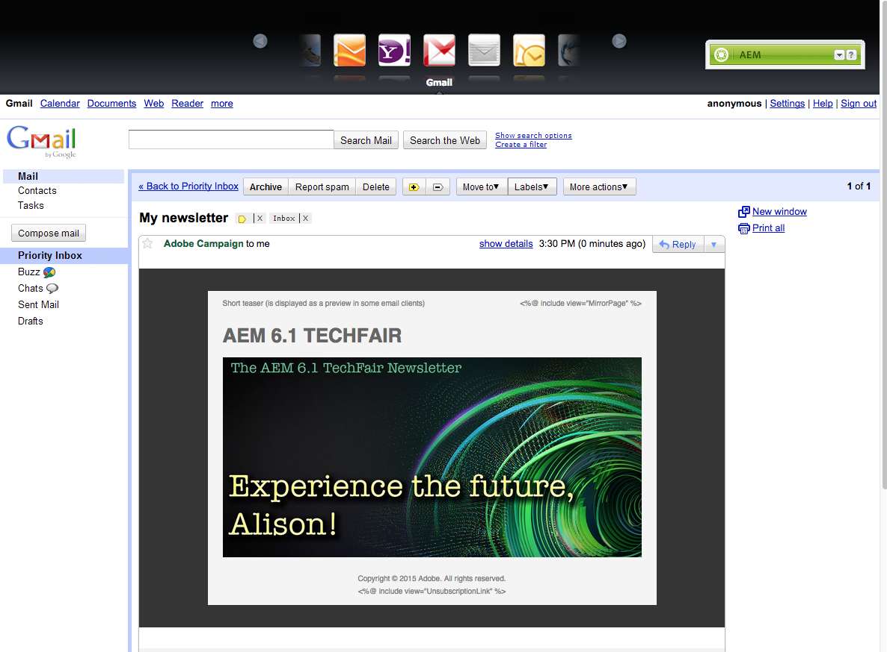

# Arbeta med Adobe Campaign 6.1 och Adobe Campaign Standard{#working-with-adobe-campaign-and-adobe-campaign-standard}

Du kan skapa e-postinnehåll i AEM och bearbeta det i e-postmeddelanden från Adobe Campaign. Om du vill göra det måste du:

1. Skapa ett nytt nyhetsbrev i AEM från en Adobe Campaign-specifik mall.
1. Välj [en Adobe Campaign-tjänst](#selectingtheadobecampaigncloudservice) innan du redigerar innehållet för att få tillgång till alla funktioner.
1. Redigera innehållet.
1. Validera innehållet.

Innehållet kan sedan synkroniseras med en leverans i Adobe Campaign. Detaljerade instruktioner beskrivs i det här dokumentet.

>[!NOTE]
>
>Innan du kan använda den här funktionen måste du konfigurera AEM så att det integreras med antingen [Adobe Campaign](/help/sites-administering/campaignonpremise.md) eller [Adobe Campaign Standard](/help/sites-administering/campaignstandard.md).

## Skicka e-postinnehåll via Adobe Campaign {#sending-email-content-via-adobe-campaign}

När du har konfigurerat AEM och Adobe Campaign kan du skapa e-postleveransinnehåll direkt i AEM och sedan bearbeta det i Adobe Campaign.

När du skapar Adobe Campaign-innehåll i AEM måste du länka till en Adobe Campaign-tjänst innan du redigerar innehållet för att få tillgång till alla funktioner.

Det finns två möjliga fall:

* Innehåll kan synkroniseras med en leverans från Adobe Campaign. På så sätt kan du använda AEM-innehåll i en leverans.
* (Endast Adobe Campaign lokalt) Innehållet kan skickas direkt till Adobe Campaign, som automatiskt genererar en ny e-postleverans. Det här läget har begränsningar.

Detaljerade instruktioner beskrivs i det här dokumentet.

### Skapa nytt e-postinnehåll {#creating-new-email-content}

>[!NOTE]
>
>När du lägger till e-postmallar måste du lägga till dem under **/innehåll/kampanjer** för att de ska vara tillgängliga.

1. I AEM väljer du **webbplatsmappen** och bläddrar sedan i utforskaren för att hitta var era e-postkampanjer hanteras. I följande exempel är den berörda noden **Webbplatser** > **Kampanjer** > **Geometrixx Outdoor** > **E-postkampanjer**.

   >[!NOTE]
   >
   >[E-postexempel är bara tillgängliga i Geometrixx](/help/sites-developing/we-retail.md#weretail). Hämta exempelinnehåll för Geometrixx från paketresurs.

   

1. Välj **Nytt** > **Ny sida** för att skapa nytt e-postinnehåll.
1. Välj en av de tillgängliga mallarna för Adobe Campaign och fyll sedan i de allmänna egenskaperna för sidan. Tre mallar är tillgängliga som standard:

   * **Adobe Campaign Email (AC 6.1)**: Med kan du lägga till innehåll i en fördefinierad mall innan du skickar den till Adobe Campaign 6.1 för leverans.
   * **Adobe Campaign Email (ACS)**: Med kan du lägga till innehåll i en fördefinierad mall innan du skickar den till Adobe Campaign Standard för leverans.
   

1. Klicka på **Skapa** för att skapa e-post eller nyhetsbrev.

### Välja molntjänst och mall för Adobe Campaign {#selecting-the-adobe-campaign-cloud-service-and-template}

Om du vill integrera med Adobe Campaign måste du lägga till en Adobe Campaign-molntjänst på sidan. Då får ni tillgång till personalisering och annan Adobe Campaign-information.

Dessutom kan du behöva välja Adobe Campaign-mallen, ändra ämnet och lägga till oformaterad text för användare som inte vill visa e-postmeddelandet i HTML.

1. Välj fliken **Sida** i sidosparken och välj sedan **Sidegenskaper.**
1. På fliken **Cloud-tjänster** i popup-fönstret väljer du **Lägg till tjänst** för att lägga till Adobe Campaign-tjänsten och klickar på **OK**.

   

1. Välj den konfiguration som matchar din Adobe Campaign-instans i listrutan och klicka sedan på **OK**.

   >[!NOTE]
   >
   >Tryck/klicka på **OK** eller **Använd** när du har lagt till molntjänsten. På så sätt kan fliken **Adobe Campaign** fungera som den ska.

1. Om du vill använda en annan mall för e-postleverans (från Adobe Campaign) än standardmallen för **e-post** väljer du **Sidegenskaper** igen. På fliken **Adobe Campaign** anger du e-postleveransmallens interna namn i den relaterade Adobe Campaign-instansen.

   I Adobe Campaign Standard är mallen **Delivery with AEM Content**. I Adobe Campaign 6.1 är mallen **E-postleverans med AEM-innehåll**.

   När du väljer en mall aktiveras komponenterna i **Adobe Campaign Newsletter** automatiskt.

### Redigera e-postinnehåll {#editing-email-content}

Du kan redigera e-postinnehåll antingen i det klassiska användargränssnittet eller i det pekoptimerade användargränssnittet.

1. Ange ämne och textversion för e-postmeddelandet genom att välja **Sidegenskaper** > **E-post** i verktygslådan.

   

1. Redigera e-postinnehåll genom att lägga till de element du vill ha från de som finns i sidosparken. Det gör du genom att dra och släppa dem. Dubbelklicka sedan på det element som du vill redigera.

   Du kan till exempel lägga till text som innehåller anpassningsfält.

   

   Se [Adobe Campaign Components](/help/sites-classic-ui-authoring/classic-personalization-ac-components.md) (Komponenter i Adobe Campaign) för en beskrivning av komponenter som är tillgängliga för nyhetsbrev/e-postkampanjer i Adobe Campaign.

   

### Infogar personalisering {#inserting-personalization}

När du redigerar innehåll kan du infoga:

* Kontextfält för Adobe Campaign. Det här är fält som du kan infoga i texten och som anpassas efter mottagarens data (till exempel förnamn, efternamn eller andra data i måldimensionen).
* Personaliseringsblock för Adobe Campaign. Detta är block med fördefinierat innehåll som inte är relaterat till mottagarens data, t.ex. en logotyp eller en länk till en spegelsida.

En fullständig beskrivning av Campaign-komponenterna finns i [Adobe Campaign-komponenter](/help/sites-classic-ui-authoring/classic-personalization-ac-components.md) .

>[!NOTE]
>
>* Endast områdena för målgruppsdimensionen i Adobe Campaign- **profiler** beaktas.
>* När du visar Egenskaper från **Webbplatser** har du inte tillgång till kontextfälten i Adobe Campaign. Du kan komma åt dessa direkt från e-postmeddelandet när du redigerar.
>

1. Infoga ett nytt **nyhetsbrev** > **Text &amp; Personalization (Campaign)** .
1. Öppna komponenten genom att dubbelklicka på den. Fönstret **Redigera** har en funktion som gör att du kan infoga anpassningselementen.

   >[!NOTE]
   >
   >De tillgängliga kontextfälten motsvarar måldimensionen för **profiler** i Adobe Campaign.
   >
   >Se [Länka en AEM-sida till ett Adobe Campaign-e-postmeddelande](/help/sites-classic-ui-authoring/classic-personalization-ac-campaign.md#linkinganaempagetoanadobecampaignemail).

   

1. Välj **Klientkontext** i sidosparken för att testa personaliseringsfälten med data i personprofilerna.

   

1. Ett fönster visas där du kan välja den person du vill använda. Anpassningsfälten ersätts automatiskt av data från den valda profilen.

   

### Förhandsgranska ett nyhetsbrev {#previewing-a-newsletter}

Du kan förhandsgranska hur nyhetsbrevet kommer att se ut samt förhandsgranska personaliseringen.

1. Öppna det nyhetsbrev som du vill förhandsgranska och klicka på Förhandsgranska (förstoringsglas) för att krympa sidbrytaren.
1. Klicka på en av ikonerna för e-postklienten för att se hur nyhetsbrevet ser ut i varje e-postklient.

   

1. Expandera sidosparken för att börja redigera igen.

### Godkänna innehåll i AEM {#approving-content-in-aem}

När innehållet är klart kan du starta godkännandeprocessen. Gå till fliken **Arbetsflöde** i verktygslådan och välj arbetsflödet **Godkänn för Adobe Campaign** .

Detta färdiga arbetsflöde har två steg: revidering, godkännande eller revidering, och sedan refusering. Arbetsflödet kan dock utvidgas och anpassas till en mer komplex process.

Om du vill godkänna innehåll för Adobe Campaign ska du tillämpa arbetsflödet genom att välja **Arbetsflöde** i sidosparken och välja **Godkänn för Adobe Campaign** och klicka på **Starta arbetsflöde**. Gå igenom stegen och godkänn innehållet. Du kan också avvisa innehållet genom att välja **Avvisa** i stället för **Godkänn** i det sista arbetsflödessteget.

När innehållet har godkänts visas det som godkänt i Adobe Campaign. E-postmeddelandet kan sedan skickas.

I Adobe Campaign Standard:

I Adobe Campaign 6.1:

>[!NOTE]
>
>Ej godkänt innehåll kan synkroniseras med en leverans i Adobe Campaign, men leveransen kan inte utföras. Endast godkänt innehåll kan skickas via kampanjleveranser.

## Länka AEM med Adobe Campaign Standard och Adobe Campaign 6.1 {#linking-aem-with-adobe-campaign-standard-and-adobe-campaign}

>[!NOTE]
>
>Mer information finns i [Länka AEM med Adobe Campaign Standard och Adobe Campaign 6.1](/help/sites-authoring/campaign.md#linking-aem-with-adobe-campaign-standard-and-adobe-campaign-classic) under [Arbeta med Adobe Campaign 6.1 och Adobe Campaign Standard](/help/sites-authoring/campaign.md) i standarddokumentationen.

