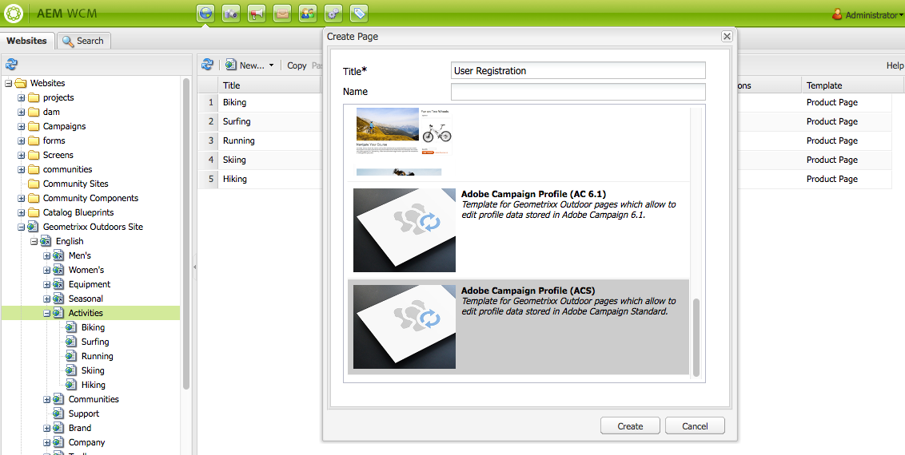

# Skapa Adobe Campaign-formulär i AEM{#creating-adobe-campaign-forms-in-aem}

Med AEM kan ni skapa och använda formulär som interagerar med Adobe Campaign på er webbplats. Specifika fält kan infogas i formulären och mappas till Adobe Campaign-databasen.

Ni kan hantera nya kontaktprenumerationer, avbeställningar och användarprofilsdata samtidigt som ni integrerar deras data i Adobe Campaign-databasen.

Om du vill använda Adobe Campaign-formulär i AEM måste du följa de här stegen som beskrivs i det här dokumentet:

1. Gör en mall tillgänglig.
1. Skapa ett formulär.
1. Redigera formulärinnehåll.

Tre typer av formulär, som är specifika för Adobe Campaign, är tillgängliga som standard:

* Spara en profil
* Prenumerera på en tjänst
* Avbeställ en tjänst

Dessa formulär definierar en URL-parameter som godkänner den krypterade primärnyckeln för en Adobe Campaign-profil. Baserat på den här URL-parametern uppdaterar formuläret data för den associerade Adobe Campaign-profilen.

Även om du skapar de här formulären oberoende av varandra, genererar du i ett vanligt fall en personlig länk till en formulärsida i nyhetsbrevets innehåll, så att mottagarna kan öppna länken och göra ändringar i profildata (oavsett om de avregistrerar, prenumererar eller uppdaterar deras profil).

Formuläret uppdateras automatiskt baserat på användaren. Mer information finns i [Redigera formulärinnehåll](#editing-form-content) .

## Göra en mall tillgänglig {#making-a-template-available}

Innan du kan skapa formulär som är specifika för Adobe Campaign måste du göra de olika mallarna tillgängliga i ditt AEM-program.

Mer information finns i dokumentationen [för](/help/sites-developing/page-templates-static.md#templateavailability)mallar.

Först och främst kontrollerar du kopplingen mellan författaren och publiceringsinstanser och Adobe Campaign fungerar. Se [Integrera med Adobe Campaign Standard](/help/sites-administering/campaignstandard.md) eller [Integrera med Adobe Campaign 6.1](/help/sites-administering/campaignonpremise.md).

>[!NOTE]
>
>Kontrollera att **egenskapen acMapping** på sidans **jcr:content** -nod är inställd på **mapRecipient** eller **profile** när du använder Adobe Campaign 6.1.x eller Adobe Campaign Standard

### Skapa ett formulär {#creating-a-form}

1. Börja i webbplatsadmin.
1. Bläddra igenom trädstrukturen för att komma till den plats där du vill skapa formuläret på den valda webbplatsen.
1. **Välj** Nytt **>** Ny sida... .
1. Välj antingen **Adobe Campaign-profil (AC 6.1)** eller **Adobe Campaign-profil (ACS)** och ange sidegenskaperna.

   >[!NOTE]
   >
   >Om mallen inte är tillgänglig läser du avsnittet [Göra en mall tillgänglig](/help/sites-classic-ui-authoring/classic-personalization-ac.md#activatingatemplate) .

1. Klicka på **Skapa** för att skapa formuläret.

   

   Du kan sedan [redigera och konfigurera formulärets innehåll](#editing-form-content).

## Redigera formulärinnehåll {#editing-form-content}

Formulär som riktar sig till Adobe Campaign har specifika komponenter. Dessa komponenter har ett alternativ som gör att du kan länka varje fält i formuläret till ett fält i Adobe Campaign-databasen.

>[!NOTE]
>
>Om den önskade mallen inte är tillgänglig läser du [Göra en mall tillgänglig](/help/sites-classic-ui-authoring/classic-personalization-ac.md#activatingatemplate).

I det här avsnittet beskrivs endast specifika länkar till Adobe Campaign. Mer information om en mer allmän översikt över hur du använder formulär i Adobe Experience Manager finns i [Komponenter](/help/sites-classic-ui-authoring/classic-page-author-edit-mode.md)i redigeringsläget.

1. Navigera till formuläret som du vill redigera.
1. **Välj** Sida **>** Sidegenskaper i verktygslådan.. går du till fliken **Cloud Services** i popup-fönstret.
1. Lägg till Adobe Campaign-tjänsten genom att klicka på **Lägg till tjänst** och sedan välja den konfiguration som motsvarar din Adobe Campaign-instans i tjänstens listruta. Den här konfigurationen utförs när anslutningen mellan instanserna skapas. Mer information finns i [Ansluta AEM till Adobe Campaign](/help/sites-administering/campaignonpremise.md#connecting-aem-to-adobe-campaign).

   >[!NOTE]
   >
   >Om det behövs kan du låsa upp konfigurationen genom att klicka på hänglåsikonen för att lägga till tjänsten Adobe Campaign.

1. Använd de allmänna parametrarna för formuläret med knappen **Redigera** som finns i början av formuläret. På fliken **Formulär** kan du välja en tacksida som användaren ska omdirigeras till efter att formuläret har validerats.

   I det **avancerade** formuläret kan du välja typ av formulär. I fältet **Bokföringsalternativ** kan du välja mellan tre typer av Adobe Campaign-formulär:

   * **Adobe Campaign: Spara profil**: Med kan du skapa eller uppdatera en mottagare i Adobe Campaign (standardvärde).
   * **Adobe Campaign: Prenumerera på tjänster**: gör att du kan hantera prenumerationer för en mottagare i Adobe Campaign.
   * **Adobe Campaign: Avbeställ tjänsterna**: Med kan du avbryta prenumerationer på en mottagare i Adobe Campaign.
   I fältet **Åtgärdskonfiguration** kan du ange om du vill skapa mottagarprofilen i Adobe Campaign-databasen eller inte om den inte finns än. Det gör du genom att kontrollera alternativet **Skapa användare om det inte finns** .

1. Lägg till de valda komponenterna genom att dra dem från verktygslådan och släppa dem i formuläret. Mer information om de tillgängliga komponenterna i Adobe Campaign finns i [Adobe Form Components](/help/sites-classic-ui-authoring/classic-personalization-ac-components.md).

   

1. Konfigurera de tillagda fälten genom att dubbelklicka på dem. På fliken **Adobe Campaign** kan du länka fältet till ett fält i mottagartabellen för Adobe Campaign. Du kan också ange om fältet är en del av avstämningsnyckeln som gör att mottagare som redan finns i Adobe Campaign-databasen kan identifieras.

   >[!CAUTION]
   >
   >Elementnamnet **** måste vara olika för olika formulärfält. Ändra den om det behövs.
   >
   >Varje formulär måste innehålla en **krypterad primärnyckelkomponent** för att mottagarna i Adobe Campaign-databasen ska kunna hanteras korrekt.

1. Aktivera sidan genom att välja **Sida** > **Aktivera sida** i verktygslådan. Sidan aktiveras på din webbplats. Du kan visa den genom att gå till din AEM-publiceringsinstans. Data i Adobe Campaign-databasen uppdateras när ett formulär har validerats.

## Testa ett formulär {#testing-a-form}

När du har skapat ett formulär och redigerat formulärinnehållet kanske du vill testa att formuläret fungerar som det ska.

>[!NOTE]
>
>Du måste ha en **krypterad primärnyckelkomponent** i varje formulär. I Komponenter väljer du Adobe Campaign så att bara de komponenterna visas.
>
>I den här proceduren anger du telefonnumret manuellt, men i praktiken får användarna en länk till den här sidan (om de vill avbeställa, prenumerera eller uppdatera din profil) i ett nyhetsbrev. Paketet uppdateras automatiskt beroende på användaren.
>
>Om du vill skapa den länken använder du variabeln **Huvudresursidentifierare**(Adobe Campaign Standard) eller **Krypterad identifierare** (Adobe Campaign 6.1) (till exempel i en **Text &amp; Personalization-komponent (Campaign)** ) som är länkad till sidan i Adobe Campaign.

För att göra detta måste du hämta EPK-filen för en Adobe Campaign-profil manuellt och sedan bifoga den till URL-adressen:

1. Så här hämtar du den krypterade primärnyckeln (EPK) för en Adobe Campaign-profil:

   * I Adobe Campaign Standard - Navigera till **Profiler och målgrupper** > **Profiler**, som listar de befintliga profilerna. Se till att tabellen visar fältet **Huvudresursidentifierare** i en kolumn (du kan konfigurera detta genom att klicka/trycka på **Konfigurera lista**). Kopiera huvudresursidentifieraren för den önskade profilen.
   * I Adobe Campaign 6.11 går du till **Profiler och mål** > **Mottagare**, som listar de befintliga profilerna. Se till att tabellen visar fältet **Krypterad identifierare** i en kolumn (detta kan konfigureras genom att högerklicka på en post och välja **Konfigurera lista..**). Kopiera den krypterade identifieraren för den önskade profilen.

1. I AEM öppnar du formulärsidan i publiceringsinstansen och lägger till EPK från steg 1 som en URL-parameter: Använd samma namn som du tidigare definierade i EPK-komponenten när du redigerar formuläret (till exempel: `?epk=...`)
1. Formuläret kan nu användas för att ändra data och prenumerationer som är kopplade till den länkade Adobe Campaign-profilen. När du har ändrat vissa fält och skickat in formuläret kan du verifiera i Adobe Campaign att rätt data har uppdaterats.

Data i Adobe Campaign-databasen uppdateras när ett formulär har validerats.
