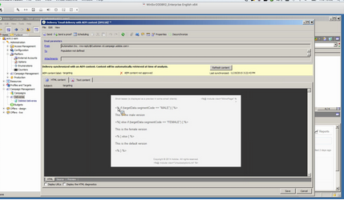

# Ange din Adobe Campaign{#targeting-your-adobe-campaign}

Om du vill använda ditt Adobe Campaign-nyhetsbrev måste du först skapa segmentering, som bara är tillgängligt i det klassiska användargränssnittet. Efter det kan ni skapa riktade upplevelser för Adobe Campaign.

## Ställa in segmentering i AEM {#setting-up-segmentation-in-aem}

Att skapa segmentering innefattar att skapa segment, ett varumärke, en kampanj och upplevelser. Du kan bara skapa ett segment i det klassiska användargränssnittet. Ni kan skapa varumärken, kampanjer och upplevelser i det pekaktiverade användargränssnittet.

>[!NOTE]
>
>Segment-ID måste mappas till det på Adobe Campaign-sidan.

### Skapar segment {#creating-segments}

Så här skapar du segment:

1. Öppna [segmenteringskonsolen](http://localhost:4502/miscadmin#/etc/segmentation) på **&lt;värd>:&lt;port>/miscadmin#/etc/segmentering**.
1. Skapa en ny sida och ange en rubrik - till exempel **AC-segment** - och välj mallen **Segment (Adobe Campaign)**.
1. Markera den skapade sidan i trädvyn till vänster.
1. Skapa ett segment, till exempel för manliga användare, genom att skapa en ny sida under segmentet som du skapade som kallas hane och välja mallen **Segment (Adobe Campaign)**.
1. Öppna den skapade segmentsidan och dra och släpp ett **segment-ID** från sidosparken på sidan.
1. Dubbelklicka på trait, ange det ID som representerar i det här fallet det manliga segment som definieras i Adobe Campaign - till exempel **MALE** - och klicka på **OK**. Följande meddelande ska visas: `targetData.segmentCode == "MALE"`
1. Upprepa stegen för ett annat segment, till exempel ett segment som riktar sig till kvinnliga användare.

### Skapar ett varumärke {#creating-a-brand}

Så här skapar du ett varumärke:

1. I **Platser** navigerar du till mappen **Kampanjer** (t.ex. i We.Retail).
1. Klicka på **Skapa sida** och ange en rubrik för sidan, till exempel We.Retail Brand och välj mallen **Brand**.

### Skapa en kampanj {#creating-a-campaign}

Så här skapar du en kampanj:

1. Öppna sidan **Varumärke** som du nyss skapade.
1. Klicka på **Skapa sida** och ange en rubrik för sidan, till exempel We.Retail Campaign, och välj mallen **Campaign** och klicka på **Create**.

### Skapar upplevelser {#creating-experiences}

Så här skapar du upplevelser för segment:

1. Öppna sidan **Kampanj** som du nyss skapade.
1. Skapa upplevelser för era segment genom att klicka på **Skapa sida** och ange en titel för sidan, till exempel&quot;Male&quot; medan du skapar en upplevelse för&quot;Male&quot;-segmentet, och välj sedan mallen **Experience**.
1. Öppna den skapade Experience-sidan.
1. Klicka på **Redigera** och sedan under Segment klicka på **Lägg till objekt**.
1. Ange sökvägen till det manliga segmentet, till exempel `/etc/segmentation/ac-segments/male`, och klicka på **OK**. Följande meddelande ska visas: *Upplevelsen är inriktad på: Man*
1. Upprepa föregående steg för att skapa en upplevelse för alla segment, till exempel kvinnligt mål.

## Skapa ett nyhetsbrev med riktat innehåll {#creating-a-newsletter-with-targeted-content}

När ni har skapat segment, varumärken, kampanjer och upplevelser kan ni skapa ett nyhetsbrev med riktat innehåll. När ni har skapat upplevelsen länkar ni upplevelser till era segment.

Du kan skapa nyhetsbrevet med riktat innehåll i både det beröringsaktiverade och klassiska användargränssnittet. I det här dokumentet beskrivs proceduren för det beröringskänsliga användargränssnittet.

Så här skapar du ett nyhetsbrev med riktat innehåll:

1. Skapa ett nyhetsbrev med riktat innehåll: Klicka eller tryck på **Skapa** > **Sida** under E-postkampanjer i Geometrixx Outdoors och välj en av Adobe Campaign Mail-mallarna.

   >[!NOTE]
   >
   >[E-postexempel är bara tillgängliga i Geometrixx](/help/sites-developing/we-retail.md#weretail). Hämta exempelinnehåll för Geometrixx från paketresurs.

1. Lägg till en text- och personaliseringskomponent i nyhetsbrevet.
1. Lägg till text i komponenten Text och Personalization, till exempel&quot;This is the default&quot;.
1. Klicka på pilen bredvid **Redigera** och välj **Mål**.
1. Välj ert varumärke i den nedrullningsbara menyn Varumärke och välj er kampanj. (Detta är varumärket och kampanjen som du skapade tidigare).
1. Klicka på **Starta målanpassning**. Dina segment visas i området Publiker. Standardupplevelsen används om inget av de definierade segmenten matchar.

   >[!NOTE]
   >
   >Som standard använder de e-postexempel som ingår i AEM Adobe Campaign som målmotor. För anpassade nyhetsbrev kan du behöva välja Adobe Campaign som målmotor. När du väljer mål trycker eller klickar du på + i verktygsfältet, anger en titel för den nya aktiviteten och väljer **Adobe Campaign** som målmotor.

1. Klicka på **Standard** och sedan på den text- och anpassningskomponent du lade till så visas Bullseye med en pil i. Klicka på ikonen om du vill ange komponenten som mål.

   

1. Navigera till ett annat segment (Man) och klicka på **Lägg till erbjudande** och klicka på plusikonen +. Redigera sedan erbjudandet.
1. Navigera till ett annat segment (Kvinna) och klicka på **Lägg till erbjudande** och plustecknet +. Redigera sedan erbjudandet.
1. Klicka på **Nästa** för att se Mappning, klicka sedan på **Nästa** för att se Inställningar, som inte gäller för Adobe Campaign, och klicka sedan på **Spara**.

   AEM genererar automatiskt rätt målinriktningskod för Adobe Campaign när innehållet används i en leverans inom Adobe Campaign

1. I Adobe Campaign skapar du leveransen - välj **E-postleverans med AEM** och välj det lokala AEM-kontot och bekräfta ändringarna.

   I HTML-vyn visas de olika upplevelserna av målkomponenter i Adobe Campaign målkod.

   

   >[!NOTE]
   >
   >Om du även ställer in segmenten i Adobe Campaign visas upplevelserna för varje segment när du klickar på **Förhandsgranska**.

