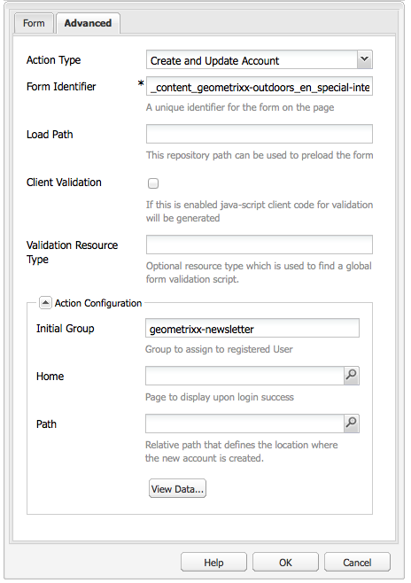

# Skapa en startsida för ett effektivt nyhetsbrev{#creating-an-effective-newsletter-landing-page}

En effektiv startsida för nyhetsbrev hjälper er att få så många människor som möjligt att registrera sig för ert nyhetsbrev (eller andra e-postmarknadsföringskampanjer). Du kan använda den information du samlar in från nyhetsbrevet för att få leads.

Om du vill skapa en effektiv startsida för nyhetsbrevet måste du göra följande:

1. Skapa en lista för nyhetsbrevet så att andra kan prenumerera på det.
1. Skapa anmälningsformuläret. När du gör det lägger du till ett arbetsflödessteg som automatiskt lägger till personen som registrerar sig för nyhetsbrevet i din lista med leads.
1. Skapa en bekräftelsesida som tackar användarna för att de har anmält sig och eventuellt erbjuder dem en befordran.
1. Lägg på teasers.

>[!NOTE]
>
>Adobe planerar inte att ytterligare förbättra denna funktion (Hantera leads och listor).
>Rekommendationen är att utnyttja [Adobe Campaign och integrationen med AEM](/help/sites-administering/campaign.md).

## Skapa en lista för nyhetsbrevet {#creating-a-list-for-the-newsletter}

Skapa en lista, till exempel **Geometrixx Newsletter**, i MCM för det nyhetsbrev som andra ska prenumerera på. Hur du skapar listor beskrivs i [Skapa listor](/help/sites-classic-ui-authoring/classic-personalization-campaigns.md#creatingnewlists).

I följande exempel visas ett exempel på en lista:

## Skapa ett anmälningsformulär {#create-a-sign-up-form}

Skapa ett registreringsformulär för nyhetsbrev där användarna kan prenumerera på taggar. Exempelwebbplatsen Geometrixx innehåller en nyhetsbrevsida i Geometrixx-verktygsfältet där du kan skapa formuläret.

Om du vill skapa ett eget nyhetsbrevformulär läser du information om hur du skapar formulär i [formulärdokumentationen](/help/sites-authoring/default-components.md#form). Nyhetsbrevet använder taggarna från taggbiblioteket. Mer information om hur du lägger till ytterligare taggar finns i [Tagghantering](/help/sites-authoring/tags.md#tagadministration).

De dolda fälten i följande exempel anger den minsta mängden information (e-post). Du kan dessutom lägga till fler fält senare, men detta påverkar konverteringsgraden.

Följande exempel är ett formulär som skapats på https://localhost:4502/cf#/content/geometrixx/en/toolbar/newsletter.html.

1. Skapa formuläret.

   

1. Klicka på **Redigera** i formulärkomponenten för att konfigurera formuläret så att det går till en Tack-sida (se [Skapa Tack-sidor](#creating-a-thank-you-page)).

   

1. Ange formuläråtgärden (d.v.s. vad som ska hända när du skickar formuläret) och konfigurera gruppen så att den tilldelar registrerade användare till listan som du skapade tidigare (t.ex. geometrixx-nyhetsbrev).

   

### Skapa en tacksida {#creating-a-thank-you-page}

När användare klickar på **Prenumerera nu** vill du att en Tack-sida ska öppnas automatiskt. Skapa sidan Tack på sidan Nyhetsbrev om Geometrixx. När du har skapat nyhetsbrevformuläret redigerar du formulärelementet och lägger till sökvägen på tacksidan.

Om du skickar begäran kommer användaren till en **Tack** -sida där han/hon får ett e-postmeddelande. Denna tacksida skapades på /content/geometrixx/en/toolbar/newsletter/thanks_you.

### Lägga till lärare {#adding-teasers}

Lägg till [lärare](/help/sites-classic-ui-authoring/classic-personalization-campaigns.md#teasers) för specifika målgrupper. Du kan till exempel lägga till lärare på sidan Tack och på registreringssidan för nyhetsbrev.

Så här lägger du till testare för att skapa en effektiv startsida för nyhetsbrevet:

1. Skapa en läcker paragraf för en gåva. Välj **Första** som strategi och inkludera text som informerar dem om vilken gåva de får.

   

1. Skapa ett underordnat stycke för sidan Tack. Välj **Första** som strategi och inkludera text som anger att presenten är på väg.

   

1. Skapa en kampanj med de två teasers - tagga en med företag och en utan taggar.

### Skicka innehåll till prenumeranter {#pushing-content-to-subscribers}

Gör ändringar i sidorna med funktionen för nyhetsbrev i MCM. Sedan skickar du uppdaterat innehåll till prenumeranterna.

Se [Skicka nyhetsbrev](/help/sites-classic-ui-authoring/classic-personalization-campaigns.md#newsletters).
