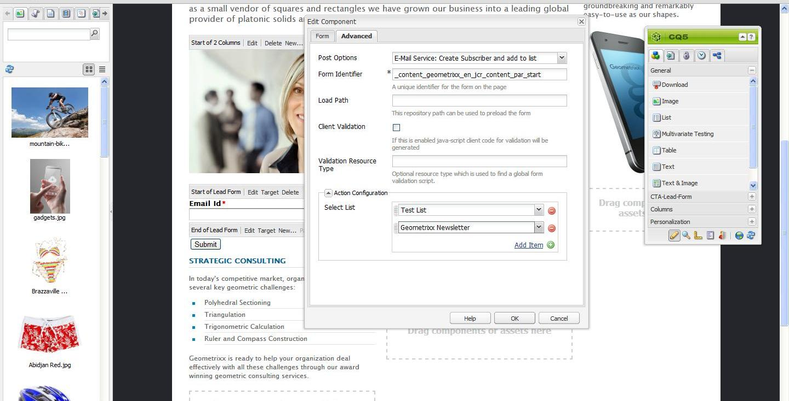

# Hantera prenumerationer{#managing-subscriptions}

>[!NOTE]
>
>Adobe planerar inte att ytterligare förbättra denna funktion (Hantera leads och listor).
>Rekommendationen är att utnyttja [Adobe Campaign och dess AEM-integrering](/help/sites-administering/campaign.md).

Användare kan uppmanas att prenumerera på **e-postleverantörens** e-postlistor med hjälp av **Form** -komponenten som används på en AEM-webbsida. Om du vill förbereda en AEM-sida med ett registreringsformulär för prenumeration på e-posttjänstens e-postlistor måste du tillämpa motsvarande tjänstkonfiguration på den AEM-sida som den potentiella prenumeranten kommer att besöka.

## Tillämpar e-posttjänstkonfiguration på en sida {#applying-email-service-configuration-to-a-page}

Så här konfigurerar du en AEM-sida:

1. Gå till fliken **Webbplatser** .
1. Välj den sida som ska konfigureras för tjänsten. Högerklicka på sidan och välj **Egenskaper**.

1. Välj **molntjänster** och sedan **Lägg till tjänst**. Välj en konfiguration i listan över tillgängliga konfigurationer.

   

1. Click **OK**.

## Skapa ett anmälningsformulär på en AEM-sida för att prenumerera/avbryta prenumerationen på listor {#creating-a-sign-up-form-on-an-aem-page-for-subscribing-unsubscribing-to-lists}

Så här skapar du ett anmälningsformulär och konfigurerar det för prenumerationer på e-postleverantörens sändlistor:

1. Öppna AEM-sidan som användaren kommer att besöka.
1. Använd e-postleverantörens konfiguration på sidan.

1. Lägg till en **Form** -komponent på sidan genom att dra komponenten från sidosparken. Om komponenten inte är tillgänglig växlar du till designläge och aktiverar **formulärgruppen** .
1. Klicka på **Redigera** i fältet **Början av formulär** och gå till fliken **Avancerat** .
1. I listrutan **Formulär** väljer du **E-posttjänst: Skapa prenumerant** och lägg till i listan.
1. Längst ned i dialogrutan öppnar du listrutan **Åtgärdskonfiguration** där du kan välja en eller flera prenumerationslistor.
1. I listan **** Välj väljer du den lista som du vill att användarna ska prenumerera på. Du kan lägga till flera listor med plusknappen (**Lägg till objekt**).

   

   >[!NOTE]
   >
   >Dialogrutan kan variera beroende på vilken e-postleverantör du har.

1. På fliken **Formulär** väljer du den tacksida som du vill att användarna ska gå till efter att de har skickat formuläret (om det lämnas tomt visas formuläret igen när formuläret skickas.) Click **OK**. En **e-post-id** -komponent visas i formuläret, där du kan skapa ett formulär där användare kan skicka sina e-postadresser för att prenumerera eller avbryta prenumerationen på en e-postlista.
1. Lägg till **Skicka** -knappkomponenten från **formulärsektionen** i sidosparken.

   Formuläret är klart. Publicera sidan som konfigurerats i stegen ovan tillsammans med **tacksidan** till publiceringsinstansen. Alla potentiella prenumeranter som besöker sidan kan fylla i formuläret och prenumerera på listan som finns i konfigurationen.

   >[!NOTE]
   >
   >För att formulärprenumerationen ska fungera på rätt sätt måste [krypteringsnycklar från författaren exporteras och importeras till publiceringsinstansen](#exporting-keys-from-author-and-importing-on-publish).

## Exportera nycklar från författare och importera vid publicering {#exporting-keys-from-author-and-importing-on-publish}

För att e-posttjänsten ska kunna prenumerera och sluta prenumerera via anmälningsformuläret på publiceringsinstansen måste du följa dessa steg:

1. Gå till Package Manager på författarinstansen.
1. Skapa ett nytt paket. Ställ in filtret som `/etc/key`.
1. Bygg och hämta paketet.
1. Navigera till Package Manager på publiceringsinstansen och överför det här paketet.
1. Gå till Publish SGB-konsolen och starta om paketet med namnet **Adobe Granite Crypto Support**.

## Avbeställa prenumeration för användare från listor {#unsubscribing-users-from-lists}

Så här avbeställer du användare från listor:

1. Öppna sidegenskaperna för den AEM-sida som har registreringsformuläret för att avbryta prenumerationen på ett lead.
1. Använd tjänstkonfigurationen på sidan.
1. Skapa ett anmälningsformulär på sidan.
1. När du konfigurerar komponenten väljer du åtgärden **E-posttjänst**: Avsluta **prenumeration på användare i listan.**
1. I listrutan väljer du lämplig lista som användaren ska tas bort från när prenumerationen avbryts.

   

1. Exportera nycklarna från författaren till publiceringen.

## Konfigurera e-postmeddelanden med automatisk svarare för e-posttjänst {#configuring-auto-responder-emails-for-email-service}

Så här konfigurerar du ett e-postmeddelande med automatiskt svar för en prenumerant:

1. Öppna sidegenskaperna för den AEM-sida som har registreringsformuläret för att konfigurera automatisk svarare för en lead.
1. Använd konfigurationen ExactTarget på sidan.

1. Lägg till en **Form** -komponent på sidan genom att dra komponenten från sidosparken. Om komponenten inte är tillgänglig växlar du till designläge och aktiverar **formulärgruppen** .
1. Klicka på **Redigera** i fältet **Början av formulär** och gå till fliken **Avancerat** .
1. I listrutan **Formulär** väljer du **E-posttjänst: Skicka e-post för automatisk svarare.**
1. **Välj ett e-postmeddelande** (det här är det e-postmeddelande som skickas som ett e-postmeddelande med automatiskt svar).

1. **Välj Klassificering** (den här klassificeringen används för att skicka e-postmeddelandet).
1. Välj sidan **Tack** (den sida som användarna dirigeras till när de har skickat in formuläret).

   På fliken **Formulär** väljer du den tacksida som du vill att användarna ska gå till när de har skickat in formuläret. (Om formuläret lämnas tomt visas det igen när det skickas.) Click **OK**.

1. Exportera nycklarna från författaren till publiceringen.
1. Lägg till **Skicka** -knappkomponenten från **formulärsektionen** i sidosparken.

   Anmälningsformuläret är klart. Publicera sidan som konfigurerats i stegen ovan tillsammans med **tacksidan** till publiceringsinstansen. Alla potentiella abonnenter som besöker sidan kan fylla i formuläret och när de skickar in formuläret ska besökaren få ett e-postmeddelande med automatiskt svar på det e-post-ID som fylls i formuläret.

   >[!NOTE]
   >
   >För att prenumerationsfunktionen för registreringsformulär ska fungera korrekt måste [krypteringsnycklar från författaren exporteras och importeras till publiceringsinstansen](#exporting-keys-from-author-and-importing-on-publish).

   

