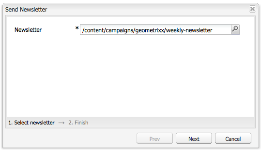

# E-postmarknadsföring{#e-mail-marketing}

>[!NOTE]
>
>Adobe planerar inte att ytterligare förbättra e-postspårningen av öppna/returnerade e-postmeddelanden som skickas av AEM SMTP-tjänsten.
>Rekommendationen är att [utnyttja Adobe Campaign och integrationen med AEM](/help/sites-administering/campaign.md).

E-postmarknadsföring (till exempel nyhetsbrev) är en viktig del av alla marknadsföringskampanjer när ni använder dem för att förmedla innehåll till era leads. I AEM kan du skapa nyhetsbrev från befintligt AEM-innehåll och lägga till nytt innehåll, som är specifikt för nyhetsbreven.

När de har skapats kan du skicka nyhetsbrev till den specifika användargruppen antingen direkt eller vid en annan schemalagd tidpunkt (med hjälp av ett arbetsflöde). Dessutom kan användare prenumerera på nyhetsbrev i det format de väljer.

Dessutom kan du med AEM administrera nyhetsbrevets funktionalitet, inklusive att underhålla ämnen, arkivera nyhetsbrev och visa statistik för nyhetsbrev.

>[!NOTE]
>
>I Geometrixx öppnar nyhetsbrevmallen automatiskt e-postredigeraren. Du kan använda e-postredigeraren i andra mallar som du vill skicka e-postmeddelanden med, till exempel, inbjudningar. E-postredigeraren visas när en sida ärvs från **mcm/components/newsletter/page**.

I det här dokumentet beskrivs grunderna för hur du skapar nyhetsbrev i AEM. Mer detaljerad information om hur du arbetar med e-postmarknadsföring finns i följande dokument:

* [Skapa en startsida för ett effektivt nyhetsbrev](/help/sites-classic-ui-authoring/classic-personalization-campaigns-email-landingpage.md)
* [Hantera prenumerationer](/help/sites-classic-ui-authoring/classic-personalization-campaigns-email-subscriptions.md)
* [Publicera ett e-postmeddelande till e-postleverantörer](/help/sites-classic-ui-authoring/classic-personalization-campaigns-email-newsletters.md)
* [Spåra studsade e-postmeddelanden](/help/sites-classic-ui-authoring/classic-personalization-campaigns-email-tracking-bounces.md)

>[!NOTE]
>
>Om du uppdaterar e-postleverantörer, gör ett flygtest eller skickar ett nyhetsbrev misslyckas dessa åtgärder om nyhetsbrevet inte publiceras till publiceringsinstansen först eller om publiceringsinstansen inte är tillgänglig. Glöm inte att publicera nyhetsbrevet och kontrollera att Publish-instansen körs.

## Skapa en upplevelse av nyhetsbrev {#creating-a-newsletter-experience}

>[!NOTE]
>
>E-postmeddelanden måste konfigureras via SGB-konfigurationen. Se [Konfigurera e-postmeddelande.](/help/sites-administering/notification.md)

1. Välj din nya kampanj i den vänstra rutan eller dubbelklicka på den i den högra rutan.

1. Markera listvyn med ikonen:

   

1. Klicka på **Ny...**

   Du kan ange **titel**, **namn** och typ av upplevelse som ska skapas. i det här fallet nyhetsbrevet.

   

1. Klicka på **Skapa**.

1. En ny dialogruta öppnas omedelbart. Här kan du ange egenskaper för nyhetsbrevet.

   Standardmottagarlistan **är ett obligatoriskt** fält eftersom detta utgör kontaktytan för nyhetsbrevet (mer information om listor finns i [Arbeta med listor](/help/sites-classic-ui-authoring/classic-personalization-campaigns.md#workingwithlists) ).

   

   * **Från Namn** som ska visas som avsändare av nyhetsbrevet.

   * **Från adress** E-postadress som ska visas som avsändare av nyhetsbrevet.

   * **Ämne** för nyhetsbrevet.

   * **Svara på** e-postadress som ska användas för svar på skickade nyhetsbrev.

   * **Beskrivning** av nyhetsbrevet.

   * **Tid** för att skicka nyhetsbrevet.

   * **Standardmottagarlista** Standardlista som ska ta emot nyhetsbrevet.
   **Dessa kan uppdateras senare i** Egenskaper... -dialogrutan.

1. Spara genom att klicka på **OK** .

## Lägga till innehåll i nyhetsbrev {#adding-content-to-newsletters}

Du kan lägga till innehåll, inklusive dynamiskt innehåll, i nyhetsbrevet på samma sätt som i andra AEM-komponenter. I Geometrixx har mallen Nyhetsbrev vissa komponenter som du kan använda för att lägga till och ändra innehåll i nyhetsbrev.

1. Klicka på fliken **Kampanjer** i MCM och dubbelklicka på det nyhetsbrev som du vill lägga till innehåll i eller redigera. Nyhetsbrevet öppnas.

1. Om komponenterna inte visas går du till designvyn och aktiverar de nödvändiga komponenterna (till exempel komponenterna i nyhetsbrevet) innan du börjar redigera.
1. Ange eventuell ny text, bilder eller andra komponenter. I Geometrixx-exemplet finns fyra komponenter: Text, bild, rubrik och 2 kolumner. Nyhetsbrevet kan ha fler eller färre komponenter beroende på hur du konfigurerar det.

   >[!NOTE]
   >
   >Ni personaliserar nyhetsbrev med hjälp av variabler. I nyhetsbrevet Geometrixx är variabler tillgängliga i komponenten Text. Värden för variablerna ärvs från informationen i användarprofilen.

   

1. Om du vill infoga variabler markerar du variabeln i listan och klickar på **Infoga**. Variabler fylls i från profilen.

## Anpassa nyhetsbrev {#personalizing-newsletters}

Du anpassar nyhetsbrev genom att infoga fördefinierade variabler i Text-komponenten i nyhetsbreven i Geometrixx. Värden för variablerna ärvs från informationen i användarprofilen.

Du kan också simulera hur ett nyhetsbrev personaliseras genom att använda klientkontexten och läsa in en profil.

Så här anpassar du ett nyhetsbrev och simulerar hur det kommer att se ut:

1. Öppna det nyhetsbrev som du vill anpassa inställningarna för i MCM.

1. Öppna den textkomponent som du vill anpassa.

1. Placera markören där du vill att variabeln ska visas, välj en variabel i listrutan och klicka på **Infoga**. Gör detta för så många variabler som behövs och klicka på **OK**.

   

1. Om du vill simulera hur variabeln kommer att se ut när den skickas trycker du på CTRL+ALT+c för att öppna klientkontexten och välja **Läs in**. Markera användaren i listan vars profil du vill läsa in och klicka på **OK**.

   Variablerna har fyllts i med informationen från profilen som du läste in.

   

## Testa nyhetsbrev i olika e-postklienter {#testing-newsletters-in-different-e-mail-clients}

>[!NOTE]
>
>Innan du skickar nyhetsbrev bör du kontrollera OSGi-konfigurationen för Day CQ Link Externalizer på `https://localhost:4502/system/console/configMgr`.
>
>Som standard är parameterns värde `localhost:4502` och åtgärden kan inte slutföras om porten för den instans som körs ändras.

Växla mellan vanliga e-postklienter för att se hur nyhetsbrevet ser ut mot era leads. Som standard öppnas nyhetsbrevet utan att någon av e-postklienterna har valts.

För närvarande kan du visa nyhetsbrev i följande e-postklienter:

* Yahoo-post
* Gmail
* Hotmail
* Thunderfågel
* Microsoft Outlook 2007
* Apple Mail

Klicka på motsvarande ikon för att visa nyhetsbrevet i e-postklienten för att växla mellan olika klienter:

1. Öppna det nyhetsbrev som du vill anpassa inställningarna för i MCM.

1. Klicka på en e-postklient i det övre fältet för att se hur nyhetsbrevet skulle se ut i klienten.

   

1. Upprepa det här steget för alla e-postklienter som du vill se.

   

## Anpassa inställningar för nyhetsbrev {#customizing-newsletter-settings}

Även om bara behöriga användare kan skicka nyhetsbrev bör du anpassa följande:

* Ämnesraden, så att användare kan öppna ditt e-postmeddelande och även försäkra sig om att det inte kommer att sluta som skräppost.
* Från-adressen, till exempel noreply@geometrixx.com, så att användarna får e-post från en angiven adress.

Så här anpassar du inställningar för nyhetsbrev:

1. Öppna det nyhetsbrev som du vill anpassa inställningarna för i MCM.

   

1. Klicka på **Inställningar** längst upp i nyhetsbrevet.

   
1. Ange **Från** e-postadress

1. Ändra vid behov **e-postmeddelandets ämne** .

1. Välj en **standardmottagarlista** i listrutan.

1. Click **OK**.

   När du testar eller skickar nyhetsbrevet får mottagarna e-post med den angivna e-postadressen och det angivna ämnet.

## Nyhetsbrev om flygtestning {#flight-testing-newsletters}

Flygtestning är inte obligatoriskt, men innan du skickar ut ett nyhetsbrev kanske du vill testa det för att vara säker på att det ser ut som du vill ha det.

Med flygtester kan du göra följande:

* Titta på nyhetsbrevet i [alla kunder](#testing-newsletters-in-different-e-mail-clients).
* Verifiera att e-postservern är korrekt konfigurerad.
* Avgör om ditt e-postmeddelande flaggas som skräppost. (Se till att du tar med dig själv i listan över mottagare.)

>[!NOTE]
>
>Om du uppdaterar e-postleverantörer, gör ett flygtest eller skickar ett nyhetsbrev misslyckas dessa åtgärder om nyhetsbrevet inte publiceras till publiceringsinstansen först eller om publiceringsinstansen inte är tillgänglig. Glöm inte att publicera nyhetsbrevet och kontrollera att Publish-instansen körs.

Så här gör du för att testa nyhetsbrev:

1. Öppna det nyhetsbrev som du vill testa och skicka från MCM.

1. Klicka på **Testa** längst upp i nyhetsbrevet för att testa innan du skickar iväg det.

   

1. Ange den testadress dit du vill skicka nyhetsbrevet och klicka på **Skicka**. Om du vill ändra profilen läser du in en annan profil i klientkontexten. Det gör du genom att trycka på CTRL+ALT+c och välja Läs in och läsa in en profil.

## Skickar nyhetsbrev {#sending-newsletters}

>[!NOTE]
>
>Adobe planerar inte att ytterligare förbättra e-postspårningen av öppna/returnerade e-postmeddelanden som skickas av AEM SMTP-tjänsten.
>Rekommendationen är att [utnyttja Adobe Campaign och integrationen med AEM](/help/sites-administering/campaign.md).

Du kan skicka ut ett nyhetsbrev från nyhetsbrevet eller från listan. Båda procedurerna beskrivs.

>[!NOTE]
>
>Innan du skickar nyhetsbrev bör du kontrollera OSGi-konfigurationen för Day CQ Link Externalizer på `https://localhost:4502/system/console/configMgr`.
>
>Som standard är parameterns värde `localhost:4502` och åtgärden kan inte slutföras om porten för den instans som körs ändras.

>[!NOTE]
>
>Om du uppdaterar e-postleverantörer, gör ett flygtest eller skickar ett nyhetsbrev misslyckas dessa åtgärder om nyhetsbrevet inte publiceras till publiceringsinstansen först eller om publiceringsinstansen inte är tillgänglig. Glöm inte att publicera nyhetsbrevet och kontrollera att Publish-instansen körs.

### Skicka nyhetsbrev från en kampanj {#sending-newsletters-from-a-campaign}

Så här skickar du ut ett nyhetsbrev inifrån kampanjen:

1. Öppna det nyhetsbrev som du vill skicka från MCM.

   >[!NOTE]
   >
   >Innan du skickar iväg nyhetsbrevet bör du kontrollera att du har anpassat ämnet och e-postadressen genom att [anpassa inställningarna](#customizing-newsletter-settings).
   >
   >
   >[Vi rekommenderar att du testar](#flight-testing-newsletters) nyhetsbrevet innan det skickas.

1. Klicka på **Skicka**&#x200B;överst i nyhetsbrevet. Guiden Nyhetsbrev öppnas.

1. I mottagarens lista markerar du den lista som du vill få nyhetsbrevet och klickar på **Nästa**.

   

1. Installationen har slutförts. Klicka på **Skicka** för att skicka nyhetsbrevet.

   

   >[!NOTE]
   >
   >Kontrollera att du är en av mottagarna så att du kan vara säker på att nyhetsbrevet har tagits emot.

### Skicka nyhetsbrev från en lista {#sending-newsletters-from-a-list}

Så här skickar du ut ett nyhetsbrev från en lista:

1. Klicka på **Listor** till vänster i MCM.

   >[!NOTE]
   >
   >Innan du skickar iväg nyhetsbrevet bör du kontrollera att du har anpassat ämnet och e-postadressen genom att [anpassa inställningarna](#customizing-newsletter-settings). Du kan inte testa ett nyhetsbrev om du skickar det från listan; du kan [flygtesta](#flight-testing-newsletters) det om du skickar det från nyhetsbrevet.

1. Markera kryssrutan bredvid listan med leads som du vill skicka ett nyhetsbrev till.

1. På **Verktyg** -menyn väljer du **Skicka nyhetsbrev**. Fönstret **Skicka nyhetsbrev** öppnas.

   

1. I fältet **Nyhetsbrev** väljer du det nyhetsbrev du vill skicka och klickar på **Nästa**.

   

1. Installationen har slutförts. Klicka på **Skicka** för att skicka det markerade nyhetsbrevet till den angivna listan med leads.

   

   Nyhetsbrevet skickas till de valda mottagarna.

## Prenumerera på ett nyhetsbrev {#subscribing-to-a-newsletter}

I det här avsnittet beskrivs hur du prenumererar på ett nyhetsbrev.

### Prenumerera på ett nyhetsbrev {#subscribing-to-a-newsletter-1}

Så här prenumererar du på ett nyhetsbrev (med Geometrixx-webbplatsen som exempel):

1. Klicka på **Webbplatser** , navigera till **verktygsfältet** Geometrixx och öppna det.

   

1. Ange din e-postadress i fältet Geometrixx Newsletter **Sign Up** och klicka på **Sign Up**. Du prenumererar nu på nyhetsbrevet.
