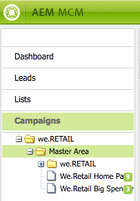

# Arbeta med Marketing Campaign Manager{#working-with-the-marketing-campaign-manager}

I AEM är Marketing Campaign Manager (MCM) en konsol som hjälper er att hantera flerkanalskampanjer. Med denna programvara för automatiserad marknadsföring kan ni hantera alla varumärken, kampanjer och upplevelser tillsammans med relaterade segment, listor, leads och rapporter.

MCM kan nås från olika platser i AEM. Välkomstskärmen, till exempel med hjälp av ikonen Kampanjer eller med URL-adressen:

`https://<hostname>:<port>/libs/mcm/content/admin.html`

Exempel:

`https://localhost:4502/libs/mcm/content/admin.html`

Från MCM får du tillgång till:

* **[Kontrollpanel](#dashboard)**Detta är uppdelat i fyra rutor:

   * [Listar](#lists)Den här rutan visar de listor du redan har skapat tillsammans med antalet leads i listan. I den här rutan kan du skapa en ny lista direkt eller importera leads för att skapa en ny lista.
Om du väljer en viss lista kommer du till avsnittet [Listor](#lists) med information om din lista.

   * [Segment](/help/sites-classic-ui-authoring/classic-personalization-campaigns.md#anoverviewofsegmentation)Den här rutan visar de segment som du har definierat. Med segment kan du karakterisera en samling besökare som delar vissa egenskaper.
Om du markerar ett visst segment öppnas segmentdefinitionssidan.

   * [Rapporter](/help/sites-administering/reporting.md)AEM innehåller olika rapporter som hjälper dig att analysera och övervaka instansens status. Rapporterna visas i den här MCM-rutan.
Om du väljer en rapport öppnas rapportsidan.

   * [Campaigns](#campaigns)Den här rutan visar era kampanjupplevelser som [nyhetsbrev](/help/sites-classic-ui-authoring/classic-personalization-campaigns.md#newsletters) och [teasers](/help/sites-classic-ui-authoring/classic-personalization-campaigns.md#teasers).

* **[Leads](#leads)**Här kan ni hantera era leads. Du kan skapa eller importera leads, redigera specifik information för enskilda leads eller ta bort när de inte längre behövs. Du kan också placera leads i olika grupper, som kallas listor.****Obs! Adobe planerar inte att ytterligare förbättra denna funktion.
Rekommendationen är att[utnyttja Adobe Campaign och integrationen med AEM](/help/sites-administering/campaign.md).

* **[Listor](#lists)**Här kan du hantera dina listor (med leads).****Obs! Adobe planerar inte att ytterligare förbättra denna funktion.
Rekommendationen är att[utnyttja Adobe Campaign och integrationen med AEM](/help/sites-administering/campaign.md).

* **[Kampanjer](#campaigns)**Här kan ni hantera varumärken, kampanjer och upplevelser.

## Kontrollpanel {#dashboard}

På kontrollpanelen visas fyra rutor som ger dig en översikt över dina listor (med leads), segment, rapporter och kampanjer. Här finns även grundläggande funktioner för dessa.

### Leads {#leads}

>[!NOTE]
>
>Adobe planerar inte att ytterligare förbättra denna funktion (Managing Leads).
>Rekommendationen är att utnyttja [Adobe Campaign och integrationen med AEM](/help/sites-administering/campaign.md).

I AEM MCM kan du ordna och lägga till leads genom att antingen ange dem manuellt eller importera en kommaseparerad lista; till exempel en utskickslista. Ytterligare sätt att generera leads är från nyhetsbrev eller communityregistreringar (om de är konfigurerade kan de utlösa ett arbetsflöde som fyller i leads). Leads kategoriseras vanligen och placeras i en lista så att du senare kan utföra åtgärder i hela listan. till exempel skicka ut ett anpassat e-postmeddelande till en viss lista.

Under **Leads** i den vänstra rutan kan du skapa, importera, redigera och ta bort dina leads och sedan aktivera eller inaktivera efter behov. Du kan lägga till en lead i en lista eller se vilka listor den redan tillhör.

>[!NOTE]
>
>Mer information om specifika uppgifter finns i [Arbeta med leads](/help/sites-classic-ui-authoring/classic-personalization-campaigns.md#workingwithleads) .

### Listor {#lists}

>[!NOTE]
>
>Adobe planerar inte att ytterligare förbättra denna funktion (Hantera listor).
>Rekommendationen är att utnyttja [Adobe Campaign och integrationen med AEM](/help/sites-administering/campaign.md).

Med listor kan du ordna dina leads i grupper. Med listor kan ni inrikta era marknadsföringskampanjer på en utvald grupp människor. Du kan till exempel skicka ett riktat nyhetsbrev till en lista.

Under **Listor** kan du hantera dina listor genom att skapa, importera, redigera, sammanfoga och ta bort listor som du sedan kan aktivera eller inaktivera efter behov. Du kan också visa leads i den listan, se om listan är medlem i en annan lista eller visa beskrivningen.

>[!NOTE]
>
>Mer information om specifika uppgifter finns i [Arbeta med listor](/help/sites-classic-ui-authoring/classic-personalization-campaigns.md#workingwithlists) .

### Kampanjer {#campaigns}

>[!NOTE]
>
>Se [Teasers and Strategies](/help/sites-classic-ui-authoring/classic-personalization-campaigns.md#workingwithlists), [Setting up your Campaign](/help/sites-classic-ui-authoring/classic-personalization-campaigns.md#settingupyourcampaign) and [Newsletters](/help/sites-classic-ui-authoring/classic-personalization-campaigns.md#newsletters) for detailed information about specific tasks.

Om du vill få tillgång till befintliga kampanjer går du till MCM och klickar på **Kampanjer**.

* **I den vänstra rutan**:
Det finns en lista över alla varumärken och kampanjer.
Ett enda klick på ett varumärke innebär att

   * utöka listan för att visa alla relaterade kampanjer i den vänstra rutan, i den här listan visas även antalet upplevelser som finns för varje kampanj.
   * öppnar varumärkesöversikten i den högra rutan.

* **I den högra rutan**:
Ikoner visas för varje varumärke (historiska kampanjer visas inte).
Du kan dubbelklicka på dessa för att öppna varumärkesöversikten.

#### Varumärkesöversikt {#brand-overview}

Härifrån kan du:

* Se hur många kampanjer och upplevelser (antal visas i den vänstra rutan) som finns för det här varumärket.
* **Skapa en** ny... kampanj för det här varumärket.

* Ändra den tidsrymd som ska visas, Välj **Vecka**, **Månad** eller **Kvartal** och använd pilarna för att markera specifika punkter eller återgå till **Idag**.

* Välj en kampanj (i den högra rutan) för att:

   * Redigera **egenskaper...**
   * **Ta bort** kampanjen.

* Öppna kampanjöversikten (dubbelklicka på en kampanj i den högra rutan eller klicka en gång i den vänstra rutan).

#### Kampanjöversikt {#campaign-overview}

Det finns två tillgängliga vyer för de enskilda kampanjerna:

1. **Kalendervy**

   Använd ikonen:

   

   Här visas en lista med alla kontaktytor (grå) med en vågrät tidsram för de upplevelser (gröna) som är kopplade till den kontaktytan:

   

   Härifrån kan du:

   * Ändra det tidsintervall du visar med pilarna eller återgå till **Idag**.

   * **Använd** Lägg till kontaktpunkt.. för att lägga till en ny kontaktyta för en befintlig upplevelse.

   * Klicka på ett suddgummi (i den högra rutan) för att ange **På-tid** och **Av-tid**.

1. **Listvy**

   Använd ikonen:

   

   Här listas alla upplevelser (t.ex. teasers och nyhetsbrev) för den valda kampanjen:

   

   Härifrån kan du:

   * **Skapa en** ny... erfarenhet, Adobe Target erbjuder till exempel, teasers och nyhetsbrev.
   * **Redigera** information om en viss teaser-sida eller nyhetsbrev (du kan också dubbelklicka).
   * **Definiera** egenskaper... för en viss teaser page eller nyhetsbrev.
   * **Simulera** utseendet och känslan i en upplevelse (teaser page eller newsletter).
När den simulerade sidan är öppen kan du sedan öppna sidosparken för att växla till redigeringsläge för den sidan.

   * **** Analysera... de intryck en sida ger.

   * **Ta bort** objekt när de inte längre behövs.
   * **Sök** efter texten (fältet Titel i upplevelsen genomsöks).
   * Använd **avancerad** sökning för att använda filter på sökningen.

### Simulera era kampanjupplevelser {#simulating-your-campaign-experiences}

Klicka på **Kampanjer** i MCM. Kontrollera att listvyn är aktiv, välj sedan önskad kampanjupplevelse och klicka på **Simulera**. Kontaktpunkten (teaser- eller nyhetsbrevsidan) öppnas och visar den upplevelse du valt - som besökaren kommer att se den.

Härifrån kan du även öppna sidosparken (klicka på den lilla nedpilen) för att ändra till redigeringsläge för uppdatering av sidan.

### Analysera era Campaign-upplevelser {#analyzing-your-campaign-experiences}

Klicka på **Kampanjer** i MCM. **Kontrollera att listvyn är aktiv, välj sedan önskad kampanjupplevelse och välj** Analysera.. . Ett diagram över sidvisningar över tiden visas.

