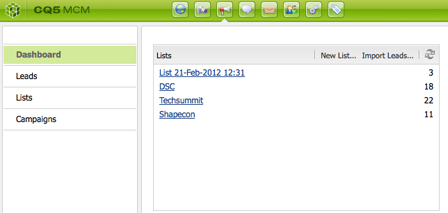

# Konfigurera kampanjen{#setting-up-your-campaign}

I konfigurationen av en ny kampanj ingår följande (allmänna) steg:

1. [Skapa ett varumärke](#creating-a-new-brand) för era kampanjer.
1. Om det behövs kan du [definiera egenskaperna för det nya varumärket](#defining-the-properties-for-your-new-brand).
1. [Skapa en kampanj](#creating-a-new-campaign) för upplevelser, till exempel teaser-sidor eller nyhetsbrev.
1. Om det behövs kan du [definiera egenskaperna för den nya kampanjen](#defining-the-properties-for-your-new-campaign).

Beroende på vilken typ av upplevelse du skapar måste du sedan [skapa en upplevelse](#creating-a-new-experience). Hur upplevelsen ser ut och vilka åtgärder som följer efter att den har skapats beror på vilken typ av upplevelse du vill skapa:

* Om du skapar en Teaser:

   1. [Skapa en läderupplevelse](/help/sites-classic-ui-authoring/classic-personalization-campaigns.md#creatingateaserexperience).
   1. [Lägg in innehåll i teaser](/help/sites-classic-ui-authoring/classic-personalization-campaigns.md#addingcontenttoyourteaser).
   1. [Skapa en kontaktpunkt för Teaser](/help/sites-classic-ui-authoring/classic-personalization-campaigns.md#creatingatouchpointforyourteaser) (lägg till din teaser på en innehållssida).

* Om du skapar ett nyhetsbrev:

   1. [Skapa ett nyhetsbrev](/help/sites-classic-ui-authoring/classic-personalization-campaigns.md#creatinganewsletterexperience).
   1. [Lägg till innehåll i nyhetsbrevet.](/help/sites-classic-ui-authoring/classic-personalization-campaigns.md#addingcontenttonewsletters)
   1. [Anpassa nyhetsbrevet.](/help/sites-classic-ui-authoring/classic-personalization-campaigns.md#personalizingnewsletters)
   1. [Skapa en engagerande startsida](/help/sites-classic-ui-authoring/classic-personalization-campaigns.md#settingupanewsletterlandingpage)för nyhetsbrev.
   1. [Skicka nyhetsbrevet](/help/sites-classic-ui-authoring/classic-personalization-campaigns.md#sendingnewsletters) till prenumeranter eller leads.

* Om du skapar ett Adobe Target-erbjudande (tidigare Test&amp;Target):

   1. [Skapa en upplevelse](/help/sites-classic-ui-authoring/classic-personalization-campaigns.md#creatingatesttargetofferexperience)av Adobe Target-erbjudanden.
   1. [Integrera med Adobe Target](/help/sites-classic-ui-authoring/classic-personalization-campaigns.md#integratewithadobetesttarget)

>[!NOTE]
>
>Mer information om hur du definierar segment finns i [Segmentering](/help/sites-administering/campaign-segmentation.md) .

## Skapa ett nytt varumärke {#creating-a-new-brand}

Så här skapar du ett nytt varumärke:

1. Öppna **MCM** och välj **Kampanjer** i den vänstra rutan.

1. **Välj** ny... att ange **titel** och **namn** och mall som ska användas för ditt nya varumärke:

   

1. Klicka på **Skapa**. Ditt nya varumärke kommer att visas i MCM (med en standardikon).

### Definiera egenskaperna för ditt nya varumärke {#defining-the-properties-for-your-new-brand}

1. I **Campaigns** i den vänstra rutan väljer du din nya varumärkesikon i den högra rutan och klickar på **Egenskaper...**

   Du kan ange en **titel**, **beskrivning** och en bild som ska användas som ikon.

   

1. Spara genom att klicka på **OK** .

### Skapa en ny kampanj {#creating-a-new-campaign}

Så här skapar du en ny kampanj:

1. I **Campaigns** väljer du ditt nya varumärke i den vänstra rutan eller dubbelklickar på ikonen i den högra rutan.

   Översikten visas (tom om varumärket är nytt).

1. **Klicka på** Ny... och ange den **titel**, det **namn** och den mall som ska användas för den nya kampanjen.

   

1. Klicka på **Skapa**. Din nya kampanj visas i MCM.

### Definiera egenskaperna för din nya kampanj {#defining-the-properties-for-your-new-campaign}

Konfigurera kampanjegenskaper som styr beteendet:

* **** Prioritet: Den här kampanjens prioritet i förhållande till andra kampanjer. När flera kampanjer är aktiverade samtidigt styr kampanjen som har högst prioritet besökarupplevelsen.
* **** På- och fråntid: Dessa egenskaper styr tidsperioden när kampanjen styr besökarupplevelsen. Egenskapen On Time styr den tid då kampanjen börjar styra upplevelsen. Egenskapen Av-tid styr när kampanjerna slutar styra upplevelsen.
* **** Bild: Bilden som representerar kampanjen i AEM.
* **** Molntjänster: De molntjänstkonfigurationer som kampanjen är integrerad med. (Se [Integrera med Adobe Marketing Cloud](/help/sites-administering/marketing-cloud.md).)

* **** Adobe Target: Egenskaper som konfigurerar kampanjer som är integrerade med Adobe Target. (Se [Integrera med Adobe Target](/help/sites-administering/target.md).)

1. Välj ert varumärke i **Campaigns**. Välj kampanj i den högra rutan och klicka på **Egenskaper**.

   Du kan ange olika egenskaper, inklusive **titel**, **beskrivning** och vilka **molntjänster** du vill ha.

   

1. Spara genom att klicka på **OK** .

### Skapa en ny upplevelse {#creating-a-new-experience}

Hur man skapar en ny upplevelse beror på vilken typ av upplevelse det är:

* [Skapa ett Teaser](/help/sites-classic-ui-authoring/classic-personalization-campaigns.md#creatingateaser)
* [Skapa ett nyhetsbrev](/help/sites-classic-ui-authoring/classic-personalization-campaigns.md#creatinganewsletter)
* [Skapa ett Adobe Target-erbjudande](/help/sites-classic-ui-authoring/classic-personalization-campaigns.md#creatingatesttargetoffer)

>[!NOTE]
>
>Precis som i tidigare versioner går det fortfarande att skapa upplevelsen som en sida i **webbplatskonsolen** (och alla sidor som skapats i tidigare versioner stöds fortfarande).
>
>Vi rekommenderar nu att du använder MCM för att skapa upplevelser.

### Konfigurera din nya upplevelse {#configuring-your-new-experience}

Nu när du har skapat det grundläggande skelettet för din upplevelse måste du fortsätta med följande åtgärder, beroende på vilken typ av upplevelse du har:

* [Teaser](/help/sites-classic-ui-authoring/classic-personalization-campaigns.md#teasers):

   * [Koppla ihop teaser-sidan med besökarsegment.](/help/sites-classic-ui-authoring/classic-personalization-campaigns.md#applyingasegmenttoyourteaser)
   * [Skapa en kontaktpunkt för Teaser](/help/sites-classic-ui-authoring/classic-personalization-campaigns.md#creatingatouchpointforyourteaser) (lägg till din teaser på en innehållssida).

* [Nyhetsbrev](/help/sites-classic-ui-authoring/classic-personalization-campaigns.md#newsletters):

   * [Lägg till innehåll i nyhetsbrevet.](/help/sites-classic-ui-authoring/classic-personalization-campaigns.md#addingcontenttonewsletters)
   * [Anpassa nyhetsbrevet.](/help/sites-classic-ui-authoring/classic-personalization-campaigns.md#personalizingnewsletters)
   * [Skicka nyhetsbrevet](/help/sites-classic-ui-authoring/classic-personalization-campaigns.md#sendingnewsletters) till prenumeranter eller leads.
   * [Skapa en engagerande startsida](/help/sites-classic-ui-authoring/classic-personalization-campaigns.md#settingupanewsletterlandingpage)för nyhetsbrev.

* [Adobe Target-erbjudande](/help/sites-classic-ui-authoring/classic-personalization-campaigns.md#testtargetoffers):

   * [Integrera med Adobe Target](/help/sites-administering/target.md)

### Lägga till en ny slutpunkt {#adding-a-new-touchpoint}

Om du har befintliga upplevelser kan du lägga till en kontaktyta direkt från kalendervyn i MCM:

1. Välj kalendervy för kampanjen.

1. **Klicka på** Lägg till kontaktpunkt.. för att öppna dialogrutan. Ange vilken upplevelse du vill lägga till:

   

1. Spara genom att klicka på **OK** .

## Arbeta med leads {#working-with-leads}

>[!NOTE]
>
>Adobe planerar inte att ytterligare förbättra denna funktion (Managing Leads).
>Rekommendationen är att [utnyttja Adobe Campaign och integrationen med AEM](/help/sites-administering/campaign.md).

I AEM MCM kan du ordna och lägga till leads antingen genom att ange dem manuellt eller importera en kommaseparerad lista, till exempel en utskickslista. Ytterligare sätt att generera leads är från nyhetsbrev eller communityregistreringar (om de är konfigurerade kan de utlösa ett arbetsflöde som fyller i leads).

Leads kategoriseras vanligtvis och placeras i en lista så att du senare kan utföra åtgärder i hela listan, till exempel skicka ut ett anpassat e-postmeddelande till en viss lista.

I kontrollpanelen får du tillgång till alla leads genom att klicka på **Leads** i den vänstra rutan. Du kan även komma åt leads från **listpanelen** .

>[!NOTE]
>
>Om du vill lägga till eller ändra avatarerna för användare öppnar du klickströmmolnet (Ctrl+Alt+c), läser in profilen och klickar på **Redigera**.

### Skapa nya leads {#creating-new-leads}

När du har skapat nya leads måste du [aktivera dem](#activating-or-deactivating-leads) så att du kan spåra deras aktivitet i publiceringsinstansen och personalisera deras upplevelse.

Så här skapar du en ny lead manuellt:

1. Navigera till MCM i AEM. Klicka på **Leads** på kontrollpanelen.
1. Klicka på **Nytt**. Fönstret **Skapa nytt** öppnas.

   

1. Ange lämplig information i fälten. Klicka på fliken **Adress** .

   

1. Ange adressinformation efter behov. Klicka på **Spara** för att spara leadet. Om du behöver lägga till fler leads klickar du på **Spara och Nytt**.

   Det nya leadet visas i rutan Leads. När du klickar på posten visas all angiven information i den högra rutan. När du har skapat en lead kan du lägga till den i en lista.

   

### Aktivera eller inaktivera leads {#activating-or-deactivating-leads}

Genom att aktivera leads kan ni spåra deras aktivitet i publiceringsinstansen och personalisera deras upplevelse. När du inte längre vill spåra deras aktivitet kan du inaktivera dem.

Till aktiva eller inaktiverade leads:

1. I AEM går du till MCM och klickar på **Leads**.

1. Markera de leads som du vill aktivera eller inaktivera och klicka på **Aktivera** eller **Inaktivera**.

   

   Precis som för AEM-sidor anges publiceringsstatusen i kolumnen **Publicerad** .

   

### Importerar nya leads {#importing-new-leads}

När du importerar nya leads kan du automatiskt lägga till dem i en befintlig lista eller skapa en ny lista som inkluderar dessa leads.

Så här importerar du leads från en kommaavgränsad lista:

1. I AEM går du till MCM och klickar på **Leads**.

   >[!NOTE]
   >
   >Du kan också importera leads genom att göra något av följande:
   >
   >
   >
   >    * Klicka på **Importera leads** i rutan **Listor** på kontrollpanelen
      >
      >    
   * Klicka på **Listor** och välj **Importera leads** på menyn **Verktyg**.

1. På **Verktyg** -menyn väljer du **Importera** **leads**.

1. Ange informationen enligt beskrivningen i Exempeldata. Följande fält kan importeras: e-post,familjenamn,givetNamn,kön,omMe,stad,land,telefonnummer,postnummer,region,gatuadress

   >[!NOTE]
   >
   >Den första raden i CSV-listan är fördefinierade etiketter som måste skrivas exakt som i exemplet:
   >
   >
   >`email,givenName,familyName` - om det skrivs som `givenname`det kommer systemet inte att känna igen det.

   

1. Click **Next**. Här förhandsgranskar du leads för att säkerställa att de är korrekta.

   

1. Click **Next**. Välj den lista som du vill att leads ska tillhöra. Om du inte vill att de ska tillhöra en lista tar du bort informationen i fältet. Som standard skapar AEM ett listnamn med datum och tid. Klicka på **Importera**.

   

   Det nya leadet visas i rutan Leads. Om du klickar på posten visas all angiven information i den högra rutan. När du har skapat en lead kan du lägga till den i en lista.

### Lägga till leads i listor {#adding-leads-to-lists}

Så här lägger du till leads till befintliga listor:

1. Klicka på **Leads** i MCM för att visa alla tillgängliga leads.

1. Markera de leads som du vill lägga till i en lista genom att markera kryssrutan bredvid leadet. Du kan lägga till så många leads du vill.

   

1. Välj **Lägg till i lista på menyn** Verktyg **... .** Fönstret **Lägg till i lista** öppnas.

   

1. Välj vilken lista du vill lägga till leads i och klicka på **OK**. leads läggs till i lämpliga listor.

### Visa leadinformation {#viewing-lead-information}

Om du vill visa lead-information klickar du i MCM-modulen på kryssrutan bredvid leadet och en höger ruta öppnas med all information om leadet, inklusive listtillhörighet.

### Ändra befintliga leads {#modifying-existing-leads}

Så här ändrar du befintlig lead-information:

1. Klicka på **Leads** i MCM. I listan med leads markerar du kryssrutan bredvid det lead du vill redigera. All leadinformation visas i den högra rutan.

   

   >[!NOTE]
   >
   >Du kan bara redigera en lead åt gången. Om du behöver ändra leads som ingår i samma lista kan du ändra listan i stället.

1. Click **Edit**. Fönstret **Redigera lead** öppnas.

   

1. Gör ändringarna efter behov och klicka på **Spara** för att spara ändringarna.

   >[!NOTE]
   >
   >Gå till användarprofilen om du vill ändra den ledande avataren. Du kan läsa in profilen i clickstream-molnet genom att trycka på CTRL+ALT+c, klicka på **Läs in** och sedan välja profilen.

### Tar bort befintliga leads {#deleting-existing-leads}

Om du vill ta bort befintliga leads i MCM markerar du kryssrutan bredvid leadet och klickar på **Ta bort**. Lead tas bort från leadlistan och alla associerade listor.

>[!NOTE]
>
>AEM bekräftar att du vill ta bort det befintliga leadet innan du tar bort det. När den har tagits bort kan den inte hämtas.

## Arbeta med listor {#working-with-lists}

>[!NOTE]
>
>Adobe planerar inte att ytterligare förbättra denna funktion (hantera listor).
>Rekommendationen är att [utnyttja Adobe Campaign och integrationen med AEM](/help/sites-administering/campaign.md).

Med listor kan du ordna dina leads i grupper. Med listor kan ni inrikta era marknadsföringskampanjer på en viss grupp personer, till exempel kan ni skicka ett målinriktat nyhetsbrev till en lista. Listor visas i MCM-modulen, antingen på kontrollpanelen eller genom att klicka på **Listor**. Båda ger dig namnet på listan och antalet medlemmar.

Om du klickar på **Listor** kan du även visa om listan är medlem i en annan lista och se en beskrivning.

### Skapa nya listor {#creating-new-lists}

Så här skapar du en ny lista (grupp):

1. **Klicka på** Ny lista på MCM-kontrollpanelen ... eller i **Listor** klickar du på **Ny** ... Fönstret Skapa lista öppnas.

   

1. Ange ett namn (obligatoriskt), en beskrivning om så önskas, och klicka på **Spara**. Listan visas i rutan **Listor** .

   

### Ändra befintliga listor {#modifying-existing-lists}

Så här ändrar du en befintlig lista:

1. Klicka på **Listor** i MCM.

1. Markera kryssrutan bredvid listan som du vill redigera i listan och klicka på **Redigera**. Fönstret **Redigera lista** öppnas.

   

   >[!NOTE]
   >
   >Du kan bara redigera en lista i taget.

1. Redigera efter behov och klicka på **Spara** för att spara ändringarna.

### Tar bort befintliga listor {#deleting-existing-lists}

Om du vill ta bort befintliga listor markerar du kryssrutan bredvid listan i MCM-filen och klickar på **Ta bort**. Listan tas bort. Leads som var kopplade till listan tas inte bort - bara kopplingen till listan tas bort.

>[!NOTE]
>
>AEM bekräftar att du vill ta bort de befintliga listorna innan du tar bort dem. När den har tagits bort kan den inte hämtas.

### Sammanfoga listor {#merging-lists}

Du kan sammanfoga en befintlig lista med en annan lista. När du gör detta blir listan som du sammanfogar medlem i den andra listan. Den finns fortfarande som en separat enhet och bör inte tas bort.

Du kan sammanfoga listor om du har samma konferens på två olika platser och vill sammanfoga dem i en deltagarlista över alla konferenser.

Så här sammanfogar du befintliga listor:

1. Klicka på **Listor** i MCM.

1. Markera den lista som du vill sammanfoga en annan lista med genom att markera kryssrutan bredvid den.

1. På **Verktyg** -menyn väljer du **Sammanfoga lista**.

   >[!NOTE]
   >
   >Du kan bara sammanfoga en lista i taget.

1. I fönstret **Koppla lista** markerar du den lista som du vill sammanfoga med och klickar på **OK**.

   

   Listan som du sammanfogade bör ökas med en medlem. Om du vill se att listan har sammanfogats markerar du listan som du har sammanfogat och väljer **Visa leads** på menyn **Verktyg**.

1. Upprepa steget tills du har sammanfogat alla listor som du vill ha.

   

>[!NOTE]
>
>Att ta bort en sammanfogad lista från dess medlemskap är detsamma som att ta bort en lead från en lista. Öppna fliken **Listor** , markera den lista som innehåller den sammanfogade listan och ta bort medlemskapet genom att klicka på den röda cirkeln bredvid listan.

### Visa leads i listor {#viewing-leads-in-lists}

Du kan när som helst visa vilka leads som hör till en viss lista genom att bläddra bland eller söka efter medlemmar.

Så här visar du leads som tillhör en lista:

1. Klicka på **Listor** i MCM.

1. Markera kryssrutan bredvid listan som du vill visa medlemmar för.

1. På **Verktyg** -menyn väljer du **Visa leads**. AEM visar leads som är medlemmar i den listan. Du kan bläddra igenom listan eller söka efter medlemmar.

   >[!NOTE]
   >
   >Dessutom kan du ta bort leads från en lista genom att markera dem och sedan klicka på **Ta bort medlemskap**.

   

1. Klicka på **Stäng** för att återgå till MCM.
