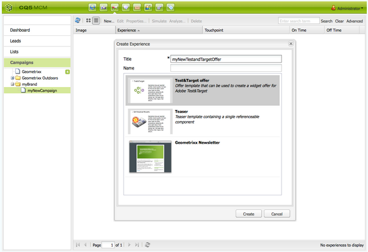

# Målerbjudanden{#target-offers}

## Skapa en test&amp;Target-erbjudandeupplevelse {#creating-a-test-target-offer-experience}

1. Välj din nya kampanj i den vänstra rutan eller dubbelklicka på den i den högra rutan.
1. Välj listvyn med hjälp av ikonen:

   

1. Klicka på **Ny ...**
1. Du kan ange **titel**, **namn** och typ av upplevelse som ska skapas. i det här fallet Test&amp;Target-erbjudande.

   

1. Klicka på **Skapa**.

   >[!NOTE]
   >
   >Test&amp;Target-upplevelser är för närvarande inte listade i MCM. De kan nås via **webbplatskonsolen** under Campaigns.

## Integrera med Adobe Target {#integrating-with-adobe-target}

Mer information finns i [Integrera med Adobe](/help/sites-administering/target.md) [Target](/help/sites-administering/target.md) .
