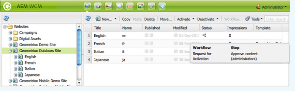
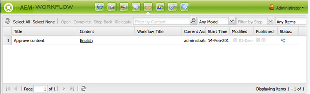

# Delta i arbetsflöden{#participating-in-workflows}

Arbetsflödena omfattar vanligtvis steg som kräver att en person utför en aktivitet på en sida eller en resurs. Arbetsflödet väljer en användare eller grupp som ska utföra aktiviteten och tilldelar en arbetsuppgift till den personen eller gruppen.

## Bearbetar dina arbetsuppgifter {#processing-your-work-items}

Du kan utföra följande åtgärder för att bearbeta ett arbetsobjekt:

* **Slutförd**

   Du kan slutföra ett objekt så att arbetsflödet kan fortsätta till nästa steg.

* **Delegera**

   Om du har tilldelats ett steg, men av någon anledning inte kan utföra någon åtgärd, kan du delegera steget till en annan användare eller grupp.

   Vilka användare som är tillgängliga för delegering beror på vem som har tilldelats arbetsposten:

   * Om arbetsuppgiften har tilldelats en grupp är gruppmedlemmarna tillgängliga.
   * Om arbetsuppgiften har tilldelats en grupp och sedan delegerats till en användare, är gruppmedlemmarna och gruppen tillgängliga.
   * Om arbetsuppgiften har tilldelats en enskild användare kan arbetsuppgiften inte delegeras.

* **Stega bakåt**

   Om du upptäcker att ett steg, eller en serie steg, måste upprepas, kan du stega tillbaka. På så sätt kan du välja ett steg som inträffade tidigare i arbetsflödet för ombearbetning. Arbetsflödet återgår till det steg du anger och fortsätter sedan därifrån.

## Delta i ett arbetsflöde {#participating-in-a-workflow}

### Meddelanden om tilldelade arbetsflödesåtgärder {#notifications-of-assigned-workflow-actions}

När du tilldelas en arbetsuppgift (till exempel **Godkänn innehåll**) visas olika varningar och/eller meddelanden:

* Kolumnen **Status** i webbplatskonsolen anger när en sida är i ett arbetsflöde:

   

* När du, eller en grupp som du tillhör, tilldelas en arbetsuppgift som en del av ett arbetsflöde, visas arbetsuppgiften i Inkorgen för ditt AEM-arbetsflöde.

   

### Slutför ett deltagarsteg {#completing-a-participant-step}

När du har vidtagit den angivna åtgärden kan du slutföra arbetsuppgiften och på så sätt tillåta arbetsflödet att fortsätta. Använd följande procedur för att slutföra arbetsuppgiften.

1. Markera arbetsflödessteget och klicka på knappen **Slutför** i det övre navigeringsfältet.
1. I den dialogruta som visas väljer du **Nästa steg**. det vill säga nästa steg. En nedrullningsbar lista visar alla lämpliga destinationer. Du kan också ange en **kommentar** .

   

   Hur många steg som visas beror på arbetsflödesmodellens design.

1. Bekräfta åtgärden genom att klicka på **OK** .

### Delegera ett deltagarsteg {#delegating-a-participant-step}

Använd följande procedur för att delegera en arbetsuppgift.

1. Klicka på knappen **Delegera** i det övre navigeringsfältet.
1. I dialogrutan använder du listrutan för att välja den **användare** som arbetsposten ska delegeras till. Du kan också lägga till en **kommentar**.

   

1. Bekräfta åtgärden genom att klicka på **OK** .

### Stega bakåt i ett deltagarsteg {#performing-step-back-on-a-participant-step}

Använd följande procedur för att stega bakåt.

1. Klicka på knappen Stega bakåt i det övre navigeringsfältet.
1. Välj Föregående steg i dialogrutan som visas. det vill säga det steg som ska köras nästa gång, även om det är ett steg som inträffar tidigare i arbetsflödet. En nedrullningsbar lista visar alla lämpliga destinationer.

   

1. Bekräfta åtgärden genom att klicka på OK.

