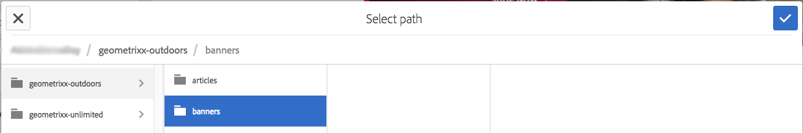

# Lägga till Scene7-funktioner på sidan{#adding-scene-features-to-your-page}

[Adobe Scene7](https://help.adobe.com/en_US/scene7/using/WS26AB0D9A-F51C-464e-88C8-580A5A82F810.html) är en värdbaserad lösning för att hantera, förbättra, publicera och leverera multimediematerial för webben, mobiler, e-post och internetanslutna skärmar och för tryck.

Du kan visa AEM-resurser som publicerats i Scene7 i olika visningsprogram:

* Zoomning
* Utfällbar
* Video
* Bildmall
* Bild

Du kan publicera digitala resurser direkt från AEM till Scene7 och du kan publicera digitala resurser från Scene7 till AEM.

I det här dokumentet beskrivs hur du publicerar digitala resurser från AEM till Scene7 och vice versa. Visningsprogrammen beskrivs också i detalj. Information om hur du konfigurerar AEM för Scene7 finns i [Integrera Scene7 med AEM](/help/sites-administering/scene7.md).

Se även [Lägga till bildscheman](/help/assets/image-maps.md).

Mer information om hur du använder videokomponenter med AEM finns i:

* [Video](/help/sites-classic-ui-authoring/manage-assets-classic-s7-video.md)

>[!NOTE]
>
>Om resurserna i Scene7 inte visas som de ska kontrollerar du att Dynamic Media är [inaktiverat](/help/assets/config-dynamic.md#disabling-dynamic-media) och uppdaterar sedan sidan.

## Publicera manuellt till Scene7 från Assets {#manually-publishing-to-scene-from-assets}

Du kan publicera digitala resurser på Scene7 antingen från Assets-konsolen i det klassiska användargränssnittet eller direkt från resursen.

>[!NOTE]
>
>AEM publicerar till Scene7 asynkront. När du har klickat på **Publicera** kan det ta flera sekunder för resursen att publicera till Scene7.

### Publicera från Resurskonsolen {#publishing-from-the-assets-console}

Så här publicerar du till Scene7 från resurskonsolen om resurserna finns i en målmapp för Scene7:

1. I det klassiska användargränssnittet för AEM klickar du på **Digital Assets** .

1. Markera resursen (eller resurserna) eller mappen i målmappen som du vill publicera på Scene7 och högerklicka och välj **Publicera på Scene7**. Du kan också välja **Publicera på Scen7** på **Verktyg-menyn**.

   

1. Gå till Scene7 och bekräfta att resurserna är tillgängliga.

   >[!NOTE]
   >
   >Om resurserna inte finns i en synkroniserad mapp för Scene7 är **Publicera till Scene7** på båda menyerna synliga men inaktiverade.

### Publicera från en resurs {#publishing-from-an-asset}

Du kan publicera en resurs manuellt så länge som resursen finns inuti den synkroniserade Scene7-mappen.

>[!NOTE]
>
>Om resursen inte finns i den synkroniserade mappen Scene7 visas inte länken till **Publicera till Scene7** .

Så här publicerar du till Scene7 direkt från en digital resurs:

1. I AEM klickar du på **Digital Assets** för att öppna den digitala resurshanteraren.

1. Dubbelklicka för att öppna en resurs.

1. Välj **Publicera på scen7** i rutan Resursinformation.

   

1. **Länken ändras till** Publicera ... och sedan **Publicerad**. Gå till Scene7 och bekräfta att resursen är tillgänglig.

   >[!NOTE]
   >
   >Om resursen inte publiceras korrekt på Scene7 ändras länken till **Publicering misslyckades**. Om resursen redan har publicerats till Scene7 läser länken **Publicera igen till Scene7**. Med återpublicering kan du göra ändringar i en mediefil i AEM och publicera om dem.

### Publicera resurser utanför CQ-målmappen {#publishing-assets-from-outside-the-cq-target-folder}

Adobe rekommenderar att du endast publicerar resurser till Scene7 från resurser i målmappen Scene7. Men om du behöver överföra resurser från en mapp utanför målmappen kan du ändå göra det genom att överföra dem till en **ad hoc** -mapp på Scene7.

Det gör du genom att först konfigurera molnkonfigurationen för sidan där resursen ska visas. Sedan lägger du till en Scene7-komponent på sidan och drar och släpper en resurs på komponenten. När sidegenskaperna har angetts för den sidan visas länken **Publicera till scen7** , som utlöser överföringen till Scene7.

>[!NOTE]
>
>Resurser som finns i ad hoc-mappen visas inte i Scene7 Content Browser.

Så här publicerar du resurser som finns utanför CQ-målmappen:

1. I AEM i det klassiska användargränssnittet klickar du på **Webbplatser** och navigerar till den webbsida där du vill lägga till en digital resurs som ännu inte har publicerats i Scene7. (Normala sidarvsregler gäller.)

1. Klicka på ikonen **Sida** i sidbrytaren och klicka på **Sidegenskaper**.

1. Klicka på **molntjänster** och klicka på **Lägg till tjänster** och välj **Scene7**.
1. Välj önskad konfiguration i listrutan **Adobe Scene7** och klicka på **OK**.

   

1. Lägg till en Scene7-komponent på önskad plats på webbsidan.
1. Dra en digital resurs från innehållssökaren till komponenten. Du ser en länk till **Kontrollera publiceringsstatus** för Scene7.

   >[!NOTE]
   >
   >Om den digitala resursen finns i CQ-målmappen visas ingen länk till **Kontrollera publiceringsstatus** för Scene7. Resurserna placeras bara i komponenten.

   

1. Klicka på **Kontrollera publiceringsstatus** för Scene7. Om resurserna inte publiceras publicerar AEM resursen till Scene7. När resursen har överförts finns den i ad hoc-mappen. Som standard finns ad hoc-mappen i **name_of_the_company/CQ5_adhoc**. Du kan [konfigurera detta vid behov](#configuringtheadhocfolder).

   >[!NOTE]
   >
   >Om resursen inte finns i en synkroniserad mapp för Scene7 och det inte finns någon molnkonfiguration kopplad till den aktuella sidan, misslyckas överföringen.

## Scene7 Components {#scene-components}

Följande Scene7-komponenter är tillgängliga i AEM:

* Zoomning
* Utfällbar (zoom)
* Bildmall
* Bild
* Video

>[!NOTE]
>
>De här komponenterna är inte tillgängliga som standard och måste markeras i designläge innan du använder.

När de har gjorts tillgängliga i designläge kan du lägga till komponenterna på sidan precis som andra AEM-komponenter. Resurser som ännu inte har publicerats till Scene7 publiceras till Scene7 i en synkroniserad mapp eller på en sida eller med en Scene7-molnkonfiguration.

>[!NOTE]
>
>Om du skapar och utvecklar anpassade S7-visningsprogram och använder Content Finder måste du lägga till parametern **allowfullscreen** explicit.

### Meddelande om att Flash-visningsprogrammet har upphört att gälla {#flash-viewers-end-of-life-notice}

Från och med den 31 januari 2017 kommer Adobe Scene7 officiellt att ha stöd för Flash-visningsprogrammets plattform.

Mer information om den här viktiga förändringen finns i Vanliga frågor och svar om [användarvänligheten i Flash Viewer](https://docs.adobe.com/content/docs/en/aem/6-1/administer/integration/marketing-cloud/scene7/flash-eol.html).

### Lägga till en Scene7-komponent på en sida {#adding-a-scene-component-to-a-page}

Att lägga till en Scene7-komponent på en sida är detsamma som att lägga till en komponent på en sida. Scene7-komponenter beskrivs i detalj i följande avsnitt.

Så här lägger du till en Scene7-komponent/ett visningsprogram på en sida i det klassiska användargränssnittet:

1. Öppna den sida där du vill lägga till Scene7-komponenten i AEM.

1. Om det inte finns några Scene7-komponenter tillgängliga klickar du på linjalen i **sidoknappen för att gå till designläget** , klickar på **Redigera** och väljer alla **Scene7** -komponenter för att göra dem tillgängliga.

1. Gå tillbaka till **redigeringsläget** genom att klicka på pennan i sidosparken.

1. Dra en komponent från **Scene7** -gruppen i sidosparken till den önskade platsen på sidan.

1. Klicka på **Redigera** för att öppna komponenten.

1. Redigera komponenten efter behov och klicka på **OK** för att spara ändringarna.

### Lägga till interaktiva tittarupplevelser på en responsiv webbplats {#adding-interactive-viewing-experiences-to-a-responsive-website}

Responsiv design för dina resurser innebär att dina resurser anpassas beroende på var de visas. Med responsiv design kan samma resurser visas effektivt på flera enheter.

Så här lägger du till en interaktiv visningsupplevelse på en responsiv webbplats i det klassiska användargränssnittet:

1. Logga in på AEM och kontrollera att du har [konfigurerat Adobe Scene7 Cloud Services](/help/sites-administering/scene7.md#configuring-scene-integration) och att Scene7-komponenterna är tillgängliga.

   >[!NOTE]
   >
   >Om Scene7 WCM-komponenterna inte är tillgängliga måste du aktivera dem i designläge.

1. På en webbplats där komponenterna i Scene7 är aktiverade drar du ett **bildvisningsprogram** till sidan.
1. Redigera komponenten och justera brytpunkterna på fliken **Scene7-inställningar** .

   

1. Bekräfta att tittarna ändrar storlek rejält och att alla interaktioner är optimerade för datorer, surfplattor och mobiler.

### Gemensamma inställningar för alla Scene7-komponenter {#settings-common-to-all-scene-components}

Även om konfigurationsalternativen varierar är följande vanligt för alla Scene7-komponenter:

* **Filreferens**- Bläddra till en fil som du vill referera till. Filreferensen visar resurs-URL:en och inte nödvändigtvis den fullständiga Scene7-URL:en, inklusive URL-kommandona och -parametrarna. Du kan inte lägga till URL-kommandon och parametrar för Scene7 i det här fältet. De måste läggas till med motsvarande funktioner i komponenten.
* **Bredd** - Här kan du ange bredden.
* **Höjd** - Här kan du ange höjden.

Du anger dessa konfigurationsalternativ genom att öppna (dubbelklicka) en Scene7-komponent, till exempel när du öppnar en **Zoom** -komponent:

### Zoomning {#zoom}

HTML5 Zoom-komponenten visar en större bild när du trycker på +-knappen.

Resursen har zoomverktyg längst ned. Klicka **+** för att förstora. Klicka **-** för att minska. Om du klickar på **x** - eller återställningspilen återställs bilden till den ursprungliga storlek den importerades som. Klicka på de diagonala pilarna för att göra helskärmspilen. Klicka på **Redigera** för att konfigurera komponenten. Med den här komponenten kan du konfigurera [inställningar som är gemensamma för alla Scene7-komponenter](#settings-common-to-all-scene-components).

### Utfällbar {#flyout}

I den utfällbara HTML5-komponenten visas resursen som en delad skärm. lämnade tillgången i den angivna storleken, till höger visas zoomdelen. Klicka på **Redigera** för att konfigurera komponenten. Med den här komponenten kan du konfigurera [inställningar som är gemensamma för alla Scene7-komponenter](/help/sites-administering/scene7.md#settingscommontoallscene7components).

>[!NOTE]
>
>Om den utfällbara komponenten använder en anpassad storlek, används den anpassade storleken och responsiv konfiguration av komponenten inaktiveras.
>
>Om den utfällbara komponenten använder standardstorleken, enligt inställningarna i designvyn, används standardstorleken och komponenten sträcks ut för att passa sidlayoutstorleken med responsiv inställning för komponenten aktiverad. Tänk dock på att det finns en begränsning för responsiv konfiguration av komponenten. När du använder den utfällbara komponenten med responsiv konfiguration bör du inte använda den med full sidsträckning. I annat fall kan den utfällbara menyn sträcka sig utanför sidans högra kant.

### Bild {#image}

Med komponenten Scene7 Image kan du lägga till funktionerna Scene7 i dina bilder, till exempel Scene7-modifierare, bild- eller visningsförinställningar samt skärpa. Scene7-bildkomponenten liknar andra bildkomponenter i AEM med speciella Scene7-funktioner. I det här exemplet används URL-modifieraren Scene7, **&amp;op_invert=1** .

**Titel, Alt-text** På fliken Avancerat lägger du till en titel i bilden och alternativ text för användare som har grafik inaktiverad.

**URL, Öppna i** Du kan ange en resurs från för att öppna en länk. Ange URL:en och Öppna i anger om du vill att den ska öppnas i samma fönster eller i ett nytt fönster.

**Visningsförinställning** Välj en befintlig visningsförinställning i listrutan. Om den visningsförinställning som du söker efter inte visas kanske du måste göra den synlig. Se Hantera förinställningar för visningsprogram. Du kan inte välja en visningsförinställning om du använder en bildförinställning och vice versa.

**Scene7 Configuration** Välj den Scene7-konfiguration som du vill använda för att hämta aktiva bildförinställningar från SPS.

**Bildförinställning** Välj en befintlig bildförinställning i listrutan. Om den bildförinställning du söker inte syns kan du behöva göra den synlig. Se Hantera bildförinställningar. Du kan inte välja en visningsförinställning om du använder en bildförinställning och vice versa.

**Utdataformat** Välj bildens utdataformat, till exempel jpeg. Beroende på vilket utdataformat du väljer kan det finnas ytterligare konfigurationsalternativ. Mer information finns i Bästa tillvägagångssätt för förinställda bilder.

**Skärpa** Välj hur du vill öka skärpan i bilden. Skärpa förklaras i detalj i Bästa praxis för bildförinställningar och Bästa praxis för skärpa.

**URL-modifierare** Du kan ändra bildeffekter genom att ange ytterligare S7-bildkommandon. Dessa beskrivs i Bildförinställningar och Kommandoreferensen.

**Brytpunkter** Om webbplatsen är responsiv vill du justera brytpunkterna. Brytpunkter måste avgränsas med kommatecken (,).

### Bildmall {#image-template}

[Scene7-bildmallar](https://help.adobe.com/en_US/scene7/using/WS60B68844-9054-4099-BF69-3DC998A04D3C.html) är lageruppbyggt Photoshop-innehåll som importerats till Scene7, där innehåll och egenskaper parametriserades för variabilitet. Med **bildmallskomponenten** kan du importera bilder och ändra texten dynamiskt i AEM. Dessutom kan du konfigurera **Image-mallkomponenten** så att värden från klientkontexten används, så att varje användare upplever bilden på ett personligt sätt.

Klicka på **Redigera** för att konfigurera komponenten. Du kan konfigurera [inställningar som är gemensamma för alla Scene7-komponenter](/help/sites-administering/scene7.md#settingscommontoallscene7components) samt andra inställningar som beskrivs i det här avsnittet.

**Filreferens, Bredd, Höjd** Se inställningar som är gemensamma för alla Scene7-komponenter.

>[!NOTE]
>
>Det går inte att lägga till URL-kommandon och parametrar för Scene7 direkt i filreferenswebbadressen. De kan bara definieras i komponentgränssnittet på panelen **Parametrar** .

**Titel, Alt-text** På fliken Scene7-bildmall lägger du till en titel i bilden och alternativ text för användare som har grafik inaktiverad.

**URL, Öppna i** Du kan ange en resurs från för att öppna en länk. Ange URL:en och Öppna i anger om du vill att den ska öppnas i samma fönster eller i ett nytt fönster.

**Parameterpanelen** När du importerar en bild fylls parametrarna i automatiskt med information från bilden. Om det inte finns något innehåll som kan ändras dynamiskt är det här fönstret tomt.

#### Ändra text dynamiskt {#changing-text-dynamically}

Om du vill ändra texten dynamiskt anger du ny text i fälten och klickar på **OK**. I det här exemplet är **priset** nu 50 dollar och frakten 99 cent.

Texten i bilden ändras. Du kan återställa texten till det ursprungliga värdet genom att klicka på **Återställ** bredvid fältet.

#### Ändra text så att värdet för en klientkontext återspeglas {#changing-text-to-reflect-the-value-of-a-client-context-value}

Om du vill länka ett fält till ett klientkontextvärde klickar du på **Välj** för att öppna klientsnabbmenyn, markerar klientkontexten och klickar på **OK**. I det här exemplet ändras namnet baserat på att namnet länkas till det formaterade namnet i profilen.

Texten återspeglar namnet på den inloggade användaren. Du kan återställa texten till det ursprungliga värdet genom att klicka på **Återställ **intill fältet.

#### Göra Scene7-bildmallen till en länk {#making-the-scene-image-template-a-link}

Så här gör du Scene7-bildmallskomponenten till en klickbar länk:

1. Klicka på **Redigera** på sidan med bildmallskomponenten Scene7.
1. I fältet **URL** anger du den URL som användarna ska gå till när de klickar på bilden. I fältet **Öppna i** väljer du om du vill att målet ska öppnas (ett nytt fönster eller samma fönster).

   

1. Click **OK**.

### Videokomponent {#video-component}

Komponenten Scene7 **Video** (som finns i avsnittet Scene7 i sidosparken) använder enhets- och bandbreddsidentifiering för att leverera rätt video till varje skärm. Den här komponenten är en HTML5-videospelare; det är ett enda visningsprogram som kan användas över flera kanaler.

Den kan användas för adaptiva videouppsättningar, en enda MP4-video eller en enda F4V-video.

Mer information om hur videoklipp fungerar med Scene7-integrering finns i [Video](/help/sites-classic-ui-authoring/manage-assets-classic-s7-video.md) . Se även hur [videokomponenten **Scene7** jämför med **videokomponenten** som utgör grunden](/help/sites-classic-ui-authoring/manage-assets-classic-s7-video.md).

### Kända begränsningar för videokomponenten {#known-limitations-for-the-video-component}

Adobe DAM och WCM visar om en mastervideo har överförts. De visar inte följande proxyresurser:

* Scene7-kodade återgivningar
* Scene7 adaptiva videouppsättningar

När du använder en adaptiv videouppsättning med videokomponenten Scene7 måste komponentens storlek ändras så att den passar videofilens mått.

## Scene7 Content Browser {#scene-content-browser}

Med Scene7:s innehållsläsare kan du visa innehåll från Scene7 direkt i AEM. Om du vill få åtkomst till innehållsläsaren väljer du **Scene7** i det pekoptimerade användargränssnittet eller **S7** -ikonen i det klassiska användargränssnittet. Funktionen är identisk mellan båda användargränssnitten.

Om du har flera konfigurationer visar AEM som standard [standardkonfigurationen](/help/sites-administering/scene7.md#configuring-a-default-configuration). Du kan välja olika konfigurationer direkt i Scene7-innehållsläsaren i listrutan.

>[!NOTE]
>
>* Resurser som finns i ad hoc-mappen visas inte i Scene7-innehållsläsaren.
>* När [Säker förhandsvisning är aktiverat](/help/sites-administering/scene7.md#configuring-the-state-published-unpublished-of-assets-pushed-to-scene)visas både publicerade och opublicerade resurser på Scene7 i innehållsläsaren Scene7.
>* Om du inte ser **Scene7** eller **S7** -ikonen som ett alternativ i webbläsaren måste du [konfigurera Scene7 så att det fungerar med AEM](/help/sites-administering/scene7.md).
   >
   >
* För video har Scene7:s innehållsläsare stöd för: >
   >    * Adaptiva videouppsättningar: behållare för alla videoåtergivningar som behövs för sömlös uppspelning på flera skärmar
   >    * Enkel MP4-video
   >    * En F4V-video
>

### Bläddra i innehåll {#browsing-content-in-the-classic-ui}

Bläddra bland innehåll i Scene7 genom att klicka på fliken **S7** .

Du kan ändra konfigurationen som du använder genom att välja konfigurationen. Mapparna ändras beroende på vilken konfiguration du väljer.

Precis som med Innehållssökaren för Resurser kan du söka efter resurser och filtrera resultat. Till skillnad från Assets Finder **börjar filnamnet med** den sträng du angav när du anger ett nyckelord på fliken **S7** , i stället för **att innehålla** nyckelordet i filnamnet.

Som standard visas resurser efter filnamn. Du kan också filtrera resultat efter resurstyp.

>[!NOTE]
>
>För video har Scene7:s webbläsare för WCM stöd för:
>
>* Adaptiva videouppsättningar: behållare för alla videoåtergivningar som behövs för sömlös uppspelning på flera skärmar
>* Enkel MP4-video
>* En F4V-video
>

### Söka efter Scene7-resurser med innehållsläsaren {#searching-for-scene-assets-with-the-content-browser}

Att söka efter Scene7-resurser liknar att söka efter AEM-resurser, förutom att när du söker ser du en fjärrvy av resurserna i Scene7-systemet i stället för att importera dem direkt till AEM.

Du kan använda det klassiska användargränssnittet eller det pekoptimerade användargränssnittet för att både visa och söka efter resurser. Beroende på gränssnittet är sökningen något annorlunda.

När du söker i något av användargränssnitten kan du filtrera efter följande villkor (visas här i det pekoptimerade användargränssnittet):

**Ange nyckelord** Du kan söka efter resurser efter namn. När du söker efter nyckelord som du anger är det filnamnet börjar med. Om du t.ex. skriver ordet &quot;simning&quot; söker du efter alla resursfilnamn som börjar med de bokstäverna i den ordningen. Var noga med att klicka på Ange när du har skrivit in termen för att hitta resursen.

**Mapp/sökväg** Namnet på mappen som visas baseras på den konfiguration du har valt. Du kan gå ned till lägre nivåer genom att klicka på mappikonen och välja en undermapp. Markera sedan kryssrutan för att markera den.

Om du anger ett nyckelord och väljer en mapp söker AEM igenom den mappen och eventuella undermappar. Om du inte anger några nyckelord när du söker efter, kommer endast resurserna i den mappen att visas om du väljer mappen. Inga undermappar kommer att visas.

Som standard söker AEM igenom den markerade mappen och alla undermappar.

**Typ av resurs** Välj Scene7 för att bläddra bland Scene7-innehåll. Det här alternativet är bara tillgängligt om Scene7 har konfigurerats.

**Konfiguration** Om du har definierat mer än en Scene7-konfiguration i molntjänster kan du välja den här. Därför ändras mappen baserat på den konfiguration du har valt.

**Resurstyp** I Scene7-webbläsaren kan du filtrera resultaten så att de innehåller något av följande: bilder, mallar, videor och anpassningsbara videouppsättningar. Om du inte väljer någon resurstyp söker AEM som standard igenom alla resurstyper.

>[!NOTE]
>
>* I det klassiska användargränssnittet kan du även söka efter **Flash** och **FXG**. Filtrering för dessa i det pekoptimerade användargränssnittet stöds för närvarande inte.
   >
   >
* När du söker efter video söker du efter en enskild återgivning. Resultatet returnerar den ursprungliga återgivningen (endast *.mp4) och den kodade återgivningen.
* När du söker i en adaptiv videouppsättning söker du i mappen och i alla undermappar, men bara om du har lagt till ett nyckelord i sökningen. Om du inte har lagt till något nyckelord söker AEM inte igenom undermapparna.

**Publiceringsstatus** Du kan filtrera efter resurser baserat på publiceringsstatus: Opublicerad eller publicerad. Om du inte väljer någon publiceringsstatus söker AEM som standard igenom alla publiceringsstatusar.

