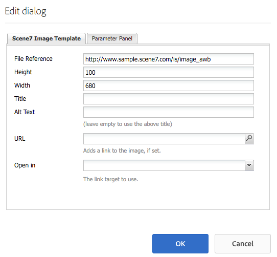

# Lägg till Dynamic Media Classic-funktioner (Scene7) på din sida{#adding-scene-features-to-your-page}

[Adobe Dynamic Media Classic (Scene7)](https://experienceleague.adobe.com/docs/dynamic-media-classic/using/home.html) är en värdbaserad lösning för att hantera, förbättra, publicera och leverera mediefiler till webben, mobiler, e-post och internetanslutna displayer samt för tryck.

Du kan visa Experience Manager-resurser som publicerats i Dynamic Media Classic (Scene7) i olika visningsprogram:

* Zooma
* Utfällbar
* Video
* Bildmall
* Bild

Du kan publicera digitala resurser direkt från Experience Manager till Dynamic Media Classic (Scene7) och du kan publicera digitala resurser från Dynamic Media Classic (Scene7) till Experience Manager.

I det här dokumentet beskrivs hur du publicerar digitala resurser från Experience Manager till Dynamic Media Classic (Scene7) och omvänt. Visningsprogrammen beskrivs också i detalj. Information om hur du konfigurerar Experience Manager för Dynamic Media Classic (Scene7) finns i [Integrera Dynamic Media Classic (Scene7) med Experience Manager](/help/sites-administering/scene7.md).

Se även [Lägg till bildscheman](/help/assets/image-maps.md).

Mer information om hur du använder videokomponenter med Experience Manager finns i:

* [Video](/help/sites-classic-ui-authoring/manage-assets-classic-s7-video.md)

>[!NOTE]
>
>Om Dynamic Media Classic (Scene7)-resurser inte visas som de ska kontrollerar du att Dynamic Media är [inaktiverad](/help/assets/config-dynamic.md#disabling-dynamic-media) och sedan uppdatera sidan.

## Publicera manuellt till Dynamic Media Classic (Scene7) från Assets {#manually-publishing-to-scene-from-assets}

Du kan publicera digitala resurser till Dynamic Media Classic (Scene7) antingen från Assets-konsolen i det klassiska användargränssnittet eller direkt från resursen.

>[!NOTE]
>
>Experience Manager publicerar till Dynamic Media Classic (Scene7) asynkront. När du har valt **[!UICONTROL Publish]** kan det ta några sekunder för resursen att publicera till Dynamic Media Classic (Scene7).
>

### Publicera från Resurskonsolen {#publishing-from-the-assets-console}

Du kan publicera till Dynamic Media Classic (Scene7) från Resurskonsolen om resurserna finns i en Dynamic Media Classic-målmapp (Scene7).

1. I det klassiska användargränssnittet för Experience Manager väljer du **[!UICONTROL Digital Assets]** för att få tillgång till resurshanteraren.

1. Markera resursen (eller resurserna) eller mappen i målmappen som du vill publicera till Dynamic Media Classic (Scene7) och högerklicka och välj **[!UICONTROL Publish to Dynamic Media Classic (Scene7)]**. Du kan också välja **[!UICONTROL Publish to Dynamic Media Classic (Scene7)]** från **[!UICONTROL Tools]** -menyn.

   

1. Gå till Dynamic Media Classic (Scene7) och bekräfta att resurserna är tillgängliga.

   >[!NOTE]
   >
   >Om resurserna inte finns i en synkroniserad Dynamic Media Classic-mapp (Scene7), **[!UICONTROL Publish to Dynamic Media Classic (Scene7)]** i båda menyerna visas men är inaktiverade.

### Publicera från en resurs {#publishing-from-an-asset}

Du kan publicera en resurs manuellt så länge som resursen finns i den synkroniserade Dynamic Media Classic-mappen (Scene7).

>[!NOTE]
>
>Om resursen inte finns i den synkroniserade mappen för Dynamic Media Classic (Scene7) länkar du till **[!UICONTROL Publish to Dynamic Media Classic (Scene7)]** visas inte.

Så här publicerar du till Dynamic Media Classic (Scene7) direkt från en digital resurs:

1. I Experience Manager väljer du **[!UICONTROL Digital Assets]** för att få tillgång till resurshanteraren.

1. Dubbelklicka för att öppna en resurs.

1. I rutan Resursinformation väljer du **[!UICONTROL Publish to Dynamic Media Classic (Scene7)]**.

   

1. Länken ändras till **[!UICONTROL Publishing ...]** och sedan **[!UICONTROL Published]**. Gå till Dynamic Media Classic (Scene7) och bekräfta att resursen är tillgänglig.

   >[!NOTE]
   >
   >Om resursen inte publiceras korrekt på Dynamic Media Classic (Scene7) ändras länken till **[!UICONTROL Publishing Failed]**. Om resursen redan har publicerats till Dynamic Media Classic (Scene7) läses länken **[!UICONTROL Re-Publish to Dynamic Media Classic (Scene7)]**. Med ompublicering kan du ändra resurser i Experience Manager och publicera dem igen.

### Publicera resurser utanför CQ-målmappen {#publishing-assets-from-outside-the-cq-target-folder}

Adobe rekommenderar att du bara publicerar resurser till Dynamic Media Classic (Scene7) från resurser i målmappen för Dynamic Media Classic (Scene7). Men om du måste överföra resurser från en mapp utanför målmappen kan du ändå göra det genom att överföra dem till en on-demand-mapp på Dynamic Media Classic (Scene7). Först konfigurerar du molnkonfigurationen för sidan där du vill att resursen ska visas. Sedan lägger du till en Dynamic Media Classic-komponent (Scene7) på sidan och drar och släpper en resurs på komponenten. När sidegenskaperna har ställts in för den sidan, **[!UICONTROL Publish to Dynamic Media Classic (Scene7)]** visas när det här alternativet har valts utlöses överföringen till Dynamic Media Classic (Scene7).

>[!NOTE]
>
>Resurser som finns i mappen on-demand visas inte i Dynamic Media Classic (Scene7) Content Browser.

**Så här publicerar du resurser utanför CQ-målmappen:**

1. I Experience Manager i det klassiska användargränssnittet väljer du **[!UICONTROL Websites]** och navigera till den webbsida där du vill lägga till en digital resurs som ännu inte har publicerats i Dynamic Media Classic (Scene7). (Normala sidarvsregler gäller.)

1. I sidosparken väljer du **[!UICONTROL Page]** ikon och markera **[!UICONTROL Page Properties]**.

1. Välj **[!UICONTROL Cloud Services]**.
1. Välj **[!UICONTROL Add services]**.
1. Välj **[!UICONTROL Dynamic Media Classic (Scene7)]**.
1. I **[!UICONTROL Adobe Dynamic Media Classic (Scene7)]** väljer du önskad konfiguration och väljer **[!UICONTROL OK]**.

   

1. Lägg till en Dynamic Media Classic-komponent (Scene7) på önskad plats på webbsidan.
1. Dra en digital resurs från innehållssökaren till komponenten. Du ser en länk till **[!UICONTROL Check Dynamic Media Classic (Scene7) Publication Status]**.

   >[!NOTE]
   >
   >Om den digitala resursen finns i CQ-målmappen finns det ingen länk till **[!UICONTROL Check Dynamic Media Classic (Scene7) Publication Status]** visas. Resurserna placeras i komponenten.

   

1. Välj **[!UICONTROL Check Dynamic Media Classic (Scene7) Publication Status]**. Om resurserna inte publiceras publicerar Experience Manager resursen till Dynamic Media Classic (Scene7). När resursen har överförts finns den i mappen on-demand. Som standard finns mappen on demand i **[!UICONTROL name_of_the_company/CQ5_adhoc]**. Du kan [konfigurera on demand-mappen, om det behövs](#configuringtheadhocfolder).

   >[!NOTE]
   >
   >Om resursen inte finns i en synkroniserad Dynamic Media Classic-mapp (Scene7) och det inte finns någon Dynamic Media Classic (Scene7)-molnkonfiguration kopplad till den aktuella sidan misslyckas överföringen.

## Dynamic Media Classic-komponenter (Scene7) {#scene-components}

Följande Dynamic Media Classic-komponenter (Scene7) finns i Experience Manager:

* Zooma
* Utfällbar (zoom)
* Bildmall
* Bild
* Video

>[!NOTE]
>
>De här komponenterna är inte tillgängliga som standard och måste markeras i designläge innan du kan använda dem.

När de har gjorts tillgängliga i designläge kan du lägga till komponenterna på sidan precis som andra Experience Manager-komponenter. Resurser som ännu inte publicerats till Dynamic Media Classic (Scene7) publiceras till Dynamic Media Classic (Scene7) om de ligger i en synkroniserad mapp eller på en sida eller med en Dynamic Media Classic (Scene7) Cloud Configuration.

>[!NOTE]
>
>Om du skapar och utvecklar anpassade S7-visningsprogram och använder Content Finder måste du lägga till `allowfullscreen` parameter.

### Meddelande om att Flash Viewer har upphört {#flash-viewers-end-of-life-notice}

Från och med den 31 januari 2017 upphörde Adobe Dynamic Media Classic (Scene7) officiellt stödet för visningsprogramplattformen Flash.

### Lägga till en Dynamic Media Classic-komponent (Scene7) på en sida {#adding-a-scene-component-to-a-page}

Att lägga till en Dynamic Media Classic-komponent (Scene7) på en sida är detsamma som att lägga till en komponent på en sida. Komponenterna i Dynamic Media Classic (Scene7) beskrivs i detalj i följande avsnitt.

Så här lägger du till en Dynamic Media Classic-komponent (Scene7)/visningsprogram på en sida i det klassiska användargränssnittet:

1. Öppna den sida i Experience Manager där du vill lägga till Dynamic Media Classic-komponenten (Scene7).

1. Om det inte finns några Dynamic Media Classic-komponenter (Scene7) väljer du linjalen i sidosparken för att ange **Design** läge, välja **[!UICONTROL Edit]** parsys, och markera alla **[!UICONTROL Dynamic Media Classic (Scene7)]** för att göra dem tillgängliga.

1. Återgå till **Redigera** genom att markera pennan i sidsparken.

1. Dra en komponent från **[!UICONTROL Dynamic Media Classic (Scene7)]** på sidan i den önskade platsen.

1. Välj ***[!UICONTROL Edit]** så att du kan öppna komponenten.

1. Redigera komponenten efter behov och markera **[!UICONTROL OK]** för att spara ändringar.

### Lägga till interaktiva tittarupplevelser på en responsiv webbplats {#adding-interactive-viewing-experiences-to-a-responsive-website}

Responsiv design för dina resurser innebär att dina resurser anpassas beroende på var de visas. Med responsiv design kan samma resurser visas effektivt på flera enheter.

Så här lägger du till en interaktiv visningsupplevelse på en responsiv webbplats i det klassiska användargränssnittet:

1. Logga in på Experience Manager och kontrollera att du har [konfigurerade Adobe Dynamic Media Classic-Cloud Services (Scene7)](/help/sites-administering/scene7.md#configuring-scene-integration) och att Dynamic Media Classic-komponenter (Scene7) är tillgängliga.

   >[!NOTE]
   >
   >Om Dynamic Media Classic (Scene7) WCM-komponenter inte är tillgängliga måste du aktivera dem i designläge.

1. Dra en **[!UICONTROL Image]** till sidan.
1. Redigera komponenten och justera brytpunkterna i **[!UICONTROL Dynamic Media Classic (Scene7) Settings]** -fliken.

   

1. Bekräfta att tittarna ändrar storlek rejält och att alla interaktioner är optimerade för datorer, surfplattor och mobiler.

### Gemensamma inställningar för alla Dynamic Media Classic-komponenter (Scene7) {#settings-common-to-all-scene-components}

Även om konfigurationsalternativen varierar är följande vanligt för alla Dynamic Media Classic-komponenter (Scene7):

* **Filreferens**- Bläddra till en fil som du vill referera till. Filreferensen visar resurs-URL:en och inte nödvändigtvis den fullständiga Dynamic Media Classic-URL:en (Scene7) inklusive URL-kommandona och -parametrarna. Du kan inte lägga till Dynamic Media Classic (Scene7) URL-kommandon och -parametrar i det här fältet. De måste i stället läggas till via motsvarande funktioner i komponenten.
* **Bredd** - Ange bredden.
* **Höjd** - Här kan du ange höjden.

Du anger dessa konfigurationsalternativ genom att öppna (dubbelklicka) en Dynamic Media Classic-komponent (Scene7), till exempel när du öppnar en **Zooma** komponent:

### Zooma {#zoom}

Zoomkomponenten för HTML5 visar en större bild när du trycker på plusknappen (+).

Resursen har zoomverktyg längst ned. Välj **[!UICONTROL +]** för att förstora. Välj **[!UICONTROL -]** för att minska. Markera **[!UICONTROL x]** eller zoompilen återställer bilden till den ursprungliga storlek som den importerades som. Markera de diagonala pilarna så att du kan göra den i helskärmsläge. Välj **[!UICONTROL Edit]** så att du kan konfigurera komponenten. Med den här komponenten kan du konfigurera [gemensamma inställningar för alla Dynamic Media Classic-komponenter (Scene7)](#settings-common-to-all-scene-components).

### Utfällbar {#flyout}

I den utfällbara komponenten HTML5 visas resursen som en delad skärm. lämnade tillgången i den angivna storleken, till höger visas zoomdelen. Välj **[!UICONTROL Edit]** så att du kan konfigurera komponenten. Med den här komponenten kan du konfigurera [gemensamma inställningar för alla Dynamic Media Classic-komponenter (Scene7)](/help/sites-administering/scene7.md#settingscommontoallscene7components).

>[!NOTE]
>
>Om den utfällbara komponenten använder en anpassad storlek, används den anpassade storleken och responsiv konfiguration av komponenten inaktiveras.
>
>Om den utfällbara komponenten använder standardstorleken, enligt inställningarna i designvyn, används standardstorleken. Komponenten sträcks ut så att den passar sidlayoutens storlek med responsiv konfiguration av komponenten aktiverad. Tänk dock på att det finns en begränsning för responsiv konfiguration av komponenten. När du använder den utfällbara komponenten med responsiv konfiguration bör du inte använda den med full sidsträckning. I annat fall kan den utfällbara menyn sträcka sig utanför sidans högra kant.

### Bild {#image}

Med Dynamic Media Classic (Scene7) Image-komponenten kan du lägga till Dynamic Media Classic (Scene7)-funktioner i dina bilder, till exempel Dynamic Media Classic (Scene7)-modifierare, bild- eller visningsförinställningar samt skärpa. Dynamic Media Classic-bildkomponenten (Scene7) liknar andra bildkomponenter i Experience Manager med speciella Dynamic Media Classic-funktioner (Scene7). I det här exemplet har bilden URL-modifieraren för Dynamic Media Classic (Scene7), `&op_invert=1` används.

**Titel, Alt-text** - På fliken Avancerat lägger du till en titel i bilden och alternativ text för användare som har grafik inaktiverad.

**URL, Öppna i** - Du kan ställa in en resurs från för att öppna en länk. Ange URL:en och Öppna i anger om du vill att den ska öppnas i samma fönster eller i ett nytt fönster.

**Förinställning för visningsprogram** - Välj en befintlig visningsförinställning i listrutan. Om den visningsförinställning du söker efter inte visas måste du göra den synlig. Se Hantera förinställningar för visningsprogram. Du kan inte välja en visningsförinställning om du använder en bildförinställning och omvänt.

**Konfiguration av Dynamic Media Classic (Scene7)** - Välj den Dynamic Media Classic-konfiguration (Scene7) som du vill använda för att hämta aktiva bildförinställningar från SPS.

**Bildförinställning** - Välj en befintlig bildförinställning i listrutan. Om den bildförinställning du söker inte syns måste du göra den synlig. Se Hantera bildförinställningar. Du kan inte välja en visningsförinställning om du använder en bildförinställning och omvänt.

**Utdataformat** - Välj bildens utdataformat, till exempel jpeg. Beroende på vilket utdataformat du väljer kan det finnas ytterligare konfigurationsalternativ. Mer information finns i Bästa tillvägagångssätt för förinställda bilder.

**Skärpa** - Välj hur du vill öka skärpan i bilden. Skärpa förklaras i detalj i Bästa praxis för bildförinställningar och Bästa praxis för skärpa.

**URL-modifierare** - Du kan ändra bildeffekter genom att ange ytterligare S7-bildkommandon. Dessa kommandon beskrivs i Bildförinställningar och Kommandoreferensen.

**Brytpunkter** - Om webbplatsen är responsiv vill du justera brytpunkterna. Brytpunkter måste avgränsas med kommatecken (,).

### Bildmall {#image-template}

Dynamic Media Classic (Scene7)-bildmallar är Photoshop-innehåll i lager som importerats till Dynamic Media Classic (Scene7), där innehåll och egenskaper parametriserats för variabilitet. The **[!UICONTROL Image template]** kan du importera bilder och ändra texten dynamiskt i Experience Manager. Dessutom kan du konfigurera **[!UICONTROL Image template]** -komponent för att använda värden från klientkontext, så att varje användare upplever bilden på ett personaliserat sätt.

Välj **[!UICONTROL Edit]** - för att konfigurera komponenten. Du kan konfigurera [gemensamma inställningar för alla Dynamic Media Classic-komponenter (Scene7)](/help/sites-administering/scene7.md#settingscommontoallscene7components) och andra inställningar som beskrivs i det här avsnittet.

**Filreferens, bredd, höjd** - Se [gemensamma inställningar för alla Dynamic Media Classic-komponenter (Scene7)](/help/sites-administering/scene7.md#settingscommontoallscene7components).

>[!NOTE]
>
>Dynamic Media Classic (Scene7) URL-kommandon och -parametrar kan inte läggas till direkt i filreferensens URL. De kan bara definieras i komponentens användargränssnitt i **[!UICONTROL Parameter]** -panelen.

**Titel, Alt-text** - På fliken Dynamic Media Classic (Scene7) Bildmall lägger du till en titel i bilden och alternativ text för användare som har bilder inaktiverade.

**URL, Öppna i** - Du kan ställa in en resurs från för att öppna en länk. Ange URL:en och Öppna i anger om du vill att den ska öppnas i samma fönster eller i ett nytt fönster.

**Parameterpanel** - När du importerar en bild fylls parametrarna i automatiskt med information från bilden. Om det inte finns något innehåll som kan ändras dynamiskt är det här fönstret tomt.

#### Ändra text dynamiskt {#changing-text-dynamically}

Om du vill ändra texten dynamiskt anger du ny text i fälten och markerar **[!UICONTROL OK]**. I det här exemplet **Pris** kostar nu 50 dollar och frakten är 99 cent.

Texten i bilden ändras. Du kan återställa texten till det ursprungliga värdet genom att markera **[!UICONTROL Reset]** bredvid fältet.

#### Ändra text så att den återspeglar värdet för ett klientkontextvärde {#changing-text-to-reflect-the-value-of-a-client-context-value}

Om du vill länka ett fält till ett klientkontextvärde väljer du **[!UICONTROL Select]** för att öppna klientsnabbmenyn väljer du klientkontext och väljer **[!UICONTROL OK]**. I det här exemplet ändras namnet baserat på att namnet länkas till det formaterade namnet i profilen.

Texten återspeglar namnet på den inloggade användaren. Du kan återställa texten till det ursprungliga värdet genom att markera **[!UICONTROL Reset]** bredvid fältet.

#### Gör Dynamic Media Classic-bildmallen (Scene7) till en länk {#making-the-scene-image-template-a-link}

Du kan göra Dynamic Media Classic-bildmallskomponenten (Scene7) till en klickbar länk.

1. På sidan med bildmallskomponenten Dynamic Media Classic (Scene7) väljer du **[!UICONTROL Edit]**.
1. I **[!UICONTROL URL]** anger du den URL som användarna går till när de klickar på bilden. I **[!UICONTROL Open in]** väljer du om du vill att målet ska öppnas (ett nytt fönster eller samma fönster).

   

1. Välj **[!UICONTROL OK]**.

### Videokomponent {#video-component}

Dynamic Media Classic (Scene7) **[!UICONTROL Video]** -komponenten (tillgänglig från Dynamic Media Classic (Scene7) i sidosparken) använder enhets- och bandbreddsidentifiering för att leverera rätt video till varje skärm. Den här komponenten är en videospelare för HTML5. det är ett enda visningsprogram som kan användas över flera kanaler.

Den kan användas för adaptiva videouppsättningar, en enda MP4-video eller en enda F4V-video.

Se [Video](/help/sites-classic-ui-authoring/manage-assets-classic-s7-video.md) om du vill ha mer information om hur videofilmer fungerar med Dynamic Media Classic-integrering (Scene7). Se även hur [den **Dynamic Media Classic (Scene7) - video** -komponenten jämfört med grunden **video** komponent](/help/sites-classic-ui-authoring/manage-assets-classic-s7-video.md).

### Kända begränsningar för videokomponenten {#known-limitations-for-the-video-component}

Adobe DAM och WCM visar om en primär källvideo har överförts. De visar inte följande proxyresurser:

* Dynamic Media Classic (Scene7)-kodade renderingar
* Dynamic Media Classic (Scene7) adaptiva videouppsättningar

När du använder en adaptiv videouppsättning med videokomponenten i Dynamic Media Classic (Scene7) måste komponentens storlek ändras så att den passar videofilens mått.

## Dynamic Media Classic (Scene7) {#scene-content-browser}

Med Dynamic Media Classic (Scene7) webbläsare kan du visa innehåll från Dynamic Media Classic (Scene7) direkt i Experience Manager. Om du vill öppna innehållsläsaren väljer du i Innehållssökning **Dynamic Media Classic (Scene7)** i det pekoptimerade användargränssnittet eller **S7** -ikonen i det klassiska användargränssnittet. Funktionen är identisk mellan båda användargränssnitten.

Om du har flera konfigurationer visas Experience Manager som standard [standardkonfiguration](/help/sites-administering/scene7.md#configuring-a-default-configuration). Du kan välja olika konfigurationer direkt i Dynamic Media Classic (Scene7) innehållsläsare i listrutan.

>[!NOTE]
>
>* Resurser i mappen on demand visas inte i Dynamic Media Classic (Scene7) innehållsläsare.
>* När [Säker förhandsvisning är aktiverat](/help/sites-administering/scene7.md#configuring-the-state-published-unpublished-of-assets-pushed-to-scene), både publicerade och opublicerade mediefiler på Dynamic Media Classic (Scene7) visas i Dynamic Media Classic (Scene7) innehållsläsare.
>* Om du inte ser **[!UICONTROL Dynamic Media Classic (Scene7)]** eller **[!UICONTROL S7]** som ett alternativ i webbläsaren måste du [konfigurera Dynamic Media Classic (Scene7) så att det fungerar med Experience Manager](/help/sites-administering/scene7.md).
>* För video har Dynamic Media Classic (Scene7) en innehållsläsare stöd för:
>   * Adaptiva videouppsättningar: behållare för alla videoåtergivningar som behövs för sömlös uppspelning på flera skärmar
>   * Enkel MP4-video
>   * En F4V-video

### Bläddra i innehåll {#browsing-content-in-the-classic-ui}

Bläddra i Dynamic Media Classic (Scene7) genom att välja **[!UICONTROL S7]** -fliken.

Du kan ändra konfigurationen som du använder genom att välja konfigurationen. Mapparna ändras beroende på den valda konfigurationen.

Precis som med Innehållssökaren för Resurser kan du söka efter resurser och filtrera resultat. Till skillnad från Assets Finder, när du anger ett nyckelord i **S7** -fliken, filnamnet **börjar med** strängen som du angav, i stället för **innehållande** nyckelordet i filnamnet.

Som standard visas resurser efter filnamn. Du kan även filtrera resultat efter resurstyp.

>[!NOTE]
>
>För video har Dynamic Media Classic (Scene7) Content Browser i WCM stöd för:
>
>* Adaptiva videouppsättningar: behållare för alla videoåtergivningar som behövs för sömlös uppspelning på flera skärmar
>* Enkel MP4-video
>* En F4V-video
>

### Söka efter Dynamic Media Classic (Scene7)-resurser med innehållsläsaren {#searching-for-scene-assets-with-the-content-browser}

Att söka efter Dynamic Media Classic-resurser (Scene7) påminner om att söka efter Experience Manager-resurser. Undantaget är att när du söker ser du en fjärrvy över resurserna i Dynamic Media Classic-systemet (Scene7) i stället för att importera dem direkt till Experience Manager.

Du kan använda det klassiska användargränssnittet eller det pekoptimerade användargränssnittet för att både visa och söka efter resurser. Beroende på gränssnittet är sökningen något annorlunda.

När du söker i något av användargränssnitten kan du filtrera efter följande villkor (visas här i det pekoptimerade användargränssnittet):

**Ange nyckelord** - Du kan söka efter resurser efter namn. När du söker efter nyckelorden anger du vilket filnamn som börjar med. Om du t.ex. skriver ordet &quot;simning&quot; söker du efter alla resursfilnamn som börjar med de bokstäverna i den ordningen. Se till att du väljer `Enter` när du har skrivit in termen för att hitta resursen.

**Mapp/sökväg** - Namnet på mappen baseras på den konfiguration som du har valt. Du kan gå ned till lägre nivåer genom att markera mappikonen och markera en undermapp. Markera sedan markeringen för att markera den.

Om du anger ett nyckelord och väljer en mapp söker Experience Manager igenom den mappen och eventuella undermappar. Om du inte anger några nyckelord när du söker efter, visas bara resurserna i den mappen om du markerar mappen, och inga undermappar inkluderas.

Som standard söker Experience Manager i den markerade mappen och i alla undermappar.

**Typ av tillgång** - Välj Dynamic Media Classic (Scene7) om du vill bläddra bland Dynamic Media Classic-innehåll (Scene7). Det här alternativet är bara tillgängligt om Dynamic Media Classic (Scene7) har konfigurerats.

**Konfiguration** - Om du har definierat mer än en Dynamic Media Classic-konfiguration (Scene7) i Cloud Services kan du markera den här. Därför ändras mappen baserat på den konfiguration du väljer.

**Tillgångstyp** - I webbläsaren Dynamic Media Classic (Scene7) kan du filtrera resultatet så att det omfattar något av följande: bilder, mallar, videor och anpassningsbara videouppsättningar. Om du inte väljer någon resurstyp söker Experience Manager som standard igenom alla resurstyper.

>[!NOTE]
>
>* I det klassiska användargränssnittet kan du även söka efter **Flash** och **FXG**. Det går inte att filtrera efter dessa två termer i det pekoptimerade användargränssnittet.
>
>* När du söker efter video söker du efter en enskild återgivning. Resultatet returnerar den ursprungliga återgivningen (endast &#42;.mp4) och den kodade återgivningen.
>* När du söker i en adaptiv videouppsättning söker du i mappen och i alla undermappar, men bara om du har lagt till ett nyckelord i sökningen. Om du inte har lagt till något nyckelord söker Experience Manager inte i undermapparna.
>

**Publiceringsstatus** - Du kan filtrera efter resurser baserat på publiceringsstatus: Opublicerad eller publicerad. Om du inte väljer någon publiceringsstatus söker Experience Manager som standard igenom alla publiceringsstatusar.

