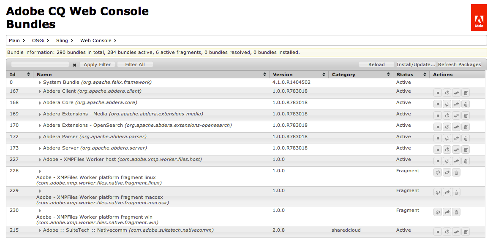

# Webbkonsol{#web-console}

Webbkonsolen i AEM baseras på [Apache Felix Web Management Console](https://felix.apache.org/documentation/subprojects/apache-felix-web-console.html). Apache Felix är en community-satsning för att implementera OSGi R4 Service Platform, som innehåller OSGi-ramverket och standardtjänster.

>[!NOTE]
>
>På webbkonsolen finns beskrivningar som anger standardinställningar för Sling.
>
>AEM har sina egna standardinställningar, så standarduppsättningen kan skilja sig från dem som finns dokumenterade på konsolen.

Webbkonsolen erbjuder ett urval flikar för underhåll av OSGi-paketen, bland annat:

* [Konfiguration](#configuration): används för att konfigurera OSGi-paketen och är därför den underliggande mekanismen för att konfigurera AEM-systemparametrar
* [Paket](#bundles): används för att installera paket
* [Komponenter](#components): används för att kontrollera status för komponenter som krävs för AEM

Alla ändringar som görs tillämpas omedelbart på det system som körs. Ingen omstart krävs.

Konsolen kan nås från `../system/console`; till exempel:

`http://localhost:4502/system/console/components`

## Konfiguration {#configuration}

Fliken **Konfiguration** används för att konfigurera OSGi-paket och är därför den underliggande mekanismen för att konfigurera AEM-systemparametrar.

>[!NOTE]
>
>Mer information finns i [OSGi Configuration with the Web Console](/help/sites-deploying/configuring-osgi.md#osgi-configuration-with-the-web-console) .

Fliken **Konfiguration** kan nås av antingen:

* Listrutan:

   **OSGi >**

* URL, till exempel:

   `http://localhost:4502/system/console/configMgr`

En lista över konfigurationer visas:

Det finns två typer av konfigurationer tillgängliga i listrutorna på den här skärmen:

* **Konfigurationer**

   Gör att du kan uppdatera befintliga konfigurationer. Dessa har en Persistent Identity (PID) och kan antingen vara:

   * standard och integrerad i AEM, dessa är obligatoriska, om de tas bort återgår värdena till standardinställningarna.
   * instanser som skapats från fabrikskonfigurationer, om instanserna skapas av användaren tas instansen bort.

* **Fabrikskonfigurationer**

   Gör att du kan skapa en instans av det nödvändiga funktionsobjektet.

   Detta tilldelas en beständig identitet och visas sedan i listrutan Konfigurationer.

Om du väljer en post i listorna visas de parametrar som är kopplade till den konfigurationen:

Du kan sedan uppdatera parametrarna efter behov och:

* **Spara**

   Spara ändringarna.

   För en fabrikskonfiguration skapas en ny instans med en beständig identitet. Den nya instansen visas sedan under Konfigurationer.

* **Återställ**

   Återställ parametrarna som visas på skärmen till de som senast sparades.

* **Ta bort**

   Ta bort den aktuella konfigurationen. Om det är standard återställs parametrarna till standardinställningarna. Om den skapas från en fabrikskonfiguration tas den specifika instansen bort.

* **Lås upp**

   Lås upp den aktuella konfigurationen från paketet.

* **Avbryt**

   Avbryt alla aktuella ändringar.

## Paket {#bundles}

Fliken **Bundles** är mekanismen för att installera de OSGi-paket som krävs för AEM. Du kommer åt fliken på något av följande sätt:

* Listrutan:

   **OSGi >**

* URL, till exempel:

   `http://localhost:4502/system/console/bundles`

En lista över paket visas:

På den här fliken kan du:

* **Installera eller uppdatera**

   Du kan **bläddra** för att hitta filen som innehåller ditt paket och ange om det ska **starta** omedelbart och vid vilken **startnivå**.

* **Läs in igen**

   Uppdaterar listan som visas.

* **Uppdatera paket**

   Detta kontrollerar referenserna för alla paket och uppdaterar vid behov.

   Efter en uppdatering kan till exempel både den gamla och den nya versionen fortfarande köras på grund av tidigare referenser. Med det här alternativet kontrolleras och flyttas alla referenser till den nya versionen så att den gamla versionen kan stoppas.

* **Start**

   Startar ett paket enligt den angivna startnivån.

* **Stoppa**

   Stoppar paketet.

* **Avinstallera**

   Avinstallerar paketet från systemet.

* **visa status**

   Förteckningen anger paketets aktuella status. Klicka på namnet på ett specifikt paket och visa mer information.

>[!NOTE]
>
>Efter **uppdatering** rekommenderas att du utför **uppdateringspaket**.

## Komponenter {#components}

På fliken **Komponenter** kan du aktivera och/eller inaktivera de olika komponenterna. Den kan nås av antingen:

* Listrutan:

   **Main >**

* URL, till exempel:

   `http://localhost:4502/system/console/components`

En lista över komponenter visas. Det finns olika ikoner som du kan använda för att aktivera, inaktivera eller (där det är lämpligt) öppna konfigurationsinformation för en viss komponent.

Om du klickar på namnet på en viss komponent visas mer information om dess status. Här kan du även aktivera, inaktivera eller läsa in komponenten igen.

>[!NOTE]
>
>Om du aktiverar, eller inaktiverar, en komponent gäller det bara tills AEM/CRX startas om.
>
>Startläget definieras i komponentbeskrivningen, som genereras under utveckling och lagras i paketet när paketet skapas.

