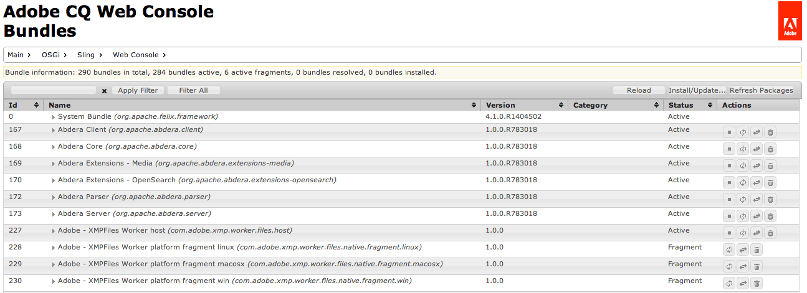

# Anpassad fristående installation{#custom-standalone-install}

I det här avsnittet beskrivs de alternativ som är tillgängliga när du installerar en fristående AEM-instans. Du kan även läsa [Storage Elements](/help/sites-deploying/storage-elements-in-aem-6.md) för mer information om hur du väljer lagringstyp för serverdelen efter att du installerat AEM 6.

## Ändra portnumret genom att byta namn på filen {#changing-the-port-number-by-renaming-the-file}

Standardporten för AEM är 4502. Om porten inte är tillgänglig eller redan används, konfigureras Quickstart automatiskt till att använda det första tillgängliga portnumret enligt följande: 4502, 8080, 8081, 8082, 8083, 8084, 8085, 8888, 9362, `<*random*>`.

Du kan också ange portnumret genom att byta namn på filen quickstart jar så att filnamnet innehåller portnumret; till exempel `cq5-publish-p4503.jar` eller `cq5-author-p6754.jar`.

Det finns olika regler som ska följas när man byter namn på filen quickstart jar:

* När du byter namn på filen måste den börja med `cq;` som i `cq5-publish-p4503.jar`.

* Vi rekommenderar att du *alltid* anger portnumret med -p; som i cq5-publish-p4503.jar eller cq5-author-p6754.jar.

>[!NOTE]
>
>Detta för att säkerställa att du inte behöver bekymra dig om att du uppfyller reglerna som används för att extrahera portnumret:
>
>* portnumret måste bestå av 4 eller 5 siffror
>* dessa siffror måste komma efter ett streck
>* om det finns andra siffror i filnamnet måste portnumret föregås av `-p`
>* &quot;cq5&quot;-prefixet i början av filnamnet ignoreras
>


>[!NOTE]
>
>Du kan också ändra portnumret med hjälp av alternativet `-port` i kommandot start.

### Java 11 - överväganden {#java-considerations}

Om du kör Oracle Java 11 (eller i allmänhet versioner av Java nyare än 8) måste ytterligare växlar läggas till på kommandoraden när du startar AEM.

* Följande - `-add-opens` växlar måste läggas till för att förhindra att relaterade reflektioner får åtkomst till VARNINGSmeddelanden i `stdout.log`

```shell
--add-opens=java.desktop/com.sun.imageio.plugins.jpeg=ALL-UNNAMED --add-opens=java.base/sun.net.www.protocol.jrt=ALL-UNNAMED --add-opens=java.naming/javax.naming.spi=ALL-UNNAMED --add-opens=java.xml/com.sun.org.apache.xerces.internal.dom=ALL-UNNAMED --add-opens=java.base/java.lang=ALL-UNNAMED --add-opens=java.base/jdk.internal.loader=ALL-UNNAMED --add-opens=java.base/java.net=ALL-UNNAMED -Dnashorn.args=--no-deprecation-warning
```

* Dessutom måste du använda växeln för att `-XX:+UseParallelGC` minska eventuella prestandaproblem.

Nedan visas ett exempel på hur de ytterligare JVM-parametrarna ska se ut när AEM startas på Java 11:

```shell
-XX:+UseParallelGC --add-opens=java.desktop/com.sun.imageio.plugins.jpeg=ALL-UNNAMED --add-opens=java.base/sun.net.www.protocol.jrt=ALL-UNNAMED --add-opens=java.naming/javax.naming.spi=ALL-UNNAMED --add-opens=java.xml/com.sun.org.apache.xerces.internal.dom=ALL-UNNAMED --add-opens=java.base/java.lang=ALL-UNNAMED --add-opens=java.base/jdk.internal.loader=ALL-UNNAMED --add-opens=java.base/java.net=ALL-UNNAMED -Dnashorn.args=--no-deprecation-warning
```

Om du kör en instans som är uppgraderad från AEM 6.3 ska du kontrollera att följande egenskap är inställd på **true** under `sling.properties`:

* `felix.bootdelegation.implicit`

## Körningslägen {#run-modes}

**Med körningslägena** kan du trimma AEM-instansen för ett specifikt ändamål; till exempel författare eller publicera, testa, utveckla, intranät etc. Med dessa lägen kan du styra användningen av exempelinnehåll. Det här exempelinnehållet definieras innan snabbstarten byggs och kan innehålla paket, konfigurationer osv. Detta kan vara särskilt användbart för produktionsklara installationer när du vill hålla installationen ren och utan exempelinnehåll. Mer information finns i:

* [Körningslägen](/help/sites-deploying/configure-runmodes.md)

## Lägga till en filinstallationsprovider {#adding-a-file-install-provider}

Som standard `crx-quickstart/install` bevakas mappen för filer.
Den här mappen finns inte, men kan skapas under körning.

Om ett paket, en konfiguration eller ett innehållspaket placeras i den här katalogen hämtas det automatiskt och installeras. Om den tas bort avinstalleras den.
Det är ett annat sätt att skicka paket, innehållspaket eller konfigurationer till databasen.

Detta är särskilt intressant för flera användningsområden:

* Under utvecklingen kan det vara enklare att lägga in något i filsystemet.
* Om något går fel går det inte att nå webbkonsolen och databasen. Med detta kan du lägga in ytterligare paket i den här katalogen och de bör installeras.
* Du kan skapa `crx-quickstart/install` mappen innan snabbstarten startas och lägga till fler paket där.

>[!NOTE]
>
>Se även [Så här installerar du CRX-paket automatiskt när servern startas](https://helpx.adobe.com/experience-manager/kb/HowToInstallPackagesUsingRepositoryInstall.html) .

## Installera och starta Adobe Experience Manager som en Windows-tjänst {#installing-and-starting-adobe-experience-manager-as-a-windows-service}

>[!NOTE]
>
>Var noga med att utföra följande procedur när du är inloggad som administratör eller starta/kör dessa steg med hjälp av **Kör som administratör** -snabbmenyvalet.
>
>Att vara inloggad som en användare med administratörsbehörighet är **inte tillräckligt**. Om du inte är inloggad som administratör när du slutför de här stegen får du **fel om nekad** åtkomst.

Så här installerar och startar du AEM som en Windows-tjänst:

1. Öppna crx-quickstart\opt\helpers\instsrv.bat i en textredigerare.
1. Om du konfigurerar en 64-bitars Windows-server ersätter du alla instanser av prunsrv med något av följande kommandon, enligt operativsystemet:

   * prunsrv_amd64
   * prunsrv_ia64
   Det här kommandot anropar rätt skript som startar Windows-tjänstdaemon i 64-bitars Java i stället för 32-bitars Java.

1. Om du vill förhindra processen från att förfalska till mer än en process ökar du den maximala stackstorleken och JVM-parametrarna för PermGen. Leta reda på `set jvm_options` kommandot och ange värdet enligt följande:

   `set jvm_options=-XX:MaxPermSize=256M;-Xmx1792m`

1. Öppna kommandotolken, ändra den aktuella katalogen till mappen crx-quickstart/opt/help i AEM-installationen och ange följande kommando för att skapa tjänsten:

   `instsrv.bat cq5`

   Kontrollera att tjänsten har skapats genom att öppna Tjänster på kontrollpanelen Administrationsverktyg eller skriva `start services.msc` i Kommandotolken. Cq5-tjänsten visas i listan.

1. Starta tjänsten genom att göra något av följande:

   * Klicka på cq5 på kontrollpanelen Tjänster och klicka på Start.
   

   * Skriv net start cq5 på kommandoraden.
   

1. Windows anger att tjänsten körs. AEM startar och den körbara prunsrv-filen visas i Aktivitetshanteraren. I webbläsaren går du till exempel till AEM `https://localhost:4502` för att börja använda AEM.

   

>[!NOTE]
>
>Egenskapsvärdena i filen instsrv.bat används när Windows-tjänsten skapas. Om du redigerar egenskapsvärdena i instsrv.bat måste du avinstallera och sedan installera om tjänsten.

>[!NOTE]
>
>När du installerar AEM som tjänst måste du ange den absoluta sökvägen för loggkatalogen i `com.adobe.xmp.worker.files.ncomm.XMPFilesNComm` från Configuration Manager.

Om du vill avinstallera tjänsten klickar du antingen på **Stopp** på **tjänstens** kontrollpanel eller på kommandoraden, navigerar till mappen och skriver `instsrv.bat -uninstall cq5`. Tjänsten tas bort från listan på kontrollpanelen **Tjänster** eller från listan på kommandoraden när du skriver `net start`.

## Definiera om platsen för den tillfälliga arbetskatalogen {#redefining-the-location-of-the-temporary-work-directory}

Standardplatsen för den tillfälliga mappen för Java-datorn är `/tmp`. AEM använder den här mappen också, till exempel när paket skapas.

Om du vill ändra platsen för den tillfälliga mappen (till exempel om du behöver en katalog med mer ledigt utrymme) definierar du en * `<new-tmp-path>`* genom att lägga till JVM-parametern:

`-Djava.io.tmpdir="/<*new-tmp-path*>"`

till antingen

* serverstartkommandoraden
* CQ_JVM_OPTS-miljöparametern i serverctl eller startskriptet

## Fler alternativ är tillgängliga från QuickStart-filen {#further-options-available-from-the-quickstart-file}

Ytterligare alternativ och namnbyteskonventioner beskrivs i hjälpfilen för QuickStart, som är tillgänglig via alternativet -help. Om du vill komma åt hjälpen skriver du:

* `java -jar cq5-<*version*>.jar -help`

```shell
Loading quickstart properties: default
Loading quickstart properties: instance
Setting properties from filename '/Users/Desktop/AEM/cq-quickstart-5.6.0.jar'
--------------------------------------------------------------------------------
Adobe Experience Manager Quickstart (build 20130129)
--------------------------------------------------------------------------------
Usage:
 Use these options on the Quickstart command line.
--------------------------------------------------------------------------------

-help (--help,-h)
         Show this help message
-quickstart.server.port (-p,-port) <port>
         Set server port number
-contextpath (-c,-org.apache.felix.http.context_path) <contextpath>
         Set context path
-debug <port>
         Enable Java Debugging on port number; forces forking
-gui
         Show GUI if running on a terminal
-nobrowser (-quickstart.nobrowser)
         Do not open browser at startup
-unpack
         Unpack installation files only, do not start the server (implies
         -verbose)
-v (-verbose)
         Do not redirect stdout/stderr to files and do not close stdin
-nofork
         Do not fork the JVM, even if not running on a console
-fork
         Force forking the JVM if running on a console, using recommended
         default memory settings for the forked JVM.
-forkargs <args> [<args> ...]
         Additional arguments for the forked JVM, defaults to '-Xmx1024m
         -XX:MaxPermSize=256m '.  Use -- to specify values starting with -,
         example: '-forkargs -- -server'
-a (--interface) <interface>
         Optional IP address (interface) to bind to
-pt <string>
         Process type (main/fork) - do not use directly, used when forking a
         process
-r <string> [<string> [<string> [<string> [<string> [<string> [<string> [<string> [<string> [<string>]]]]]]]]]
         Runmode(s) - Use this to define the run mode(s)
-b <string>
         Base folder - defines the path under which the quickstart work folder
         is created
-low-mem-action <string>
         Low memory action - what to do if memory is insufficient at startup
-use-control-port
         Start a control port
-ll <level>
         Define launchpad log level (1 = error...4 = debug)
--------------------------------------------------------------------------------
Quickstart filename options
--------------------------------------------------------------------------------
Usage:
 Rename the jar file, including one of the patterns shown below, to set the
corresponding option. Command-line options have priority on these filename
patterns.
--------------------------------------------------------------------------------

-NNNN
         Include -NNNN.jar or -pNNNN in the renamed jar filename to run on port
         NNNN, for example: quickstart-8085.jar
-nobrowser
         Include -nobrowser in the renamed jar filename to avoid opening the
         browser at startup, example: quickstart-nobrowser-8085.jar
-publish
         Include -publish in the renamed jar filename to run cq5 in "publish"
         mode, example: cq5-publish-7502.jar
--------------------------------------------------------------------------------
The license.properties file
--------------------------------------------------------------------------------
  The license.properties file stores licensing information, created from the
  licensing form displayed on first startup and stored in the folder from where
  Quickstart is run.
--------------------------------------------------------------------------------
Log files
--------------------------------------------------------------------------------
  Once Quickstart has been unpacked and started, log files can be found under
  ./crx-quickstart/logs.
--------------------------------------------------------------------------------
```

## Installera AEM i Amazon EC2-miljön {#installing-aem-in-the-amazon-ec-environment}

När du installerar AEM på en instans av Amazon Elastic Compute Cloud (EC2) installeras Author-instansen korrekt om du installerar både författaren och publicerar på EC2-instansen enligt proceduren [Installera instanser av AEM Manager](#installinginstancesofaemmanager). Publiceringsinstansen blir dock författare.

Innan du installerar Publish-instansen i EC2-miljön gör du följande:

1. Packa upp jar-filen för Publish-instansen innan du startar instansen för första gången. Använd följande kommando för att packa upp filen:

   ```xml
   java -jar quickstart.jar -unpack
   ```

   >[!NOTE]
   >
   >Om du ändrar läget **efter** att du startat instansen första gången kan du inte ändra körningsläget.

1. Starta instansen genom att köra:

   ```xml
   java -jar quickstart.jar -r publish
   ```

   >[!CAUTION]
   >
   >Kontrollera att du först kör instansen när du har packat upp den genom att köra kommandot ovan. Annars genereras inte fyllningen quickstart.properties. Utan den här filen kommer eventuella framtida AEM-uppgraderingar att misslyckas.

1. Öppna **startskriptet** i mappen **bin** och kontrollera följande avsnitt:

   ```xml
   # runmode(s)
   if [ -z "$CQ_RUNMODE" ]; then
    CQ_RUNMODE='author'
   fi
   ```

1. Ändra runmode för att **publicera** och spara filen.

   ```xml
   # runmode(s)
   if [ -z "$CQ_RUNMODE" ]; then
    CQ_RUNMODE='publish'
   fi
   ```

1. Stoppa instansen och starta om den genom att köra **startskriptet** .

## Verifierar installationen {#verifying-the-installation}

Följande länkar kan användas för att verifiera att installationen fungerar (alla exempel baseras på att instansen körs på port 8080 på den lokala värden, att CRX är installerat under /crx och Launchpad under /):

* `https://localhost:8080/crx/de`
CRXDE Lite-konsolen.

* `https://localhost:8080/system/console`
Webbkonsolen.

## Åtgärder efter installation {#actions-after-installation}

Även om det finns många möjligheter att konfigurera AEM WCM bör vissa åtgärder vidtas eller åtminstone granskas omedelbart efter installationen:

* Se [Säkerhetschecklistan](/help/sites-administering/security-checklist.md) för uppgifter som krävs för att säkerställa att systemet förblir säkert.
* Granska listan över standardanvändare och -grupper som har installerats med AEM WCM. Kontrollera om du vill vidta åtgärder för andra konton - se [Säkerhet och användaradministration](/help/sites-administering/security.md) för mer information.

## Åtkomst till CRXDE Lite och webbkonsolen {#accessing-crxde-lite-and-the-web-console}

När AEM WCM har startats kan du även få åtkomst till:

* [CRXDE Lite](#accessing-crxde-lite) - används för att få åtkomst till och hantera databasen
* [Webbkonsol](#accessing-the-web-console) - används för att hantera eller konfigurera OSGi-paket (kallas även OSGi-konsolen)

### Åtkomst till CRXDE Lite {#accessing-crxde-lite}

Om du vill öppna CRXDE Lite kan du välja **CRXDE Lite** från välkomstskärmen eller använda webbläsaren för att navigera till

```
 https://<<i>host</i>>:<<i>port</i>>/crx/de/index.jsp
```

Exempel:
`https://localhost:4502/crx/de/index.jsp`


#### Åtkomst till webbkonsolen {#accessing-the-web-console}

Om du vill komma åt Adobe CQ Web Console kan du välja **OSGi Console** från välkomstskärmen eller använda webbläsaren för att navigera till

```
 https://<host>:<port>/system/console
```

Till exempel:
eller`https://localhost:4502/system/console`för sidan Paket`https://localhost:4502/system/console/bundles`



Mer information finns i [OSGi Configuration with the Web Console](/help/sites-deploying/configuring-osgi.md#osgi-configuration-with-the-web-console) .

## Felsökning {#troubleshooting}

Information om hur du hanterar problem som kan uppstå under installationen finns i:

* [Felsökning](/help/sites-deploying/troubleshooting.md)

## Avinstallerar Adobe Experience Manager {#uninstalling-adobe-experience-manager}

Eftersom AEM installeras i en enda katalog behövs inget avinstallationsverktyg. Avinstallation kan vara så enkelt som att ta bort hela installationskatalogen, men hur du avinstallerar AEM beror på vad du vill uppnå och vilken beständig lagring du använder.

Om beständig lagring är inbäddad i installationskatalogen, till exempel i standardinstallationen för TPM, tas även data bort om du tar bort mappar.

>[!NOTE]
>
>Adobe rekommenderar att du säkerhetskopierar databasen innan du tar bort AEM. Om du tar bort hela &lt;cq-installation-directory> tar du bort databasen. Om du vill behålla databasdata innan du tar bort, flyttar eller kopierar du mappen &lt;cq-installation-directory>/crx-quickstart/database någon annanstans innan du tar bort de andra mapparna.

Om din installation av AEM använder extern lagring, till exempel en databasserver, tas inte data bort automatiskt när du tar bort mappen, men lagringskonfigurationen tas bort, vilket gör det svårt att återställa JCR-innehållet.
