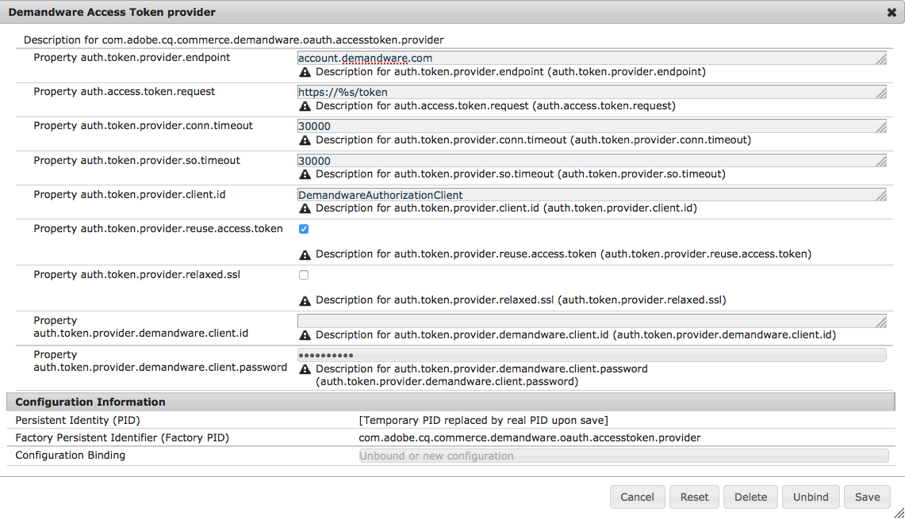

# Salesforce Commerce Cloud{#salesforce-commerce-cloud}

Distribuering av nödvändiga e-handelspaket kommer att ge e-handelsramverket full funktionalitet, tillsammans med en referensimplementering av e-handelsfunktionaliteten i enlighet med en Salesforce Commerce Cloud/Demandware-implementering (inklusive en demonstrationskatalog).

## Paket som behövs för e-handel med Salesforce Commerce Cloud {#packages-needed-for-ecommerce-with-salesforce-commerce-cloud}

Så här installerar du e-handelsfunktioner:

* AEM e-handelsramverk:

   * detta ingår i en AEM

* Innehållspaket AEM Demandware Commerce

   * cq-6.4.0-featurepack-10262

>[!NOTE]
>
>Den här integreringen stöder Salesforce Commerce Cloud-/Demandware-instanser som konfigurerats att använda OCAPI version 17.6 eller senare.

### Installation av e-handel med Salesforce Commerce Cloud {#installation-of-ecommerce-with-salesforce-commerce-cloud}

Så här installerar du AEM med en integrationskonfiguration för Demandware Commerce (med demonstrationskatalogen Geometrixx Outdoors):

1. [Installera AEM](/help/sites-deploying/deploy.md).
1. Installera innehållspaketet med [pakethanteraren](/help/sites-administering/package-manager.md):
1. [Skapa ](/help/sites-authoring/page-authoring.md) eventuella tilläggssidor som du behöver i AEM.

>[!NOTE]
>
>Navigera till [Paketresurs](/help/sites-administering/package-manager.md#package-share) om du vill hämta paketen.

Serveranslutningen mellan AEM och Demandware Sandbox måste konfigureras. Den mesta konfigurationen är redan förkonfigurerad för att fungera med det angivna innehållspaketet för SiteGenisis-demo med standardsökvägar, bibliotek och så vidare. Om kopplingen används med andra webbplatser och bibliotek måste du uppdatera den här konfigurationen.

1. Navigera till [https://localhost:4502/system/console/configMgr](https://localhost:4502/system/console/configMgr).
1. Klicka på **Demandware Client**.
1. Ange **instansslutpunkten ip eller värdnamnet** efter behov.

   

1. Klicka på **Spara**.
1. Klicka på **Plugin-programmet Demandware TransportHandler för WebDAV**.
1. Ange **WebDAV-användaren** och **WebDAV-användarlösenordet**.

   

1. Klicka på **Spara**.

#### Replikering {#replication}

Replikeringen bör aktiveras efter paketinstallationen. Du kan kontrollera att du här: [https://localhost:4502/etc/replication/agents.author/demandware.html](https://localhost:4502/etc/replication/agents.author/demandware.html)

>[!NOTE]
>
>Replikeringsagenten är som standard konfigurerad till informationsloggnivå. Om du vill ha mer information kan du växla loggnivån till felsökning.

#### OAuth {#oauth}

OAuth-klienten är konfigurerad att arbeta med en Demandware-sandlådeinstans. För testningsändamål behövs ingen ändring.

För staging- och produktionssystem måste OAuth-klienterna konfigureras med lämpligt klient-ID och lösenord.

1. Navigera till [https://localhost:4502/system/console/configMgr](https://localhost:4502/system/console/configMgr).
1. Klicka på **Token Provider för åtkomst till maskinvara**.

   

1. Ändra värdena efter behov och klicka på **Spara**.

### Salesforce Commerce Cloud Sandbox {#salesforce-commerce-cloud-sandbox}

Sandlådan Demandware måste vara konfigurerad för att köra den nya mallmotorn för hastighet.

>[!NOTE]
>
>Följande guide ingår inte i AEM Demandware-anslutning. Den ingår som en del av demoinnehållspaketet för att hjälpa dig att snabbt konfigurera SiteGenesis-demosidorna.

1. Navigera till [https://localhost:4502/etc/demandware/init.html](https://localhost:4502/etc/demandware/init.html).
1. Klicka på **Redigera.**
1. Kontrollera värdena och klicka på **OK**.
1. Klicka på **Initiera**.
1. Gå till WebDAV-mappen och sök efter publicerade mallfiler, till exempel under `adobe01-tech-prtnr-na01-dw.demandware.net/on/demandware.servlet/webdav/Sites/Dynamic/SiteGenesis`.

   >[!NOTE]
   >
   >Tillägget är `.vs`.

1. Kontrollera även om det finns exporterade JS- och CSS-filer, till exempel under `adobe01-tech-prtnr-na01-dw.demandware.net/on/demandware.servlet/webdav/Sites/Libraries/SiteGenesisSharedLibrary`.

