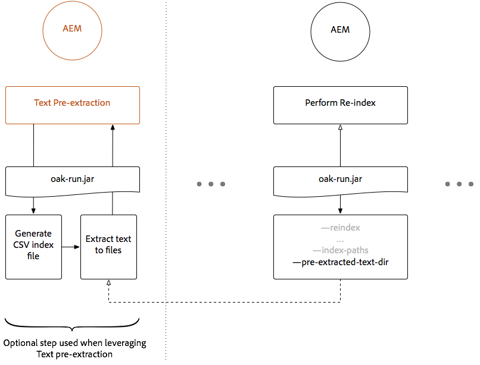
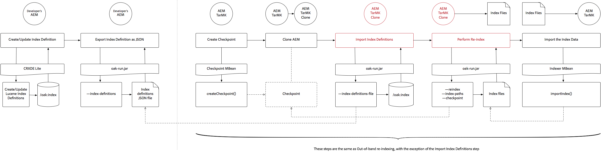

# Indexering med hjälp av Oak-runda JAR {#indexing-via-the-oak-run-jar}

Oak-run har stöd för alla indexeringsanvändningsfall på kommandoraden utan att JMX-nivån behöver användas. Fördelarna med att använda ekon är:

1. Det är en ny indexverktygslåda för AEM 6.4
1. Det minskar time to re-index-värdet vilket påverkar omindexeringstiden positivt i större databaser
1. Det minskar resursförbrukningen vid omindexering av AEM vilket ger bättre systemprestanda för andra AEM aktiviteter
1. Oak-runda har stöd för out-of-band: Om produktionsvillkoren inte tillåter att du kör omindexering på produktionsinstanser kan en klonad miljö användas för omindexering för att undvika en kritisk prestandapåverkan.

Nedan visas en lista med användningsfall som kan användas när du utför indexeringsåtgärder med verktyget `oak-run`.

## Konsekvenskontroller för index {#indexconsistencychecks}

>[!NOTE]
>
>Mer detaljerad information om det här scenariot finns i [Använd fall 1 - Kontroll av indexkonsekvens](/help/sites-deploying/oak-run-indexing-usecases.md#usercase1indexconsistencycheck).

* `oak-run.jar`avgör snabbt om Lucene Oak-index är skadade.
* Det är säkert att köra på en AEM som används för konsekvenskontrollnivå 1 och 2.

## Indexstatistik {#indexstatistics}

>[!NOTE]
>
>Mer information om det här scenariot finns i [Använd fall 2 - Indexstatistik](/help/sites-deploying/oak-run-indexing-usecases.md#usecase2indexstatistics)

* `oak-run.jar` dumpar alla indexdefinitioner, viktiga indexvärden och indexinnehåll för offlineanalys.
* Kan köras på en AEM som används.

## Beslutsträd för omindexering av metod {#reindexingapproachdecisiontree}

Diagrammet är ett beslutsträd för när olika omindexeringsmetoder ska användas.

## Omindexering av MongoMK / RDMBMK {#reindexingmongomk}

>[!NOTE]
>
>Mer detaljerad information om det här scenariot finns i [Använd fall 3 - Omindexering](/help/sites-deploying/oak-run-indexing-usecases.md#usecase3reindexing).

### Textförextrahering för SegmentNodeStore och DocumentNodeStore {#textpre-extraction}

[Textförextrahering](/help/sites-deploying/best-practices-for-queries-and-indexing.md#how-to-perform-text-pre-extraction) (en funktion som fanns i AEM 6.3) kan användas för att minska tiden för omindexering. Textförextrahering kan användas med alla omindexeringsmetoder.

Beroende på indexeringsmetoden för `oak-run.jar` finns det olika steg på båda sidor av steget Utför omindexering i diagrammet nedan.

>[!NOTE]
>
>Orange betecknar aktiviteter där AEM måste finnas i en underhållsperiod.

### Omindexering online för MongoMK eller RDBMK med oak-run.jar {#onlinere-indexingformongomk}

>[!NOTE]
>
>Mer detaljerad information om det här scenariot finns i [Indexera om - DocumentNodeStore](/help/sites-deploying/oak-run-indexing-usecases.md#reindexdocumentnodestore).

Detta är den rekommenderade metoden för omindexering av AEM MongoMK (och RDBMK). Ingen annan metod bör användas.

Kör bara den här processen mot en enda AEM i klustret.

## Omindexering av tarMK {#re-indexingtarmk}

>[!NOTE]
>
>Mer detaljerad information om det här scenariot finns i [Reindex - SegmentNodeStore](/help/sites-deploying/oak-run-indexing-usecases.md#reindexsegmentnodestore).

* **Väntelägesöverväganden (tarMK)**

   * Det finns inget särskilt att tänka på när du använder vänteläge i Cold. Väntelägesinstanserna i Cold synkas som vanligt.

* **AEM Publish Farms (AE Publish Farms ska alltid vara tarMK)**

   * För publiceringsgrupper måste det göras för alla ELLER för att utföra stegen på en enda publicering. Sedan klonar du konfigurationen för andra (med alla vanliga försiktighetsåtgärder när du klonar AEM förekomster, sling.id - ska länka till något här).

### Omindexering online för tarMK {#onlinere-indexingfortarmk}

>[!NOTE]
>
>Mer detaljerad information om det här scenariot finns i [Online Reindex - SegmentNodeStore](/help/sites-deploying/oak-run-indexing-usecases.md#onlinereindexsegmentnodestore).

Detta är den metod som användes innan de nya indexeringsfunktionerna i oak-run.jar introducerades. Detta görs genom att ange egenskapen `reindex=true` i Oak-indexet.

Den här metoden kan användas om tids- och prestandaeffekterna som ska indexeras är godtagbara för kunden. Detta gäller ofta små till medelstora AEM installationer.

### Omindexering online av tarMK med oak-run.jar {#onlinere-indexingtarmkusingoak-run-jar}

>[!NOTE]
>
>Mer detaljerad information om det här scenariot finns i [Online Reindex - SegmentNodeStore - Den AEM instansen körs](/help/sites-deploying/oak-run-indexing-usecases.md#onlinereindexsegmentnodestoretheaeminstanceisrunning).

Omindexering online av tarMK med hjälp av oak-run.jar är snabbare än [Omindexering online för tarMK](#onlinere-indexingfortarmk) som beskrivs ovan. Den kräver dock även körning under ett underhållsfönster, med en hänvisning till att fönstret är kortare och att fler steg krävs för att utföra omindexeringen.

>[!NOTE]
>
>Orange betecknar verksamhet där AEM måste utföras under en underhållsperiod.

### Offline omindexing tarMK med oak-run.jar {#offlinere-indexingtarmkusingoak-run-jar}

>[!NOTE]
>
>Mer detaljerad information om det här scenariot finns i [Online Reindex - SegmentNodeStore - Den AEM instansen är avstängd](/help/sites-deploying/oak-run-indexing-usecases.md#onlinereindexsegmentnodestoreaeminstanceisdown).

Omindexering offline för tarMK är den enklaste `oak-run.jar`-baserade omindexeringsmetoden för tarMK eftersom den kräver en enda `oak-run.jar`-kommentar. AEM måste dock stängas.

>[!NOTE]
>
>Rött anger åtgärder där AEM måste stängas av.

### Omindexerings-TarMK utanför band med oak-run.jar  {#out-of-bandre-indexingtarmkusingoak-run-jar}

>[!NOTE]
>
>Mer detaljerad information om det här scenariot finns i [Omindexering utanför intervall - SegmentNodeStore](/help/sites-deploying/oak-run-indexing-usecases.md#outofbandreindexsegmentnodestore).

Omindexering utan band minimerar effekten av omindexering på AEM som används.

>[!NOTE]
>
>Rött anger åtgärder där AEM kan avslutas.

## Uppdaterar indexeringsdefinitioner {#updatingindexingdefinitions}

>[!NOTE]
>
>Mer information om det här scenariot finns i [Använd fall 4 - Uppdatera indexdefinitioner](/help/sites-deploying/oak-run-indexing-usecases.md#usecase4updatingindexdefinitions).

### Skapa och uppdatera indexdefinitioner på tarMK med hjälp av ACS Kontrollera index {#creatingandupdatingindexdefinitionsontarmkusingacsensureindex}

>[!NOTE]
>
>ACS Kontrollera att Index är ett projekt som stöds av communityn och inte stöds av Adobe Support.

Detta tillåter indexdefinitioner för leverans via innehållspaketet, vilket senare resulterar i omindexering genom att omindexeringsflaggan ställs in på `true`. Detta fungerar för mindre uppsättningar där omindexering inte tar lång tid.

Mer information finns i [dokumentationen ](https://adobe-consulting-services.github.io/acs-aem-commons/features/ensure-oak-index/index.html) för att kontrollera ACS-index.

### Skapa och uppdatera indexdefinitioner på tarMK med oak-run.jar {#creatingandupdatingindexdefinitionsontarmkusingoak-run-jar}

Om tiden eller prestandaeffekten av omindexering med icke-`oak-run.jar`-metoder är för hög kan följande `oak-run.jar`-baserade metod användas för att importera och indexera om Lucene-indexdefinitioner i en TARMK-baserad AEM.

### Skapa och uppdatera indexdefinitioner på MonogMK med oak-run.jar {#creatingandupdatingindexdefinitionsonmonogmkusingoak-run-jar}

Om tiden eller prestandaeffekten av omindexering med icke-`oak-run.jar`-metoder är för hög kan följande `oak-run.jar`-baserade metod användas för att importera och indexera om Lucene-indexdefinitioner i MongoMK-baserade AEM.

