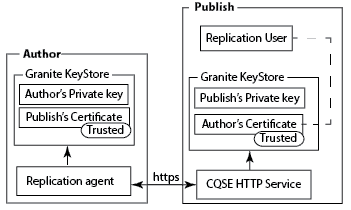

# Replikering med ömsesidig SSL{#replicating-using-mutual-ssl}

Konfigurera AEM så att en replikeringsagent på författarinstansen använder gemensam SSL (MSSL) för att ansluta till publiceringsinstansen. Med MSSL använder replikeringsagenten och HTTP-tjänsten på publiceringsinstansen certifikat för att autentisera varandra.

När du konfigurerar MSSL för replikering utför du följande steg:

1. Skapa eller hämta privata nycklar och certifikat för författaren och publiceringsinstanserna.
1. Installera nycklarna och certifikaten på författaren och publicera instanserna:

   * Författare: Författarens privata nyckel och Publiceringens certifikat.
   * Publicera: Publiceringens privata nyckel och författarens certifikat. Certifikatet är kopplat till det användarkonto som autentiseras med replikeringsagenten.

1. Konfigurera den Jetty-baserade HTTP-tjänsten på Publish-instansen.
1. Konfigurera transport- och SSL-egenskaperna för replikeringsagenten.



Du måste avgöra vilket användarkonto som utför replikeringen. När du installerar det betrodda författarcertifikatet på publiceringsinstansen kopplas certifikatet till det här användarkontot.

## Hämta eller skapa autentiseringsuppgifter för MSSL {#obtaining-or-creating-credentials-for-mssl}

Du behöver en privat nyckel och ett offentligt certifikat för författaren och publiceringsinstanserna:

* Privata nycklar måste finnas i pkcs#12- eller JKS-format.
* Certifikat måste finnas i pkcs#12- eller JKS-format. Dessutom kan certifikat i CER-format läggas till i Granite Truststore.
* Certifikat kan vara självsignerade eller signerade av en erkänd certifikatutfärdare.

### JKS-format {#jks-format}

Generera en privat nyckel och ett certifikat i JKS-format. Den privata nyckeln lagras i en KeyStore-fil och certifikatet lagras i en TrustStore-fil. Använd [Java `keytool`](https://docs.oracle.com/javase/7/docs/technotes/tools/solaris/keytool.html) för att skapa båda.

Utför följande steg med Java `keytool` för att skapa den privata nyckeln och autentiseringsuppgifterna:

1. Skapa ett nyckelpar för privat-offentlig nyckel i en KeyStore.
1. Skapa eller hämta certifikatet:

   * Självsignerad: Exportera certifikatet från KeyStore.
   * CA-signerad: Generera en certifikatbegäran och skicka den till certifikatutfärdaren.

1. Importera certifikatet till en TrustStore.

Använd följande procedur för att skapa en privat nyckel och ett självsignerat certifikat för både författaren och publiceringsinstanserna. Använd olika värden för kommandoalternativen.

1. Öppna ett kommandoradsfönster eller en terminal. Om du vill skapa nyckelparet privat-offentlig anger du följande kommando med alternativvärden från tabellen nedan:

   ```shell
   keytool -genkeypair -keyalg RSA -validity 3650 -alias alias -keystore keystorename.keystore  -keypass key_password -storepass  store_password -dname "CN=Host Name, OU=Group Name, O=Company Name,L=City Name, S=State, C=Country_ Code"
   ```

   | Alternativ | Författare | Publicera |
   |---|---|---|
   | -alias | author | publicera |
   | -keystore | author.keystore | publish.keystore |

1. Om du vill exportera certifikatet anger du följande kommando med alternativvärden från tabellen nedan:

   ```shell
   keytool -exportcert -alias alias -file cert_file -storetype jks -keystore keystore -storepass store_password
   ```

   | Alternativ | Författare | Publicera |
   |---|---|---|
   | -alias | author | publicera |
   | -file | author.cer | publish.cer |
   | -keystore | author.keystore | publish.keystore |

### pkcs#12-format {#pkcs-format}

Generera en privat nyckel och ett certifikat i formatet pkcs#12. Använd [openSSL](https://www.openssl.org/) för att generera dem. Använd följande procedur för att skapa en privat nyckel och en certifikatbegäran. Om du vill få certifikatet signerar du begäran med din privata nyckel (självsignerade certifikat) eller skickar begäran till en certifikatutfärdare. Generera sedan arkivet pkcs#12 som innehåller den privata nyckeln och certifikatet.

1. Öppna ett kommandoradsfönster eller en terminal. Om du vill skapa den privata nyckeln anger du följande kommando med alternativvärden från tabellen nedan:

   ```shell
   openssl genrsa -out keyname.key 2048
   ```

   | Alternativ | Författare | Publicera |
   |---|---|---|
   | -out | author.key | publish.key |

1. Om du vill generera en certifikatbegäran anger du följande kommando med alternativvärden från tabellen nedan:

   ```shell
   openssl req -new -key keyname.key -out key_request.csr
   ```

   | Alternativ | Författare | Publicera |
   |---|---|---|
   | -key | author.key | publish.key |
   | -out | author_request.csr | publish_request.csr |

   Signera certifikatbegäran eller skicka begäran till en certifikatutfärdare.

1. Om du vill signera certifikatbegäran anger du följande kommando med alternativvärden från tabellen nedan:

   ```shell
   openssl x509 -req -days 3650 -in key_request.csr -signkey keyname.key -out certificate.cer
   ```

   | Alternativ | Författare | Publicera |
   |---|---|---|
   | -signkey | author.key | publish.key |
   | -in | author_request.csr | publish_request.csr |
   | -out | author.cer | publish.cer |

1. Om du vill lägga till din privata nyckel och det signerade certifikatet i en pkcs#12-fil anger du följande kommando med alternativvärden från tabellen nedan:

   ```shell
   openssl pkcs12 -keypbe PBE-SHA1-3DES -certpbe PBE-SHA1-3DES -export -in certificate.cer -inkey keyname.key -out pkcs12_archive.pfx -name "alias"
   ```

   | Alternativ | Författare | Publicera |
   |---|---|---|
   | -inkey | author.key | publish.key |
   | -out | author.pfx | publish.pfx |
   | -in | author.cer | publish.cer |
   | -name | author | publicera |

## Installera den privata nyckeln och TrustStore på författaren {#install-the-private-key-and-truststore-on-author}

Installera följande objekt på författarinstansen:

* Den privata nyckeln för författarinstansen.
* Certifikatet för publiceringsinstansen.

Om du vill utföra följande procedur måste du vara inloggad som administratör för författarinstansen.

### Installera den privata nyckeln för författaren {#install-the-author-private-key}

1. Öppna sidan Användarhantering för författarinstansen. ([http://localhost:4502/libs/granite/security/content/useradmin.html](http://localhost:4502/libs/granite/security/content/useradmin.html))
1. Klicka eller tryck på ditt användarnamn för att öppna egenskaperna för ditt användarkonto.
1. Om länken Skapa KeyStore visas i området Kontoinställningar klickar du på länken. Konfigurera ett lösenord och klicka på OK.
1. Klicka på Hantera nyckelbehållare i området Kontoinställningar.

   

1. Klicka på Lägg till privat nyckel från nyckelarkivfilen.

   

1. Klicka på Välj nyckelbehållarfil, bläddra efter och välj filen author.keystore eller filen author.pfx om du använder pkcs#12 och klicka sedan på Öppna.
1. Ange ett alias och lösenordet för nyckelbehållaren. Ange alias och lösenord för den privata nyckeln och klicka sedan på Skicka.
1. Stäng dialogrutan Hantering av nyckelbehållare.

   

### Installera publiceringscertifikatet {#install-the-publish-certificate}

1. Öppna sidan Användarhantering för författarinstansen. ([http://localhost:4502/libs/granite/security/content/useradmin.html](http://localhost:4502/libs/granite/security/content/useradmin.html))
1. Klicka eller tryck på ditt användarnamn för att öppna egenskaperna för ditt användarkonto.
1. Om länken Skapa TrustStore visas i området Kontoinställningar klickar du på länken, skapar ett lösenord för TrustStore och klickar på OK.
1. Klicka på Hantera TrustStore i området Kontoinställningar.
1. Klicka på Lägg till certifikat från CER-fil.

   

1. Avmarkera alternativet Koppla certifikat till användare. Klicka på Välj certifikatfil, välj publish.cer och klicka på Open.
1. Stäng dialogrutan Hantering av TrustStore.

   

## Installera privat nyckel och TrustStore vid publicering {#install-private-key-and-truststore-on-publish}

Installera följande objekt på publiceringsinstansen:

* Den privata nyckeln för publiceringsinstansen.
* Certifikatet för författarinstansen. Associera certifikatet med den användare som används för att köra replikeringsbegäranden.

Om du vill utföra följande procedur måste du vara inloggad som administratör för publiceringsinstansen.

### Installera den privata nyckeln för publicering {#install-the-publish-private-key}

1. Öppna sidan Användarhantering för publiceringsinstansen. ([http://localhost:4503/libs/granite/security/content/useradmin.html](http://localhost:4503/libs/granite/security/content/useradmin.html))
1. Klicka eller tryck på ditt användarnamn för att öppna egenskaperna för ditt användarkonto.
1. Om länken Skapa KeyStore visas i området Kontoinställningar klickar du på länken. Konfigurera ett lösenord och klicka på OK.
1. Klicka på Hantera nyckelbehållare i området Kontoinställningar.
1. Klicka på Lägg till privat nyckel från nyckelarkivfilen.
1. Klicka på Välj nyckelbehållarfil, bläddra efter och välj filen publish.keystore eller filen publish.pfx om du använder pkcs#12 och klicka sedan på Öppna.
1. Ange ett alias och lösenordet för nyckelbehållaren. Ange alias och lösenord för den privata nyckeln och klicka sedan på Skicka.
1. Stäng dialogrutan Hantering av nyckelbehållare.

### Installera författarcertifikatet {#install-the-author-certificate}

1. Öppna sidan Användarhantering för publiceringsinstansen. ([http://localhost:4503/libs/granite/security/content/useradmin.html](http://localhost:4503/libs/granite/security/content/useradmin.html))
1. Leta reda på användarkontot som du använder för att köra replikeringsbegäranden och klicka eller tryck på användarnamnet.
1. Om länken Skapa TrustStore visas i området Kontoinställningar klickar du på länken, skapar ett lösenord för TrustStore och klickar på OK.
1. Klicka på Hantera TrustStore i området Kontoinställningar.
1. Klicka på Lägg till certifikat från CER-fil.
1. Kontrollera att alternativet Koppla certifikat till användare är markerat. Klicka på Välj certifikatfil, välj author.cer och klicka på Open.
1. Klicka på Skicka och stäng sedan dialogrutan Hantera i TrustStore.

## Konfigurera HTTP-tjänsten vid publicering {#configure-the-http-service-on-publish}

Konfigurera egenskaperna för Apache Felix Jetty Based HTTP Service på publiceringsinstansen så att HTTPS används vid åtkomst till Granite Keystore. Tjänstens PID är `org.apache.felix.http`.

I följande tabell visas de OSGi-egenskaper som du behöver för att konfigurera om du använder webbkonsolen.

| Egenskapsnamn på webbkonsolen | OSGi-egenskapsnamn | Värde |
|---|---|---|
| Aktivera HTTPS | org.apache.felix.https.enable | true |
| Aktivera HTTPS för att använda Granite KeyStore | org.apache.felix.https.use.granite.keystore | true |
| HTTPS-port | org.osgi.service.http.port.secure | 8443 (eller annan önskad port) |
| Klientcertifikat | org.apache.felix.https.clientcertificate | &quot;Klientcertifikat önskat&quot; |

## Konfigurera replikeringsagenten på författaren {#configure-the-replication-agent-on-author}

Konfigurera replikeringsagenten på författarinstansen så att HTTPS-protokollet används vid anslutning till publiceringsinstansen. Fullständig information om hur du konfigurerar replikeringsagenter finns i [Konfigurera replikeringsagenter](/help/sites-deploying/replication.md#configuring-your-replication-agents).

Om du vill aktivera MSSL konfigurerar du egenskaperna på fliken Transport enligt följande tabell:

<table>
 <tbody>
  <tr>
   <th>Egenskap</th>
   <th>Värde</th>
  </tr>
  <tr>
   <td>URI</td>
   <td><p>https://server_name:SSL_port/bin/receive?sling:authRequestLogin=1</p> <p>Exempel:</p> <p>http://localhost:8443/bin/receive?sling:authRequestLogin=1</p> </td>
  </tr>
  <tr>
   <td>Användare</td>
   <td>Inget värde</td>
  </tr>
  <tr>
   <td>Lösenord</td>
   <td>Inget värde</td>
  </tr>
  <tr>
   <td>SSL</td>
   <td>Klientautentisering</td>
  </tr>
 </tbody>
</table>


När du har konfigurerat replikeringsagenten testar du anslutningen för att avgöra om MSSL är korrekt konfigurerat.

```xml
29.08.2014 14:02:46 - Create new HttpClient for Default Agent
29.08.2014 14:02:46 - * HTTP Version: 1.1
29.08.2014 14:02:46 - * Using Client Auth SSL configuration *
29.08.2014 14:02:46 - adding header: Action:Test
29.08.2014 14:02:46 - adding header: Path:/content
29.08.2014 14:02:46 - adding header: Handle:/content
29.08.2014 14:02:46 - deserialize content for delivery
29.08.2014 14:02:46 - No message body: Content ReplicationContent.VOID is empty
29.08.2014 14:02:46 - Sending POST request to http://localhost:8443/bin/receive?sling:authRequestLogin=1
29.08.2014 14:02:46 - sent. Response: 200 OK
29.08.2014 14:02:46 - ------------------------------------------------
29.08.2014 14:02:46 - Sending message to localhost:8443
29.08.2014 14:02:46 - >> POST /bin/receive HTTP/1.0
29.08.2014 14:02:46 - >> Action: Test
29.08.2014 14:02:46 - >> Path: /content
29.08.2014 14:02:46 - >> Handle: /content
29.08.2014 14:02:46 - >> Referer: about:blank
29.08.2014 14:02:46 - >> Content-Length: 0
29.08.2014 14:02:46 - >> Content-Type: application/octet-stream
29.08.2014 14:02:46 - --
29.08.2014 14:02:46 - << HTTP/1.1 200 OK
29.08.2014 14:02:46 - << Connection: Keep-Alive
29.08.2014 14:02:46 - << Server: Day-Servlet-Engine/4.1.64
29.08.2014 14:02:46 - << Content-Type: text/plain;charset=utf-8
29.08.2014 14:02:46 - << Content-Length: 26
29.08.2014 14:02:46 - << Date: Fri, 29 Aug 2014 18:02:46 GMT
29.08.2014 14:02:46 - << Set-Cookie: login-token=3529326c-1500-4888-a4a3-93d299726f28%3ac8be86c6-04bb-4d18-80d6-91278e08d720_98797d969258a669%3acrx.default; Path=/; HttpOnly; Secure
29.08.2014 14:02:46 - << Set-Cookie: cq-authoring-mode=CLASSIC; Path=/; Secure
29.08.2014 14:02:46 - <<
29.08.2014 14:02:46 - << R
29.08.2014 14:02:46 - << eplicationAction TEST ok.
29.08.2014 14:02:46 - Message sent.
29.08.2014 14:02:46 - ------------------------------------------------
29.08.2014 14:02:46 - Replication (TEST) of /content successful.
Replication test succeeded
```

