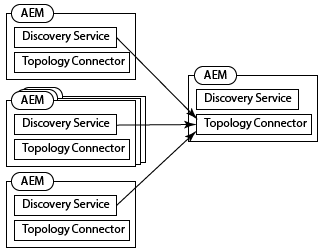
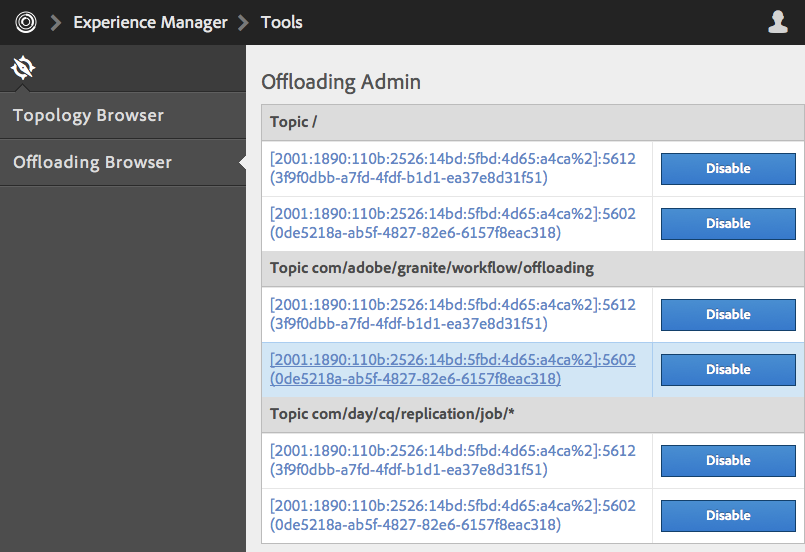
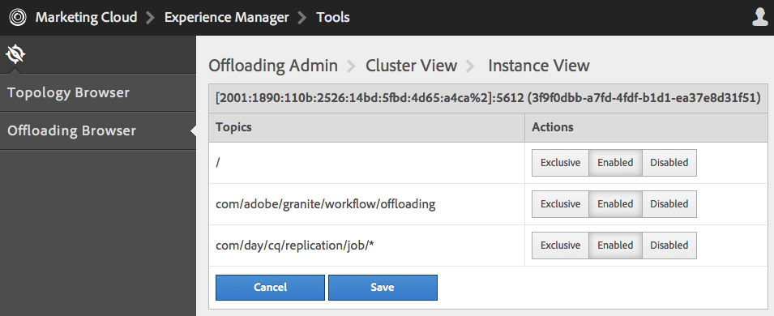

# Avlastar jobb{#offloading-jobs}

## Introduktion {#introduction}

När du avlastar distribueras bearbetningsuppgifter mellan Experience Manager-instanser i en topologi. Med avlastning kan du använda särskilda Experience Manager-instanser för att utföra vissa typer av bearbetning. Specialiserad bearbetning gör att du kan maximera användningen av tillgängliga serverresurser.

Avlastningen baseras på funktionerna [Apache Sling Discovery](https://sling.apache.org/documentation/bundles/discovery-api-and-impl.html) och Sling JobManager. Om du vill använda avlastning lägger du till Experience Manager-kluster i en topologi och identifierar de jobbämnen som klusterprocessen gör. Kluster består av en eller flera instanser av Experience Manager, så att en enda instans betraktas som ett kluster.

Mer information om hur du lägger till instanser i en topologi finns i [Administrera topologier](/help/sites-deploying/offloading.md#administering-topologies).

### Jobbdistribution {#job-distribution}

Med Sling JobManager och JobConsumer kan du skapa jobb som bearbetas i en topologi:

* JobManager: En tjänst som skapar jobb för specifika ämnen.
* JobConsumer: En tjänst som kör jobb i ett eller flera ämnen. Flera JobConsumer-tjänster kan registreras för samma ämne.

När JobManager skapar ett jobb väljer avlastningsramverket ett Experience Manager-kluster i topologin för att köra jobbet:

* Klustret måste innehålla en eller flera instanser som kör en JobConsumer som är registrerad för jobbämnet.
* Ämnet måste aktiveras för minst en instans i klustret.

Mer information om hur du finjusterar jobbdistributionen finns i [Konfigurera ämnesförbrukning](/help/sites-deploying/offloading.md#configuring-topic-consumption) .

När avlastningsramverket väljer ett kluster för att köra ett jobb, och klustret består av flera instanser, avgör Sling Distribution vilken instans i klustret som kör jobbet.

### Jobbnyttolaster {#job-payloads}

Avlastningsramverket stöder jobbnyttolaster som associerar jobb med resurser i databasen. Jobbnyttolaster är användbara när jobb skapas för att bearbeta resurser och jobbet avlastas till en annan dator.

När ett jobb skapas garanteras nyttolasten bara finnas på instansen som skapar jobbet. När du avlastar jobbet ser replikeringsagenterna till att nyttolasten skapas på instansen som till slut förbrukar jobbet. När jobbkörningen är klar kopieras nyttolasten tillbaka till instansen som skapade jobbet.

## Administrera topologier {#administering-topologies}

Topologier är löst kopplade Experience Manager-kluster som deltar i avlastning. Ett kluster består av en eller flera Experience Manager-serverinstanser (en enda instans betraktas som ett kluster).

Varje instans i Experience Manager kör följande avlastningsrelaterade tjänster:

* Discovery Service: Skickar begäranden till en Topology Connector om att gå med i topologin.
* Topology Connector: Tar emot kopplingsbegäranden och godkänner eller avvisar varje begäran.

Identifieringstjänsten för alla medlemmar i topologin pekar på Topology Connector på en av medlemmarna. I efterföljande avsnitt kallas den här medlemmen rotmedlem.

Varje kluster i topologin innehåller en instans som identifieras som ledare. Klusterledaren interagerar med topologin för de andra medlemmarna i klustret. När ledaren lämnar klustret väljs automatiskt en ny ledare för klustret.

### Visa topologin {#viewing-the-topology}

Använd Topology Browser för att utforska läget för topologin där Experience Manager-instansen deltar. Topology Browser visar kluster och instanser av topologin.

För varje kluster visas en lista med klustermedlemmar som anger i vilken ordning varje medlem har anslutit till klustret och vilken medlem som är ledare. Egenskapen Current anger instansen som du för närvarande administrerar.

För varje instans i klustret kan du se flera topologirelaterade egenskaper:

* En tillåtelselista med ämnen för förekomstens jobbkonsument.
* De slutpunkter som exponeras för anslutning till topologin.
* De jobbämnen som instansen är registrerad för avlastning för.
* Jobbämnena som instansen bearbetar.

1. Klicka på fliken Verktyg med Touch-gränssnittet. ([http://localhost:4502/tools.html](http://localhost:4502/tools.html))
1. Klicka på Avlastningsläsaren i området Beskärningsåtgärder.
1. Klicka på Topology Browser i navigeringspanelen.

   De kluster som ingår i topologin visas.

   

1. Klicka på ett kluster för att visa en lista över instanserna i klustret och deras ID, Aktuell status och Ledarstatus.
1. Klicka på ett instans-ID om du vill se mer detaljerade egenskaper.

Du kan också använda webbkonsolen för att visa topologiinformation. Konsolen ger mer information om topologiklustren:

* Vilken instans är den lokala instansen.
* Topology Connector-tjänsterna som den här instansen använder för att ansluta till topologin (utgående) och tjänsterna som ansluter till den här instansen (inkommande).
* Ändringshistorik för topologin och instansegenskaperna.

Gör så här för att öppna sidan Topology Management i webbkonsolen:

1. Öppna webbkonsolen i webbläsaren. ([http://localhost:4502/system/console](http://localhost:4502/system/console))
1. Klicka på Meny > Topologihantering.

   

### Konfigurera topologimedlemskap {#configuring-topology-membership}

Resursbaserad sökningstjänst för Apache Sling körs på varje instans för att styra hur instanser från Experience Manager interagerar med en topologi.

Identifieringstjänsten skickar periodiska POST-begäranden (hjärtslag) till Topology Connector-tjänster för att upprätta och underhålla anslutningar till topologin. Topology Connector-tjänsten underhåller en tillåtelselista med IP-adresser eller värdnamn som kan ansluta till topologin:

* Om du vill koppla en instans till en topologi anger du URL:en för Topology Connector-tjänsten för rotmedlemmen.
* Om du vill göra det möjligt för en instans att ansluta till en topologi lägger du till instansen tillåtelselista i rotmedlemmens Topology Connector-tjänst.

Använd webbkonsolen eller en sling:OsgiConfig-nod för att konfigurera följande egenskaper för tjänsten org.apache.sling.discovery.impt.Config:

<table>
 <tbody>
  <tr>
   <th>Egenskapsnamn</th>
   <th>OSGi-namn</th>
   <th>Beskrivning</th>
   <th>Standardvärde</th>
  </tr>
  <tr>
   <td>Timeout för pulsslag (sekunder)</td>
   <td>hjärtslagTimeout</td>
   <td>Hur lång tid i sekunder det tar att vänta på ett pulsslagssvar innan målinstansen anses vara otillgänglig. </td>
   <td>20</td>
  </tr>
  <tr>
   <td>Intervall för pulsslag (sekunder)</td>
   <td>hjärtslagIntervall</td>
   <td>Tiden i sekunder mellan hjärtslag.</td>
   <td>15</td>
  </tr>
  <tr>
   <td>Minimal händelsefördröjning (sekunder)</td>
   <td>minEventDelay</td>
   <td>
När en ändring görs i topologin, den tid det tar att fördröja ändringen av tillståndet från TOPOLOGY_CHANGING till TOPOLOGY_CHANGED. Varje ändring som inträffar när läget är TOPOLOGY_CHANGING ökar fördröjningen med den här tiden.
 
Den här fördröjningen förhindrar att avlyssnare översvämmas av händelser. 
 
Om du inte vill använda någon fördröjning anger du 0 eller ett negativt tal.
 </td>
   <td>3</td>
  </tr>
  <tr>
   <td>Topology Connector-URL:er</td>
   <td>topologyConnectorUrls</td>
   <td>URL:erna för Topology Connector-tjänsterna som skickar meddelanden om hjärtslag.</td>
   <td>http://localhost:4502/libs/sling/topology/connector</td>
  </tr>
  <tr>
   <td>Topology Connector tillåtelselista</td>
   <td>topologyConnectorWhitelist</td>
   <td>Listan över IP-adresser eller värdnamn som tillåts av den lokala Topology Connector-tjänsten i topologin. </td>
   <td>
localhost
 
127.0.0.1
 </td>
  </tr>
  <tr>
   <td>Databasbeskrivningsnamn</td>
   <td>leaderValectionRepositoryDescriptor</td>
   <td> </td>
   <td>&lt;inget värde&gt;</td>
  </tr>
 </tbody>
</table>

Använd följande procedur för att ansluta en CQ-instans till rotmedlemmen i en topologi. Proceduren pekar instansen mot Topology Connector-URL:en för rotopologimedlemmen. Utför den här proceduren på alla medlemmar i topologin.

1. Öppna webbkonsolen i webbläsaren. ([http://localhost:4502/system/console](http://localhost:4502/system/console))
1. Klicka på Meny > Topologihantering.
1. Klicka på Konfigurera sökningstjänst.
1. Lägg till ett objekt i egenskapen Topology Connector URL:er och ange URL:en för rotopologimedlemmens Topology Connector-tjänst. URL:en har formatet https://rootservername:4502/libs/sling/topology/connector.

Utför följande procedur på rotmedlemmen i topologin. Proceduren lägger till namnen på de andra topologimedlemmarna i tillåtelselista för sökningstjänsten.

1. Öppna webbkonsolen i webbläsaren. ([http://localhost:4502/system/console](http://localhost:4502/system/console))
1. Klicka på Meny > Topologihantering.
1. Klicka på Konfigurera sökningstjänst.
1. För varje medlem i topologin lägger du till ett objekt i tillåtelselista-egenskapen Topology Connector och anger värdnamnet eller IP-adressen för topologimedlemmen.

## Konfigurera ämnesförbrukning {#configuring-topic-consumption}

Använd Avlastningsläsaren för att konfigurera ämnesförbrukning för Experience Manager-instanserna i topologin. För varje förekomst kan du ange ämnen som den upptar. Om du till exempel vill konfigurera din topologi så att bara en instans förbrukar ämnen av en viss typ, inaktiverar du ämnet för alla instanser utom en.

Jobb fördelas mellan instanser där det associerade ämnet är aktiverat med hjälp av resurslogik.

1. Klicka på fliken Verktyg med Touch-gränssnittet. ([http://localhost:4502/tools.html](http://localhost:4502/tools.html))
1. Klicka på Avlastningsläsaren i området Beskärningsåtgärder.
1. Klicka på Avlasta webbläsare i navigeringspanelen.

   Avlastande ämnen och serverinstanser som kan förbruka ämnena visas.

   

1. Om du vill inaktivera användningen av ett ämne för en instans klickar du under ämnesnamnet på Inaktivera bredvid instansen.
1. Om du vill konfigurera all ämnesförbrukning för en instans klickar du på förekomdentifieraren under ett ämne.

   

1. Klicka på någon av följande knappar bredvid ett ämne för att konfigurera konsumtionsbeteendet för instansen och klicka sedan på Spara:

   * Aktiverad: Den här instansen förbrukar jobb i det här avsnittet.
   * Inaktiverad: Den här instansen förbrukar inte jobb i det här avsnittet.
   * Exklusivt: Den här instansen förbrukar endast jobb i det här avsnittet.
   **Obs!** När du väljer Exklusiv för ett ämne ställs alla andra ämnen automatiskt in på Inaktiverad.

### Installerade jobbkonsumenter {#installed-job-consumers}

Flera JobConsumer-implementeringar installeras med Experience Manager. Ämnen som dessa JobConsumers är registrerade för visas i Avläsningsläsaren. Ytterligare ämnen som visas är de som anpassade JobConsumers har registrerat. I följande tabell beskrivs JobConsumers som är standard.

| Jobbämne | Tjänst-PID | Beskrivning |
|---|---|---|
| / | org.apache.sling.event.impl.jobs.deprecated.EventAdminBridge | Installerat med Apache Sling. Bearbetar jobb som genereras av OSGi-händelseadministratören för bakåtkompatibilitet. |
| com/day/cq/replication/job/&amp;ast; | com.day.cq.replication.impl.AgentManagerImpl | En replikeringsagent som replikerar jobbnyttolaster. |

<!--
| com/adobe/granite/workflow/offloading |com.adobe.granite.workflow.core.offloading.WorkflowOffloadingJobConsumer |Processes jobs that the DAM Update Asset Offloader workflow generates. |
-->

### Inaktivera och aktivera ämnen för en instans {#disabling-and-enabling-topics-for-an-instance}

Tjänsten Apache Sling Job Consumer Manager innehåller egenskaperna tillåtelselista och blockeringslista. Konfigurera dessa egenskaper för att aktivera eller inaktivera bearbetning av specifika ämnen i en Experience Manager-instans.

**Obs!** Om instansen tillhör en topologi kan du även använda Avlastningsläsaren på vilken dator som helst i topologin för att aktivera eller inaktivera ämnen.

Den logik som skapar listan med aktiverade ämnen tillåter först alla ämnen som finns i tillåtelselista och tar sedan bort ämnen som finns i blockeringslista. Som standard är alla ämnen aktiverade (tillåtelselista-värdet är `*`) och inga ämnen är inaktiverade (blockeringslista har inget värde).

Använd webbkonsolen eller en `sling:OsgiConfig` nod för att konfigurera följande egenskaper. För `sling:OsgiConfig` noder är PID för tjänsten Job Consumer Manager org.apache.sling.event.impl.job.JobConsumerManager.

| Egenskapsnamn i webbkonsolen | OSGi ID | Beskrivning |
|---|---|---|
| tillåtelselista | job.consumermanager.whitelist | En lista med ämnen som den lokala JobManager-tjänsten bearbetar. Standardvärdet för &amp;ast; skickar alla ämnen till den registrerade TopicConsumer-tjänsten. |
| blockeringslista | job.consumermanager.blacklist | En lista med ämnen som den lokala JobManager-tjänsten inte bearbetar. |

## Skapar replikeringsagenter för avlastning {#creating-replication-agents-for-offloading}

Avlastningsramverket använder replikering för att transportera resurser mellan författare och arbetare. Ramverket för avlastning skapar automatiskt replikeringsagenter när instanser ansluts till topologin. Agenterna skapas med standardvärden. Du måste ändra lösenordet som agenterna använder för autentisering manuellt.

>[!CAUTION]
>
>Ett känt problem med de automatiskt genererade replikeringsagenterna kräver att du skapar nya replikeringsagenter manuellt. Följ proceduren i [Problem med att använda automatiskt genererade replikeringsagenter](/help/sites-deploying/offloading.md#problems-using-the-automatically-generated-replication-agents) innan du skapar agenter för avlastning.

Skapa de replikeringsagenter som transporterar jobbnyttolaster mellan instanser för avlastning. Följande bild visar de agenter som krävs för att avlasta författaren till en arbetarinstans. Författaren har ett Sling-ID på 1 och arbetarinstansen har ett Sling-ID på 2:

Installationen kräver följande tre agenter:

1. En utgående agent på författarinstansen som replikeras till arbetarinstansen.
1. En omvänd agent på författarinstansen som hämtas från utkorgen på arbetarinstansen.
1. En utkorgsagent på arbetarinstansen.

Replikeringsschemat liknar det som används mellan författare och publiceringsinstanser. I avlastningssituationen är dock alla instanser aktuella.

>[!NOTE]
>
>Avlastningsramverket använder topologin för att hämta IP-adresserna för avlastningsinstanserna. Replikeringsagenterna skapas sedan automatiskt i ramverket baserat på dessa IP-adresser. Om IP-adresserna för avlastningsinstanserna ändras senare sprids ändringen automatiskt på topologin när instansen startas om. Däremot uppdaterar inte ramverket för avlastning automatiskt replikeringsagenterna så att de motsvarar de nya IP-adresserna. Du kan undvika den här situationen genom att använda fasta IP-adresser för alla instanser i topologin.

### Namnge replikeringsagenter för avlastning {#naming-the-replication-agents-for-offloading}

Använd ett specifikt format för egenskapen ***Name*** för replikeringsagenterna så att avlastningsramverket automatiskt använder rätt agent för specifika arbetarinstanser.

**Namnge den utgående agenten på författarinstansen:**

`offloading_<slingid>`, där `<slingid>` är Sling-ID för arbetarinstansen.

Exempel: `offloading_f5c8494a-4220-49b8-b079-360a72f71559`

**Namnge den omvända agenten på författarinstansen:**

`offloading_reverse_<slingid>`, där `<slingid>` är Sling-ID för arbetarinstansen.

Exempel: `offloading_reverse_f5c8494a-4220-49b8-b079-360a72f71559`

**Namnge utkorgen på arbetarinstansen:**

`offloading_outbox`

### Skapar den utgående agenten {#creating-the-outgoing-agent}

1. Skapa en **replikeringsagent** på författaren. (Se [dokumentationen för replikeringsagenter](/help/sites-deploying/replication.md).) Ange en **titel**. Namnet **** måste följa namnkonventionen.
1. Skapa agenten med följande egenskaper:

   | Egenskap | Värde |
   |---|---|
   | Inställningar > Serialiseringstyp | Standard |
   | Transport >Transport-URI | https://*`<ip of target instance>`*:*`<port>`*`/bin/receive?sling:authRequestLogin=1` |
   | Transport > Transportanvändare | Replikeringsanvändare i målinstansen |
   | Transport > Transportlösenord | Lösenord för replikeringsanvändare för målinstans |
   | Extended > HTTP Method | POST |
   | Utlösare > Ignorera standard | True |

### Skapar den omvända agenten {#creating-the-reverse-agent}

1. Skapa en **omvänd replikeringsagent** på författaren. (Se [dokumentationen för replikeringsagenter](/help/sites-deploying/replication.md).) Ange en **titel**. Namnet **** måste följa namnkonventionen.
1. Skapa agenten med följande egenskaper:

   | Egenskap | Värde |
   |---|---|
   | Inställningar > Serialiseringstyp | Standard |
   | Transport >Transport-URI | https://*`<ip of target instance>`*:*`<port>`*`/bin/receive?sling:authRequestLogin=1` |
   | Transport > Transportanvändare | Replikeringsanvändare i målinstansen |
   | Transport > Transportlösenord | Lösenord för replikeringsanvändare för målinstans |
   | Extended > HTTP Method | GET |

### Skapa en utkorgsagent {#creating-the-outbox-agent}

1. Skapa en **replikeringsagent** på arbetsinstansen. (Se [dokumentationen för replikeringsagenter](/help/sites-deploying/replication.md).) Ange en **titel**. Namnet **** måste vara `offloading_outbox`.
1. Skapa agenten med följande egenskaper.

   | Egenskap | Värde |
   |---|---|
   | Inställningar > Serialiseringstyp | Standard |
   | Transport >Transport-URI | repo://var/replication/outbox |
   | Utlösare > Ignorera standard | True |

### Sling ID hittas {#finding-the-sling-id}

Hämta Sling ID för en Experience Manager-instans med någon av följande metoder:

* Öppna webbkonsolen och i Sling Settings hittar du värdet för egenskapen Sling ID ([http://localhost:4502/system/console/status-slingsettings](http://localhost:4502/system/console/status-slingsettings)). Den här metoden är användbar om instansen ännu inte ingår i topologin.
* Använd Topology-webbläsaren om instansen redan är en del av topologin.

<!--
## Offloading the Processing of DAM Assets {#offloading-the-processing-of-dam-assets}

Configure the instances of a topology so that specific instances perform the background processing of assets that are added or updated in DAM.

By default, Experience Manager executes the [!UICONTROL DAM Update Asset] workflow when a DAM asset changes or one is added to DAM. Change the default behavior so that Experience Manager instead executes the [!UICONTROL DAM Update Asset Offloader] workflow. This workflow generates a JobManager job that has a topic of `com/adobe/granite/workflow/offloading`. Then, configure the topology so that the job is offloaded to a dedicated worker.

>[!CAUTION]
>
>No workflow should be transient when used with workflow offloading. For example, the [!UICONTROL DAM Update Asset] workflow must not be transient when used for asset offloading. To set/unset the transient flag on a workflow, see [Transient Workflows](/help/assets/performance-tuning-guidelines.md#workflows).

The following procedure assumes the following characteristics for the offloading topology:

* One or more Experience Manager instance are authoring instances that users interact with for adding or updating DAM assets.
* Users to do not directly interact with one or more Experience Manager instances that process the DAM assets. These instances are dedicated to the background processing of DAM assets.

1. On each Experience Manager instance, configure the Discovery Service so that it points to the root Topography Connector. (See [Configuring Topology Membership](#title4).)
1. Configure the root Topography Connector so that the connecting instances are on the allow list.
1. Open Offloading Browser and disable the `com/adobe/granite/workflow/offloading` topic on the instances with which users interact to upload or change DAM assets.

   

1. On each instance that users interact with to upload or change DAM assets, configure workflow launchers to use the [!UICONTROL DAM Update Asset Offloading] workflow:

    1. Open the Workflow console.
    1. Click the Launcher tab.
    1. Locate the two Launcher configurations that execute the [!UICONTROL DAM Update Asset] workflow. One launcher configuration event type is Node Created, and the other type is Node Modified.
    1. Change both event types so that they execute the [!UICONTROL DAM Update Asset Offloading] workflow. (For information about launcher configurations, see [Starting Workflows When Nodes Change](/help/sites-administering/workflows-starting.md).)

1. On the instances that perform the background processing of DAM assets, disable the workflow launchers that execute the [!UICONTROL DAM Update Asset] workflow.
-->

## Ytterligare läsning {#further-reading}

Förutom informationen på den här sidan kan du läsa följande:

* Mer information om hur du använder Java API:er för att skapa jobb och jobbkunder finns i [Skapa och använda jobb för avlastning](/help/sites-developing/dev-offloading.md).
