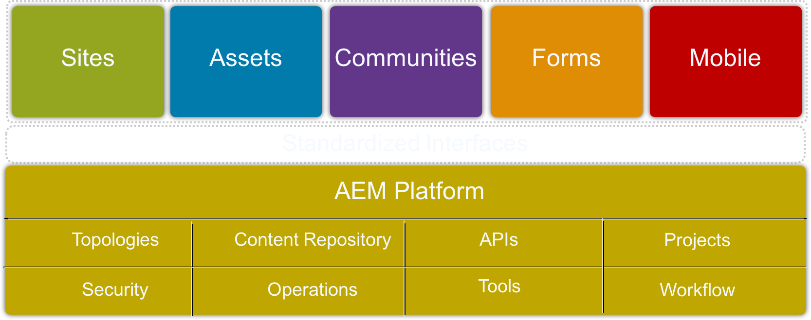
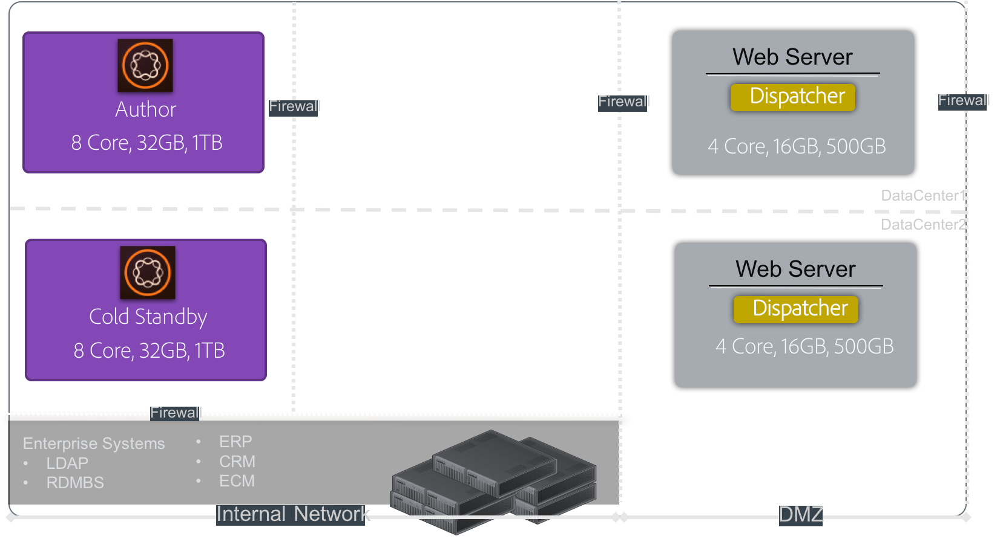

# Riktlinjer för prestanda{#performance-guidelines}

Den här sidan innehåller allmänna riktlinjer för hur du optimerar prestandan för AEM. Om du inte har AEM tidigare bör du granska följande sidor innan du börjar läsa riktlinjerna för prestanda:

* [AEM grundläggande begrepp](/help/sites-deploying/deploy.md#basic-concepts)
* [Översikt över lagring i AEM](/help/sites-deploying/storage-elements-in-aem-6.md#overview-of-storage-in-aem)
* [Rekommenderade distributioner](/help/sites-deploying/recommended-deploys.md)
* [Tekniska krav](/help/sites-deploying/technical-requirements.md)

Illustrator below are the deployment options available for AEM (scroll to view all the options):

<table>
 <tbody>
  <tr>
   <td>
<strong>AEM</strong>
 
<strong>Produkt</strong>
 </td>
   <td>
<strong>Topologi</strong>
 </td>
   <td>
<strong>Operativsystem</strong>
 </td>
   <td>
<strong>Programserver</strong>
 </td>
   <td>
<strong>JRE</strong>
 </td>
   <td>
<strong>Dokumentskydd</strong>
 </td>
   <td>
<strong>Micro Kernel</strong>
 </td>
   <td>
<strong>Datastore</strong>
 </td>
   <td>
<strong>Indexering</strong>
 </td>
   <td>
<strong>Webbserver</strong>
 </td>
   <td>
<strong>Webbläsare</strong>
 </td>
   <td>
<strong>Experience Cloud</strong>
 </td>
  </tr>
  <tr>
   <td>
Sites
 </td>
   <td>
Ej-HA
 </td>
   <td>
Windows
 </td>
   <td>
CQSE
 </td>
   <td>
Oracle
 </td>
   <td>
LDAP
 </td>
   <td>
tar
 </td>
   <td>
Segment
 </td>
   <td>
Egenskap
 </td>
   <td>
Apache
 </td>
   <td>
Edge
 </td>
   <td>
Mål
 </td>
  </tr>
  <tr>
   <td>
Assets
 </td>
   <td>
Publish-HA
 </td>
   <td>
Solaris™
 </td>
   <td>
WebLogic
 </td>
   <td>
IBM®
 </td>
   <td>
SAML
 </td>
   <td>
MongoDB
 </td>
   <td>
Fil
 </td>
   <td>
Lucene
 </td>
   <td>
IIS
 </td>
   <td>
IE
 </td>
   <td>
Analyser
 </td>
  </tr>
  <tr>
   <td>
Communities
 </td>
   <td>
Author-CS
 </td>
   <td>
Red Hat®
 </td>
   <td>
WebSphere®
 </td>
   <td>
HP
 </td>
   <td>
Oauth
 </td>
   <td>
RDB/Oracle
 </td>
   <td>
S3/Azure
 </td>
   <td>
Solr
 </td>
   <td>
iPlanet
 </td>
   <td>
FireFox
 </td>
   <td>
Campaign
 </td>
  </tr>
  <tr>
   <td>
Forms
 </td>
   <td>
Författaravlastning
 </td>
   <td>
HP-UX
 </td>
   <td>
Tomcat
 </td>
   <td>
 
 </td>
   <td>
 
 </td>
   <td>
RDB/DB2
 </td>
   <td>
MongoDB
 </td>
   <td>
 
 </td>
   <td>
 
 </td>
   <td>
Chrome
 </td>
   <td>
Social
 </td>
  </tr>
  <tr>
   <td>
Mobil
 </td>
   <td>
Författarkluster
 </td>
   <td>
IBM® AIX®
 </td>
   <td>
JBoss®
 </td>
   <td>
 
 </td>
   <td>
 
 </td>
   <td>
RDB/MySQL
 </td>
   <td>
RDBMS
 </td>
   <td>
 
 </td>
   <td>
 
 </td>
   <td>
Safari
 </td>
   <td>
Målgrupp
 </td>
  </tr>
  <tr>
   <td>
Flera platser
 </td>
   <td>
ASRP
 </td>
   <td>
SUSE®
 </td>
   <td>
 
 </td>
   <td>
 
 </td>
   <td>
 
 </td>
   <td>
RDB/SQLServer
 </td>
   <td>
 
 </td>
   <td>
 
 </td>
   <td>
 
 </td>
   <td>
 
 </td>
   <td>
Assets
 </td>
  </tr>
  <tr>
   <td>
Commerce
 </td>
   <td>
MSRP
 </td>
   <td>
APPLE OS
 </td>
   <td>
 
 </td>
   <td>
 
 </td>
   <td>
 
 </td>
   <td>
 
 </td>
   <td>
 
 </td>
   <td>
 
 </td>
   <td>
 
 </td>
   <td>
 
 </td>
   <td>
Aktivering
 </td>
  </tr>
  <tr>
   <td>
Dynamic Media
 </td>
   <td>
JSRP
 </td>
   <td>
 
 </td>
   <td>
 
 </td>
   <td>
 
 </td>
   <td>
 
 </td>
   <td>
 
 </td>
   <td>
 
 </td>
   <td>
 
 </td>
   <td>
 
 </td>
   <td>
 
 </td>
   <td>
Mobil
 </td>
  </tr>
  <tr>
   <td>
Brand Portal
 </td>
   <td>
J2E
 </td>
   <td>
 
 </td>
   <td>
 
 </td>
   <td>
 
 </td>
   <td>
 
 </td>
   <td>
 
 </td>
   <td>
 
 </td>
   <td>
 
 </td>
   <td>
 
 </td>
   <td>
 
 </td>
   <td>
 
 </td>
  </tr>
  <tr>
   <td>
AoD
 </td>
   <td>
 
 </td>
   <td>
 
 </td>
   <td>
 
 </td>
   <td>
 
 </td>
   <td>
 
 </td>
   <td>
 
 </td>
   <td>
 
 </td>
   <td>
 
 </td>
   <td>
 
 </td>
   <td>
 
 </td>
   <td>
 
 </td>
  </tr>
  <tr>
   <td>
LiveFyre
 </td>
   <td>
 
 </td>
   <td>
 
 </td>
   <td>
 
 </td>
   <td>
 
 </td>
   <td>
 
 </td>
   <td>
 
 </td>
   <td>
 
 </td>
   <td>
 
 </td>
   <td>
 
 </td>
   <td>
 
 </td>
   <td>
 
 </td>
  </tr>
  <tr>
   <td>
Screens
 </td>
   <td>
 
 </td>
   <td>
 
 </td>
   <td>
 
 </td>
   <td>
 
 </td>
   <td>
 
 </td>
   <td>
 
 </td>
   <td>
 
 </td>
   <td>
 
 </td>
   <td>
 
 </td>
   <td>
 
 </td>
   <td>
 
 </td>
  </tr>
  <tr>
   <td>
Dokumentsäkerhet
 </td>
   <td>
 
 </td>
   <td>
 
 </td>
   <td>
 
 </td>
   <td>
 
 </td>
   <td>
 
 </td>
   <td>
 
 </td>
   <td>
 
 </td>
   <td>
 
 </td>
   <td>
 
 </td>
   <td>
 
 </td>
   <td>
 
 </td>
  </tr>
  <tr>
   <td>
Processhantering
 </td>
   <td>
 
 </td>
   <td>
 
 </td>
   <td>
 
 </td>
   <td>
 
 </td>
   <td>
 
 </td>
   <td>
 
 </td>
   <td>
 
 </td>
   <td>
 
 </td>
   <td>
 
 </td>
   <td>
 
 </td>
   <td>
 
 </td>
  </tr>
  <tr>
   <td>
datorprogram
 </td>
   <td>
 
 </td>
   <td>
 
 </td>
   <td>
 
 </td>
   <td>
 
 </td>
   <td>
 
 </td>
   <td>
 
 </td>
   <td>
 
 </td>
   <td>
 
 </td>
   <td>
 
 </td>
   <td>
 
 </td>
   <td>
 
 </td>
  </tr>
 </tbody>
</table>

>[!NOTE]
>
>Riktlinjerna gäller i huvudsak AEM Sites.

## När prestandarådarna ska användas {#when-to-use-the-performance-guidelines}

Använd riktlinjerna för prestanda i följande situationer:

* **Första gången du distribuerar**: När du planerar att distribuera AEM Sites eller Assets för första gången är det viktigt att du förstår vilka alternativ som är tillgängliga. Särskilt när du konfigurerar Micro Kernel, Node Store och Data Store (jämfört med standardinställningarna). Om du till exempel ändrar standardinställningarna för datalagret för tarMK till fildatalagret.
* **Uppgraderar till en ny version**: När du uppgraderar till en ny version är det viktigt att du förstår prestandaskillnaderna jämfört med körningsmiljön. Du kan till exempel uppgradera från AEM 6.1 till 6.2 eller från AEM 6.0 CRX2 till 6.2 OAK.
* **Svarstiden är långsam**: När den valda Nodestore-arkitekturen inte uppfyller dina krav är det viktigt att förstå prestandaskillnaderna jämfört med andra topologialternativ. Du kan till exempel distribuera tarMK i stället för MongoMK, eller använda en File Data Store i stället för ett Amazon S3- eller Microsoft® Azure-datalager.
* **Lägger till fler författare**: Om den rekommenderade TjärMK-topologin inte uppfyller prestandakraven och om redigeringsnoden har uppnått den maximala tillgängliga kapaciteten, måste du förstå prestandaskillnaderna. Jämför med att använda MongoMK med tre eller fler Author-noder. Du kan till exempel distribuera MongoMK i stället för tarMK.
* **Lägga till mer innehåll**: När den rekommenderade datalagerarkitekturen inte uppfyller dina krav är det viktigt att förstå prestandaskillnaderna jämfört med andra datalageralternativ. Exempel: använda Amazon S3 eller Microsoft® Azure Data Store i stället för ett File Data Store.

## Introduktion {#introduction}

I det här kapitlet ges en allmän översikt över den AEM arkitekturen och dess viktigaste komponenter. Den innehåller också riktlinjer för utveckling och beskriver de testscenarier som används i prestandatesterna TjärMK och MongoMK.

### AEM Platform {#the-aem-platform}

Den AEM plattformen består av följande komponenter:

Mer information om den AEM plattformen finns i [Vad är AEM](/help/sites-deploying/deploy.md#what-is-aem).

### AEM arkitektur {#the-aem-architecture}

Det finns tre viktiga byggstenar för en AEM. **Författarinstansen** som används av innehållsförfattare, redigerare och godkännare för att skapa och granska innehåll. När innehållet godkänns publiceras det till en andra instanstyp med namnet **Publish Instance** som slutanvändarna kommer åt det från. Det tredje byggblocket är **Dispatcher** som är en modul som hanterar cachelagring och URL-filtrering och som är installerad på webbservern. Mer information om den AEM arkitekturen finns i [Vanliga distributionsscenarier](/help/sites-deploying/deploy.md#typical-deployment-scenarios).

### Micro Kernels {#micro-kernels}

Micro Kernels fungerar som beständiga chefer i AEM. Det finns tre typer av mikrokärnor som används med AEM: tarMK, MongoDB och Relational Database (med begränsat stöd). Vilken som passar bäst beror på instansens syfte och vilken distributionstyp du överväger. Mer information om Micro Kernels finns på sidan [Rekommenderade distributioner](/help/sites-deploying/recommended-deploys.md).

### Nodestore {#nodestore}

I AEM kan binära data lagras oberoende av innehållsnoder. Platsen där binära data lagras kallas **datalagret**, medan platsen för innehållsnoderna och -egenskaperna kallas **nodarkivet**.

>[!NOTE]
>
>Adobe rekommenderar att TARMK är standardbeständighetstekniken som används av kunder både för AEM författare och Publish.

>[!CAUTION]
>
>Mikrokärnan i relationsdatabasen har begränsat stöd. Kontakta [Adobe kundtjänst](https://experienceleague.adobe.com/sv?support-solution=General&support-tab=home#support) innan du använder den här typen av mikrokärna.

### Datalager {#data-store}

När du hanterar ett stort antal binära filer bör du använda ett externt datalager i stället för standardnodarkiven för att maximera prestandan. Om ditt projekt till exempel kräver många medieresurser och du lagrar dem under Arkiv eller Azure/S3 Data Store blir det snabbare att komma åt dem än att lagra dem direkt i en MongoDB.

Mer information om tillgängliga konfigurationsalternativ finns i [Konfigurera nod- och datalager](/help/sites-deploying/data-store-config.md).

>[!NOTE]
>
>Adobe rekommenderar att du väljer alternativet att distribuera AEM på Azure eller Amazon Web Services (AWS) med Adobe Managed Services. Kunderna drar nytta av ett team som har erfarenhet och kompetens av att driftsätta och AEM i dessa molnmiljöer. Se [ytterligare dokumentation om Adobe Managed Services](https://business.adobe.com/products/experience-manager/managed-services.html?aemClk=t).
>
>Adobe rekommenderar att du arbetar direkt med molnleverantören för att få rekommendationer om hur du ska distribuera AEM på Azure eller AWS utanför Adobe Managed Services. Eller samarbeta med en av Adobe som stöder driftsättningen av AEM i molnmiljön. Den valda molnleverantören eller partnern ansvarar för storleksspecifikationerna, designen och implementeringen av den arkitektur de stöder för att uppfylla just dina krav på prestanda, belastning, skalbarhet och säkerhet.
>
>&#x200B;>Se även sidan [Tekniska krav](/help/sites-deploying/technical-requirements.md#supported-platforms).

### Sök {#search-features}

I det här avsnittet finns de anpassade indexproviders som används med AEM. Mer information om indexering finns i [Oak-frågor och indexering](/help/sites-deploying/queries-and-indexing.md).

>[!NOTE]
>
>För de flesta installationer rekommenderar Adobe att du använder Lucene-index. Använd Solr endast för skalbarhet vid specialiserad och komplex driftsättning.

### Utvecklingsriktlinjer {#development-guidelines}

Utveckla för AEM som vill ha **prestanda och skalbarhet**. Här följer några tips som du kan följa:

**GÖR**

* Separera presentation, logik och innehåll
* Använd befintliga AEM-API:er (t.ex. Sling) och verktyg (t.ex. replikering)
* Utveckla i rätt sammanhang
* Utveckla för optimal tillgänglighet
* Minimera antalet besparingar (t.ex. genom att använda tillfälliga arbetsflöden)
* Kontrollera att alla HTTP-slutpunkter är RESTful
* Begränsa omfattningen av JCR-observation
* Tänk på asynkron tråd

**GÖR INTE**

* Använd inte JCR-API:er direkt om du kan
* Ändra inte /libs, utan använd i stället övertäckningar
* Använd inte frågor där det är möjligt
* Använd inte Sling Bindings för att få OSGi-tjänster i Java™-kod, utan använd istället:

   * @Referens i en DS-komponent
   * @Injicera i en körningsmodell
   * sling.getService() i en lättanvänd klass
   * sling.getService() i en JSP
   * en ServiceTracker
   * direktåtkomst till OSGi-tjänstregistret

Mer information om hur du utvecklar AEM finns i [Utveckla - Grunderna](/help/sites-developing/the-basics.md). Mer information finns i [Bästa metoder för utveckling](/help/sites-developing/best-practices.md).

### Benchmark-scenarier {#benchmark-scenarios}

>[!NOTE]
>
>Alla test som visas på den här sidan har utförts i laboratoriemiljö.

De testscenarier som beskrivs nedan används för prestandatestavsnitten i kapitlen TjärMK, MongoMk och TjärMK jämfört med MongoMk. Läs avsnittet Scenario i tabellen [Tekniska specifikationer](/help/sites-deploying/performance-guidelines.md#tarmk-performance-benchmark) om du vill se vilket scenario som användes för ett visst test.

**Scenario för en produkt**

AEM Assets:

* Användarinteraktioner: Bläddra i Assets/Sök i Assets/Hämta resurs/Läs resursmetadata/Uppdatera resursmetadata/Överför resurs/Kör arbetsflöde för överföring av resurs
* Körningsläge: samtidiga användare, en interaktion per användare

**Scenario för blandade produkter**

AEM Sites + Assets:

* Webbplatsanvändarinteraktioner: Läs artikelsida / Läs sida / Skapa stycke / Redigera stycke / Skapa innehållssida / Aktivera innehållssida / Författarsökning
* Assets användarinteraktioner: Bläddra i Assets/Sök i Assets/Hämta resurs/Läs resursmetadata/Uppdatera resursmetadata/Överför resurs/Kör arbetsflöde för överföring av resurs
* Körningsläge: samtidiga användare, blandade interaktioner per användare

**Vertikalt scenario för användning**

Media:

* `Read Article Page (27.4%), Read Page (10.9%), Create Session (2.6%), Activate Content Page (1.7%), Create Content Page (0.4%), Create Paragraph (4.3%), Edit Paragraph (0.9%), Image Component (0.9%), Browse Assets (20%), Read Asset Metadata (8.5%), Download Asset (4.2%), Search Asset (0.2%), Update Asset Metadata (2.4%), Upload Asset (1.2%), Browse Project (4.9%), Read Project (6.6%), Project Add Asset (1.2%), Project Add Site (1.2%), Create Project (0.1%), Author Search (0.4%)`
* Körningsläge: samtidiga användare, blandade interaktioner per användare

## tarMK {#tarmk}

I det här kapitlet finns allmänna riktlinjer för prestanda för TjäraMK som specificerar minimikraven för arkitektur och inställningskonfigurationen. Riktmärkestester tillhandahålls också för ytterligare förtydliganden.

Adobe rekommenderar att TARMK är standardbeständighetstekniken som används av kunder i alla distributionsscenarier, både för AEM Author och Publish.

Mer information om TjärMK finns i [Distributionsscenarier](/help/sites-deploying/recommended-deploys.md#deployment-scenarios) och [Tjärlagring](/help/sites-deploying/storage-elements-in-aem-6.md#tar-storage).

### TaMK - riktlinjer för minimiarkitektur {#tarmk-minimum-architecture-guidelines}

>[!NOTE]
>
>De riktlinjer för minimiarkitektur som presenteras nedan gäller produktionsmiljöer och stora trafikplatser. Riktlinjerna är **inte** de [lägsta specifikationerna](/help/sites-deploying/technical-requirements.md#prerequisites) som ska köras AEM.

För att få goda prestanda när du använder tarMK bör du utgå från följande arkitektur:

* En författarinstans
* Två Publish-instanser
* Två utskickare

Nedan visas riktlinjerna för arkitektur för webbplatser AEM AEM Assets.

>[!NOTE]
>
>Binärfri replikering ska vara **ON** om fildatalagret delas.

**Riktlinjer för Tjärarkitektur för AEM Sites**

**Riktlinjer för Tjärarkitektur för AEM Assets**

### Riktlinje för inställningar för TARMK {#tarmk-settings-guideline}

För bästa prestanda bör du följa riktlinjerna nedan. Instruktioner om hur du ändrar inställningarna finns i [Prestandaoptimering](/help/sites-deploying/configuring-performance.md).

<table>
 <tbody>
  <tr>
   <td><strong>Inställning</strong></td>
   <td><strong>Parameter</strong></td>
   <td><strong>Värde</strong></td>
   <td><strong>Beskrivning</strong></td>
  </tr>
  <tr>
   <td>Sling-jobbköer</td>
   <td><code>queue.maxparallel</code></td>
   <td>Ange värdet till hälften av antalet processorkärnor. </td>
   <td>Som standard är antalet samtidiga trådar per jobbkö lika med antalet processorkärnor.</td>
  </tr>
  <tr>
   <td>Bevilja tillfällig arbetsflödeskö</td>
   <td><code>Max Parallel</code></td>
   <td>Ange värdet till hälften av antalet processorkärnor</td>
   <td> </td>
  </tr>
  <tr>
   <td>JVM-parametrar</td>
   <td>
<code>Doak.queryLimitInMemory</code>
 
<code>Doak.queryLimitReads</code>
 
<code>Dupdate.limit</code>
 
<code>Doak.fastQuerySize</code>
 </td>
   <td>
500000
 
100000
 
250000
 
True
 </td>
   <td>Om du vill förhindra att expanderande frågor överbelastar systemen lägger du till dessa JVM-parametrar i AEM startskript.</td>
  </tr>
  <tr>
   <td>Lucene-indexkonfiguration</td>
   <td>
<code>CopyOnRead</code>
 
<code>CopyOnWrite</code>
 
<code>Prefetch Index Files</code>
 </td>
   <td>
Aktiverad
 
Aktiverad
 
Aktiverad
 </td>
   <td>Mer information om tillgängliga parametrar finns på <a href="https://jackrabbit.apache.org/oak/docs/query/lucene.html">den här sidan</a>.</td>
  </tr>
  <tr>
   <td>Datalager = S3 Datastore</td>
   <td>
<code>maxCachedBinarySize</code>
 
<code>cacheSizeInMB</code>
 </td>
   <td>
1048576 (1 MB) eller mindre
 
2-10 % av maximal stackstorlek
 </td>
   <td>Se även <a href="/help/sites-deploying/data-store-config.md#data-store-configurations">Datalagerkonfigurationer</a>.</td>
  </tr>
  <tr>
   <td>Arbetsflöde för DAM-uppdatering</td>
   <td><code>Transient Workflow</code></td>
   <td>checked</td>
   <td>Det här arbetsflödet hanterar uppdateringen av resurser.</td>
  </tr>
  <tr>
   <td>DAM MetaData Writeback</td>
   <td><code>Transient Workflow</code></td>
   <td>checked</td>
   <td>Det här arbetsflödet hanterar XMP återskrivning till det ursprungliga binärdokumentet och anger det senaste ändringsdatumet i JCR.</td>
  </tr>
 </tbody>
</table>

### Resultatjämförelse för tarMK {#tarmk-performance-benchmark}

#### Tekniska specifikationer {#technical-specifications}

Testerna utfördes på följande specifikationer:

| | **Författarnod** |
|---|---|
| Server | Maskinvara av barrmetall (HP) |
| Operativsystem | Red Hat® Linux® |
| Processor/kärnor | Processorn Intel(R) Xeon(R) E5-2407 @2,40 GHz, 8 kärnor |
| RAM | 32 GB |
| Skiva | Magnetiskt |
| Java™ | Oracle JRE version 8 |
| JVM-heap | 16 GB |
| Produkt | AEM 6.2 |
| Nodestore | tarMK |
| Datastore | Fil-DS |
| Scenario | En produkt: Assets/30 samtidiga trådar |

#### Resultat av prestandatest {#performance-benchmark-results}

>[!NOTE]
>
>Siffrorna nedan har normaliserats till 1 som baslinje och är inte de faktiska flödenumren.

 

## MongoMK {#mongomk}

Den främsta anledningen till att du väljer MongoMK-beständighetsbackend framför tarMK är att skalförändra instanserna vågrätt. Detta innebär att två eller flera aktiva författarinstanser alltid körs och att MongoDB används som beständigt lagringssystem. Behovet av att köra mer än en författarinstans beror i allmänhet på att processorn och minneskapaciteten på en enda server, som stöder alla samtidiga redigeringsaktiviteter, inte längre är hållbara.

Mer information om TjärMK finns i [Distributionsscenarier](/help/sites-deploying/recommended-deploys.md#deployment-scenarios) och [Mongo-lagring](/help/sites-deploying/storage-elements-in-aem-6.md#mongo-storage).

### Riktlinjer för minimiarkitektur i MongoMK {#mongomk-minimum-architecture-guidelines}

För att få bra prestanda när du använder MongoMK bör du utgå från följande arkitektur:

* Tre författarinstanser
* Två Publish-instanser
* Tre MongoDB-instanser
* Två utskickare

>[!NOTE]
>
>I produktionsmiljöer används MongoDB alltid som en replikuppsättning med en primär och två sekundära. Läsningar och skrivningar går till huvudlistan och läsningar kan gå till de sekundära. Om lagring inte är tillgängligt kan en av de sekundära ersättas med en skiljedomare, men MongoDB-replikuppsättningar måste alltid bestå av ett ojämnt antal instanser.

>[!NOTE]
>
>Binärfri replikering ska vara **ON** om fildatalagret delas.

### Riktlinjer för MongoMK-inställningar {#mongomk-settings-guidelines}

För bästa prestanda bör du följa riktlinjerna nedan. Instruktioner om hur du ändrar inställningarna finns i [Prestandaoptimering](/help/sites-deploying/configuring-performance.md).

<table>
 <tbody>
  <tr>
   <td><strong>Inställning</strong></td>
   <td><strong>Parameter</strong></td>
   <td><strong>Värde (standard)</strong></td>
   <td><strong>Beskrivning</strong></td>
  </tr>
  <tr>
   <td>Sling-jobbköer</td>
   <td><code>queue.maxparallel</code></td>
   <td>Ange värdet till hälften av antalet processorkärnor. </td>
   <td>Som standard är antalet samtidiga trådar per jobbkö lika med antalet processorkärnor.</td>
  </tr>
  <tr>
   <td>Bevilja tillfällig arbetsflödeskö</td>
   <td><code>Max Parallel</code></td>
   <td>Ange värdet till hälften av antalet processorkärnor.</td>
   <td> </td>
  </tr>
  <tr>
   <td>JVM-parametrar</td>
   <td>
<code>Doak.queryLimitInMemory</code>
 
<code>Doak.queryLimitReads</code>
 
<code>Dupdate.limit</code>
 
<code>Doak.fastQuerySize</code>
 
<code>Doak.mongo.maxQueryTimeMS</code>
 </td>
   <td>
500000
 
100000
 
250000
 
True
 
60000
 </td>
   <td>Om du vill förhindra att expanderande frågor överbelastar systemen lägger du till dessa JVM-parametrar i AEM startskript.</td>
  </tr>
  <tr>
   <td>Lucene-indexkonfiguration</td>
   <td>
<code>CopyOnRead</code>
 
<code>CopyOnWrite</code>
 
<code>Prefetch Index Files</code>
 </td>
   <td>
Aktiverad
 
Aktiverad
 
Aktiverad
 </td>
   <td>Mer information om tillgängliga parametrar finns på <a href="https://jackrabbit.apache.org/oak/docs/query/lucene.html">den här sidan</a>.</td>
  </tr>
  <tr>
   <td>Datalager = S3 Datastore</td>
   <td>
<code>maxCachedBinarySize</code>
 
<code>cacheSizeInMB</code>
 </td>
   <td>
1048576 (1 MB) eller mindre
 
2-10 % av maximal stackstorlek
 </td>
   <td>Se även <a href="/help/sites-deploying/data-store-config.md#data-store-configurations">Datalagerkonfigurationer</a>.</td>
  </tr>
  <tr>
   <td>DocumentNodeStoreService</td>
   <td>
<code>cache</code>
 
<code>nodeCachePercentage</code>
 
<code>childrenCachePercentage</code>
 
<code>diffCachePercentage</code>
 
<code>docChildrenCachePercentage</code>
 
<code>prevDocCachePercentage</code>
 
<code>persistentCache</code>
 </td>
   <td>
2048
 
35 (25)
 
20 (10)
 
30 (5)
 
10 (3)
 
4 (4)
 
./cache,size=2048,binary=0,-compact,-compress
 </td>
   <td>
Standardstorleken för cachen är 256 MB.
 
Påverkar hur lång tid det tar att göra cachen ogiltig.
 </td>
  </tr>
  <tr>
   <td>ek-observation</td>
   <td>
<code>thread pool</code>
 
<code>length</code>
 </td>
   <td>
min &amp; max = 20
 
50000
 </td>
   <td> </td>
  </tr>
 </tbody>
</table>

### Prestandatest för MongoMK {#mongomk-performance-benchmark}

### Tekniska specifikationer {#technical-specifications-1}

Testerna utfördes på följande specifikationer:

| | **Författarnod** | **MongoDB-nod** |
|---|---|---|
| Server | Maskinvara av barrmetall (HP) | Maskinvara av barrmetall (HP) |
| Operativsystem | Red Hat® Linux® | Red Hat® Linux® |
| Processor/kärnor | Processorn Intel(R) Xeon(R) E5-2407 @2,40 GHz, 8 kärnor | Processorn Intel(R) Xeon(R) E5-2407 @2,40 GHz, 8 kärnor |
| RAM | 32 GB | 32 GB |
| Skiva | Magnetiskt - >1 k IOPS | Magnetiskt - >1 k IOPS |
| Java™ | Oracle JRE version 8 | Ej tillämpligt |
| JVM-heap | 16 GB | Ej tillämpligt |
| Produkt | AEM 6.2 | MongoDB 3.2 WiredTiger |
| Nodestore | MongoMK | Ej tillämpligt |
| Datastore | Fil-DS | Ej tillämpligt |
| Scenario | En produkt: Assets/30 samtidiga trådar | En produkt: Assets/30 samtidiga trådar |

### Resultat av prestandatest {#performance-benchmark-results-1}

>[!NOTE]
>
>Siffrorna nedan har normaliserats till 1 som baslinje och är inte de faktiska flödenumren.

 

## tarMK jämfört med MongoMK {#tarmk-vs-mongomk}

Den grundläggande regeln som ska beaktas när du väljer mellan de två är att tarMK är utformat för prestanda, medan MongoMK används för skalbarhet. Adobe rekommenderar att TARMK är standardbeständighetstekniken som används av kunder i alla distributionsscenarier, både för AEM Author och Publish.

Den främsta anledningen till att du väljer MongoMK-beständighetsbackend framför tarMK är att skalförändra instanserna vågrätt. Den här funktionen innebär att två eller flera aktiva författarinstanser alltid körs och att MongoDB används som beständigt lagringssystem. Behovet av att köra mer än en författarinstans beror i allmänhet på att processorn och minneskapaciteten på en enda server, som stöder alla samtidiga redigeringsaktiviteter, inte längre är hållbara.

Mer information om TjäraMK och MongoMK finns i [Rekommenderade distributioner](/help/sites-deploying/recommended-deploys.md#microkernels-which-one-to-use).

### Riktlinjer för tarMK jämfört med MongoMk {#tarmk-vs-mongomk-guidelines}

**Fördelar med tarMK**

* Ändamålsenlig för content management-program
* Filerna är alltid konsekventa och kan säkerhetskopieras med valfritt filbaserat säkerhetskopieringsverktyg
* Tillhandahåller en redundansmekanism - mer information finns i [Cold Standby](/help/sites-deploying/tarmk-cold-standby.md)
* Ger höga prestanda och tillförlitlig datalagring med minimal driftkostnad
* Lägre ägandekostnader (total ägandekostnad)

**Villkor för val av MongoMK**

* Antal namngivna användare som är anslutna under en dag: i tusental eller mer
* Antal samtidiga användare: i hundratals eller fler
* Volym för tillgångsförslag per dag: i hundratusentals eller fler
* Antal sidredigeringar per dag: hundratusentals eller fler
* Antal sökningar per dag: tiotusentals eller fler

### Benchmarks för tarMK jämfört med MongoMK {#tarmk-vs-mongomk-benchmarks}

>[!NOTE]
>
>Siffrorna nedan har normaliserats till 1 som baslinje och är inte faktiska flödesnummer.

### Tekniska specifikationer för scenario 1 {#scenario-technical-specifications}

<table>
 <tbody>
  <tr>
   <td><strong> </strong></td>
   <td><strong>Skapa OAK Node</strong></td>
   <td><strong>MongoDB-nod</strong></td>
   <td> </td>
  </tr>
  <tr>
   <td>Server</td>
   <td>Maskinvara av barrmetall (HP)</td>
   <td>Maskinvara av barrmetall (HP)</td>
   <td> </td>
  </tr>
  <tr>
   <td>Operativsystem</td>
   <td>Red Hat® Linux®</td>
   <td>Red Hat® Linux®</td>
   <td> </td>
  </tr>
  <tr>
   <td>Processor/kärnor</td>
   <td>Processorn Intel(R) Xeon(R) E5-2407 @2,40 GHz, 8 kärnor</td>
   <td>Processorn Intel(R) Xeon(R) E5-2407 @2,40 GHz, 8 kärnor</td>
   <td> </td>
  </tr>
  <tr>
   <td>RAM</td>
   <td>32 GB</td>
   <td>32 GB</td>
   <td> </td>
  </tr>
  <tr>
   <td>Skiva</td>
   <td>Magnetiskt - &gt;1 k IOPS</td>
   <td>Magnetiskt - &gt;1 k IOPS</td>
   <td> </td>
  </tr>
  <tr>
   <td>Java™</td>
   <td>Oracle JRE version 8</td>
   <td>Ej tillämpligt</td>
   <td> </td>
  </tr>
  <tr>
   <td>JVM Heap16 GB</td>
   <td>16 GB</td>
   <td>Ej tillämpligt</td>
   <td> </td>
  </tr>
  <tr>
   <td>Produkt </td>
   <td>AEM 6.2</td>
   <td>MongoDB 3.2 WiredTiger</td>
   <td> </td>
  </tr>
  <tr>
   <td>Nodestore</td>
   <td>tarMK eller MongoMK</td>
   <td>Ej tillämpligt</td>
   <td> </td>
  </tr>
  <tr>
   <td>Datastore</td>
   <td>Fil-DS </td>
   <td>Ej tillämpligt</td>
   <td> </td>
  </tr>
  <tr>
   <td>Scenario</td>
   <td>
  En produkt: Assets/30 samtidiga trådar per körning
 </td>
   <td> </td>
   <td> </td>
  </tr>
 </tbody>
</table>

### Resultat av prestandatest för scenario 1 {#scenario-performance-benchmark-results}

### Tekniska specifikationer för scenario 2 {#scenario-technical-specifications-1}

>[!NOTE]
>
>Om du vill aktivera samma antal författare med MongoDB som med ett tarMK-system behöver du ett kluster med två AEM noder. Ett mongoDB-kluster med fyra noder kan hantera 1,8 gånger så många författare som en tarMK-instans. Ett åtta-nods MongoDB-kluster kan hantera 2,3 gånger så många författare som en tarMK-instans.

<table>
 <tbody>
  <tr>
   <td><strong> </strong></td>
   <td><strong>Författare tarMK-nod</strong></td>
   <td><strong>Författare MongoMK-nod</strong></td>
   <td><strong>MongoDB-nod</strong></td>
  </tr>
  <tr>
   <td>Server</td>
   <td>AWS c3.8xlarge</td>
   <td>AWS c3.8xlarge</td>
   <td>AWS c3.8xlarge</td>
  </tr>
  <tr>
   <td>Operativsystem</td>
   <td>Red Hat® Linux®</td>
   <td>Red Hat® Linux®</td>
   <td>Red Hat® Linux®</td>
  </tr>
  <tr>
   <td>Processor/kärnor</td>
   <td>32</td>
   <td>32</td>
   <td>32</td>
  </tr>
  <tr>
   <td>RAM</td>
   <td>60 GB</td>
   <td>60 GB</td>
   <td>60 GB</td>
  </tr>
  <tr>
   <td>Skiva</td>
   <td>SSD - 10 000 IOPS</td>
   <td>SSD - 10 000 IOPS</td>
   <td>SSD - 10 000 IOPS</td>
  </tr>
  <tr>
   <td>Java™</td>
   <td>Oracle JRE version 8</td>
   <td>  Oracle JRE version 8</td>
   <td>Ej tillämpligt</td>
  </tr>
  <tr>
   <td>JVM Heap16 GB</td>
   <td>30 GB</td>
   <td>30 GB</td>
   <td>Ej tillämpligt</td>
  </tr>
  <tr>
   <td>Produkt </td>
   <td>AEM 6.2</td>
   <td>AEM 6.2</td>
   <td>  MongoDB 3.2 WiredTiger</td>
  </tr>
  <tr>
   <td>Nodestore</td>
   <td>tarMK </td>
   <td>MongoMK</td>
   <td>  Ej tillämpligt</td>
  </tr>
  <tr>
   <td>Datastore</td>
   <td>Fil-DS </td>
   <td>  Fil-DS</td>
   <td>  Ej tillämpligt</td>
  </tr>
  <tr>
   <td>Scenario</td>
   <td>
    Vertikalt användningsfall: Media/2000 samtidiga trådar
 </td>
   <td></td>
   <td></td>
  </tr>
 </tbody>
</table>

### Resultat av prestandatest för scenario 2 {#scenario-performance-benchmark-results-1}

### Riktlinjer för arkitekturskalbarhet för AEM Sites och Assets {#architecture-scalability-guidelines-for-aem-sites-and-assets}

## Sammanfattning av riktlinjer för prestanda  {#summary-of-performance-guidelines}

Riktlinjerna på denna sida kan sammanfattas enligt följande:

* **tarMK med fildatastore** - Den rekommenderade arkitekturen för de flesta kunder:

   * Minimitopologi: en författarinstans, två Publish-instanser, två utskickare
   * Binärfri replikering aktiveras om fildatalagret delas

* **MongoMK med File DataStore** - Den rekommenderade arkitekturen för vågrät skalbarhet för Author-nivån:

   * Minimitopologi: tre författarinstanser, tre MongoDB-instanser, två Publish-instanser, två Dispatchers
   * Binärfri replikering aktiveras om fildatalagret delas

* **Nodestore** - lagras på den lokala disken, inte ett nätverksanslutet lagringsutrymme (NAS)
* När du använder **Amazon S3**:

   * Amazon S3-datalagret delas mellan författaren och Publish-skiktet
   * Binär replikering måste vara aktiverad
   * Datastore Garbage Collection kräver en första körning på alla författarnoder och Publish-noder och sedan en andra körning på författaren

* **Anpassat index ska skapas utöver indexvärdet i rutan** - baserat på de vanligaste sökningarna

   * Lucene-index bör användas för anpassade index

* **Om du anpassar arbetsflödet kan prestandan förbättras avsevärt** - Ta bort videomsteget i arbetsflödet Uppdatera resurs, inaktivera avlyssnare som inte används och så vidare.

Mer information finns också på sidan [Rekommenderade distributioner](/help/sites-deploying/recommended-deploys.md).
