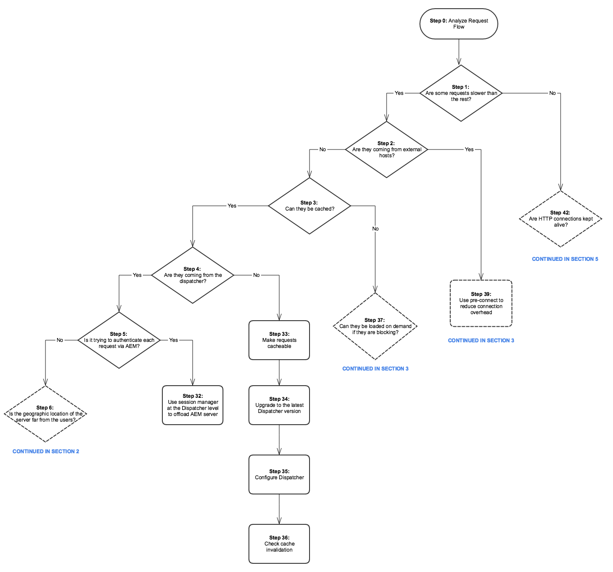
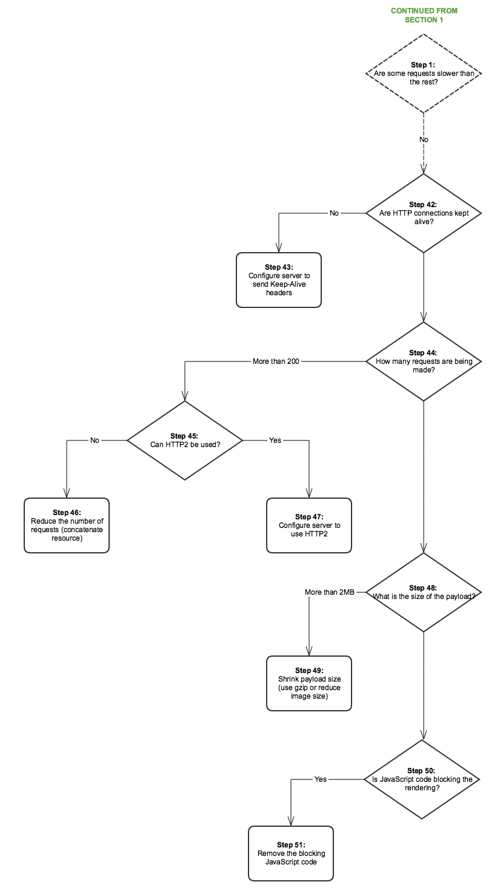

# Prestandaträd{#performance-tree}

## Omfång {#scope}

Följande diagram ger vägledning om hur du felsöker prestandaproblem. Den är uppdelad i fem avsnitt för enklare läsning.

Varje steg i diagrammet är länkat till en dokumentationsresurs eller en rekommendation.

## Krav och antaganden {#prerequisites-and-assumptions}

Antagandet är att ett prestandaproblem observeras på en viss sida (antingen en AEM konsol eller en webbsida) och kan återges på ett enhetligt sätt. Att kunna testa eller övervaka prestanda är en förutsättning innan undersökningen inleds.

Analysen börjar med steg 0. Målet är att avgöra vilken enhet (Dispatcher, extern värd eller AEM) som ansvarar för prestandaproblemet och sedan avgöra vilket område (server eller nätverk) som ska undersökas.

### Avsnitt 1 {#section}

### Avsnitt 2 {#section-1}

### Avsnitt 3 {#section-2}

### Avsnitt 4 {#section-3}

### Avsnitt 5 {#section-4}

## Referenslänkar {#reference-links}

<table>
 <tbody>
  <tr>
   <td><strong>Steg</strong></td>
   <td><strong>Titel</strong></td>
   <td><strong>Resurser</strong></td>
  </tr>
  <tr>
   <td><strong>Steg 0</strong></td>
   <td>Analysera flödet för förfrågningar</td>
   <td>
Du kan använda standardanalys av HTTP-begäran i webbläsaren för att analysera förfrågningsflödet. Mer information om hur du gör den här analysen på Chrome finns i:  
 
<a href="https://developers.google.com/web/tools/chrome-devtools/profile/network-performance/resource-loading">https://developer.chrome.com/docs/devtools/</a>  
 </td>
  </tr>
  <tr>
   <td><strong>Steg 2</strong></td>
   <td>Kommer förfrågningar från externa värdar?</td>
   <td>Du kan använda standardanalys av HTTP-begäran i webbläsaren för att analysera förfrågningsflödet. Se länkarna ovan om hur du gör den här analysen på Chrome.  </td>
  </tr>
  <tr>
   <td><strong>Steg 3</strong></td>
   <td>Kan förfrågningarna cachelagras?</td>
   <td>Mer information om tillgängliga begäranden och allmänna råd om prestandaoptimering för Dispatcher finns i <a href="/help/sites-deploying/configuring-performance.md#optimizing-performance-when-using-the-dispatcher">Dispatcher Performance Optimization</a>.</td>
  </tr>
  <tr>
   <td><strong>Steg 4</strong></td>
   <td>Kommer förfrågningar från Dispatcher?</td>
   <td>
Kontrollera <a href="https://experienceleague.adobe.com/docs/experience-manager-dispatcher/using/configuring/dispatcher-configuration.html#debugging">Dispatcher-felsökningsdokumentationen</a> för att se om begäranden har cachelagrats korrekt.  
 </td>
  </tr>
  <tr>
   <td><strong>Steg 5</strong></td>
   <td>Försöker Dispatcher autentisera varje begäran via AEM?</td>
   <td>Kontrollera om Dispatcher skickar <code>HEAD</code> begäranden till AEM för autentisering innan den cachelagrade resursen levereras. Sök efter <code>HEAD</code> förfrågningar i AEM <code>access.log</code>. Mer information finns i <a href="/help/sites-deploying/configure-logging.md">Loggning</a>.  </td>
  </tr>
  <tr>
   <td><strong>Steg 6</strong></td>
   <td>Är Dispatcher geografiska plats långt från användarna?</td>
   <td>Flytta Dispatcher närmare användarna.</td>
  </tr>
  <tr>
   <td><strong>Steg 7</strong></td>
   <td>Går nätverkslagret i Dispatcher bra?</td>
   <td>  Undersök nätverkslagret för problem med mättnad och fördröjning.
 
 </td>
  </tr>
  <tr>
   <td><strong>Steg 8</strong></td>
   <td>Kan långsamheten reproduceras med en lokal instans?</td>
   <td>  
Använd <a href="/help/sites-developing/tough-day.md">Tough Day</a> för att replikera verkliga förhållanden från produktionsinstanserna. Om det här scenariot inte är realistiskt för ditt utvecklingsområde måste du testa produktionsinstansen (eller en identisk mellanlagringsmodell) i en annan nätverkskontext.  
 </td>
  </tr>
  <tr>
   <td><strong>Steg 9</strong></td>
   <td>Är serverns geografiska plats långt från användarna?</td>
   <td>Flytta servern närmare användarna.</td>
  </tr>
  <tr>
   <td><strong>Steg 10 och 29</strong></td>
   <td>Undersök nätverkslager</td>
   <td>
Undersök nätverkslagret för problem med mättnad och fördröjning.
 
För författarnivån rekommenderas att fördröjningen inte överstiger 100 millisekunder.
 
Mer information om tips för prestandaoptimering finns på <a href="https://helpx.adobe.com/customer-care-office-hours/aem/6x-performance-tuning-best-practices.html">den här sidan</a>.
 </td>
  </tr>
  <tr>
   <td><strong>Steg 11</strong></td>
   <td>Flytta servern närmare eller lägg till en per region</td>
   <td> </td>
  </tr>
  <tr>
   <td><strong>Steg 12</strong></td>
   <td>Felsök AEM server</td>
   <td>Mer information finns i följande delsteg i diagrammet.</td>
  </tr>
  <tr>
   <td><strong>Steg 13</strong></td>
   <td>Kontrollera maskinvarukraven</td>
   <td>Läs dokumentationen om <a href="/help/managing/hardware-sizing-guidelines.md">Riktlinjer för maskinvarustorlek</a>.  </td>
  </tr>
  <tr>
   <td><strong>Steg 14</strong></td>
   <td>Kontrollera om det finns vanliga orsaker till prestandaproblem</td>
   <td> </td>
  </tr>
  <tr>
   <td><strong>Steg 15</strong></td>
   <td>Hitta långsamma förfrågningar</td>
   <td>
Du kan söka efter långsamma begäranden genom att analysera <code>request.log</code> eller genom att använda <code>rlog.jar</code>.
 
Mer information om hur du använder rlog.jar finns på den här sidan.
 
Se <a href="/help/sites-deploying/monitoring-and-maintaining.md#using-rlog-jar-to-find-requests-with-long-duration-times">Söka efter begäranden med lång varaktighet med rlog.jar</a>.  
 
 
 </td>
  </tr>
  <tr>
   <td><strong>Steg 16</strong></td>
   <td>Profilserver</td>
   <td>
Mer information om profileringsverktyg som du kan använda med AEM finns i <a href="/help/sites-deploying/monitoring-and-maintaining.md#tools-for-monitoring-and-analyzing-performance">Verktyg för övervakning och analys av prestanda</a>.  
 </td>
  </tr>
  <tr>
   <td><strong>Steg 17</strong></td>
   <td>Hitta långsamma metoder i profilering</td>
   <td> </td>
  </tr>
  <tr>
   <td><strong>Steg 18</strong></td>
   <td>Vanliga scenarier för profilering</td>
   <td>Se <a href="/help/sites-deploying/monitoring-and-maintaining.md#analyzing-specific-scenarios">Analysera specifika scenarier</a> i avsnittet Prestandaoptimering.  </td>
  </tr>
  <tr>
   <td><strong>Steg 19</strong></td>
   <td>100 % CPU</td>
   <td><a href="/help/sites-deploying/monitoring-and-maintaining.md#monitoring-performance">https://experienceleague.adobe.com/docs/experience-manager-release-information/aem-release-updates/previous-updates/aem-previous-versions.html</a></td>
  </tr>
  <tr>
   <td><strong>Steg 20</strong></td>
   <td>Slut på minne</td>
   <td> 
    <ol>
     <li><a href="/help/sites-deploying/monitoring-and-maintaining.md#out-of-memory">Slut på minne</a></li>
     <li><a href="/help/sites-deploying/troubleshooting.md">Mitt program orsakar fel av typen slut på minne</a></li>
     <li><a href="https://experienceleague.adobe.com/docs/experience-cloud-kcs/kbarticles/KA-17482.html">Analysera minnesproblem.</a>  </li>
    </ol> </td>
  </tr>
  <tr>
   <td><strong>Steg 21</strong></td>
   <td>Skiva-I/O</td>
   <td>
Se avsnittet <a href="/help/sites-deploying/monitoring-and-maintaining.md#disk-i-o">Skiva-I/O</a> i dokumentationen för övervakning och underhåll.
 </td>
  </tr>
  <tr>
   <td><strong>Steg 22 och 22.1</strong></td>
   <td>Cachenivåer</td>
   <td>Se <a href="/help/sites-deploying/configuring-performance.md#calculating-the-dispatcher-cache-ratio">Beräkna Dispatcher-cacheförhållandet</a>.    </td>
  </tr>
  <tr>
   <td><strong>Steg 23</strong></td>
   <td>Långsamma frågor</td>
   <td><a href="/help/sites-deploying/best-practices-for-queries-and-indexing.md">Metodtips för frågor och indexering</a></td>
  </tr>
  <tr>
   <td><strong>Steg 24</strong></td>
   <td>Databasjustering</td>
   <td>
    <ul>
     <li><a href="https://helpx.adobe.com/customer-care-office-hours/aem/6x-performance-tuning-best-practices.html">Tips för prestandajustering</a></li>
     <li><a href="/help/sites-deploying/configuring-performance.md#configuring-for-performance">Konfigurera för prestanda</a></li>
     <li><a href="https://www.slideshare.net/jukka/repository-performance-tuning">Justering av databasprestanda</a></li>
    </ul> </td>
  </tr>
  <tr>
   <td><strong>Steg 25</strong></td>
   <td>Arbetsflöden som körs</td>
   <td>
    <ul>
     <li><a href="/help/sites-deploying/configuring-performance.md#concurrent-workflow-processing">Samtidig bearbetning av arbetsflöden</a></li>
     <li><a href="/help/sites-deploying/configuring-performance.md#configure-the-queue-for-a-specific-workflow">Konfigurera kön för ett specifikt arbetsflöde</a></li>
     <li><a href="/help/sites-administering/workflows-administering.md#regular-purging-of-workflow-instances">Vanlig tömning av arbetsflödesinstanser</a></li>
     <li><a href="/help/sites-developing/workflows.md#transient-workflows">Övergående arbetsflöden</a>  </li>
    </ul> 
 
 </td>
  </tr>
  <tr>
   <td><strong>Steg 26</strong></td>
   <td>MSM-infrastruktur</td>
   <td>
<a href="/help/sites-administering/msm-best-practices.md">Bästa praxis för hantering av flera webbplatser</a>  
 </td>
  </tr>
  <tr>
   <td><strong>Steg 27</strong></td>
   <td>Assets-justering</td>
   <td>
    <ol>
     <li><a href="/help/sites-deploying/configuring-performance.md#cq-dam-asset-synchronization-service">Assets Synchronization Service</a></li>
     <li><a href="/help/sites-deploying/configuring-performance.md#multiple-dam-instances">Flera DAM-instanser</a></li>
     <li>Tipsartikel för prestandajustering <a href="https://helpx.adobe.com/customer-care-office-hours/aem/6x-performance-tuning-best-practices.html">här</a>.  </li>
    </ol> </td>
  </tr>
  <tr>
   <td><strong>Steg 28</strong></td>
   <td>Oavslutade sessioner</td>
   <td>
 
 
<a href="/help/sites-administering/troubleshoot.md#checking-for-unclosed-jcr-sessions">Söker efter oavslutade JCR-sessioner</a>
 
 
 </td>
  </tr>
  <tr>
   <td><strong>Steg 30</strong></td>
   <td>Flytta Dispatcher närmare (lägg till en per region?)</td>
   <td> </td>
  </tr>
  <tr>
   <td><strong>Steg 31</strong></td>
   <td>Använd CDN framför Dispatcher</td>
   <td><a href="https://experienceleague.adobe.com/docs/experience-manager-dispatcher/using/dispatcher.html#using-dispatcher-with-a-cdn">Använda Dispatcher med ett CDN</a>  </td>
  </tr>
  <tr>
   <td><strong>Steg 32</strong></td>
   <td>Använd sessionshantering på Dispatcher-nivå för att avlasta AEM server</td>
   <td>
<a href="https://experienceleague.adobe.com/docs/experience-manager-dispatcher/using/configuring/dispatcher-configuration.html#enabling-secure-sessions-sessionmanagement">Aktivera säkra sessioner</a>
 </td>
  </tr>
  <tr>
   <td><strong>Steg 33</strong></td>
   <td>Gör förfrågningar tillgängliga</td>
   <td>
    <ol>
     <li><a href="https://experienceleague.adobe.com/docs/experience-manager-dispatcher/using/dispatcher.html">Allmän Dispatcher-konfiguration</a></li>
     <li><a href="https://experienceleague.adobe.com/docs/experience-manager-dispatcher/using/configuring/dispatcher-configuration.html#configuring-the-dispatcher-cache-cache">Konfigurera Dispatcher Cache</a></li>
    </ol> 
Hur man förbättrar cachekvoten; gör förfrågningar cachelagrade (Dispatcher bästa praxis)
 
Titta även på inställningarna nedan för att optimera cachelagringskonfigurationerna   

    <ol>
     <li>Ange en regel utan cache för HTTP-begäran som inte är GET</li>
     <li>Konfigurera frågesträngar som inte ska kunna cachelagras</li>
     <li>Cachelagra inte URL:er som saknar tillägg</li>
     <li>Cacheautentiseringsrubriker (möjligt sedan Dispatcher version 4.1.10)</li>
    </ol> </td>
  </tr>
  <tr>
   <td><strong>Steg 34</strong></td>
   <td>Uppgradera Dispatcher</td>
   <td>
Du kan ladda ned den senaste Dispatcher-versionen här:
 
<a href="https://experienceleague.adobe.com/docs/experience-manager-dispatcher/using/getting-started/release-notes.html">Följ länk</a>
 </td>
  </tr>
  <tr>
   <td><strong>Steg 35</strong></td>
   <td>Konfigurera Dispatcher</td>
   <td><a href="https://experienceleague.adobe.com/docs/experience-manager-dispatcher/using/configuring/dispatcher-configuration.html">Konfigurera Dispatcher</a>  </td>
  </tr>
  <tr>
   <td><strong>Steg 36</strong></td>
   <td>Kontrollera cacheminnets ogiltigförklaring</td>
   <td> 
    <ul>
     <li><a href="https://experienceleague.adobe.com/docs/experience-manager-dispatcher/using/configuring/page-invalidate.html#invalidating-dispatcher-cache-from-the-authoring-environment">Cacheinvalidering för författarnivån.</a></li>
     <li><a href="https://experienceleague.adobe.com/docs/experience-manager-dispatcher/using/configuring/page-invalidate.html#invalidating-dispatcher-cache-from-a-publishing-instance">Cacheinvalidering för Publish-nivån.</a></li>
    </ul> </td>
  </tr>
  <tr>
   <td><strong>Steg 37 och 38</strong></td>
   <td>Lazyladdning</td>
   <td><a href="https://experienceleague.adobe.com/docs/experience-manager-gems-events/gems/gems2016/aem-web-performance.html">Visa Gem-sessionen AEM webbinsprestanda.</a>  </td>
  </tr>
  <tr>
   <td><strong>Steg 39</strong></td>
   <td>Använd pre-connect för att minska anslutningens belastning</td>
   <td>Se Gem-sessionen ovan. Ytterligare föranslutningsdokumentation på W3c:<a href="https://html.spec.whatwg.org/#linkTypes"> https://html.spec.whatwg.org/#linkTypes</a></td>
  </tr>
  <tr>
   <td><strong>Steg 40 och 41</strong>  </td>
   <td>Latens och svarstid för externa värdar</td>
   <td>Undersök latens och svarstid för externa värdar.</td>
  </tr>
  <tr>
   <td><strong>Steg 45  och 47</strong>  </td>
   <td>Använda HTTP/2</td>
   <td>Se Gem Session för steg 37, 38 och 39. Du kan även ta en titt på <a href="https://help-forums.adobe.com/content/adobeforums/en/experience-manager-forum/adobe-experience-manager.topic.html/forum__kdzc-does_anyoneknowwhe.html">det här</a> foruminlägget om HTTP/2-stöd.  </td>
  </tr>
  <tr>
   <td><strong>Steg 49</strong></td>
   <td>Minska nyttolastens storlek</td>
   <td><a href="/help/sites-deploying/osgi-configuration-settings.md">Aktivera Gzip</a> och <a href="https://experienceleague.adobe.com/docs/experience-manager-gems-events/gems/gems2016/aem-web-performance.html">Minska bildstorleken</a>.  </td>
  </tr>
  <tr>
   <td><strong>Steg 42 och 43</strong></td>
   <td>Håll dig uppdaterad</td>
   <td>
Finns rubriken <code>Keep-Alive</code> i olika begäranden om att återanvända anslutningar? I annat fall innebär det att varje begäran leder till en annan anslutningsanläggning, vilket medför onödiga kostnader. (Standardanalys av HTTP-begäran i webbläsaren)
 
Du kan kontrollera <a href="/help/sites-administering/proxy-jar.md">proxyserververktyget</a> för att kontrollera om det finns anslutningar som inte används.  
 </td>
  </tr>
  <tr>
   <td><strong>Steg 44</strong></td>
   <td>Hur många förfrågningar görs?</td>
   <td>Utför standardanalys av HTTP-begäran i webbläsaren.</td>
  </tr>
  <tr>
   <td><strong>Steg 46</strong></td>
   <td>Minska antalet förfrågningar</td>
   <td>
    <ol>
     <li>Sammanfoga resurser (bilder, CSS-sprites, JSON)  </li>
     <li>Inbäddning av klienter:
      <ol>
       <li><a href="/help/sites-developing/clientlibs.md#creating-client-library-folders">Skapar klientbiblioteksmappar</a> - se rubriken Använda inbäddning för att minimera begäranden</li>
      </ol> </li>
    </ol> </td>
  </tr>
  <tr>
   <td><strong>Steg 48</strong></td>
   <td>Vilken är nyttolastens storlek?</td>
   <td>Standardanalys av HTTP-begäran i webbläsaren</td>
  </tr>
  <tr>
   <td><strong>Steg 50 och 51</strong></td>
   <td>JS-kodblockering</td>
   <td><a href="https://experienceleague.adobe.com/docs/experience-manager-gems-events/gems/gems2016/aem-web-performance.html">https://experienceleague.adobe.com/docs/experience-manager-gems-events/gems/gems2016/aem-web-performance.html</a></td>
  </tr>
 </tbody>
</table>
