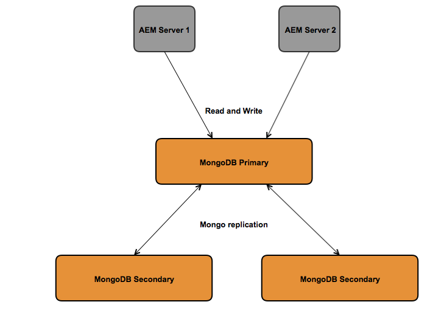
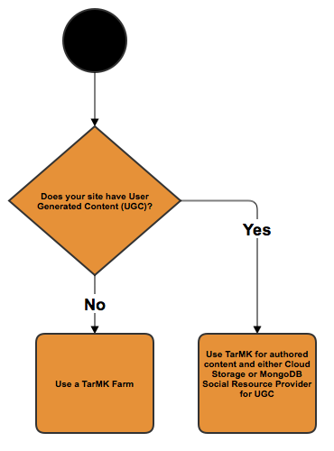

# Rekommenderade distributioner{#recommended-deployments}

>[!NOTE]
>
>Den här sidan hänvisar till rekommenderade topologier för AEM. Mer information om klusterfunktioner och hur du konfigurerar dem finns i [API-dokumentationen för Apache Sling Discovery](https://sling.apache.org/documentation/bundles/discovery-api-and-impl.html).

MicroKernels fungerar som persistencehanterare från och med AEM 6.2. Vilken som passar dina behov beror på syftet med instansen och vilken distributionstyp du överväger.

Exemplen nedan är avsedda att vara en indikation på vad som rekommenderas i de vanligaste AEM.

## Distributionsscenarier {#deployment-scenarios}

### Single tarMK-instans {#single-tarmk-instance}

I det här scenariot körs en enda tarMK-instans på en enda server.

**Det här är standarddistributionen för författarinstanser.**

Fördelarna:

* Enkel
* Smidigt underhåll
* Bra prestanda

Nackdelar:

* Kan inte skalas utanför serverkapacitetens gränser
* Ingen failover-kapacitet

### StjärtMK i kallt läge {#tarmk-cold-standby}

En tarMK-instans fungerar som primär instans. Databasen från den primära databasen replikeras till ett standby-failover-system.

Kylstandbyfunktionen kan också användas som säkerhetskopia eftersom hela databasen hela tiden replikeras till redundansservern. Redundansservern körs i kallt vänteläge, vilket innebär att det bara är HttpReceiver för instansen som körs.

Fördelarna:

* Enkelt
* Underhållbarhet
* Prestanda
* Redundans

Nackdelar:

* Kan inte skalas utanför serverkapacitetens gränser
* En server är inaktiv för det mesta
* Redundansväxlingen är inte automatisk. Den måste identifieras externt innan redundanssystemet kan börja skicka begäranden.

>[!NOTE]
>
>Mer information om hur du konfigurerar AEM med TjärMK Cold Standby finns i [den här](/help/sites-deploying/tarmk-cold-standby.md) artikeln.

>[!NOTE]
>
>Distributionen av vänteläge i Cold Standby i det här exemplet kräver att både den primära instansen och standby-instansen licensieras separat, eftersom det finns en konstant replikering till redundansservern. Mer information om licensiering finns i de allmänna licensvillkoren för [Adobe](https://www.adobe.com/legal/terms/enterprise-licensing.html).

### TARMK Farm {#tarmk-farm}

Flera Oak-instanser körs var och en med en tarMK-instans. TarmMK-databaserna är oberoende och måste synkroniseras.

Att synkronisera databaserna tillhandahålls med det faktum att författarservern publicerar samma innehåll till varje gruppmedlem. Mer information finns i [Replikering](/help/sites-deploying/replication.md).

För AEM Communities replikeras aldrig användargenererat innehåll (UGC). Information om stöd för UGC på en TjärMK-grupp finns i [överväganden för AEM Communities](#considerations-for-aem-communities).

**Det här är standarddistributionen för publiceringsmiljöer.**

Fördelarna:

* Prestanda
* Skalbarhet för läsåtkomst
* Redundans

### Oak Cluster med MongoMK Failover för hög tillgänglighet i ett och samma datacenter {#oak-cluster-with-mongomk-failover-for-high-availability-in-a-single-datacenter}

Detta innebär att flera Oak-instanser får åtkomst till en MongoDB-replikuppsättning i ett enda datacenter, vilket skapar ett aktivt kluster för AEM. Replikuppsättningar i MongoDB används för hög tillgänglighet och redundans vid maskinvaru- eller nätverksfel.

Fördelarna:

* Skala vågrätt med nya AEM
* Hög tillgänglighet, redundans och automatiserad failover av datalager

Nackdelar:

* Prestanda kan vara lägre än med tarMK för vissa scenarier

### Oak Cluster med MongoMK Failover över flera datacentraler {#oak-cluster-with-mongomk-failover-across-multiple-datacenters}

Detta innebär att flera Oak-instanser får åtkomst till en MongoDB-replikuppsättning i flera datacenter, vilket skapar ett aktivt kluster för AEM. Med flera datacenter ger MongoDB-replikering samma höga tillgänglighet och redundans, men nu även möjligheten att hantera ett datacenteravbrott.

Fördelarna:

* Skala vågrätt med nya AEM
* Hög tillgänglighet, redundans och automatiserad failover för datalager (inklusive datacenteravbrott)

>[!NOTE]
>
>I diagrammet ovan visas AEM Server 3 och AEM Server 4 med en inaktiv status som förutsätter en nätverksfördröjning mellan de AEM servrarna i datacenter 2 och den primära MongoDB-noden i datacenter 1 som är högre än vad som krävs [här](/help/sites-deploying/aem-with-mongodb.md#checklists). Om den maximala fördröjningen är kompatibel med kraven, till exempel genom användning av tillgänglighetszoner, kan AEM i Data Center 2 också vara aktiva och skapa ett aktivt AEM över flera datacenter.

>[!NOTE]
>
>Mer information om MongoDB-arkitektoniska koncept som beskrivs i det här avsnittet finns i [MongoDB-replikering](https://docs.mongodb.org/manual/replication/).

## Mikrokärnor: vilka som ska användas {#microkernels-which-one-to-use}

Den grundläggande regel som måste beaktas när man väljer mellan de två tillgängliga mikrokärnor är att tarMK är utformad för prestanda, medan MongoMK används för skalbarhet.

Du kan använda de här beslutsmatriserna för att fastställa vilken typ av distribution som passar dina behov bäst.

Adobe rekommenderar starkt att TarmMK är standardbeständighetstekniken som används av kunder i alla distributionsscenarier, både för AEM Author och Publish, utom i de fall som beskrivs nedan.

### Undantag för att välja AEM MongoMK över tarMK för författarinstanser {#exceptions-for-choosing-aem-mongomk-over-tarmk-on-author-instances}

Den främsta anledningen till att du väljer MongoMK-beständighetsbackend framför tarMK är att skalförändra instanserna vågrätt. Det innebär att två eller flera aktiva författarinstanser alltid körs och att MongoDB används som beständigt lagringssystem. Behovet av att köra mer än en författarinstans beror i allmänhet på att processorn och minneskapaciteten på en enda server, som stöder alla samtidiga redigeringsaktiviteter, inte längre är hållbara.

Det är nästan omöjligt att förutsäga exakt vilken samtidighetsmodell som kommer att bli när en ny webbplats publiceras. Adobe rekommenderar därför att du tar hänsyn till följande kriterier när du utvärderar om du ska använda MongoMK och två eller flera Author active-noder:

1. Antal namngivna användare som är anslutna under en dag: i tusental eller mer.
1. Antal samtidiga användare: i hundratals eller fler.
1. Volym av tillgångsförslag per dag: i hundratusentals eller fler.
1. Antal sidredigeringar per dag: i hundratusentals eller fler (inklusive automatiserade uppdateringar via Multi Site Manager eller nyhetsfeedsförslag).
1. Antal sökningar per dag: tiotusentals eller fler.

>[!NOTE]
>
>Tough Day kan användas för att utvärdera prestanda för kundens program i samband med den maskinvarukonfiguration som distribueras. Mer information om verktyget finns [här](/help/sites-developing/tough-day.md).

En minimidistribution med MongoDB omfattar vanligtvis följande topologi:

* En MongoDB-replikuppsättning bestående av en primär nod, två sekundära noder där var och en av MongoDB-instanserna körs i en tillgänglighetszon med en latens på mindre än 15 millisekunder över varje nod.
* Ett kluster med författarinstanser med en ledarnod, en icke-ledarnod och båda är aktiva samtidigt, där var och en av författarinstanserna körs i varje datacentral, där den primära och sekundära instansen MongoDB körs.

Vi rekommenderar dessutom att du konfigurerar datalagret i ett delat filsystem eller i Amazon S3 så att resurserna eller binärfilerna inte lagras i MongoDB. Detta ger optimala prestanda i driftsättningen.

En av de extra fördelarna med att distribuera en MongoDB-replikuppsättning med ett kluster med två eller flera författarinstanser är att ha ett automatiskt återställningsscenario med minimalt driftstopp om det finns författarinstanser, MongoDB-replikering eller ett fullständigt datacenterfel. Valet av MongoMK framför tarMK bör dock inte enbart styras av återhämtningskravet, eftersom tarMK också kan tillhandahålla en minimalt låg driftstoppslösning med en kontrollerad failover-mekanism.

Om ovanstående kriterier inte förväntas vara uppfyllda under de första 18 månaderna av distributionen bör du först distribuera AEM med hjälp av tarMK, sedan utvärdera konfigurationen vid ett senare tillfälle när ovanstående villkor är uppfyllda och slutligen avgöra om du ska stanna kvar på tarMK eller migrera till MongoMK.

### Undantag för att välja AEM MongoMK över tarMK på Publish-instanser {#exceptions-for-choosing-aem-mongomk-over-tarmk-on-publish-instances}

Du bör inte distribuera MongoMK för publiceringsinstanser. Distributionsskiktet distribueras nästan alltid som en grupp fullständigt oberoende publiceringsinstanser som kör tarMK, som synkroniseras genom att innehåll från författarinstanserna replikeras. Denna&quot;delade ingenting&quot;-arkitektur, som är rätt för publiceringsinstanserna, gör att publiceringsnivån kan skalas vågrätt på ett linjärt sätt. Servergruppstopologin ger också fördelen att använda uppdateringar eller uppgraderingar för att publicera instanser rullande, så att inga ändringar i publiceringsnivån kräver några driftavbrott.

Detta gäller inte AEM Communities som använder MongoMK-kluster på publiceringsnivån när det finns fler än en utgivare. Om du väljer JSRP (se [Community Content Storage](/help/communities/working-with-srp.md)) är ett MongoMK-kluster lämpligt, precis som alla publiceringssidkluster oavsett vald MK, till exempel MongoDB eller RDB.

### Förutsättningar och Recommendations när AEM distribueras med MongoMK {#prerequisites-and-recommendations-when-deploying-aem-with-mongomk}

En uppsättning förutsättningar och rekommendationer är tillgängliga om du överväger en MongoMK-distribution för AEM:

**Obligatoriska krav för MongoDB-distributioner:**

1. MongoDB:s driftsättningsarkitektur och storlek måste ingå i projektimplementeringen med hjälp av Adobe Consulting- eller MongoDB-arkitekter som är bekanta med AEM.
1. MongoDB-expertis måste finnas i partner- eller kundteamet för att man ska kunna upprätthålla och underhålla en befintlig eller ny MongoDB-miljö.
1. Du kan välja att driftsätta den kommersiella versionen eller versionen med öppen källkod av MongoDB (AEM stöder båda), men du måste köpa ett MongoDB Maintenance and Support-avtal direkt från MongoDB Inc.
1. De övergripande arkitekturerna och infrastrukturerna för AEM och MongoDB bör vara väl definierade och validerade av en Adobe AEM Architect.
1. Granska supportmodellen för AEM distributioner som inkluderar MongoDB.

**Starka rekommendationer för MongoDB-distributioner:**

* Läs MongoDB för Adobe Experience Manager [artikel](https://www.mongodb.com/lp/contact/mongodb-adobe-experience-manager);
* Granska MongoDB-produktionen [checklista](https://docs.mongodb.org/manual/administration/production-checklist/);
* Delta i en certifieringsklass på MongoDB som är tillgänglig online [här](https://university.mongodb.com/).

>[!NOTE]
>
>Kontakta [Adobe kundtjänst](https://helpx.adobe.com/marketing-cloud/contact-support.html) om du har frågor om dessa riktlinjer, villkor och rekommendationer.

### Överväganden för AEM Communities {#considerations-for-aem-communities}

För webbplatser som planerar att distribuera [AEM Communities](/help/communities/overview.md) rekommenderar vi att du [väljer en distribution](/help/communities/working-with-srp.md#characteristicsofstorageoptions) som är optimerad för hantering av UGC som publicerats av communitymedlemmar från publiceringsmiljön.

Genom att använda en [gemensam lagringsplats](/help/communities/working-with-srp.md) behöver inte UGC replikeras mellan författaren och andra publiceringsinstanser för att få en konsekvent vy över UGC.

Nedan finns en uppsättning beslutsmatriser som kan hjälpa dig att välja den bästa typen av beständighet för din distribution:

#### Välja distributionstyp för författarinstanser {#choosing-the-deployment-type-for-author-instances}

#### Välja distributionstyp för publiceringsinstanser {#choosing-the-deployment-type-for-publish-instances}

>[!NOTE]
>
>MongoDB är en tredjepartsprogramvara och ingår inte i AEM licenspaket. Mer information finns på sidan [MongoDB-licensieringsprincip](https://www.mongodb.org/about/licensing/).
>
>För att få ut så mycket som möjligt av er AEM rekommenderar Adobe licensiering av MongoDB Enterprise-versionen och att du får tillgång till professionell support.
>
>Licensen innehåller en standarduppsättning av repliker, som består av en primär och två sekundära instanser som kan användas för antingen författaren eller publiceringsdistributionerna.
>
>Om du vill köra både författaren och publicera på MongoDB måste du köpa två separata licenser.
>
>Mer information finns på sidan [MongoDB för Adobe Experience Manager](https://www.mongodb.com/lp/contact/mongodb-adobe-experience-manager).
