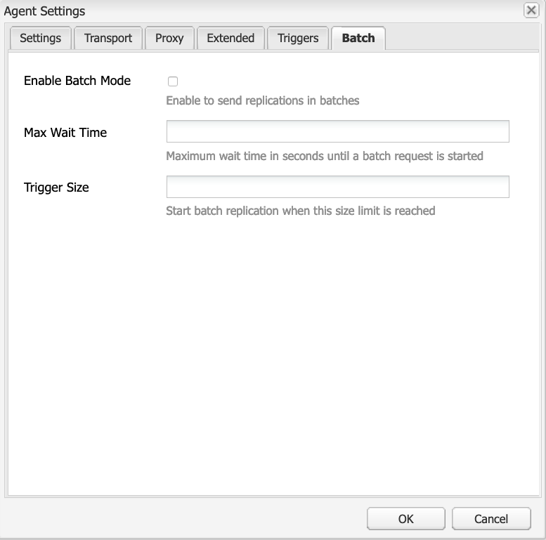

# Replikering{#replication}

Replikeringsagenter är centrala för Adobe Experience Manager (AEM) eftersom den mekanism som används för att:

* [Publicera (aktivera)](/help/sites-authoring/publishing-pages.md#activatingcontent) innehåll från författare till publiceringsmiljö.
* Rensa innehåll explicit från Dispatcher-cachen.
* Returnera användarindata (till exempel formulärindata) från publiceringsmiljön till författarmiljön (under kontroll av författarmiljön).

Begäranden [köad](/help/sites-deploying/osgi-configuration-settings.md#apacheslingjobeventhandler) till lämpligt ombud för behandling.

>[!NOTE]
>
>Användardata (användare, användargrupper och användarprofiler) replikeras inte mellan författare- och publiceringsinstanser.
>
>För flera publiceringsinstanser distribueras användardata när [Användarsynkronisering](/help/sites-administering/sync.md) är aktiverat.

## Replikerar från författare till publicering {#replicating-from-author-to-publish}

Replikering till en Publish-instans eller Dispatcher utförs i flera steg:

* författaren begär att visst innehåll ska publiceras (aktiveras). Detta kan initieras av en manuell begäran eller av automatiska utlösare som har förkonfigurerats.
* begäran skickas till rätt standardreplikeringsagent. En miljö kan ha flera standardagenter som alltid är valda för sådana åtgärder.
* replikeringsagenten&quot;paketerar&quot; innehållet och placerar det i replikeringskön.
* på fliken Webbplatser [färgad statusindikator](/help/sites-authoring/publishing-pages.md#determiningpagepublicationstatus) är inställt för de enskilda sidorna.
* innehållet tas bort från kön och transporteras till publiceringsmiljön med det konfigurerade protokollet, vanligtvis HTTP.
* en serverlet i publiceringsmiljön tar emot begäran och publicerar det mottagna innehållet. Standardserverpaketet är `https://localhost:4503/bin/receive`.

* flera redigerings- och publiceringsmiljöer kan konfigureras.

### Replikerar från publicera till författare {#replicating-from-publish-to-author}

Vissa funktioner tillåter användare att ange data i en Publish-instans.

Ibland behövs en typ av replikering som kallas omvänd replikering för att returnera dessa data till redigeringsmiljön från vilken de distribueras till andra publiceringsmiljöer. Av säkerhetsskäl måste all trafik från publicering till redigeringsmiljön vara strikt kontrollerad.

Omvänd replikering använder en agent i publiceringsmiljön som refererar till redigeringsmiljön. Den här agenten placerar data i en utkorg. Utkorgen matchas med replikeringslyssnare i redigeringsmiljön. Avlyssnarna avsöker utkorgarna för att samla in alla data som anges och sedan distribuera dem efter behov. Detta garanterar att redigeringsmiljön styr all trafik.

I andra fall, t.ex. för communityfunktioner (t.ex. forum, bloggar, kommentarer och granskningar), är mängden användargenererat innehåll (UGC) som anges i publiceringsmiljön svår att effektivt synkronisera mellan AEM instanser med hjälp av replikering.

AEM [Communities](/help/communities/overview.md) använder aldrig replikering för UGC. Distributionen för Communities kräver i stället en gemensam butik för UGC (se [Community-innehåll](/help/communities/working-with-srp.md)).

### Replikering - utanför lådan {#replication-out-of-the-box}

Webbplatsen för webbutiker som ingår i en standardinstallation av AEM kan användas för att illustrera replikering.

Om du vill följa det här exemplet och använda standardreplikeringsagenterna [installera AEM](/help/sites-deploying/deploy.md) med:

* författarmiljön på porten `4502`
* publiceringsmiljön på porten `4503`

>[!NOTE]
>
>Aktiverad som standard:
>
>* Agenter på författare : Standardagent (publicera)
>
>Inaktiverat som standard (från och med AEM 6.1):
>
>* Agenter på författare: Omvänd replikeringsagent (publish_reverse)
>* Agenter vid publicering: Omvänd replikering (utkorg)
>
>Om du vill kontrollera status för agenten eller kön använder du **verktyg** konsol.
>Se [Övervaka replikeringsagenter](#monitoring-your-replication-agents).

#### Replikering (författare att publicera) {#replication-author-to-publish}

1. Gå till supportsidan i redigeringsmiljön.
   **https://localhost:4502/content/we-retail/us/en/experience.html** `<pi>`
1. Redigera sidan så att du kan lägga till ny text.
1. **Aktivera sida** så att du kan publicera ändringarna.
1. Öppna supportsidan i publiceringsmiljön:
   **https://localhost:4503/content/we-retail/us/en/experience.html**
1. Du kan nu se ändringarna som du har angett för Författare.

Den här replikeringen utförs från redigeringsmiljön av:

* **Standardagent (publicera)**
Den här agenten replikerar innehåll till standardpubliceringsinstansen.
Information om detta (konfiguration och loggar) finns på verktygskonsolen i redigeringsmiljön, eller:
  `https://localhost:4502/etc/replication/agents.author/publish.html`.

#### Replikeringsagenter - utanför lådan {#replication-agents-out-of-the-box}

Följande agenter är tillgängliga i en AEM standardinstallation:

* [Standardagent](#replication-author-to-publish)
Används för replikering från författare till publicering.

* Dispatcher Flush Detta används för att hantera Dispatcher-cachen. Se [Dispatcher Cache har inte verifierats från redigeringsmiljön](https://experienceleague.adobe.com/docs/experience-manager-dispatcher/using/configuring/page-invalidate.html#invalidating-dispatcher-cache-from-the-authoring-environment) och [Invaliderar Dispatcher Cache från en publiceringsinstans](https://experienceleague.adobe.com/docs/experience-manager-dispatcher/using/configuring/page-invalidate.html#invalidating-dispatcher-cache-from-a-publishing-instance) för mer information.

* [Omvänd replikering](#reverse-replication-publish-to-author)
Används för replikering från Publicera till Författare. Omvänd replikering används inte för communityfunktioner som forum, bloggar och kommentarer. Den är inaktiverad eftersom utkorgen inte är aktiverad. Användning av omvänd replikering kräver anpassad konfiguration.

* Statisk agent Detta är en&quot;agent som lagrar en statisk representation av en nod i filsystemet&quot;.
Med standardinställningarna lagras till exempel innehållssidor och dammresurser under `/tmp`, antingen som HTML eller lämpligt resursformat. Se `Settings` och `Rules` -flikar för konfigurationen.
Detta begärdes så att innehållet kan ses när sidan begärs direkt från programservern. Detta är en specialagent och (troligen) krävs inte för de flesta instanser.

## Replikeringsagenter - konfigurationsparametrar {#replication-agents-configuration-parameters}

När du konfigurerar en replikeringsagent från verktygskonsolen är fyra flikar tillgängliga i dialogrutan:

### Inställningar {#settings}

* **Namn**

  Ett unikt namn för replikeringsagenten.

* **Beskrivning**

  En beskrivning av syftet med denna replikeringsagent.

* **Aktiverad**

  Anger om replikeringsagenten är aktiverad.

  När agenten är **aktiverad** visas kön som:

   * **Aktiv** när objekt bearbetas.
   * **Ledig** när kön är tom.
   * **Blockerad** när objekten finns i kön, men inte kan bearbetas, till exempel när mottagande kö är inaktiverad.

* **Serialiseringstyp**

  Typ av serialisering:

   * **Standard**: Ange om agenten ska väljas automatiskt.
   * **Dispatcher Flush**: Välj det här alternativet om agenten ska användas för tömning av Dispatcher-cachen.

* **Återförsöksfördröjning**

  Fördröjningen (i millisekunder) mellan två försök om ett problem skulle uppstå.

  Standard: `60000`

* **Användar-ID för agent**

  Beroende på miljön använder agenten det här användarkontot för att:

   * samla in och paketera innehåll från redigeringsmiljön
   * skapa och skriva innehåll i publiceringsmiljön

  Lämna det här fältet tomt om du vill använda systemanvändarkontot (det konto som definierats i slussen som administratörsanvändare). Som standard är det här `admin`).

  >[!CAUTION]
  >
  >För en agent i författarmiljön är det här kontot *måste* har läsåtkomst till alla sökvägar som du vill ha replikerade.

  >[!CAUTION]
  >
  >För en agent i publiceringsmiljön är det här kontot *måste* har den behörighet att skapa/skriva som krävs för att replikera innehållet.

  >[!NOTE]
  >
  >Detta kan användas som en mekanism för att välja specifikt innehåll för replikering.

* **Loggnivå**

  Anger den detaljnivå som ska användas för loggmeddelanden.

   * `Error`: endast fel loggas
   * `Info`: fel, varningar och andra informationsmeddelanden loggas
   * `Debug`: en hög detaljnivå används i meddelandena, främst i felsökningssyfte

  Standard: `Info`

* **Använd för omvänd replikering**

  Anger om den här agenten används för omvänd replikering, returnerar användarindata från publicerings- till författarmiljön.

* **Aliasuppdatering**

  Om du väljer det här alternativet aktiveras ogiltiga aliassökvägar eller ogiltiga sökvägar för Dispatcher. Se även [Konfigurera en agent för utskickstömning](/help/sites-deploying/replication.md#configuring-a-dispatcher-flush-agent).

#### Transport {#transport}

* **URI**

  Detta anger den mottagande servern på målplatsen. Du kan särskilt ange värdnamnet (eller aliaset) och kontextsökvägen till målinstansen här.

  Till exempel:

   * En standardagent kan replikeras till `https://localhost:4503/bin/receive`
   * En agent för utskickstömning kan replikeras till `https://localhost:8000/dispatcher/invalidate.cache`

  Det protokoll som anges här (HTTP eller HTTPS) avgör transportmetoden.

  För Dispatcher Flush-agenter används URI-egenskapen endast om du använder sökvägsbaserade virtualhost-poster för att skilja mellan grupper, använder du det här fältet för att göra gruppen ogiltig. Servergrupp #1 har till exempel en virtuell värd för `www.mysite.com/path1/*` och grupp 2 har en virtuell värd för `www.mysite.com/path2/*`. Du kan använda en URL med `/path1/invalidate.cache` för att rikta in sig på den första gården och `/path2/invalidate.cache` för den andra gruppen.

* **Användare**

  Användarnamnet för kontot som ska användas för att komma åt målet.

* **Lösenord**

  Lösenord för kontot som ska användas för att komma åt målet.

* **NTLM-domän**

  Domän för NTML-autentisering.

* **NTLM-värd**

  Värd för NTML-autentisering.

* **Aktivera relaxerad SSL**

  Aktivera om du vill att självcertifierade SSL-certifikat ska godkännas.

* **Tillåt utgångna certifikat**

  Aktivera om du vill att utgångna SSL-certifikat ska godkännas.

#### Proxy {#proxy}

Följande inställningar behövs bara om en proxy behövs:

* **Proxyvärd**

  Värdnamn för proxyn som används för transport.

* **Proxyport**

  Proxyns port.

* **Proxyanvändare**

  Användarnamnet för kontot som ska användas.

* **Proxylösenord**

  Lösenord för kontot som ska användas.

* **Proxy NTLM-domän**

  NTLM-proxydomänen.

* **Proxy NTLM-värd**

  NTLM-proxydomänen.

#### Utökad {#extended}

* **Gränssnitt**

  Här kan du definiera socketgränssnittet som du vill binda till.

  Detta anger den lokala adress som ska användas när anslutningar skapas. Om detta inte anges används standardadressen. Detta är användbart när du vill ange vilket gränssnitt som ska användas på system med flera hem eller kluster.

* **HTTP-metod**

  HTTP-metoden som ska användas.

  För en Dispatcher Flush-agent är detta nästan alltid GET och bör inte ändras (POST är ett annat möjligt värde).

* **HTTP-huvuden**

  Dessa används för Dispatcher Flush-agenter och anger element som måste tömmas.

  För en Dispatcher Flush-agent behöver de tre standardposterna inte ändras:

   * `CQ-Action:{action}`
   * `CQ-Handle:{path}`
   * `CQ-Path:{path}`

  Dessa används, beroende på vad som är lämpligt, för att ange vilken åtgärd som ska användas när handtaget eller banan töms. Underparametrarna är dynamiska:

   * `{action}` anger en replikeringsåtgärd

   * `{path}` anger en bana

  De ersätts av den sökväg/åtgärd som är relevant för begäran och behöver därför inte&quot;hårdkodas&quot;:

  >[!NOTE]
  >
  >Om du har installerat AEM i en annan kontext än den rekommenderade måste du registrera kontexten i HTTP-rubrikerna. Till exempel:
  >`CQ-Handle:/<*yourContext*>{path}`

* **Stäng anslutning**

  Aktivera så att du kan stänga anslutningen efter varje begäran.

* **Timeout för anslutning**

  Timeout (i millisekunder) som ska användas vid försök att upprätta en anslutning.

* **Tidsgräns för socket**

  Timeout (i millisekunder) som ska användas vid väntan på trafik efter att en anslutning har upprättats.

* **Protokollversion**

  Protokollets version. Till exempel: `1.0` för HTTP/1.0.

#### Utlösare {#triggers}

De här inställningarna används för att definiera utlösare för automatiserad replikering:

* **Ignorera standard**

  Om det här alternativet är markerat utesluts agenten från standardreplikeringen. Det innebär att den inte används om en innehållsförfattare utfärdar en replikeringsåtgärd.

* **Vid ändring**

  Här aktiveras en replikering från den här agenten automatiskt när en sida ändras. Används för Dispatcher Flush-agenter, men även för omvänd replikering.

* **Vid distribution**

  Om det här alternativet är markerat kopieras automatiskt allt innehåll som är markerat för distribution när det ändras.

* **On-/Offtime uppnådd**

  Detta utlöser automatisk replikering (för att aktivera eller inaktivera en sida efter behov) när de tider eller förskjutningar som har definierats för en sida inträffar. Detta används främst för Dispatcher Flush-agenter.

* **Vid mottagning**

  Om det här alternativet är markerat replikeras agentkedjorna när replikeringshändelser tas emot.

* **Ingen statusuppdatering**

  När det här alternativet är markerat tvingar agenten inte fram någon uppdatering av replikeringsstatusen.

* **Ingen versionshantering**

  När det här alternativet är markerat tvingar agenten inte fram versionshantering av aktiverade sidor.

## Konfigurera replikeringsagenter {#configuring-your-replication-agents}

Mer information om hur du ansluter replikeringsagenter till publiceringsinstansen med MSSL finns i [Replikering med ömsesidig SSL](/help/sites-deploying/mssl-replication.md).

### Konfigurera dina replikeringsagenter från författarmiljön {#configuring-your-replication-agents-from-the-author-environment}

På fliken Verktyg i redigeringsmiljön kan du konfigurera replikeringsagenter som finns i antingen författarmiljön (**Agenter på författare**) eller publiceringsmiljön (**Agenter vid publicering**). Följande procedurer illustrerar konfigurationen av en agent för författarmiljön, men kan användas för båda.

>[!NOTE]
>
>När en Dispatcher hanterar HTTP-begäranden för författare- eller publiceringsinstanser måste HTTP-begäran från replikeringsagenten innehålla PATH-huvudet. Utöver följande procedur måste du lägga till PATH-huvudet i listan med klientrubriker. Se [/clientheaders (klientrubriker)](https://experienceleague.adobe.com/docs/experience-manager-dispatcher/using/configuring/dispatcher-configuration.html#specifying-the-http-headers-to-pass-through-clientheaders).
>

1. Öppna **verktyg** AEM.
1. Klicka **Replikering** (vänster ruta för att öppna mappen).
1. Dubbelklicka **Agenter på författare** (antingen vänster eller höger ruta).
1. Klicka på lämpligt agentnamn (som är en länk) för att visa detaljerad information om agenten.
1. Klicka **Redigera** så att konfigurationsdialogrutan öppnas:

   

1. De angivna värdena ska vara tillräckliga för en standardinstallation. Om du gör ändringar klickar du på **OK** för att spara dem (se [Replikeringsagenter - konfigurationsparametrar](#replication-agents-configuration-parameters) för information om enskilda parametrar).

>[!NOTE]
>
>En standardinstallation av AEM anger `admin` som användare för transportreferenser inom standardreplikeringsagenterna.
>
>Detta bör ändras till ett platsspecifikt replikeringsanvändarkonto med behörighet att replikera de nödvändiga sökvägarna.

### Konfigurerar omvänd replikering {#configuring-reverse-replication}

Omvänd replikering används för att hämta användarinnehåll som genererats i en Publish-instans tillbaka till en Author-instans. Detta används ofta för funktioner som undersökningar och registreringsformulär.

Av säkerhetsskäl tillåter de flesta nätverkstopologier inte anslutningar *från* &quot;Demilitarized Zone&quot; (ett undernätverk som exponerar de externa tjänsterna för ett icke-betrott nätverk som Internet).

Eftersom publiceringsmiljön vanligtvis finns i DMZ måste anslutningen initieras från Author-instansen för att innehållet ska kunna skickas tillbaka till redigeringsmiljön. Detta görs med:

* en *utkorg* i publiceringsmiljön där innehållet placeras.
* en agent (publicera) i redigeringsmiljön som regelbundet frågar efter nytt innehåll i utkorgen.

>[!NOTE]
>
>För AEM [Communities](/help/communities/overview.md)används inte replikering för användargenererat innehåll i en Publish-instans. Se [Community-innehåll](/help/communities/working-with-srp.md).

För att göra detta behöver du:

**En omvänd replikeringsagent i redigeringsmiljön** - Fungerar som en aktiv komponent för att samla in information från utkorgen i publiceringsmiljön:

Om du vill använda omvänd replikering kontrollerar du att agenten är aktiverad.

**En omvänd replikeringsagent i publiceringsmiljön (en utkorg)** - Det passiva elementet fungerar som en&quot;utkorg&quot;. Användarindata placeras här, från vilket agenten samlar in dem i författarmiljön.

### Konfigurera replikering för flera publiceringsinstanser {#configuring-replication-for-multiple-publish-instances}

>[!NOTE]
>
>Endast innehåll replikeras - användardata är inte det (användare, användargrupper och användarprofiler).
>
>Om du vill synkronisera användardata över flera publiceringsinstanser aktiverar du [Användarsynkronisering](/help/sites-administering/sync.md).

Efter installationen har en standardagent redan konfigurerats för replikering av innehåll till en Publish-instans som körs på port 4503 på den lokala värden.

Om du vill konfigurera replikering av innehåll för ytterligare en Publish-instans skapar och konfigurerar du en ny replikeringsagent:

1. Öppna **verktyg** AEM.
1. Välj **Replikering** sedan **Agenter på författare** till vänster.
1. Välj **Nytt...**.
1. Ange **Titel** och **Namn** väljer **Replikeringsagent**.
1. Klicka **Skapa** så att du kan skapa agenten.
1. Dubbelklicka på det nya agentobjektet så att konfigurationspanelen öppnas.
1. Klicka **Redigera** - **Agentinställningar** öppnas - **Serialiseringstyp** är redan definierad som Standard. Detta måste förbli så.

   * I **Inställningar** tab:

      * Aktivera **Aktiverad**.
      * Ange en **Beskrivning**.
      * Ange **Återförsöksfördröjning** till `60000`.

      * Lämna **Serialiseringstyp** as `Default`.

   * I **Transport** tab:

      * Ange den URI som krävs för den nya Publish-instansen, till exempel
        `https://localhost:4504/bin/receive`.

      * Ange det platsspecifika användarkonto som används för replikering.
      * Du kan konfigurera andra parametrar efter behov.

1. Klicka **OK**.

Du kan sedan testa åtgärden genom att uppdatera och sedan publicera en sida i redigeringsmiljön.

Uppdateringarna visas på alla publiceringsinstanser som har konfigurerats enligt ovan.

Om du får problem kan du kontrollera loggarna på författarinstansen. Beroende på vilken detaljnivå som krävs kan du även ange **Loggnivå** till `Debug` med **Agentinställningar** som ovan.

>[!NOTE]
>
>Detta kan kombineras med [Användar-ID för agent](#agentuserid) om du vill välja ett annat innehåll som ska replikeras till de enskilda publiceringsmiljöerna. För varje publiceringsmiljö:
>
>1. Konfigurera en replikeringsagent för replikering till den publiceringsmiljön.
>1. Konfigurera ett användarkonto med de åtkomsträttigheter som krävs för att läsa innehållet som replikeras till den specifika publiceringsmiljön.
>1. Tilldela användarkontot som **Användar-ID för agent** för replikeringsagenten.
>

### Konfigurera en agent för utskickstömning {#configuring-a-dispatcher-flush-agent}

Standardagenter ingår i installationen. En viss konfiguration behövs dock fortfarande, och det samma gäller om du definierar en ny agent:

1. Öppna **verktyg** AEM.
1. Klicka **Distribution**.
1. Välj **Replikering** och sedan **Agenter vid publicering**.
1. Dubbelklicka på **Dispatcher Flush** för att öppna översikten.
1. Klicka **Redigera** - **Agentinställningar** öppnas:

   * I **Inställningar** tab:

      * Aktivera **Aktiverad**.
      * Ange en **Beskrivning**.
      * Lämna **Serialiseringstyp** as `Dispatcher Flush`eller ange det som sådant om du skapar en agent.

      * (valfritt) Välj **Aliasuppdatering** om du vill aktivera aliasbegäran eller ogiltighetsbegäran för ogiltighetssökvägen till Dispatcher.

   * I **Transport** tab:

      * Ange den URI som krävs för den nya Publish-instansen, till exempel
        `https://localhost:80/dispatcher/invalidate.cache`.

      * Ange det platsspecifika användarkonto som används för replikering.
      * Du kan konfigurera andra parametrar efter behov.

   För Dispatcher Flush-agenter används URI-egenskapen endast om du använder sökvägsbaserade virtualhost-poster för att skilja mellan grupper, använder du det här fältet för att göra gruppen ogiltig. Servergrupp #1 har till exempel en virtuell värd för `www.mysite.com/path1/*` och grupp 2 har en virtuell värd för `www.mysite.com/path2/*`. Du kan använda en URL med `/path1/invalidate.cache` för att rikta in sig på den första gården och `/path2/invalidate.cache` för den andra gruppen.

   >[!NOTE]
   >
   >Om du har installerat AEM i en annan kontext än den som rekommenderas konfigurerar du [HTTP-huvuden](#extended) i **Utökad** -fliken.

1. Klicka **OK**.
1. Återgå till **verktyg** här kan du **Aktivera** den **Dispatcher Flush** agent (**Agenter vid publicering**).

The **Dispatcher Flush** replikeringsagenten är inte aktiv på författaren. Du kan komma åt samma sida i publiceringsmiljön med motsvarande URI, till exempel `https://localhost:4503/etc/replication/agents.publish/flush.html`.

### Kontrollera åtkomst till replikeringsagenter {#controlling-access-to-replication-agents}

Åtkomst till de sidor som används för att konfigurera replikeringsagenterna kan styras med användar- och/eller gruppsidesbehörigheter på `etc/replication` nod.

>[!NOTE]
>
>Inställningen påverkar inte användare som replikerar innehåll (t.ex. från webbplatskonsolen eller sidosparsalternativet). Replikeringsramverket använder inte den aktuella användarens användarsession för att komma åt replikeringsagenter när sidor replikeras.

### Konfigurera dina replikeringsagenter från CRXDE Lite {#configuring-your-replication-agents-from-crxde-lite}

>[!NOTE]
>
>Det går bara att skapa replikeringsagenter i `/etc/replication` lagringsplats. Detta krävs för att de tillhörande åtkomstkontrollistorna ska hanteras på rätt sätt. Om du skapar en replikeringsagent på en annan plats i trädet kan det leda till obehörig åtkomst.

Olika parametrar för replikeringsagenterna kan konfigureras med CRXDE Lite.

Om du navigerar till `/etc/replication`visas följande tre noder:

* `agents.author`
* `agents.publish`
* `treeactivation`

De två `agents` innehåller konfigurationsinformation om lämplig miljö och är bara aktiv när den miljön körs. Till exempel: `agents.publish` används endast i publiceringsmiljön. På följande skärmbild visas Publish Agent i redigeringsmiljön, som i AEM WCM:

## Övervaka replikeringsagenter {#monitoring-your-replication-agents}

Så här övervakar du en replikeringsagent:

1. Öppna **verktyg** AEM.
1. Klicka **Replikering**.
1. Dubbelklicka på länken till agenterna för lämplig miljö (antingen vänster eller höger ruta). Till exempel: **Agenter på författare**.

   I det resulterande fönstret visas en översikt över alla dina replikeringsagenter för redigeringsmiljön, inklusive mål och status.

1. Klicka på lämpligt agentnamn (som är en länk) för att visa detaljerad information om agenten:

   

   Här kan du göra följande:

   * Se om agenten är aktiverad.
   * Se målet för alla replikeringar.
   * Kontrollera om replikeringskön är aktiv (aktiverad).
   * Se om det finns några objekt i kön.
   * **Uppdatera** eller **Rensa** för att uppdatera visningen av köposter. Detta gör att du lättare ser att objekt kommer in i och lämnar kön.

   * **Visa logg** för att få åtkomst till loggen över eventuella åtgärder från replikeringsagenten.
   * **Testanslutning** till målinstansen.
   * **Tvinga återförsök** på alla köobjekt, om det behövs.

   >[!CAUTION]
   >
   >Använd inte länken Testa anslutning för den omvända replikeringsutkorgen på en publiceringsinstans.
   >
   >
   >Om ett replikeringstest utförs för en Utkorgskö bearbetas alla objekt som är äldre än testreplikeringen om med varje omvänd replikering.
   >
   >
   >Om sådana objekt finns i en kö kan de hittas med följande XPath JCR-fråga och bör tas bort.
   >
   >
   >`/jcr:root/var/replication/outbox//*[@cq:repActionType='TEST']`

## Batchreplikering {#batch-replication}

Gruppreplikeringen replikerar inte enskilda sidor eller resurser, men väntar på att det första tröskelvärdet för de två sidorna, baserat på tid eller storlek, ska aktiveras.

Därefter paketeras alla replikeringsobjekt i ett paket som sedan replikeras som en enda fil till utgivaren.

Publisher packar upp alla objekt, sparar dem och rapporterar tillbaka till författaren.

### Konfigurerar batchreplikering {#configuring-batch-replication}

1. Gå till `http://serveraddress:serverport/siteadmin`
1. Tryck på **[!UICONTROL Tools]** ikonen längst upp på skärmen
1. Från vänster navigeringsspår, gå till **[!UICONTROL Replication - Agents on Author]** och dubbelklicka **[!UICONTROL Default Agent]**.
   * Du kan även nå standardagenten för publiceringsreplikering genom att gå direkt till `http://serveraddress:serverport/etc/replication/agents.author/publish.html`
1. Tryck på **[!UICONTROL Edit]** ovanför replikeringskön.
1. Gå till **[!UICONTROL Batch]** tab:
   
1. Konfigurera agenten.

### Parametrar {#parameters}

* `[!UICONTROL Enable Batch Mode]` - aktiverar eller inaktiverar batchreplikeringsläge
* `[!UICONTROL Max Wait Time]` - Maximal väntetid i sekunder tills en gruppbegäran startas. Standardvärdet är 2 sekunder.
* `[!UICONTROL Trigger Size]` - Startar batchreplikering när den här storleksgränsen överskrids

## Ytterligare resurser {#additional-resources}

Mer information om felsökning finns i [Felsökning av replikering](/help/sites-deploying/troubleshoot-rep.md) sida.
