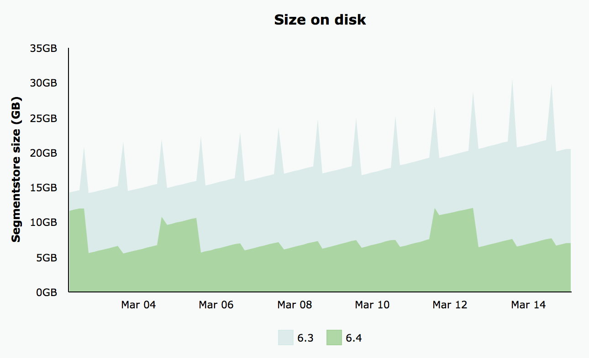

# Revision Cleanup{#revision-cleanup}

## Introduktion {#introduction}

Varje uppdatering av databasen skapar en ny innehållsrevision. Det innebär att databasstorleken ökar för varje uppdatering. För att undvika okontrollerad databastillväxt måste gamla ändringar rensas bort för att frigöra diskutrymme. Den här underhållsfunktionen kallas Revision Cleanup. Det har funnits som en offlinerutrutin sedan AEM 6.0.

Med AEM 6.3 introducerades en onlineversion av den här funktionen som kallas Online Revision Cleanup. Jämfört med Offline Revision Cleanup, där AEM-instansen måste stängas, kan Online Revision Cleanup köras när AEM-instansen är online. Rensa onlineändringar är aktiverat som standard och det är det rekommenderade sättet att rensa en revision.

**Obs**: En introduktion [finns i videon](https://helpx.adobe.com/experience-manager/kt/platform-repository/using/revision-cleanup-technical-video-use.html) och information om hur du använder funktionen för rensning av onlineversioner.

Rensningsprocessen består av tre faser: Uppskattning **,** komprimering **och** rensning ****. Beräkningen avgör om nästa fas (komprimering) ska köras eller inte baserat på hur mycket skräp som kan samlas in. Under komprimeringsfasen skrivs segment och tjärfiler om, utan att något innehåll som inte används tas bort. Rengöringsfasen tar sedan bort de gamla segmenten inklusive eventuellt skräp. Offlineläget kan vanligtvis frigöra mer utrymme eftersom onlineläget måste ta hänsyn till AEM-arbetsuppsättningen, som inte samlar in fler segment.

Mer information om Revision Cleanup finns på följande länkar:

* [Så här kör du rensning av onlineändringar](/help/sites-deploying/revision-cleanup.md#how-to-run-online-revision-cleanup)
* [Vanliga frågor och svar om rensning av onlineversioner](/help/sites-deploying/revision-cleanup.md#online-revision-cleanup-frequently-asked-questions)
* [Så här kör du borttagning av offlinerevision](/help/sites-deploying/revision-cleanup.md#how-to-run-offline-revision-cleanup)

Du kan även läsa den [officiella ekdokumentationen.](https://jackrabbit.apache.org/oak/docs/nodestore/segment/overview.html)

### När ska onlinerevision rensas i stället för Offline Revision Cleanup? {#when-to-use-online-revision-cleanup-as-opposed-to-offline-revision-cleanup}

**Rensning av onlineändringar är det rekommenderade sättet att rensa revideringar.** Rensning av offlineredigering bör endast användas i undantagsfall, t.ex. innan du migrerar till det nya lagringsformatet eller om du har ombetts att göra det av Adobes kundtjänst.

## Så här kör du rensning av onlineändringar {#how-to-run-online-revision-cleanup}

Rensning av onlineändringar är konfigurerat som standard att automatiskt köras en gång om dagen på både AEM Author- och Publish-instanser. Allt du behöver göra är att definiera underhållsfönstret under en period med minsta användaraktivitet. Du kan konfigurera rensningsaktiviteten för onlineändringar på följande sätt:

1. I huvudfönstret i AEM går du till **Verktyg - Åtgärder - Kontrollpanel - Underhåll** eller pekar på webbläsaren för att: `https://serveraddress:serverport/libs/granite/operations/content/maintenance.html`

   

1. Håll muspekaren över fönstret **** Dagligt underhåll och klicka på ikonen **Inställningar** .

   

1. Ange önskade värden (upprepning, starttid, sluttid) och klicka på **Spara**.

   

Om du vill köra revideringsrensningen manuellt kan du:

1. Gå till **Verktyg - Åtgärder - Kontrollpanel - Underhåll** eller gå direkt till `https://serveraddress:serverport/libs/granite/operations/content/maintenance.html`
1. Klicka på **Daglig underhållsplan**.
1. Håll muspekaren över ikonen **Revision Cleanup** (Revision Cleanup).
1. Klicka på **Kör**.

   

### Online Revision Cleanup After Offline Revision Cleanup {#running-online-revision-cleanup-after-offline-revision-cleanup}

Rensningsprocessen för revision återtar gamla versioner av generationer. Det innebär att varje gång du kör en revideringsrensning skapas en ny generation som sparas på disken. Det finns dock en skillnad mellan de två typerna av revisionsrensning: rensning av offlineändringar sparar en generation medan rensning av onlineändringar sparar två generationer. Så när du rensar onlinerevisioner **efter** att offlinerevideringar har rensats händer följande:

1. När den första rensningen av onlineversionen har gjorts kommer databasen att ha dubbel storlek. Det beror på att det nu finns två generationer som finns på disken.
1. Under efterföljande körningar kommer databasen att växa tillfälligt medan den nya generationen skapas och sedan stabiliseras tillbaka till den storlek som den hade efter den första körningen, när rensningsprocessen för onlineändringar återtar den tidigare generationen.

Tänk också på att beroende på typ och antal implementeringar kan varje generation variera i storlek jämfört med den föregående, vilket innebär att den slutliga storleken kan variera mellan olika körningar.

På grund av detta bör du göra skivans storlek minst två eller tre gånger större än den ursprungligen beräknade databasstorleken.

## Komprimeringslägen i full- och slutläge {#full-and-tail-compaction-modes}

**I AEM 6.5** introduceras **två nya lägen** för **komprimeringsfasen** av rensningsprocessen för onlineändringar:

* I det **fullständiga komprimeringsläget** skrivs alla segment och tjärfiler i hela databasen om. Den efterföljande rensningsfasen kan på så sätt ta bort den maximala mängden skräp i databasen. Eftersom fullständig komprimering påverkar hela databasen krävs det mycket systemresurser och tid för att slutföra. Fullständig komprimering motsvarar komprimeringsfasen i AEM 6.3.
* I **svanskomprimeringsläget** skrivs endast de senaste segmenten och tjärfilerna i databasen om. De senaste segmenten och tjärfilerna är de som har lagts till sedan den senaste gången komprimeringen kördes, antingen helt eller slut. Den efterföljande rensningsfasen kan därför bara ta bort det skräp som finns i den senaste delen av databasen. Eftersom slutkomprimering bara påverkar en del av databasen krävs betydligt mindre systemresurser och tid för att slutföra kompaktionen än fullständig komprimering.

Dessa komprimeringslägen utgör en kompromiss mellan effektivitet och resursförbrukning: Även om slutkomprimeringen är mindre effektiv har den mindre inverkan på den normala systemdriften. Fullständig komprimering är däremot mer effektivt men har större inverkan på den normala systemdriften.

I AEM 6.5 introduceras också en effektivare funktion för borttagning av dubbletter vid komprimering, vilket ytterligare minskar databasens diskutrymme.

De två diagrammen nedan visar resultaten från interna laboratorietester som visar minskningen av genomsnittliga exekveringstider och den genomsnittliga diskåtgången i AEM 6.5 jämfört med AEM 6.3:

 

### Så här konfigurerar du kompaktion med hel- och slutdata {#how-to-configure-full-and-tail-compaction}

Standardkonfigurationen kör slutkomprimering på veckodagar och fullständig komprimering på söndagar. Standardkonfigurationen kan ändras med det nya konfigurationsvärdet `full.gc.days` för `RevisionCleanupTask` underhållsaktiviteten [](/help/sites-deploying/revision-cleanup.md#how-to-run-online-revision-cleanup).

När du konfigurerar `full.gc.days` värdet ska du vara medveten om att fullständig komprimering kommer att köras under de dagar som definieras i värdet och svansen kommer att köras under de dagar som inte definieras i värdet. Om du till exempel konfigurerar fullständig komprimering för att köras på söndag, körs slutkomprimeringen på måndag till lördag. Om du till exempel konfigurerar fullständig komprimering så att den körs varje veckodag kommer slutkomprimeringen inte att köras alls.

Tänk också på följande:

* **Slutlig komprimering** är mindre effektivt och har mindre inverkan på den normala systemdriften. Den är således avsedd att köras under vardagar.
* **Fullständig komprimering** är effektivare men har också större inverkan på den normala systemdriften. Den är således avsedd att användas utanför kontorstid.
* Både svanskomprimering och fullständig komprimering bör schemaläggas att köras under lågbelastningstimmar.

### Felsökning {#troubleshooting}

Tänk på följande när du använder de nya komprimeringslägena:

* Du kan övervaka in-/utdataaktiviteten (I/O), till exempel: I/O-åtgärder, CPU väntar på IO, bekräftar köstorlek. Detta hjälper till att avgöra om systemet håller på att bli I/O-bundet och kräver en uppgradering.
* Här `RevisionCleanupTaskHealthCheck` anges den övergripande hälsostatusen för onlineversionen av rensning. Det fungerar på samma sätt som i AEM 6.3 och skiljer inte mellan full- och svanskomprimering.
* Loggmeddelandena innehåller relevant information om komprimeringslägena. När t.ex. onlineredigering av revision startas visas komprimeringsläget i motsvarande loggmeddelanden. I vissa hörnfall återställs systemet dessutom till fullständig komprimering när det var schemalagt att köra en slutkomprimering och loggmeddelandena visar på denna ändring. Loggexemplen nedan visar komprimeringsläget och ändringen från svans till full komprimering:

```
TarMK GC: running tail compaction
TarMK GC: no base state available, running full compaction instead
```

### Kända begränsningar {#known-limitations}

I vissa fall kan rensningsprocessen fördröjas om du växlar mellan svansen och det fullständiga komprimeringsläget. Mer exakt kommer databasen att växa efter en fullständig komprimering (den kommer att dubbleras i storlek). Det extra utrymmet kommer att återvinnas i den efterföljande svansen, när databasen kommer att hamna under den förfyllda komprimeringsstorleken. Parallella körningar av underhållsuppgifter bör också undvikas.

**Du bör göra disken minst två eller tre gånger större än den ursprungligen beräknade databasstorleken.**

## Vanliga frågor och svar om rensning av onlineversioner {#online-revision-cleanup-frequently-asked-questions}

### AEM 6.5 Upgrade Considerations {#aem-upgrade-considerations}

<table>
 <tbody>
  <tr>
   <td>Frågor </td>
   <td>Svar</td>
  </tr>
  <tr>
   <td>Vad bör jag veta när jag uppgraderar till AEM 6.5?</td>
   <td><p>Det beständiga formatet för tarMK ändras med AEM 6.5. Dessa ändringar kräver inget proaktivt migreringssteg. Befintliga databaser kommer att genomgå en rullande migrering som är genomskinlig för användaren. Migreringsprocessen initieras första gången AEM 6.5 (eller relaterade verktyg) använder databasen.</p> <p><strong>När migreringen till AEM 6.5-beständighetsformatet har startats går det inte att återställa databasen till det tidigare AEM 6.3-beständiga formatet.</strong></p> </td>
  </tr>
 </tbody>
</table>

### Migrera till Oak Segment tar {#migrating-to-oak-segment-tar}

<table>
 <tbody>
  <tr>
   <td><strong>Frågor</strong></td>
   <td><strong>Svar</strong></td>
   <td> </td>
  </tr>
  <tr>
   <td><strong>Varför måste jag migrera databasen?</strong></td>
   <td><p>I AEM 6.3 behövdes ändringar av lagringsformatet, särskilt för att förbättra prestanda och effektivitet i rensning av onlinerevision. Dessa ändringar är inte bakåtkompatibla och databaser som skapats med det gamla eksegmentet (AEM 6.2 och tidigare) måste migreras.</p> <p>Ytterligare fördelar med att ändra lagringsformatet:</p>
    <ul>
     <li>Bättre skalbarhet (optimerad segmentstorlek).</li>
     <li>Snabbare <a href="/help/sites-administering/data-store-garbage-collection.md" target="_blank">skräpinsamling</a>för datalagring.<br /> </li>
     <li>Markarbeten för framtida förbättringar.</li>
    </ul> </td>
   <td> </td>
  </tr>
  <tr>
   <td><strong>Stöds det tidigare tjärformatet fortfarande?</strong></td>
   <td>Endast den nya Oak Segment-taggen stöds med AEM 6.3.</td>
   <td> </td>
  </tr>
  <tr>
   <td><strong>Är innehållsmigreringen alltid obligatorisk?</strong></td>
   <td>Ja. Om du inte börjar med en ny instans måste du alltid migrera innehållet.</td>
   <td> </td>
  </tr>
  <tr>
   <td><strong>Kan jag uppgradera till 6.3 och göra migreringen senare (till exempel genom att använda ett annat underhållsfönster)?</strong></td>
   <td>Nej, som förklaras ovan är innehållsmigrering obligatorisk.</td>
   <td> </td>
  </tr>
  <tr>
   <td><strong>Kan driftstopp undvikas vid migrering?</strong></td>
   <td>Nej. Detta är en engångsåtgärd som inte kan utföras på en instans som körs.</td>
   <td> </td>
  </tr>
  <tr>
   <td><strong>Vad händer om jag av misstag kör mot fel databasformat?</strong></td>
   <td>Om du försöker köra eksegmentmodulen mot en eksegment-tjärdatabas (eller vice versa) misslyckas start med ett <em>IllegalStateException</em> med meddelandet"Ogiltigt segmentformat". Inga data skadas.</td>
   <td> </td>
  </tr>
  <tr>
   <td><strong>Måste sökindexen indexeras om?</strong></td>
   <td>Nej. När du migrerar från eksegment till eksegment-tar ändras behållarformatet. De data som finns påverkas inte och kommer inte att ändras.</td>
   <td> </td>
  </tr>
  <tr>
   <td><strong>Hur beräknas det förväntade diskutrymmet under och efter migreringen på bästa sätt?</strong></td>
   <td>Migreringen motsvarar att återskapa segmentbutiken i det nya formatet. Detta kan användas för att uppskatta det ytterligare diskutrymme som behövs under migreringen. Efter migreringen kan det gamla segmentlagret tas bort för att frigöra utrymme.</td>
   <td> </td>
  </tr>
  <tr>
   <td><strong>Hur uppskattar jag migreringens varaktighet på bästa sätt?</strong></td>
   <td>Migreringsprestanda kan förbättras avsevärt om rensning <a href="/help/sites-deploying/revision-cleanup.md#how-to-run-offline-revision-cleanup">av</a> offlineändringar utförs före migreringen. Alla kunder uppmanas att göra detta som en förutsättning för uppgraderingsprocessen. Migreringens varaktighet bör i allmänhet vara densamma som tiden för rensningsaktiviteten för offlineändringar, förutsatt att rensningsaktiviteten för offlineändringar har körts före migreringen.</td>
   <td> </td>
  </tr>
 </tbody>
</table>

### Online Revision Cleanup körs {#running-online-revision-cleanup}

<table>
 <tbody>
  <tr>
   <td><strong>Frågor</strong></td>
   <td><strong>Svar</strong></td>
   <td> </td>
  </tr>
  <tr>
   <td><strong>Hur ofta ska onlinerevision rensas?</strong></td>
   <td>En gång om dagen. Det här är standardkonfigurationen på kontrollpanelen för åtgärder.</td>
   <td> </td>
  </tr>
  <tr>
   <td><strong>Hur konfigurerar jag starttiden för underhållsaktiviteten för onlinerensning av revision?</strong></td>
   <td>Se avsnittet <a href="/help/sites-deploying/revision-cleanup.md#how-to-run-online-revision-cleanup">Så här kör du rensning</a> av onlineändringar. </td>
   <td> </td>
  </tr>
  <tr>
   <td><strong>Finns det en maxfrekvens som inte får överskridas för onlinerensning av revision?</strong></td>
   <td>Vi rekommenderar att du kör rensning av onlineändringar en gång om dagen enligt standardinställningarna.<br /> </td>
   <td> </td>
  </tr>
  <tr>
   <td><strong>Vilka är nyckelindikatorerna för hur ofta onlinerevision ska rensas?</strong></td>
   <td>Det finns ingen anledning att avgöra hur ofta onlinerättning av revision har konfigurerats som en underhållsuppgift och den körs automatiskt varje dag.</td>
   <td> </td>
  </tr>
  <tr>
   <td><strong>Varför tar onlineredigering inte bort utrymme när programmet körs för första gången?</strong></td>
   <td>Online Revision Cleanup återkallar gamla versioner efter generationer. En ny generation genereras varje gång som en revision rensas. Endast det innehåll som är minst två generationer gammalt kommer att återvinnas, vilket betyder att det inte finns något att återkräva i en första omgång.</td>
   <td> </td>
  </tr>
  <tr>
   <td><strong>Varför tar inte den första rensningen av onlinerevision bort något utrymme när den körs efter rensningen av offlinerevision?</strong></td>
   <td><p>Offline Revision Cleanup återtar allt utom den senaste generationen jämfört med de senaste två generationerna för Online Revision Cleanup. Om en ny databas används kommer rensning av onlineändringar inte att frigöra utrymme första gången efter rensningen av offlineredigering, eftersom det inte finns någon generation som räcker för att återvinnas.</p> <p>Läs även avsnittet"Running Online Revision Cleanup after Offline Revision Cleanup" i <a href="/help/sites-deploying/revision-cleanup.md#how-to-run-online-revision-cleanup">det här kapitlet</a>.</p> </td>
   <td> </td>
  </tr>
  <tr>
   <td><strong>Skulle författare och publicering vanligtvis ha olika fönster för rensning av onlineversioner?</strong></td>
   <td>Detta beror på kontorstid och kundens trafikmönster online. Underhållsfönstren bör konfigureras utanför de huvudsakliga produktionstiderna för att ge bästa möjliga rensningseffekt. För flera AEM Publish-instanser (tarMK-servergrupp) bör underhållsfönstren för onlinerevision Cleanup mellanlagras.</td>
   <td> </td>
  </tr>
  <tr>
   <td><strong>Finns det några krav innan onlineversionen rensas?</strong></td>
   <td><p>Online Revision Cleanup är endast tillgängligt med AEM 6.3 och senare versioner. Om du använder en äldre version av AEM måste du dessutom migrera till den nya <a href="/help/sites-deploying/revision-cleanup.md#migrating-to-oak-segment-tar">Oak Segment-taggen</a>.</p> </td>
   <td> </td>
  </tr>
  <tr>
   <td><strong>Vilka faktorer avgör hur länge onlineversionen ska rensas?</strong></td>
   <td>Faktorer är:<br />
    <ul>
     <li>Databasstorlek</li>
     <li>Läs in på systemet (begäranden per minut, specifikt skrivåtgärder)</li>
     <li>Aktivitetsmönster (läses eller skrivs)</li>
     <li>Maskinvaruspecifikationer (processorprestanda, minne, IOPS)</li>
    </ul> </td>
   <td> </td>
  </tr>
  <tr>
   <td><strong>Kan skribenter fortfarande arbeta medan onlineversionen rensas?</strong></td>
   <td>Ja, onlinerevision Cleanup kan hantera samtidiga skrivningar. Online Revision Cleanup fungerar dock snabbare och effektivare utan samtidiga write-transaktioner. Vi rekommenderar att du schemalägger underhållsuppgiften Online Revision Cleanup till en relativt lugn tid utan att behöva så mycket trafik.</td>
   <td> </td>
  </tr>
  <tr>
   <td><strong>Vilka är minimikraven för diskutrymme och heap-minne när du kör Online Revision Cleanup?</strong></td>
   <td><p>Diskutrymmet övervakas kontinuerligt under rensning av onlineändringar. Om det tillgängliga diskutrymmet sjunker under ett kritiskt värde avbryts processen. Det kritiska värdet är 25 % av databasens aktuella diskutrymme och kan inte konfigureras.</p> <p><strong>Du bör göra disken minst två eller tre gånger större än den ursprungligen beräknade databasstorleken.</strong></p> <p>Ledigt stackutrymme övervakas kontinuerligt under rensningsprocessen. Om det lediga stackutrymmet skulle sjunka under ett kritiskt värde avbryts processen. Det kritiska värdet konfigureras via org.apache.jackrabbit.oak.segment.SegmentNodeStoreService#MEMORY_THRESHOLD. Standardvärdet är 15%.</p> <p>Rekommendationer för minsta storlek för komprimeringsstackar separeras inte från rekommendationerna för storleksändring av AEM-minne. Som allmän regel: <strong>Om en AEM-instans är tillräckligt stor för att kunna hantera användningsfallen och den förväntade nyttolasten på den, får rensningsprocessen tillräckligt med minne.</strong></p> </td>
   <td> </td>
  </tr>
  <tr>
   <td><strong>Vilken är den förväntade prestandapåverkan när onlinerevision rensas?</strong></td>
   <td>Rensa onlineändringar är en bakgrundsprocess som läser från och skriver till databasen samtidigt som vanliga systemåtgärder. Det kan i synnerhet behöva få exklusiv åtkomst till databasen under en kort tidsperiod, vilket förhindrar att andra trådar skriver till databasen.</td>
   <td> </td>
  </tr>
  <tr>
   <td><strong>Hur länge förväntas onlinerevision Cleanup köras?</strong></td>
   <td>Det bör inte ta längre tid än två timmar att utföra enligt de senaste prestandatesterna vi utförde internt.</td>
   <td> </td>
  </tr>
  <tr>
   <td><strong>Vad ska du göra om rensning av onlineversioner tar längre tid?</strong></td>
   <td>
    <ul>
     <li>Se till att den körs dagligen.<br /> </li>
     <li>Se till att den körs under minimala databasaktiviteter genom att konfigurera underhållsfönstren i Operations Dashboard därefter.</li>
     <li>Skala upp systemresurser (processor, minne, I/O).</li>
    </ul> </td>
   <td> </td>
  </tr>
  <tr>
   <td><strong>Vad händer om onlineredigering av versioner överskrider konfigurerade underhålls-Windows?</strong></td>
   <td>Se till att andra underhållsåtgärder inte försenar körningen. Detta kan vara fallet om fler underhållsåtgärder än när onlinerevision rensas utförs inom samma underhållsfönster. Observera att underhållsåtgärder utförs sekventiellt utan någon konfigurerbar order.</td>
   <td> </td>
  </tr>
  <tr>
   <td><strong>Varför ignoreras skräpinsamlingen för revideringar?</strong></td>
   <td><p>Revision Cleanup förlitar sig på en uppskattningsfas för att avgöra om det finns tillräckligt med skräp att rengöra. Uppskattaren jämför den aktuella storleken med storleken på databasen efter att den senast kompilerades. Om storleken överskrider den konfigurerade deltavärdet kommer rensning att köras. Storleksdeltavärdet är inställt på 1 GB. Detta innebär att om databasstorleken inte har ökat med 1 GB sedan den senaste rensningen, kommer den nya rensningsprocessen att hoppas över. </p> <p>Nedan anges de relevanta loggposterna för uppskattningsfasen:</p>
    <ul>
     <li>Revision GC kommer att köras: Storleksdeltavärdet är N% eller N/N (N/N byte), så komprimering körs <em></em></li>
     <li>GC för revision kommer <strong>inte</strong> att köras: <em>Storleksförändringen är N% eller N/N (N/N byte), så hoppa över komprimering för tillfället</em></li>
    </ul> </td>
   <td> </td>
  </tr>
  <tr>
   <td><strong>Går det att avbryta den automatiska komprimeringen om prestandan är för hög?</strong></td>
   <td>Ja. Sedan AEM 6.3 kan det stoppas på ett säkert sätt via underhållsaktivitetsfönstret på kontrollpanelen för drift eller via JMX.</td>
   <td> </td>
  </tr>
  <tr>
   <td><strong>Om AEM-instansen stängs av under en schemalagd rensningsaktivitet, avbryts processen på ett säkert sätt eller blockeras avstängningen tills komprimeringen är klar?</strong></td>
   <td>Revision Cleanup avbryts och databasen stängs av på ett säkert sätt.</td>
   <td> </td>
  </tr>
  <tr>
   <td><strong>Vad händer när systemet kraschar vid rensning av onlinerevision?</strong></td>
   <td>Det finns ingen risk för att data skadas i sådana fall. Skräprester kommer att rensas upp i en efterföljande körning.</td>
   <td> </td>
  </tr>
  <tr>
   <td><strong>Vad blir det för effekt om onlineversionen inte rensas?</strong></td>
   <td>Prestandaförsämring över tid.</td>
   <td> </td>
  </tr>
  <tr>
   <td><strong>Vilka revisioner samlas in?</strong></td>
   <td>Som standard samlar rensningen av onlineändringar bara in revideringar som är minst 24 timmar gamla.</td>
   <td> </td>
  </tr>
  <tr>
   <td><strong>Vad händer om det uppstår för mycket störningar från samtidig skrivning till databasen?</strong></td>
   <td><p>Om det finns samtidiga skrivningar i systemet kan rensning av onlineversioner kräva exklusiv skrivåtkomst för att ändringarna ska kunna verkställas i slutet av en kompaktionscykel. Systemet övergår till <strong>forceCompact-läge</strong>, vilket beskrivs mer ingående i <a href="https://jackrabbit.apache.org/oak/docs/nodestore/segment/overview.html" target="_blank">ekdokumentationen</a>. Under force compact förvärvas ett exklusivt skrivlås för att ändringarna ska kunna verkställas utan att några samtidiga skrivningar stör. Du kan definiera ett tidsgränsvärde om du vill begränsa effekten på svarstiderna. Detta värde ställs in på 1 minut som standard, vilket innebär att om force compact inte slutförs inom 1 minut avbryts komprimeringsprocessen till förmån för samtidiga implementeringar.</p> <p>Kraftkomprimeringens varaktighet beror på följande faktorer:</p>
    <ul>
     <li>maskinvara: specifikt IOPS. Varaktigheten minskar med fler IOPS.</li>
     <li>segmentbutiksstorlek: längden ökar med segmentbutikens storlek.</li>
    </ul> </td>
   <td> </td>
  </tr>
  <tr>
   <td><p><strong>Hur körs onlinerevision Cleanup på en standby-instans?</strong></p> </td>
   <td><p>I ett kallt vänteläge behöver bara den primära instansen konfigureras för att köra onlinerevisionsrensning. I väntelägesinstansen behöver rensning av onlineändringar inte schemaläggas specifikt.</p> <p>Motsvarande åtgärd i en standby-instans är den automatiska rensningen - det motsvarar rensningsfasen i onlineändringsrensningen. Den automatiska rensningen körs i väntelägesinstansen efter att Online Revision Cleanup på den primära instansen har körts.</p> <p>Uppskattnings- och komprimeringsfaserna körs inte på en standby-instans.</p> </td>
   <td> </td>
  </tr>
  <tr>
   <td><strong>Kan Revision Cleanup frigöra mer diskutrymme än Online Revision Cleanup?</strong></td>
   <td><p>Revision Cleanup offline kan omedelbart ta bort gamla versioner medan Online Revision Cleanup måste ta hänsyn till gamla versioner som fortfarande refereras av programstacken. Den första kan på så sätt ta bort skräp mer aggressivt än den senare, där effekten skrivs av under ett par sopinsamlingscykler.</p> <p>Läs även avsnittet"Running Online Revision Cleanup after Offline Revision Cleanup" i <a href="/help/sites-deploying/revision-cleanup.md#how-to-run-online-revision-cleanup">det här kapitlet</a>.</p> </td>
   <td> </td>
  </tr>
  <tr>
   <td>Har du något att tänka på när det gäller minnesmappade filåtgärder?</td>
   <td>
    <ul>
     <li><strong>I Windows-miljöer</strong>används alltid vanlig filåtkomst så minnesmappad åtkomst används inte. Som en allmän rekommendation bör allt tillgängligt RAM-minne allokeras till heap-objektet och segmentets cachestorlek ökas. Du ökar segmentCache genom att lägga till alternativet segmentCache.size i org.apache.jackrabbit.oak.segment.SegmentNodeStoreService.config (till exempel segmentCache.size=20480). Kom ihåg att utelämna lite RAM-minne för operativsystemet och andra processer.</li>
     <li><strong>I icke-Windows-miljöer</strong>ökar du storleken på det fysiska minnet för att förbättra minnesmappningen för databasen.</li>
    </ul> </td>
   <td>
    <ul>
     <li> </li>
    </ul> </td>
  </tr>
 </tbody>
</table>

### Övervaka rensning av onlineändringar {#monitoring-online-revision-cleanup}

<table>
 <tbody>
  <tr>
   <td><strong>Vad behöver övervakas under rensning av onlineversioner?</strong></td>
   <td>
    <ul>
     <li>Diskutrymmet bör övervakas när rensning av onlinerevision är aktiverat. Rensningen kommer inte att köras eller avslutas när det inte finns tillräckligt med diskutrymme.</li>
     <li>Kontrollera loggarna för att se när onlineversionen har rensats. Det får inte ta längre tid än 2 timmar.</li>
     <li>Antal kontrollpunkter. Om det finns fler än tre kontrollpunkter när komprimeringen körs bör du rensa upp kontrollpunkterna.</li>
    </ul> </td>
   <td> </td>
  </tr>
  <tr>
   <td><strong>Hur kontrollerar jag om rensningen av onlineversionen har slutförts utan problem?</strong></td>
   <td><p>Du kan kontrollera om rensningen av onlineändringar har slutförts genom att kontrollera loggarna.</p> <p>"<code>TarMK GC #{}: compaction completed in {} ({} ms), after {} cycles</code>" innebär till exempel att komprimeringssteget slutfördes utan att föregås av meddelandet "<code>TarMK GC #{}: compaction gave up compacting concurrent commits after {} cycles</code>", vilket innebär att det fanns för mycket samtidig inläsning.</p> <p>Motsvarande meddelande visas"<code>TarMK GC #{}: cleanup completed in {} ({} ms</code>" för slutförande av rensningssteget.</p> </td>
   <td><p> </p> </td>
  </tr>
  <tr>
   <td><strong>Var hittar vi statistik över de senaste versionerna av Online Revision Cleanup?</strong></td>
   <td><p>Status, förlopp och statistik visas via JMX (<code>SegmentRevisionGarbageCollection</code> MBean). Mer information om <code>SegmentRevisionGarbageCollection</code> MBean finns i <a href="https://jackrabbit.apache.org/oak/docs/nodestore/segment/overview.html#monitoring-via-jmx" target="_blank">följande stycke</a>.</p> <p>Förloppet kan spåras via attributet <code>EstimatedRevisionGCCompletion</code> för <code>SegmentRevisionGarbageCollection MBean.</code></p> <p>Du kan hämta en referens för MBean med hjälp av <code>ObjectName org.apache.jackrabbit.oak:name="Segment node store revision garbage collection",type="SegmentRevisionGarbageCollection”</code>.</p> <p>Observera att statistiken bara är tillgänglig sedan den senaste systemstarten. Externa övervakningsverktyg kan användas för att hålla data utanför AEM-drifttid. Se AEM- <a href="/help/sites-administering/operations-dashboard.md#monitoring-with-nagios" target="_blank">dokumentationen för att bifoga hälsokontroller till Nagios som exempel på ett externt övervakningsverktyg</a>.</p> </td>
   <td> </td>
  </tr>
  <tr>
   <td><strong>Vad är relevanta loggposter?</strong></td>
   <td>
    <ul>
     <li>Rensa onlineändringar har startats/stoppats
      <ul>
       <li>Rensa onlineändringar består av tre faser: uppskattning, komprimering och rensning. Uppskattningen kan tvinga komprimering och rensning att hoppa över om databasen inte innehåller tillräckligt mycket skräp. I den senaste versionen av AEM är meddelandet"<code>TarMK GC #{}: estimation started</code>" början av uppskattningen,"<code>TarMK GC #{}: compaction started, strategy={}</code>" markerar början av komprimeringen och"T<code>arMK GC #{}: cleanup started. Current repository size is {} ({} bytes</code>" markerar början av rensningen.</li>
      </ul> </li>
     <li>Det diskutrymme som frigjorts vid rensning av revision
      <ul>
       <li>Utrymmet återvinns endast när rensningsfasen är klar. Slutet av rensningsfasen markeras med loggmeddelandet "T<code>arMK GC #{}: cleanup completed in {} ({} ms</code>". Storleken efter rensning är {} ({} byte) och utrymmet återfanns {} ({} byte). Vikt/djup för komprimeringsmappning är {}/{} ({} bytes/{})."</li>
      </ul> </li>
     <li>Ett problem uppstod under rensningen av revisionen
      <ul>
       <li>Det finns många feltillstånd, som alla markeras med WARN- eller ERROR-loggmeddelanden som börjar med TjärMK GC.</li>
      </ul> </li>
    </ul> <p>Se även avsnittet <a href="/help/sites-deploying/revision-cleanup.md#troubleshooting-based-on-error-messages">Felsökning baserad på felmeddelanden</a> nedan.</p> </td>
   <td> </td>
  </tr>
  <tr>
   <td><strong>Hur mycket utrymme har tagits i anspråk efter att onlinerevision har rensats?</strong></td>
   <td>Det finns ett meddelande i loggen i slutet av rensningscykeln: "<code>TarMK GC #3: cleanup completed</code>" som omfattar databasens storlek och mängden återvunnet skräp.</td>
   <td> </td>
  </tr>
  <tr>
   <td><strong>Hur kontrollerar jag databasens integritet efter att onlineversionen har rensats?</strong></td>
   <td><p>Det behövs ingen integritetskontroll för databasen efter rensning av onlinerevision. </p> <p>Du kan dock utföra följande åtgärder för att kontrollera databasens status efter rensning:</p>
    <ul>
     <li>En <a href="/help/sites-deploying/consistency-check.md" target="_blank">genomgång av databasen</a></li>
     <li>Använd ekkörningsverktyget när rensningsprocessen har slutförts för att kontrollera om det finns några inkonsekvenser. Mer information om hur du gör detta finns i dokumentationen för <a href="https://github.com/apache/jackrabbit-oak/blob/trunk/oak-doc/src/site/markdown/nodestore/segment/overview.md#check" target="_blank">Apache.</a> Du behöver inte stänga av AEM för att köra verktyget.</li>
    </ul> </td>
   <td> </td>
  </tr>
  <tr>
   <td><strong>Hur du identifierar om rensning av onlineändringar har misslyckats och vilka steg ska återställas?</strong></td>
   <td>Feltillstånd markeras med WARN- eller FELloggmeddelanden som börjar med TjärMK GC. Se även avsnittet <a href="/help/sites-deploying/revision-cleanup.md#troubleshooting-based-on-error-messages">Felsökning baserad på felmeddelanden</a> nedan.</td>
   <td> </td>
  </tr>
  <tr>
   <td><strong>Vilken information visas i hälsokontrollen för Revision Cleanup? Hur och när bidrar de till den färgkodade statusnivån? </strong></td>
   <td><p>Hälsokontrollen för rensning av revision ingår i <a href="/help/sites-administering/operations-dashboard.md#health-reports" target="_blank">kontrollpanelen</a>för åtgärder.<br /> </p> <p>Statusen blir <strong>GRÖN</strong> om den senaste körningen av underhållsaktiviteten för Online Revision Cleanup har slutförts.</p> <p>Det blir <strong>GELLOW</strong> om underhållsaktiviteten för onlinekorrigering av revision har avbrutits en gång.<br /> </p> <p>Det blir <strong>RED</strong> om underhållsaktiviteten Rensa online-revision har avbrutits tre gånger i rad. <strong>I det här fallet krävs</strong> manuell interaktion, eller så misslyckas rensningen av onlineändringar troligtvis igen. Mer information finns i avsnittet <a href="/help/sites-deploying/revision-cleanup.md#troubleshooting-online-revision-cleanup">Felsökning</a> nedan.<br /> </p> <p>Observera också att hälsokontrollsstatusen återställs när systemet har startats om. En instans som har startats om nyligen visar en grön status i hälsokontrollen för Revision Cleanup. Externa övervakningsverktyg kan användas för att hålla data utanför AEM-drifttid. Se AEM- <a href="/help/sites-administering/operations-dashboard.md#monitoring-with-nagios">dokumentationen för att bifoga hälsokontroller till Nagios som exempel på ett externt övervakningsverktyg</a>.</p> </td>
   <td> </td>
  </tr>
  <tr>
   <td><p><strong>Hur övervakar jag automatisk rensning på en standby-instans?</strong></p> </td>
   <td><p>Status, förlopp och statistik visas via JMX med hjälp av <code>SegmentRevisionGarbageCollection</code> MBean. Se även följande <a href="https://jackrabbit.apache.org/oak/docs/nodestore/segment/overview.html#monitoring-via-jmx" target="_blank">Oak-dokumentation</a>. </p> <p>Du kan hämta en referens för MBean med hjälp av <code>ObjectName org.apache.jackrabbit.oak:name="Segment node store revision garbage collection",type="SegmentRevisionGarbageCollection”</code>.</p> <p>Observera att statistiken endast är tillgänglig sedan den senaste systemstarten. Externa övervakningsverktyg kan användas för att hålla data utanför AEM-drifttiden. Se även <a href="/help/sites-administering/operations-dashboard.md#monitoring-with-nagios" target="_blank">dokumentationen till AEM för att bifoga hälsokontroller till Nagios som exempel på ett externt övervakningsverktyg</a>.</p> <p>Loggfilerna kan också användas för att kontrollera status, förlopp och statistik för den automatiska rensningen.</p> </td>
   <td> </td>
  </tr>
  <tr>
   <td><p><strong>Vad behöver övervakas under automatisk rensning på en standby-instans?</strong></p> </td>
   <td>
    <ul>
     <li>Diskutrymmet bör övervakas när den automatiska rensningen körs.</li>
     <li>Slutförandetid (via loggarna) för att säkerställa att 2 timmar inte överskrids.</li>
     <li>Storlek på segmentlager efter att automatisk rensning har körts. Storleken på segmentbutiken i standby-instansen bör vara ungefär densamma som storleken på den primära instansen.</li>
    </ul> </td>
   <td> </td>
  </tr>
 </tbody>
</table>

### Felsökning av rensning av onlineversioner {#troubleshooting-online-revision-cleanup}

<table>
 <tbody>
  <tr>
   <td><strong>Vad är det värsta som kan hända om du inte kör Online Revision Cleanup?</strong></td>
   <td>AEM-instansen kommer att få slut på diskutrymme, vilket kan orsaka produktionsavbrott.</td>
   <td> </td>
  </tr>
  <tr>
   <td><strong>Är det problem med hög användartrafik att köra rensning av onlinerevision på en publiceringsinstans?</strong></td>
   <td>Hög användartrafik påverkar huruvida komprimeringsfasen kan slutföras eller inte.<br /> </td>
   <td> </td>
  </tr>
  <tr>
   <td><strong>Enligt hälsokontrollen och loggposterna har rensning av onlineändringar inte slutförts tre gånger i rad. Vad krävs för att onlineversionen ska kunna rensas korrekt?</strong></td>
   <td>Du kan utföra flera steg för att hitta och åtgärda problemet:<br />
    <ul>
     <li>Kontrollera först loggposterna<br /> </li>
     <li>Beroende på informationen i loggarna kan du vidta lämpliga åtgärder:
      <ul>
       <li>Om loggarna visar fem missade kompakta cykler och en timeout i <code>forceCompact</code> cykeln, schemalägger du underhållsperioden till en lugn tid när mängden databasskrivningar är låg. Du kan kontrollera databasskrivningar i verktyget för övervakning av databasmått som finns på <em>https://serveraddress:serverport/libs/granite/operations/content/monitoring/page.html</em></li>
       <li>Om rensningen stoppas i slutet av underhållsperioden ska du kontrollera att konfigurationen för underhållsperioden i underhållsuppgifter-användargränssnittet är tillräckligt stor</li>
       <li>Om det inte finns tillräckligt med stackminne kontrollerar du att instansen har tillräckligt med minne.</li>
       <li>Om reaktionen är sen kan segmentlagret växa för mycket för att onlinerevision Cleanup ska kunna slutföras även i ett längre underhållsfönster. Om t.ex. ingen lyckad rensning av onlinerevision slutfördes under den senaste veckan rekommenderar vi att du planerar ett offlineunderhåll och kör en rensning av offlineredigering för att få segmentlagret att bli hanterbart igen.</li>
      </ul> </li>
    </ul> </td>
   <td> </td>
  </tr>
  <tr>
   <td><strong>Vad behöver göras när hälsokontrollen är aktiverad?</strong></td>
   <td>Se föregående punkt.</td>
   <td> </td>
  </tr>
  <tr>
   <td><strong>Vad händer om rensning av onlineversioner tar slut under det schemalagda underhållet?</strong></td>
   <td>Rensa onlineändringar avbryts och överbliven tas bort. Den startas igen nästa gång underhållsfönstret är schemalagt.</td>
   <td> </td>
  </tr>
  <tr>
   <td><strong>Vad gör att <code>SegmentNotFoundException</code> instanser loggas i <code>error.log</code> och hur kan jag återställa?</strong></td>
   <td><p>En <code>SegmentNotFoundException</code> loggas av tarMK när den försöker komma åt en lagringsenhet (ett segment) som den inte kan hitta. Det finns tre scenarier som kan orsaka problemet:</p>
    <ol>
     <li>Ett program som kringgår de rekommenderade åtkomstmekanismerna (som Sling och JCR API) och använder ett API/SPI på lägre nivå för att komma åt databasen och sedan överskrider kvarhållningstiden för ett segment. Det innebär att den behåller en referens till en enhet som är längre än den kvarhållningstid som tillåts av onlinerevideringsrensningen (24 timmar som standard). Det här fallet är övergående och leder inte till att data skadas. För att återställa systemet bör ekkörningsverktyget användas för att bekräfta undantagets transienta karaktär (ekskörningskontrollen bör inte rapportera några fel). För att göra detta måste instansen tas offline och sedan startas om.</li>
     <li>En extern händelse orsakade att data på disken skadades. Det kan vara ett diskfel, slut på diskutrymme eller en oavsiktlig ändring av de datafiler som krävs. I det här fallet måste instansen tas offline och repareras med hjälp av körkontrollen. Mer information om hur du utför körningen finns i följande <a href="https://github.com/apache/jackrabbit-oak/blob/trunk/oak-doc/src/site/markdown/nodestore/segment/overview.md#check" target="_blank">Apache-dokumentation</a>.</li>
     <li>Alla andra händelser kan åtgärdas via <a href="https://helpx.adobe.com/marketing-cloud/contact-support.html" target="_blank">Adobes kundtjänst</a>.</li>
    </ol> </td>
   <td> </td>
  </tr>
 </tbody>
</table>

### Felsökning baserad på felmeddelanden {#troubleshooting-based-on-error-messages}

error.log blir mycket detaljerad om det uppstår incidenter under rensningen av onlineändringar. Följande matris syftar till att förklara de vanligaste budskapen och ge möjliga lösningar:

| **Fas** | **Loggmeddelanden** | **Förklaring** | **Nästa steg** |
|---|---|---|---|
|  |  |  |  |
| Uppskattning | TjärMK GC #2: uppskattningen hoppades över eftersom komprimeringen har pausats | Uppskattningsfasen hoppas över när komprimering är inaktiverat i systemet efter konfiguration. | Aktivera rensning av onlineversioner. |
|  | TjärMK GC #2: Uppskattningen avbröts: ${REASON}. Hoppar över komprimering. | Uppskattningsfasen avslutades i förtid. Exempel på händelser som kan avbryta beräkningsfasen: det finns inte tillräckligt med minne eller diskutrymme på värdsystemet. | Beroende på den angivna orsaken. |
| Komprimering | TjärMK GC #2: komprimering pausad | Så länge komprimeringsfasen pausas av konfigurationen kommer varken beräkningsfasen eller komprimeringsfasen att utföras. | Aktivera rensning av onlineversioner. |
|  | TjärMK GC #2: komprimeringen avbröts: ${REASON}. | Komprimeringsfasen avslutades för tidigt. Exempel på händelser som kan avbryta kompaktionsfasen: det finns inte tillräckligt med minne eller diskutrymme på värdsystemet. Komprimering kan också avbrytas genom att systemet stängs av eller genom att det uttryckligen avbryts via administrativa gränssnitt som underhållsperioden i Operations Dashobard. | Beroende på den angivna orsaken. |
|  | TjärMK GC #2: komprimering misslyckades med 32,902 min (1974140 ms), efter 5 cykler | Det här meddelandet betyder inte att det fanns ett oåterkalleligt fel, men bara den komprimeringen avslutades efter ett visst antal försök. Läs även [följande stycke](https://jackrabbit.apache.org/oak/docs/nodestore/segment/overview.html#how-does-compaction-works-with-concurrent-writes). | Läs följande [Oak-dokumentation](https://jackrabbit.apache.org/oak/docs/nodestore/segment/overview.html#how-does-compaction-works-with-concurrent-writes)och den sista frågan i avsnittet [Running Online Revision Cleanup](/help/sites-deploying/revision-cleanup.md#running-online-revision-cleanup) . |
| Rensa | TjärMK GC #2: rensning avbruten | Rensningen avbröts genom att databasen stängdes av. Ingen påverkan på konsekvensen förväntas. Dessutom återkrävs troligtvis inte diskutrymmet till fullo. Den kommer att återvinnas under nästa revisionsrensningscykel. | Undersök varför databasen har stängts av och gå framåt för att undvika att stänga av databasen under underhållsfönstren. |

## Så här kör du borttagning av offlinerevision {#how-to-run-offline-revision-cleanup}

>[!CAUTION]
>
>Olika versioner av Oak-run-verktyget måste användas beroende på vilken Oak-version du använder med din AEM-installation. Kontrollera listan över versionskrav innan du använder verktyget:
>
>* För ekversioner **1.0.0 till 1.0.11** eller **1.1.0 till 1.1.6** använder du Oak-run version** 1.0.11**
   >
   >
* För ekversioner som är **nyare än ovanstående** använder du den version av Oak-run som matchar Oak-kärnan i din AEM-installation.
>


Adobe har ett verktyg som heter **Oak-run** för att rensa revisioner. Den kan laddas ned här:

[https://repo1.maven.org/maven2/org/apache/jackrabbit/oak-run/](https://repo1.maven.org/maven2/org/apache/jackrabbit/oak-run/)

Verktyget är en burk som kan köras manuellt för att komprimera databasen. Processen kallas för rensning av offlineändringar eftersom databasen måste stängas av för att verktyget ska kunna köras korrekt. Se till att planera rensningen i enlighet med ditt underhållsfönster.

Tips om hur du kan förbättra rensningsprocessens prestanda finns i [Öka prestanda för rensning](/help/sites-deploying/revision-cleanup.md#increasing-the-performance-of-offline-revision-cleanup)av offlineredigering.

>[!NOTE]
>
>Du kan även rensa gamla kontrollpunkter innan underhållet utförs (steg 2 och 3 i proceduren nedan). Detta rekommenderas endast för instanser som har fler än 100 kontrollpunkter.

1. Kontrollera alltid att du har en senaste säkerhetskopia av AEM-instansen.

   Stäng av AEM.

1. (Valfritt) Använd verktyget för att hitta gamla kontrollpunkter:

   ```xml
   java -jar oak-run.jar checkpoints install-folder/crx-quickstart/repository/segmentstore
   ```

1. (Valfritt) Ta sedan bort de orefererade kontrollpunkterna:

   ```xml
   java -jar oak-run.jar checkpoints install-folder/crx-quickstart/repository/segmentstore rm-unreferenced
   ```

1. Kör komprimeringen och vänta tills den är klar:

   ```xml
   java -jar -Dsun.arch.data.model=32 oak-run.jar compact install-folder/crx-quickstart/repository/segmentstore
   ```

### Förbättra prestanda för rensning av offlinerevision {#increasing-the-performance-of-offline-revision-cleanup}

Verktyget för ekakning innehåller flera funktioner som syftar till att öka prestandan för revisionsrensningen och minimera underhållsfönstret så mycket som möjligt.

Listan innehåller flera kommandoradsparametrar, enligt beskrivningen nedan:

* **-mmap.** Du kan ange detta som sant eller falskt. Om värdet är true används minnesmappad åtkomst. Om värdet är false används filåtkomst. Om inget anges används minnesmappad åtkomst på 64-bitarssystem och filåtkomst används på 32-bitarssystem. I Windows används alltid vanlig filåtkomst och det här alternativet ignoreras. **Den här parametern har ersatt parametern -Dtar.memoryMMapped.**

* **-Dupdate.limit**. Definierar tröskelvärdet för tömning av en temporär transaktion till disk. Standardvärdet är 10000.

* **-Dcompress-interval**. Antal komprimeringsmappningsposter som ska behållas tills den aktuella kartan komprimeras. Standardvärdet är 100000. Om det finns tillräckligt med stackminne bör du öka det här värdet till ett ännu högre värde för snabbare dataflöde. **Den här parametern har tagits bort i Oak version 1.6 och har ingen effekt.**

* **-Dcompaction-progress-log**. Antalet komprimerade noder som loggas. Standardvärdet är 150000, vilket innebär att de första 150000 komprimerade noderna loggas under åtgärden. Använd detta tillsammans med nästa parameter som beskrivs nedan.

* **-Dtar.PersistCompactionMap.** Ställ in den här parametern på true om du vill använda diskutrymme i stället för heap-minne för att bevara komprimeringskartan. Kräver **version 1.4** och senare av ekningskörningsverktyget. Mer information finns i fråga 3 i avsnittet [Offline Revision Cleanup Frequently Asked Questions](/help/sites-deploying/revision-cleanup.md#offline-revision-cleanup-frequently-asked-questions) . **Den här parametern har tagits bort i Oak version 1.6 och har ingen effekt.**

* **—force.** Tvinga komprimering och ignorera en version som inte matchar segmentlagret.

>[!CAUTION]
>
>Om du använder `--force` parametern uppgraderas segmentbutiken till den senaste versionen, vilket inte är kompatibelt med äldre versioner av Oak. Tänk också på att ingen nedgradering är möjlig. I allmänhet bör du använda dessa parametrar med försiktighet och endast om du har kunskap om hur de används.

Ett exempel på de parametrar som används:

```xml
java -Dupdate.limit=10000 -Dcompaction-progress-log=150000 -Dlogback.configurationFile=logback.xml -Xmx8g -jar oak-run-*.jar checkpoints <repository>
```

### Ytterligare metoder för att utlösa rensning av revision {#additional-methods-of-triggering-revision-cleanup}

Förutom metoderna ovan kan du även aktivera funktionen för revisionsrensning med hjälp av JMX-konsolen på följande sätt:

1. Öppna JMX-konsolen genom att gå till [http://localhost:4502/system/console/jmx](http://localhost:4502/system/console/jmx)
1. Klicka på **RevisionGarbageCollection** MBean.
1. I nästa fönster klickar du på **startRevisionGC()** och sedan **Invoke** för att starta jobbet Revision Skräpsamling.

### Vanliga frågor och svar om rensning av offlinerevision {#offline-revision-cleanup-frequently-asked-questions}

<table>
 <tbody>
  <tr>
   <td><strong>Vilka faktorer avgör varaktigheten för rensningen av offlineredigering?</strong></td>
   <td><p>Databasstorleken och mängden revideringar som behöver rensas avgör hur lång rensningen ska vara.</p> </td>
  </tr>
  <tr>
   <td><strong>Vad är skillnaden mellan en revision och en sidversion?</strong></td>
   <td>
    <ul>
     <li><strong></strong> Oak-revision: Oak organiserar allt innehåll i en stor trädhierarki som består av noder och egenskaper. Varje ögonblicksbild eller revidering av det här innehållsträdet kan inte ändras och ändringar av trädet uttrycks som en sekvens av nya revideringar. Vanligtvis utlöser varje innehållsändring en ny revision. Se även <a href="https://jackrabbit.apache.org/dev/ngp.html" target="_blank"> Länken</a>Följ.</li>
     <li><strong></strong> Sidversion:Versionshantering skapar en ögonblicksbild av en sida vid en viss tidpunkt. Vanligtvis skapas en ny version när en sida aktiveras. Mer information finns i <a href="/help/sites-authoring/working-with-page-versions.md" target="_blank">Arbeta med sidversioner</a>.</li>
    </ul> </td>
  </tr>
  <tr>
   <td><strong>Hur kan vi snabba upp rensningen av offlinerevision om den inte slutförs inom 8 timmar?</strong></td>
   <td>Om revideringsaktiviteten inte slutförs inom 8 timmar och <a href="/help/sites-administering/operations-dashboard.md#diagnosis-tools" target="_blank">tråddumparna</a> visar att aktiveringspunkten är <code>InMemoryCompactionMap.findEntry</code>använder du följande parameter med <strong>version 1.4 av körningsverktyget </strong>eller senare: <code>-Dtar.PersistCompactionMap=true</code>. Observera att <code>-Dtar.PersistCompactionMap</code> parametern har tagits bort i Oak version 1.6.</td>
  </tr>
 </tbody>
</table>

