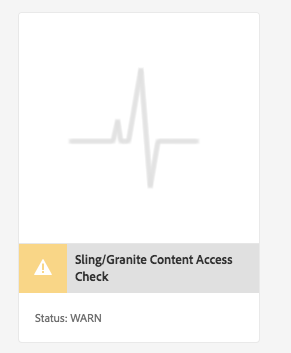

# Hållbara uppgraderingar{#sustainable-upgrades}

## Anpassningsramverk {#customization-framework}

### Arkitektur (funktion/infrastruktur/innehåll/program) {#architecture-functional-infrastructure-content-application}

Customization Framework-funktionen är utformad för att minska antalet fel i icke-utökningsbara områden av koden (som APIS) eller innehåll (som övertäckningar) som inte är uppgraderingsvänliga.

Det finns två komponenter i anpassningsramverket: API- **gränssnittet** och **innehållsklassificeringen**.

#### API-gränssnitt {#api-surface}

I tidigare versioner av AEM exponerades många API:er via Uber Jar. Vissa av dessa API:er var inte avsedda att användas av kunder, men exponerades för AEM-funktionalitet i alla paket. I framtiden kommer Java-API:erna att markeras som Public eller Private för att visa kunderna vilka API:er som är säkra att använda i samband med uppgraderingar. Andra detaljer är:

* Java-API:er som markerats som `Public` kan användas och refereras av anpassade implementeringspaket.

* Offentliga API:er är bakåtkompatibla med installationen av ett kompatibilitetspaket.
* Kompatibilitetspaketet innehåller en Uber JAR-kompatibel för att säkerställa bakåtkompatibilitet
* Java-API:er som markerats som `Private` är avsedda endast att användas av AEM interna paket och bör inte användas av anpassade paket.

>[!NOTE]
>
>Begreppet `Private` och `Public` i detta sammanhang bör inte blandas ihop med Java-föreläsningar av offentliga och privata klasser.

#### Innehållsklassificeringar {#content-classifications}

AEM har länge använt principen för övertäckningar och Sling Resource Merger för att ge kunderna möjlighet att utöka och anpassa AEM-funktionaliteten. Fördefinierade funktioner som driver AEM-konsolerna och användargränssnittet lagras i **/libs**. Kunderna får aldrig ändra något under **/libs** men kan lägga till ytterligare innehåll under **/appar** för att täcka över och utöka de funktioner som definieras i **/libs** (mer information finns i Utveckla med övertäckningar). Detta orsakade fortfarande många problem vid uppgradering av AEM eftersom innehållet i **/libs** kan ändras och göra att övertäckningsfunktionen bryts på oväntade sätt. Kunder kan också utöka AEM-komponenter genom arv via `sling:resourceSuperType`eller bara referera en komponent i **/libs** direkt via sling:resourceType. Liknande uppgraderingsproblem kan uppstå med referens- och åsidosättningsanvändningsfall.

För att göra det säkrare och enklare för kunderna att förstå vilka områden i **/ben** som är säkra att använda och täcka över innehållet i **/libs** har klassificerats med följande blandningar:

* **Public (granite:PublicArea)** - Definierar en nod som public så att den kan överlappa, ärvs ( `sling:resourceSuperType`) eller användas direkt ( `sling:resourceType`). Noder under /libs markerade som Public (Offentliga) kan uppgraderas utan risk med ett kompatibilitetspaket. I allmänhet bör kunderna endast utnyttja noder som är markerade som offentliga.

* **Abstrakt (granite:AbstractArea)** - Definierar en nod som abstrakt. Noder kan överlappas eller ärvas ( `sling:resourceSupertype`), men får inte användas direkt ( `sling:resourceType`).

* **Final (granite:FinalArea)** - Definierar en nod som final. Noder som klassificerats som slutliga bör inte överlappas eller ärvas. Slutnoder kan användas direkt via `sling:resourceType`. Undernoder under den sista noden betraktas som interna som standard.

* ***Internal (granite:InternalArea)*** *- *Definierar en nod som internal. Noder som klassificeras som interna och idealiska får inte överlappas, ärvas eller användas direkt. De här noderna är endast avsedda för AEM:s interna funktioner

* **Ingen anteckning** - Noderna ärver klassificering baserat på trädhierarkin. Roten / är som standard Public (Offentlig). **Noder med en överordnad som klassificerats som Internal eller Final ska också behandlas som Internal.**

>[!NOTE]
>
>Dessa profiler används endast mot Sling-sökvägsbaserade mekanismer. Andra områden av **/libs** som ett klientbibliotek kan markeras som `Internal`, men kan ändå användas med standardinkludering av klientlib. Det är viktigt att kunden i dessa fall fortsätter att respektera den interna klassificeringen.

#### Indikatorer för CRXDE Lite-innehållstyp {#crxde-lite-content-type-indicators}

Blandningar som används i CRXDE Lite visar innehållsnoder och träd som markerats som `INTERNAL` nedtonade. För `FINAL` endast ikonen är nedtonad. De underordnade noderna visas också i grått. Funktionen Overlay Node är inaktiverad i båda dessa fall.

**Offentlig**

**Slutlig**

**Intern**

**Hälsokontroll för innehåll**

>[!NOTE]
>
>Från och med AEM 6.5 rekommenderar Adobe att du använder mönsteravkännaren för att upptäcka intrång i innehållsåtkomst. Mönsterdetektorrapporter är mer detaljerade, identifierar fler problem och minskar sannolikheten för falska positiva.
>
>Mer information finns i [Utvärdera uppgraderingskomplexiteten med Mönsteravkännaren](/help/sites-deploying/pattern-detector.md).

AEM 6.5 levereras med en hälsokontroll som varnar kunderna om överlagrat eller refererat innehåll används på ett sätt som inte stämmer överens med innehållsklassificeringen.

** Kontroll av åtkomsten till innehåll som delas/beviljas** är en ny hälsokontroll som övervakar databasen för att se om kundkoden inte har åtkomst till skyddade noder i AEM.

Detta skannar **/appar** och tar vanligtvis flera sekunder att slutföra.

För att få tillgång till den nya hälsokontrollen måste du göra följande:

1. Gå till **Verktyg > Åtgärder > Hälsorapporter på AEM-startskärmen**
1. Klicka på kontrollen **** Sling/Granite Content Access enligt nedan:

   

När sökningen är klar visas en lista med varningar som meddelar slutanvändaren om den skyddade noden som felaktigt refereras till:

Efter att ha åtgärdat överträdelserna återgår den till grön stat:

Hälsokontrollen visar information som samlats in av en bakgrundstjänst som kontrollerar asynkront när en övertäckning eller resurstyp används i alla Sling-sökvägar. Om innehållsblandningar används felaktigt rapporteras en överträdelse.
