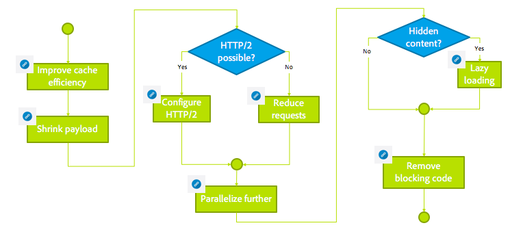

# Felsöka installationsproblem med AEM{#troubleshooting}

I det här avsnittet finns detaljerad information om loggar som kan hjälpa dig att felsöka. Här finns även information om några av de problem som du kan råka ut för AEM.

## Felsöka författarprestanda {#troubleshoot-author-performance}

Det kan bli komplicerat att analysera långsamma prestanda i redigeringsinstansen. Som ett första steg måste du ta reda på vilken nivå av teknikhögen som prestandan minskar på.

Följande beslutsträd ger vägledning för att minska flaskhalsen.

## Grundläggande optimering {#basic-optimization}

## Konfigurera loggfiler och granskningsloggar {#configuring-log-files-and-audit-logs}

AEM loggar som du kan konfigurera för att felsöka installationsproblem. Mer information finns i avsnittet [Arbeta med granskningsposter och loggfiler](/help/sites-deploying/monitoring-and-maintaining.md#working-with-audit-records-and-log-files).

## Använda alternativet Detaljerad {#using-the-verbose-option}

När du startar AEM WCM kan du lägga till alternativet -v (verbose) på kommandoraden som i: java -jar cq-wcm-quickstart-&lt;version>.jar -v.

I det utförliga alternativet visas några av QuickStart-loggutdata på konsolen, så de kan användas för felsökning.

## Vanliga installationsproblem {#common-installation-issues}

I följande avsnitt beskrivs några installationsproblem och deras lösningar.

### Om du dubbelklickar på Quickstart-behållaren får den ingen effekt och filen öppnas med ett annat program (t.ex. arkivhanteraren) {#double-clicking-the-quickstart-jar-does-not-have-any-effect-or-opens-the-jar-file-with-another-program-for-example-archive-manager}

Detta tyder vanligtvis på ett problem med hur operativsystemets skrivbordsmiljö är konfigurerad att öppna filer med filnamnstillägget .jar. Det kan också tyda på att du inte har Java™ installerat eller att du använder en version av Java™ som inte stöds.

När man använder burkfiler i ZIP-format kan vissa av arkiveringsprogrammen automatiskt konfigurera skrivbordet så att man kan öppna burkfiler som arkivfiler.

Så här felsöker du:

* Kontrollera att du har minst Java™ version 1.6 installerad.
* Testa en snabbmeny (oftast högerklickning) i AEM WCM QuickStart och välj&quot;Öppna med...&quot;
* Kontrollera om Java™ eller Sun Java™ finns med och försök köra AEM WCM med det. Om du har flera Java™-versioner installerade väljer du en som stöds.

  Om du lyckas med det här steget och operativsystemet har ett alternativ för att alltid använda det valda programmet för att köra .jar-filerna markerar du det. Dubbelklickning bör fungera från och med nu.

* Ibland kan det vara bra att återställa rätt association om du installerar om den Java™-version som stöds.
* Du kan alltid köra CRX med kommandoraden eller starta/stoppa skript enligt beskrivningen tidigare i det här dokumentet.

### Mitt program som körs på CRX orsakar fel av typen slut på minne {#my-application-running-on-crx-throws-out-of-memory-errors}

>[!NOTE]
>
>Se även [Analysera minnesproblem](https://experienceleague.adobe.com/docs/experience-cloud-kcs/kbarticles/KA-17482.html?lang=sv-SE).

CRX har också lite minnesutrymme. Om programmet som körs i CRX har större minnesbehov eller begär minnesintensiva åtgärder (till exempel stora transaktioner), måste JVM-instansen där CRX körs startas med lämpliga minnesinställningar.

Använd Java™-kommandoalternativen för att definiera minnesinställningar för JVM (t.ex. java -Xmx512m -jar crx&ast;.jar för att ange heapsize till 512 MB).

Ange minnesinställningsalternativet när du startar AEM WCM från kommandoraden. AEM WCM-skript för start/stopp eller anpassade skript för hantering AEM WCM-start kan också ändras för att definiera de nödvändiga minnesinställningarna.

Om du redan har definierat stackstorleken till 512 MB kan du analysera minnesproblemet ytterligare genom att skapa en stackdump.

Använd följande kommando för att automatiskt skapa en stackdump när minnet tar slut:

java -Xmx256m -XX:+HeapDumpOnOutOfMemoryError -jar &ast;.jar

Den här metoden genererar en stackdumpfil (**java_...hprof**) när minnet tar slut. Processen kan fortsätta att köras efter att stackdumpen har skapats.

Det krävs ofta tre stackdumpfiler, som samlats in under en tidsperiod, för att analysera problemet:

* Innan ett fel inträffar
* Vid fel 1
* Vid fel 2
* *I idealfallet är det också bra att samla in information efter att händelsen har lösts*

Dessa kan jämföras för att se ändringar och hur objekt använder minne.

>[!NOTE]
>
>Om du regelbundet samlar in sådan information, eller har erfarenhet av att läsa stackdumpar, kan en stackdumpfil vara tillräckligt för att analysera problemet.

### AEM välkomstskärm visas inte i webbläsaren när du dubbelklickat AEM QuickStart {#the-aem-welcome-screen-does-not-display-in-the-browser-after-double-clicking-aem-quickstart}

I vissa situationer visas inte AEM WCM-välkomstskärmar automatiskt även om själva databasen körs. Problemet kan bero på operativsystemets konfiguration, webbläsarkonfigurationen eller liknande faktorer.

Det vanligaste symtomet är att AEM WCM QuickStart-fönstret visar&quot;AEM WCM startar och väntar på att servern ska startas...&quot; Om det meddelandet visas under en relativt lång tid anger du AEM WCM-URL:en i webbläsarfönstret manuellt med standardporten 4502 eller den port som instansen körs på: http://localhost:4502/.

Loggar kan också visa orsaken till att webbläsaren inte startas.

Ibland visas meddelandet &quot;AEM WCM som körs på http://localhost:port/&quot; i fönstret AEM WCM QuickStart och webbläsaren startar inte automatiskt. I så fall klickar du på URL:en i AEM WCM QuickStart-fönster (det är en hyperlänk) eller anger URL:en manuellt i webbläsaren.

Om allt annat misslyckas, kontrollera loggarna för att ta reda på vad som har hänt.

### Webbplatsen läses inte in och misslyckas ibland med Java™ 11 {#the-website-does-not-load-or-fails-intermittently-with-java11}

Det finns ett känt fel med att AEM 6.5 körs på Java™ 11, där webbplatsen kanske inte läses in eller misslyckas regelbundet.

Gör så här om problemet uppstår:

1. Öppna filen `sling.properties` under mappen `crx-quickstart/conf/`
1. Leta reda på följande rad:

   `org.osgi.framework.bootdelegation=sun.,com.sun.`

1. Ersätt den med följande:

   `org.osgi.framework.bootdelegation=sun.,com.sun.,jdk.internal.reflect,jdk.internal.reflect.*`

1. Starta om instansen.

## Felsöka installationer med en programserver {#troubleshooting-installations-with-an-application-server}

### Sidan hittades inte returnerades när en geometrixx-outdoor-sida begärdes {#page-not-found-returned-when-requesting-a-geometrixx-outdoor-page}

**Gäller WebLogic 10.3.5 och JBoss® 5.1**

När en begäran om att geometrixx-outdoor/en-sida ska returnera 404 (Sidan hittades inte), kan du kontrollera att du har angett ytterligare sling-egenskapen i filen sling.properties som behövs för dessa specifika programservrar.

Mer information finns i *Distribuera AEM* -stegen.

### Svarshuvudstorleken kan vara större än 4 kB {#response-header-size-can-be-greater-than-kb}

502 fel kan indikera att webbservern inte kan hantera storleken på AEM HTTP-svarshuvud. AEM kan generera HTTP-svarshuvuden som innehåller cookies som är större än 4 kB. Kontrollera att serverbehållaren är konfigurerad så att den maximala svarshuvudets storlek kan överskrida 4 kB.

För Tomcat 7.0 styr till exempel attributet maxHttpHeaderSize för [HTTP Connector](https://tomcat.apache.org/tomcat-7.0-doc/config/http.html) begränsningar för rubrikstorlek.

## Avinstallerar Adobe Experience Manager {#uninstalling-adobe-experience-manager}

Eftersom AEM installeras i en enda katalog behövs inget avinstallationsverktyg. Avinstallationen kan vara så enkel som att ta bort hela installationskatalogen, men hur du avinstallerar AEM beror på vad du vill uppnå och vilken beständig lagring du använder.

Om beständig lagring är inbäddad i installationskatalogen, till exempel i standardinstallationen för TPM, tas även data bort om du tar bort mappar.

>[!NOTE]
>
>Adobe rekommenderar att du säkerhetskopierar databasen innan du tar bort AEM. Om du tar bort hela &lt;cq-installation-directory> tar du även bort databasen. Om du vill behålla databasdata innan du tar bort, flyttar eller kopierar du mappen &lt;cq-installation-directory>/crx-quickstart/database någon annanstans innan du tar bort de andra mapparna.

Om din installation av AEM använder extern lagring, till exempel en databasserver, tas inte data bort automatiskt när du tar bort mappen, men lagringskonfigurationen tas bort, vilket gör det svårt att återställa JCR-innehållet.

### JSP-filer kompileras inte på JBoss® {#jsp-files-are-not-compiled-on-jboss}

Om du installerar eller uppdaterar JSP-filer till Experience Manager på JBoss® och motsvarande servrar inte kompileras kontrollerar du att JBoss® JSP-kompilatorn är korrekt konfigurerad. Mer information finns i
[JSP-kompileringsproblem i JBoss®](https://helpx.adobe.com/experience-manager/kb/jsps-dont-compile-jboss.html)-artikeln.
