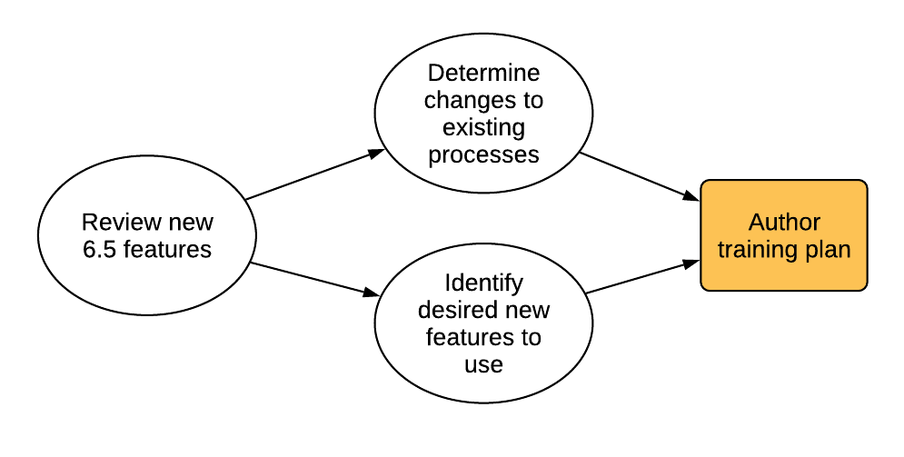

# Planera din uppgradering{#planning-your-upgrade}

## Översikt över AEM-projekt {#aem-project-overview}

AEM används ofta i driftsättningar med stor effekt som kan vara avsedda för miljontals användare. I de flesta fall finns det anpassade program som distribueras på instanserna, vilket ökar komplexiteten. Alla försök att uppgradera en sådan distribution måste hanteras metodiskt.

Den här guiden hjälper dig att fastställa tydliga mål, faser och resultat när du planerar en uppgradering. Det fokuserar på det övergripande projektgenomförandet och på riktlinjerna. Den ger en översikt över de faktiska uppgraderingsstegen, men hänvisar till tillgängliga tekniska resurser där det är lämpligt. Den bör användas tillsammans med de tillgängliga tekniska resurser som avses i dokumentet.

AEM Upgrade-processen behöver noggrant hanteras i planerings-, analys- och exekveringsfaserna med nyckelprodukter definierade för varje fas.

Observera att det går att uppgradera direkt från AEM version 6.0 och upp till 6.5. Kunder som kör 5.6.x och tidigare måste uppgradera först till version 6.0 eller senare, och 6.0(SP3) rekommenderas. Det nya OAK-segmenttjärformatet används nu även för segmentnodarkivet sedan 6.3, och databasmigrering till det nya formatet är obligatoriskt även för 6.0, 6.1 och 6.2.

>[!CAUTION]
>
>Om du uppgraderar från AEM 6.2 till 6.3 bör du antingen uppgradera från versioner (**6.2-SP1-CFP1 - -6.2SP1-CFP12.1**) eller **6.2SP1-CFP15** och framåt. Om du uppgraderar från **6.2SP1-CFP13/6.2SP1CFP14** till AEM 6.3 måste du annars även uppgradera till minst version **6.3.2.2**. I annat fall kommer AEM Sites inte att fungera efter uppgraderingen.

## Uppgraderingsomfång och krav {#upgrade-scope-requirements}

Nedan finns en lista över områden som påverkas i ett typiskt AEM Upgrade-projekt:

<table>
 <tbody>
  <tr>
   <td><strong>Komponent</strong></td>
   <td><strong>Effekt</strong></td>
   <td><strong>Beskrivning</strong></td>
  </tr>
  <tr>
   <td>Operativsystem</td>
   <td>Osäker, men subtila effekter</td>
   <td>När AEM-uppgraderingen görs kan det vara dags att uppgradera operativsystemet, vilket kan ha lite effekt.</td>
  </tr>
  <tr>
   <td>Java Runtime</td>
   <td>Måttlig effekt</td>
   <td>AEM 6.3 kräver JRE 1.7.x (64 bitar) eller senare. JRE 1.8 är den enda version som för närvarande stöds av Oracle.</td>
  </tr>
  <tr>
   <td>Maskinvara</td>
   <td>Måttlig effekt</td>
   <td>Onlinekorrigering av ändringar kräver ett ledigt  diskutrymme som motsvarar 25 % av databasens storlek och 15 % ledigt  stackutrymme för att slutföras. Du kan behöva uppgradera din maskinvara för att  se till att det finns tillräckligt med resurser för att kunna utföra  rensning online. Om du uppgraderar från en version som är tidigare än AEM 6 kan det dessutom  finnas ytterligare lagringskrav.</td>
  </tr>
  <tr>
   <td>Innehållsdatabas (CRX eller Oak)</td>
   <td>Hög effekt</td>
   <td>Från och med version 6.1 stöder inte AEM CRX2, så det krävs en migrering till  Oak (CRX3) om du uppgraderar från en äldre version. AEM 6.3 har  implementerat ett nytt segmentnodarkiv som även kräver en migrering. Verktyget  crx2oak används för detta.</td>
  </tr>
  <tr>
   <td>AEM Components/Content</td>
   <td>Måttlig effekt</td>
   <td><code>/libs</code> och <code>/apps</code> kan enkelt hanteras genom uppgraderingen, men <code>/etc</code> kräver vanligtvis manuell omtillämpning av anpassningar.</td>
  </tr>
  <tr>
   <td>AEM Services</td>
   <td>Låg effekt</td>
   <td>De flesta av AEM-bastjänsterna har testats för uppgradering. Detta är ett område med låg effekt.</td>
  </tr>
  <tr>
   <td>Anpassade programtjänster</td>
   <td>Låg till hög effekt</td>
   <td>Beroende på program och anpassning kan det finnas  beroenden på JVM, operativsystemversioner och vissa indexeringsrelaterade  ändringar, eftersom index inte genereras automatiskt i Oak.</td>
  </tr>
  <tr>
   <td>Anpassat programinnehåll</td>
   <td>Låg till hög effekt</td>
   <td>Innehåll som inte hanteras genom uppgraderingen kan säkerhetskopieras  innan uppgraderingen äger rum och sedan flyttas tillbaka till databasen.  Det mesta innehållet kan hanteras med migreringsverktyget.</td>
  </tr>
 </tbody>
</table>

Det är viktigt att du kör ett operativsystem som stöds, Java-miljön, httpd- och Dispatcher-versionen. Mer information finns på sidan [med tekniska krav för](/help/sites-deploying/technical-requirements.md)AEM 6.5. Du måste ta hänsyn till dessa komponenter i din projektplan och de bör uppgraderas innan du uppgraderar AEM.

## Projektfaser {#project-phases}

En stor del av arbetet går åt till att planera och genomföra en AEM-uppgradering. För att förtydliga de olika insatser som ingår i denna process har vi delat upp planerings- och genomförandeövningarna i separata faser. I avsnitten nedan resulterar varje fas i en slutprodukt som ofta utnyttjas av en framtida fas i projektet.

### Planering för författarutbildning {#planning-for-author-training}

I alla nya versioner finns det risk för förändringar i användargränssnittet och användararbetsflöden. Dessutom innehåller nya releaser nya funktioner som kan vara till nytta för företaget. Vi rekommenderar att du granskar de funktionsändringar som har införts och organiserar en plan för att utbilda dina användare så att de kan utnyttja dem effektivt.

Nya funktioner i AEM 6.5 finns i AEM- [delen av adobe.com](/help/release-notes/release-notes.md). Observera alla ändringar av användargränssnitt och produktfunktioner som används ofta i din organisation. När du tittar igenom de nya funktionerna bör du också tänka på alla funktioner som kan vara av värde för din organisation. När du har gått igenom vad som har ändrats i AEM 6.5 kan du utveckla en utbildningsplan för dina författare. Detta kan innebära att man utnyttjar kostnadsfria resurser som hjälpmedelsvideor eller formell utbildning som erbjuds via [Adobe Digital Learning Services](https://www.adobe.com/training.html).

### Skapa en testplan {#creating-a-test-plan}

Varje kunds implementering av AEM är unik och har anpassats för att uppfylla deras affärskrav. Därför är det viktigt att fastställa alla anpassningar som har gjorts i systemet så att de kan inkluderas i en testplan. Testplanen kommer att driva den QA-process som vi utför på den uppgraderade instansen.

Den exakta produktionsmiljön måste dupliceras och testning bör utföras efter uppgraderingen för att säkerställa att alla program och anpassad kod fortfarande fungerar som de ska. Du måste ångra all anpassning och utföra prestandatestning, inläsning och säkerhetstestning. När du organiserar din testplan måste du ta med alla anpassningar som har gjorts i systemet, förutom de användargränssnitt och arbetsflöden som du använder i din dagliga verksamhet. Dessa kan omfatta anpassade OSGI-tjänster och -servrar, integreringar med Adobe Marketing Cloud, integrering med tredje part via AEM-anslutningar, anpassade tredjepartsintegreringar, anpassade komponenter och mallar, anpassade gränssnittsövertäckningar i AEM och anpassade arbetsflöden. För kunder som migrerar från en version som är tidigare än AEM 6 bör alla anpassade frågor analyseras eftersom dessa kan behöva indexeras. För kunder som redan har en AEM 6.x-version bör dessa frågor fortfarande testas för att säkerställa att deras index fortsätter att fungera effektivt efter uppgraderingen.

### Fastställa nödvändiga arkitektoniska förändringar och infrastrukturförändringar {#determining-architectural-and-infrastructure-changes-needed}

När du uppgraderar kan du behöva uppgradera andra komponenter i din tekniska stack, till exempel operativsystemet eller JVM. Dessutom är det möjligt att ytterligare maskinvara kan behövas på grund av ändringar i databaskonfigurationen. Det här uppstår oftast bara för kunder som migrerar från tidigare versioner än 6.x, men det är viktigt att tänka på. Slutligen kan det finnas ändringar som är nödvändiga i era rutiner för övervakning, underhåll och säkerhetskopiering och katastrofåterställning.

Granska de tekniska kraven för AEM 6.5 och se till att din nuvarande maskin- och programvara är tillräcklig. Följande dokument innehåller information om möjliga ändringar av de operativa processerna:

**Övervakning och underhåll:**

[Instrumentpanel för åtgärder](/help/sites-administering/operations-dashboard.md)

[Metodtips för resursövervakning](/help/assets/assets-monitoring-best-practices.md)

[Övervakningsserverresurser med JMX-konsolen](/help/sites-administering/jmx-console.md)

[Revision Cleanup](/help/sites-deploying/revision-cleanup.md)

**Säkerhetskopiering/återställning och katastrofåterställning:**

[Säkerhetskopiering och återställning](/help/sites-administering/backup-and-restore.md)

[Prestanda och skalbarhet](/help/sites-deploying/performance.md)

[Så här kör du AEM med StjärmMK Cold Standby](/help/sites-deploying/tarmk-cold-standby.md)

#### Överväganden vid innehållsomstrukturering {#content-restructuring-considerations}

AEM har infört ändringar i databasstrukturen som gör uppgraderingarna smidigare. Ändringarna innebär att flytta innehåll från mappen /etc till mappar som /libs, /apps och /content, baserat på om Adobe eller en kund äger innehållet, vilket minskar riskerna för att skriva över innehåll under releaser. Omstruktureringen av databasen har gjorts på ett sådant sätt att inga kodändringar behöver göras vid uppgraderingen av version 6.5, även om det rekommenderas att du granskar informationen i [Repository-omstrukturering i AEM](/help/sites-deploying/repository-restructuring-in-aem65.md) när du planerar en uppgradering.

### Utvärderar uppgraderingskomplexitet {#assessing-upgrade-complexity}

På grund av det stora utbudet av anpassningar som våra kunder använder i sina AEM-miljöer är det viktigt att lägga lite tid på att avgöra den övergripande nivå av arbete som förväntas i uppgraderingen.

Det finns två sätt att bedöma uppgraderingens komplexitet. En inledande fas kan bara använda den nya mönsteravkännaren, som är tillgänglig för körning i dina AEM 6.1-, 6.2- och 6.3-instanser. Mönsterdetektorn är det enklaste sättet att bedöma uppgraderingens totala komplexitet som kan förväntas med hjälp av rapporterade mönster. Mönsterdetektorrapporten innehåller mönster för att identifiera otillgängliga API:er som används av den anpassade kodbasen (detta gjordes med kompatibilitetskontroller före uppgradering i 6.3).

Efter den första bedömningen kan ett mer omfattande nästa steg vara att utföra en uppgradering av en testinstans och utföra några grundläggande röktester. Adobe erbjuder också en del . Dessutom bör listan över [borttagna och borttagna funktioner](/help/release-notes/deprecated-removed-features.md) granskas inte bara för den version du uppgraderar till, utan även för alla versioner mellan käll- och målversionerna. Om du till exempel uppgraderar från AEM 6.2 till 6.5 är det viktigt att du granskar de borttagna och borttagna funktionerna i AEM 6.3, utöver dem som finns i AEM 6.5.

Den mönsteravkännare som introducerades nyligen bör ge en korrekt uppskattning av vad du kan förvänta dig under en uppgradering i de flesta fall. För mer komplexa anpassningar och driftsättningar där du har inkompatibla ändringar kan du uppgradera en utvecklingsinstans till AEM 6.5 enligt instruktionerna i [Utföra en lokal uppgradering](/help/sites-deploying/in-place-upgrade.md). När det är klart utför du några högnivåröktester på den här miljön. Målet med denna övning är inte att göra en omfattande inventering av testfall och göra en formell inventering av defekter, utan att ge oss en ungefärlig uppskattning av mängden arbete som krävs för att uppgradera koden för kompatibilitet med 6.5. I kombination med [Mönsterupptäckt](/help/sites-deploying/pattern-detector.md) och de arkitektoniska förändringar som fastställdes i föregående avsnitt kan en grov uppskattning göras av projektledningsteamet för planering av uppgraderingen.

### Bygga Runbook för uppgradering och återställning {#building-the-upgrade-and-rollback-runbook}

Adobe har dokumenterat processen för uppgradering av en AEM-instans, men varje kunds nätverkslayout, driftsättningsarkitektur och anpassningar kräver finjustering och anpassning av den här metoden. Därför rekommenderar vi att du granskar all dokumentation som vi har tillhandahållit och använder den för att informera en projektspecifik Runbook som beskriver de specifika uppgraderings- och återställningsprocedurer som du kommer att följa i din miljö. Om du uppgraderar från CRX2 måste du se till att utvärdera hur lång tid det tar att migrera innehåll när du flyttar från CRX2 till Oak. För stora databaser kan det vara mycket viktigt.

Vi har tagit fram uppgraderings- och återställningsprocedurer i [uppgraderingsproceduren](/help/sites-deploying/upgrade-procedure.md) samt stegvisa instruktioner för hur man tillämpar uppgraderingen i Utföra en [lokal uppgradering](/help/sites-deploying/in-place-upgrade.md). Dessa instruktioner bör granskas och beaktas med din systemarkitektur, anpassningar och driftsavvikelse för att avgöra vilka procedurer för växling och återställning som du ska utföra under uppgraderingen. Alla ändringar av arkitektur eller serverstorlekar bör inkluderas när du skapar din anpassade runbook. Det är viktigt att notera att detta bör behandlas som ett första utkast. När teamet slutför sina QA- och utvecklingscykler och distribuerar uppgraderingen till testmiljön är det troligt att det krävs ytterligare åtgärder. Helst bör det här dokumentet innehålla tillräckligt med information så att om det skulle överlämnas till en medlem av personalen kan de slutföra uppgraderingen helt utifrån informationen i det.

### Utveckla en projektplan {#developing-a-project-plan}

Vi kan använda resultaten från tidigare övningar för att bygga en projektplan som täcker de tidslinjer som vi förväntar oss för test- eller utvecklingsarbete, utbildning och faktiskt utförande av uppgraderingen.

En omfattande projektplan bör omfatta följande:

* Slutförande av utvecklings- och testplaner
* Uppgraderar utvecklings- och QA-miljöer
* Uppdatera den anpassade kodbasen för AEM 6.5
* En QA-provning och korrigeringscykel
* Uppgraderar mellanlagringsmiljön
* Integrering, prestanda och belastningstestning
* Miljöcertifiering
* Go live

### Utveckling och kvalitetskontroll {#performing-development-and-qa}

Vi har skapat rutiner för att [uppgradera kod och anpassningar](/help/sites-deploying/upgrading-code-and-customizations.md) så att de är kompatibla med AEM 6.5. När den här iterativa processen körs bör ändringar göras i Runbook efter behov. Se även [Bakåtkompatibilitet i AEM 6.5](/help/sites-deploying/backward-compatibility.md) om hur dina anpassningar kan bli bakåtkompatibla i de flesta fall utan att behöva utvecklas omedelbart efter uppgraderingen.

Utvecklings- och testprocessen är vanligtvis iterativ. På grund av anpassningar kan ändringar som görs under uppgraderingen göra att en hel del av produkten blir oanvändbar. När utvecklarna har åtgärdat den grundläggande orsaken till problemet och testteamet har tillgång till dessa funktioner, finns det risk för att ytterligare problem upptäcks. När problem upptäcks som kräver justeringar i uppgraderingsprocessen måste du lägga till dem i din anpassade uppgraderingsrunbook. Efter flera iterationer av testning och korrigering bör kodbasen vara helt validerad och klar för distribution till testmiljön.

### Slutlig testning {#final-testing}

Vi rekommenderar en sista testomgång efter att kodbasen har certifierats av din organisations QA-team. Denna testomgång innebär att du validerar din runbook i en staging-miljö, följt av rundor där användaren accepteras, prestanda och säkerhetstestning.

Det här steget är viktigt eftersom det är enda gången som du kan validera stegen i Runbook mot en produktionsliknande miljö. När miljön har uppgraderats är det viktigt att användarna ges tid att logga in och gå igenom de aktiviteter de utför när de använder systemet i sina dagliga aktiviteter. Det är inte ovanligt att användare utnyttjar en del av systemet som inte tidigare övervägts. Att hitta och åtgärda problem i dessa områden innan du går vidare kan bidra till att förhindra kostsamma produktionsavbrott. Som en ny version av AEM innehåller betydande ändringar av den underliggande plattformen är det också viktigt att utföra prestanda-, laddnings- och säkerhetstester på systemet som om det startades för första gången.

### Utföra uppgraderingen {#performing-the-upgrade}

När en slutgiltig signering har tagits emot från alla intressenter är det dags att köra de runbook-procedurer som har definierats. Vi har tagit fram steg för uppgradering och återställning i [uppgraderingsproceduren](/help/sites-deploying/upgrade-procedure.md) och installationsstegen i Utföra en [lokal uppgradering](/help/sites-deploying/in-place-upgrade.md) som referenspunkt.

Vi har tagit fram några steg i uppgraderingsinstruktionerna för miljövalidering. Detta omfattar grundläggande kontroller som att skanna uppgraderingsloggarna och verifiera att alla OSGi-paket har startats korrekt, men vi rekommenderar även att du validerar med dina egna testfall baserat på dina affärsprocesser. Vi rekommenderar också att du kontrollerar schemat för AEM&#39;s Online Revision Cleanup och tillhörande rutiner för att säkerställa att de inträffar under en lugn tid för ditt företag. Dessa rutiner är viktiga för AEM:s långsiktiga prestanda.
