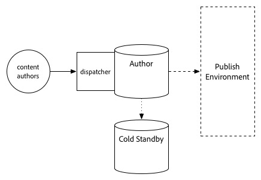

# Uppgraderingsprocedur {#upgrade-procedure}

>[!NOTE]
>
>Uppgraderingen kräver driftstopp för Author-nivån eftersom de flesta AEM-uppgraderingar utförs på plats. Genom att följa dessa metodtips kan driftstopp i publiceringsskiktet minimeras eller elimineras.

När du uppgraderar dina AEM-miljöer måste du ta hänsyn till skillnaderna i tillvägagångssätt mellan att uppgradera författarmiljöer eller publiceringsmiljöer för att minimera driftstoppen för både författare och slutanvändare. På den här sidan beskrivs hur du uppgraderar en AEM-topologi som för närvarande körs på en version av AEM 6.x. Eftersom processen skiljer sig mellan redigerings- och publiceringsnivåer samt Mongo- och TarmMK-baserade distributioner, har varje nivå och mikrokärna listats i ett separat avsnitt. När du utför din distribution rekommenderar vi att du först uppgraderar din utvecklingsmiljö, avgör om du lyckas och sedan fortsätter till publiceringsmiljöerna.

## Stjärtmaskförfattarnivå {#tarmk-author-tier}

### Startopologi {#starting-topology}

Den topologi som antas för det här avsnittet består av en författarserver som körs på tarMK med ett Cold Standby. Replikering sker från författarservern till TjärMK-publiceringsservergruppen. Även om det inte visas här kan den här metoden även användas för distributioner som använder avlastning. Se till att du uppgraderar eller återskapar avlastningsinstansen på den nya versionen efter att du har inaktiverat replikeringsagenter på författarinstansen och innan du återaktiverar dem.

### Förberedelse av uppgradering {#upgrade-preparation}

1. Stoppa redigering av innehåll

1. Stoppa standby-instansen

1. Inaktivera replikeringsagenter på författaren

1. Kör underhållsuppgifterna [som](/help/sites-deploying/pre-upgrade-maintenance-tasks.md)gjorts före uppgraderingen.

### Uppgraderingskörning {#upgrade-execution}

1. Kör uppgraderingen [på plats](/help/sites-deploying/in-place-upgrade.md)
1. Uppdatera dispatchermodulen *vid behov*

1. QA validerar uppgraderingen

1. Stäng författarinstansen.

### Om slutförd {#if-successful}

1. Kopiera den uppgraderade instansen för att skapa en ny Cold Standby

1. Starta Author-instansen

1. Starta Standby-instansen.

### Om misslyckades (återställning) {#if-unsuccessful-rollback}

1. Starta vänteläget som nytt primärt

1. Bygg om redigeringsmiljön från vänteläget Cold.

## Författarkluster för MongoMK {#mongomk-author-cluster}

### Startopologi {#starting-topology-1}

Den topologi som antas för det här avsnittet består av ett MongoMK Author-kluster med minst två AEM Author-instanser, som stöds av minst två MongoMK-databaser. Alla författarinstanser delar ett datalager. Dessa steg bör gälla både S3- och File-datalager. Replikering sker från författarservrarna till TjärMK-publiceringsservergruppen.

### Förberedelse av uppgradering {#upgrade-preparation-1}

1. Stoppa redigering av innehåll
1. Klona datalagret för säkerhetskopiering
1. Stoppa alla utom en AEM Author-instans, din primära författare
1. Ta bort alla MongoDB-noder utom en från replikuppsättningen, den primära Mongo-instansen
1. Uppdatera `DocumentNodeStoreService.cfg` filen på den primära författaren så att den återspeglar replikuppsättningen för en enskild medlem
1. Starta om den primära författaren för att säkerställa att den startar om ordentligt
1. Inaktivera replikeringsagenter på den primära författaren
1. Kör [föruppgraderingsunderhållsaktiviteter](/help/sites-deploying/pre-upgrade-maintenance-tasks.md) på den primära författarinstansen
1. Uppgradera vid behov MongoDB på den primära Mongo-instansen till version 3.2 med WiredTiger

### Uppgraderingskörning {#Upgrade-execution-1}

1. Kör en [uppgradering](/help/sites-deploying/in-place-upgrade.md) på plats på den primära författaren
1. Uppdatera Dispatcher eller webbmodulen *vid behov*
1. QA validerar uppgraderingen

### Om slutförd {#if-successful-1}

1. Skapa nya 6.5 Author-instanser, anslutna till den uppgraderade Mongo-instansen

1. Återskapa MongoDB-noder som tagits bort från klustret

1. Uppdatera `DocumentNodeStoreService.cfg` filerna så att de återspeglar hela replikuppsättningen

1. Starta om Author-instanserna, en i taget

1. Ta bort det klonade datalagret.

### Om misslyckades (återställning) {#if-unsuccessful-rollback-2}

1. Konfigurera om de sekundära författarinstanserna för att ansluta till det klonade datalagret

1. Stäng den uppgraderade primära författarinstansen

1. Stäng den uppgraderade primära instansen av Mongo.

1. Starta de sekundära Mongo-instanserna med en av dem som ny primär

1. Konfigurera filerna på den sekundära författarinstansen så att de pekar på replikuppsättningen med ännu inte uppgraderade Mongo-instanser `DocumentNodeStoreService.cfg`

1. Starta de sekundära författarinstanserna

1. Rensa de uppgraderade författarinstanserna, Mongo-noden och datalagret.

## TjärMK-publiceringsgrupp {#tarmk-publish-farm}

### TjärMK-publiceringsgrupp {#tarmk-publish-farm-1}

Den topologi som antas för det här avsnittet består av två TjärMK-publiceringsinstanser, framtagna av Dispatchers, som i sin tur står framför en belastningsutjämnare. Replikering sker från författarservern till TjärMK-publiceringsservergruppen.

### Uppgraderingskörning {#upgrade-execution-2}

1. Stoppa trafiken till Publish 2-instansen vid belastningsutjämnaren
1. Kör [föruppgraderingsunderhåll](/help/sites-deploying/pre-upgrade-maintenance-tasks.md) vid publicering 2
1. Köra en [uppgradering](/help/sites-deploying/in-place-upgrade.md) på plats vid publicering 2
1. Uppdatera Dispatcher eller webbmodulen *vid behov*
1. Rensa Dispatcher-cachen
1. QA validerar Publish 2 via Dispatcher, bakom brandväggen
1. Avsluta publicering 2
1. Kopiera Publish 2-instansen
1. Starta publicering 2

### Om slutförd {#if-successful-2}

1. Aktivera trafik till Publish 2
1. Stoppa trafik till Publish 1
1. Stoppa Publish 1-instansen
1. Ersätt Publish 1-instansen med en kopia av Publish 2
1. Uppdatera Dispatcher eller webbmodulen *vid behov*
1. Töm Dispatcher-cachen för Publish 1
1. Starta publicering 1
1. QA validerar Publish 1 via Dispatcher, bakom brandväggen

### Om misslyckades (återställning) {#if-unsuccessful-rollback-1}

1. Skapa en kopia av Publish 1
1. Ersätt Publish 2-instansen med en kopia av Publish 1
1. Töm Dispatcher-cachen för Publish 2
1. Starta publicering 2
1. QA validerar Publish 2 via Dispatcher, bakom brandväggen
1. Aktivera trafik till Publish 2

## Slutliga uppgraderingssteg {#final-upgrade-steps}

1. Aktivera trafik till Publish 1
1. QA utför slutlig validering från en offentlig URL
1. Aktivera replikeringsagenter från redigeringsmiljön
1. Återuppta redigering av innehåll
1. Genomför [efteruppgraderingskontroller](/help/sites-deploying/post-upgrade-checks-and-troubleshooting.md).

