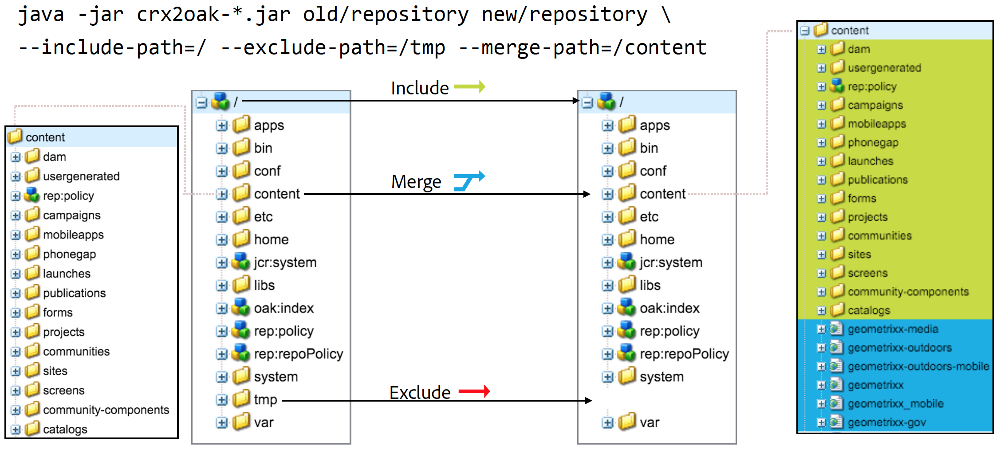

# Använda CRX2Oak Migration Tool{#using-the-crx-oak-migration-tool}

## Introduktion {#introduction}

CRX2Oak är ett verktyg som är utformat för att migrera data mellan olika databaser.

Den kan användas för att migrera data från äldre CQ-versioner baserade på Apache Jackrabbit 2 till Oak, och den kan också användas för att kopiera data mellan Oak-databaser.

Du kan hämta den senaste versionen av crx2oak från den offentliga Adobe-databasen på den här platsen:
[https://repo1.maven.org/maven2/com/adobe/granite/crx2oak/](https://repo1.maven.org/maven2/com/adobe/granite/crx2oak/)

>[!NOTE]
>
>Mer information om Apache Oak och viktiga koncept för Adobe Experience Manager (AEM) persistence finns i [Introduktion till AEM](/help/sites-deploying/platform.md).

## Användningsexempel vid migrering {#migration-use-cases}

Verktyget kan användas för:

* Migrera från äldre CQ 5-versioner till AEM 6
* Kopiera data mellan flera Oak-databaser
* Konverterar data mellan olika Oak MicroKernel-implementeringar.

Stöd för att migrera databaser med externa blobbarkiv (kallas ofta datalager) finns i olika kombinationer. En möjlig migreringsväg är från en CRX2-databas som använder en extern `FileDataStore` till en Oak-databas med `S3DataStore`.

Bilden nedan visar alla möjliga migreringskombinationer som stöds av CRX2Oak:


## Funktioner {#features}

CRX2Oak anropas under AEM uppgraderingar på ett sätt där användaren kan ange en fördefinierad migreringsprofil som automatiserar omkonfigureringen av beständiga lägen. Detta kallas snabbstartsläge.

Den kan också köras separat om den kräver mer anpassning. I det här läget görs dock endast ändringar i databasen och eventuella ytterligare omkonfigurationer av AEM måste utföras manuellt. Detta kallas fristående läge.

En annan sak att tänka på är att med standardinställningarna i fristående läge migreras endast nodarkivet och den nya databasen återanvänder den gamla binära lagringen.

### Automatiserat snabbläge {#automated-quickstart-mode}

Sedan AEM 6.3 kan CRX2Oak hantera användardefinierade migreringsprofiler som kan konfigureras med alla migreringsalternativ som redan är tillgängliga. Detta ger både större flexibilitet och möjlighet att automatisera konfigurationen av AEM, funktioner som inte är tillgängliga om du använder verktyget i fristående läge.

Om du vill växla CRX2Oak till snabbredigeringsläge anger du sökvägen till mappen crx-quickstart i AEM installationskatalog med hjälp av den här systemvariabeln i operativsystemet:

**För UNIX-baserade system och macOS:**

```shell
export SLING_HOME="/path/to/crx-quickstart"
```

**För Windows:**

```shell
SET "SLING_HOME=/path/to/crx-quickstart"
```

#### Återuppta support {#resume-support}

Migreringen kan avbrytas när som helst, med möjlighet att återuppta den efteråt.

#### Anpassningsbar uppgraderingslogik {#customizable-upgrade-logic}

Anpassad Java™-logik kan implementeras med `CommitHooks`. Egen `RepositoryInitializer` kan implementeras för att initiera databasen med anpassade värden.

#### Stöd för minnesmappningsåtgärder {#support-for-memory-mapped-operations}

CRX2Oak stöder även minnesmappade åtgärder som standard. Minnesmappning förbättrar prestanda avsevärt och bör användas när det är möjligt.

>[!CAUTION]
>
>Observera dock att minnesmappade åtgärder inte stöds för Windows-plattformar. Därför rekommenderar vi att du lägger till **—disable-mmap** -parametern när migreringen utförs i Windows.

#### Selektiv migrering av innehåll {#selective-migration-of-content}

Som standard migrerar verktyget hela databasen under `"/"` bana. Du har dock fullständig kontroll över vilket innehåll som ska migreras.

Om det finns någon del av innehållet som inte krävs för den nya instansen kan du använda `--exclude-path` -parameter för att exkludera innehållet och optimera uppgraderingsproceduren.

#### Bansammanslagning {#path-merging}

Om data måste kopieras mellan två databaser och du har en innehållssökväg som är annorlunda på båda instanserna, kan du definiera den i `--merge-path` parameter. När du gör det kopierar CRX2Oak bara de nya noderna till måldatabasen och behåller de gamla på plats.



#### Versionsstöd {#version-support}

Som standard skapar AEM en version av varje nod eller sida som ändras och lagrar den i databasen. Versionerna kan sedan användas för att återställa sidan till ett tidigare läge.

Dessa versioner rensas dock aldrig även om originalsidan tas bort. När du hanterar databaser som har varit i drift under en längre tid kan migreringen bearbeta om överflödiga data som har orsakats av överblivna versioner.

En användbar funktion för den här typen av situationer är tillägget `--copy-versions` parameter. Den kan användas för att hoppa över versionsnoderna under migrering eller kopiering av en databas.

Du kan också välja om du vill kopiera överblivna versioner genom att lägga till `--copy-orphaned-versions=true`.

Båda parametrarna har även stöd för `YYYY-MM-DD` datumformat, om du vill kopiera versioner senast ett visst datum.


#### Open Source Version {#open-source-version}

En öppen källkodsversion av CRX2Oak finns i form av ekuppgradering. Det har stöd för alla funktioner förutom:

* Stöd för CRX2
* Stöd för migreringsprofiler
* Stöd för automatisk AEM

Se [Apache-dokumentation](https://jackrabbit.apache.org/oak/docs/migration.html) för mer information.

## Parametrar {#parameters}

### Alternativ för nodlagring {#node-store-options}

* `--cache`: Cachestorlek i MB (standard är `256`)

* `--mmap`: Aktivera minnesmappad filåtkomst för segmentarkivet
* `--src-password:` Lösenord för käll-RDB-databasen

* `--src-user:` Användare för käll-RDB

* `--user`: Användare för mål-RDB

* `--password`: Lösenord för mål-RDB.

### Migreringsalternativ {#migration-options}

* `--early-shutdown`: Stänger JCR2-källdatabasen efter att noderna har kopierats och innan implementeringshookarna tillämpas
* `--fail-on-error`: Tvingar ett migreringsfel om noderna inte kan läsas från källdatabasen.
* `--ldap`: Flyttar LDAP-användare från en CQ 5.x-instans till en Oak-baserad. För att detta ska fungera måste identitetsprovidern i Oak-konfigurationen ha namnet ldap. Mer information finns i [LDAP-dokumentation](/help/sites-administering/ldap-config.md).

* `--ldap-config:` Använd det här med `--ldap` parameter för CQ 5.x-databaser som använde flera LDAP-servrar för autentisering. Du kan använda den för att peka på CQ 5.x `ldap_login.conf` eller `jaas.conf` konfigurationsfiler. Formatet är `--ldapconfig=path/to/ldap_login.conf`.

### Alternativ för Versionsarkiv {#version-store-options}

* `--copy-orphaned-versions`: Hoppar över kopiering av överblivna versioner. Följande parametrar stöds: `true`, `false`och `yyyy-mm-dd`. Standardvärdet är `true`.

* `--copy-versions:` Kopierar versionslagringen. Parametrar: `true`, `false`, `yyyy-mm-dd`. Standardvärdet är `true`.

#### Banalternativ {#path-options}

* `--include-paths:` Kommaavgränsad lista med sökvägar som ska inkluderas vid kopiering
* `--merge-paths`: Kommaavgränsad lista med sökvägar som ska sammanfogas vid kopiering
* `--exclude-paths:` Kommaavgränsad lista med sökvägar som ska uteslutas vid kopiering.

### Alternativ för källblobbutik {#source-blob-store-options}

* `--src-datastore:` Den datalagerkatalog som ska användas som källa `FileDataStore`

* `--src-fileblobstore`: Den datalagerkatalog som ska användas som källa `FileBlobStore`

* `--src-s3datastore`: Den datalagerkatalog som ska användas för källan `S3DataStore`

* `--src-s3config`: Källans konfigurationsfil `S3DataStore`.

### Alternativ för målblobStore {#destination-blobstore-options}

* `--datastore:` Den datalagerkatalog som ska användas som mål `FileDataStore`

* `--fileblobstore:` Den datalagerkatalog som ska användas som mål `FileBlobStore`

* `--s3datastore`: Den datalagerkatalog som ska användas för målet `S3DataStore`

* `--s3config`: Konfigurationsfilen för målet `S3DataStore`.

### Hjälpalternativ {#help-options}

* `-?, -h, --help:` Visar hjälpinformation.

## Felsökning {#debugging}

Du kan även aktivera felsökningsinformation för migreringsprocessen för att felsöka problem som kan uppstå under processen. Du kan göra detta på olika sätt beroende på vilket läge du vill köra verktyget i:

<table>
 <tbody>
  <tr>
   <td><strong>CRX2Oak-läge</strong></td>
   <td><strong>Åtgärd</strong></td>
  </tr>
  <tr>
   <td>Snabbstartsläge</td>
   <td>Du kan lägga till <strong>—log-level TRACE</strong> eller <strong>—log-level DEBUG </strong>till kommandoraden när CRX2Oak körs. I det här läget omdirigeras loggarna automatiskt till <strong>upgrade.log file</strong>.</td>
  </tr>
  <tr>
   <td>Fristående läge</td>
   <td><p>Lägg till <strong>—trace</strong> alternativ till kommandoraden för CRX2Oak så att du kan visa TRACE-händelser för standardutdata (du måste omdirigera loggar dig själv med omdirigeringstecknet: &gt; eller T-kommandot för senare kontroll).</p> </td>
  </tr>
 </tbody>
</table>

## Andra överväganden {#other-considerations}

När du migrerar till en MongoDB-replikuppsättning måste du ange `WriteConcern` parameter till `2` på alla anslutningar till Mongo-databaserna.

Du kan göra detta genom att lägga till `w=2` -parametern i slutet av anslutningssträngen så här:

```xml
java -Xmx4092m -jar crx2oak.jar crx-quickstart/repository/ mongodb://localhost:27017/aem-author?replicaset=replica1&w=2
```

>[!NOTE]
>
>Mer information finns i dokumentationen för anslutningssträngen för MongoDB på [Skrivproblem](https://docs.mongodb.org/manual/reference/connection-string/#write-concern-options).
