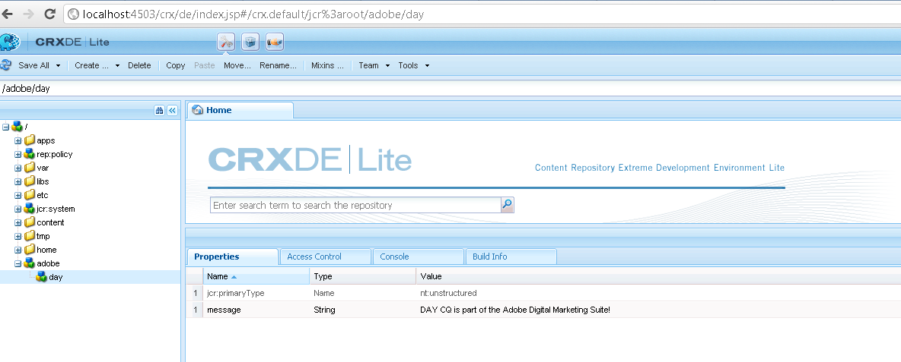

# Så här programmässigt kommer du åt AEM JCR{#how-to-programmatically-access-the-aem-jcr}

Du kan programmässigt ändra noder och egenskaper som finns i Adobe CQ-databasen, som ingår i Adobe Marketing Cloud. Om du vill komma åt CQ-databasen använder du JCR-API:t (Java Content Repository). Du kan använda Java JCR API för att skapa, ersätta, uppdatera och ta bort (CRUD) åtgärder för innehåll som finns i Adobe CQ-databasen. Mer information om Java JCR API finns på [https://jackrabbit.apache.org/jcr/jcr-api.html](https://jackrabbit.apache.org/jcr/jcr-api.html).

>[!NOTE]
>
>Den här utvecklingsartikeln ändrar Adobe CQ JCR från ett externt Java-program. Du kan däremot ändra JCR-inställningen inifrån ett OSGi-paket med JCR API. Mer information finns i [Bevara CQ-data i Java Content Repository](https://helpx.adobe.com/experience-manager/using/persisting-cq-data-java-content1.html).

>[!NOTE]
>
>Om du vill använda JCR-API:t lägger du till `jackrabbit-standalone-2.4.0.jar` filen i Java-programmets klasssökväg. Du kan hämta JAR-filen från Java JCR API-webbsidan på [https://jackrabbit.apache.org/jcr/jcr-api.html](https://jackrabbit.apache.org/jcr/jcr-api.html).

>[!NOTE]
>
>Om du vill lära dig hur du frågar efter Adobe CQ JCR med JCR-fråge-API:t läser du [Fråga Adobe Experience Manager-data med JCR-API:t](https://helpx.adobe.com/experience-manager/using/querying-experience-manager-data-using1.html).

## Skapa en databasinstans {#create-a-repository-instance}

Även om det finns olika sätt att ansluta till en databas och upprätta en anslutning använder den här utvecklingsartikeln en statisk metod som tillhör `org.apache.jackrabbit.commons.JcrUtils` klassen. Metodens namn är `getRepository`. Den här metoden tar en strängparameter som representerar URL:en för Adobe CQ-servern. Exempel `http://localhost:4503/crx/server`.

Metoden `getRepository`returnerar en `Repository`instans, vilket visas i följande kodexempel.

```java
//Create a connection to the AEM JCR repository running on local host
Repository repository = JcrUtils.getRepository("http://localhost:4503/crx/server");
```

## Skapa en sessionsinstans {#create-a-session-instance}

The `Repository`instance representing the CRX database. Du använder `Repository`instansen för att upprätta en session med databasen. Om du vill skapa en session anropar du `Repository`instansens `login`metod och skickar ett `javax.jcr.SimpleCredentials` objekt. Metoden `login`returnerar en `javax.jcr.Session` instans.

Du skapar ett `SimpleCredentials`objekt med hjälp av dess konstruktor och skickar följande strängvärden:

* Användarnamn;
* Motsvarande lösenord

När du skickar den andra parametern anropar du String-objektets `toCharArray`metod. I följande kod visas hur du anropar `login`metoden som returnerar en `javax.jcr.Sessioninstance`.

```java
//Create a Session instance
javax.jcr.Session session = repository.login( new SimpleCredentials("admin", "admin".toCharArray()));
```

## Skapa en nodinstans {#create-a-node-instance}

Använd en `Session`instans för att skapa en `javax.jcr.Node` instans. Med en `Node`instans kan du utföra nodåtgärder. Du kan till exempel skapa en ny nod. Om du vill skapa en nod som representerar rotnoden anropar du `Session`instansens `getRootNode` metod så som visas på följande kodrad.

```java
//Create a Node
Node root = session.getRootNode();
```

När du har skapat en `Node`instans kan du utföra åtgärder som att skapa en annan nod och lägga till ett värde till den. I följande kod skapas två noder och ett värde läggs till i den andra noden.

```java
// Store content
Node day = adobe.addNode("day");
day.setProperty("message", "Adobe CQ is part of the Adobe Digital Marketing Suite!");
```

## Hämta nodvärden {#retrieve-node-values}

Om du vill hämta en nod och dess värde anropar du `Node`instansens `getNode`metod och skickar ett strängvärde som representerar den fullständigt kvalificerade sökvägen till noden. Tänk på nodstrukturen som skapades i föregående kodexempel. Om du vill hämta dagnoden anger du adobe/day enligt följande kod:

```java
// Retrieve content
Node node = root.getNode("adobe/day");
System.out.println(node.getPath());
System.out.println(node.getProperty("message").getString());
```

## Skapa noder i Adobe CQ Repository {#create-nodes-in-the-adobe-cq-repository}

Följande Java-kodexempel representerar en Java-klass som ansluter till Adobe CQ, skapar en `Session`instans och lägger till nya noder. En nod tilldelas ett datavärde och sedan skrivs nodens värde och sökväg ut till konsolen. När du är klar med sessionen måste du logga ut.

```java
/*
 * This Java Quick Start uses the jackrabbit-standalone-2.4.0.jar
 * file. See the previous section for the location of this JAR file
 */

import javax.jcr.Repository;
import javax.jcr.Session;
import javax.jcr.SimpleCredentials;
import javax.jcr.Node;

import org.apache.jackrabbit.commons.JcrUtils;
import org.apache.jackrabbit.core.TransientRepository;

public class GetRepository {

public static void main(String[] args) throws Exception {

try {

    //Create a connection to the CQ repository running on local host
    Repository repository = JcrUtils.getRepository("http://localhost:4503/crx/server");

   //Create a Session
   javax.jcr.Session session = repository.login( new SimpleCredentials("admin", "admin".toCharArray()));

  //Create a node that represents the root node
  Node root = session.getRootNode();

  // Store content
  Node adobe = root.addNode("adobe");
  Node day = adobe.addNode("day");
  day.setProperty("message", "Adobe CQ is part of the Adobe Digital Marketing Suite!");

  // Retrieve content
  Node node = root.getNode("adobe/day");
  System.out.println(node.getPath());
  System.out.println(node.getProperty("message").getString());

  // Save the session changes and log out
  session.save();
  session.logout();
  }
 catch(Exception e){
  e.printStackTrace();
  }
 }
}
```

När du har kört det fullständiga kodexemplet och skapat noderna kan du visa de nya noderna i **[!UICONTROL CRXDE Lite]**, som på följande bild.



