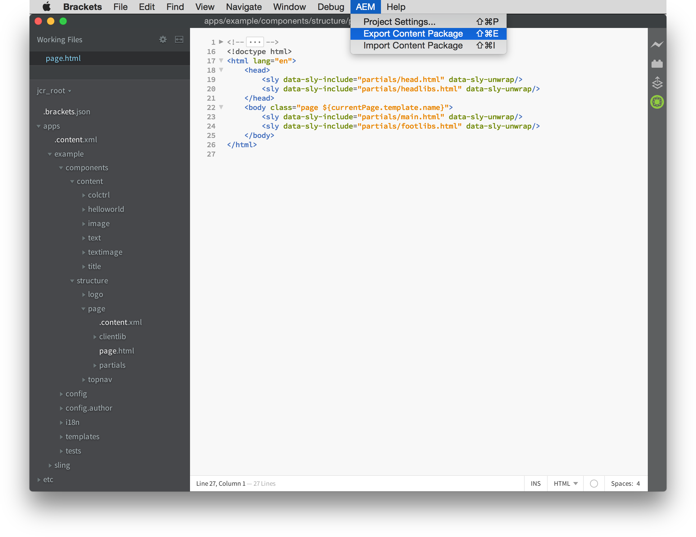
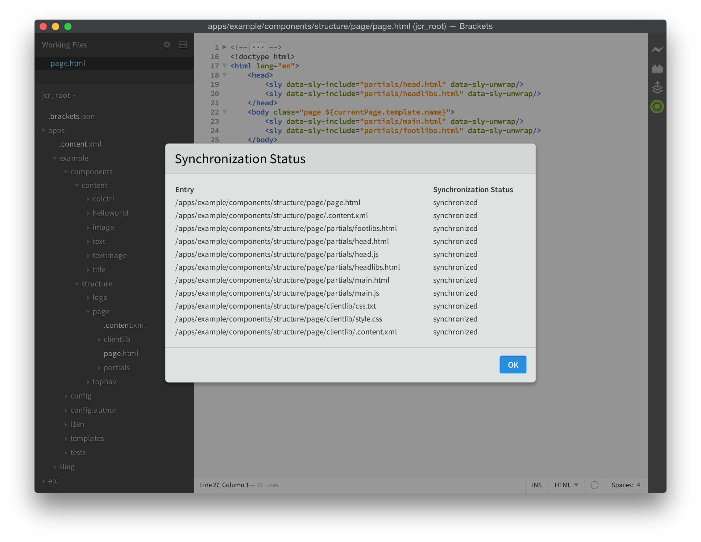

# AEM Brackets Extension{#aem-brackets-extension}

## Översikt {#overview}

AEM Brackets Extension ger ett smidigt arbetsflöde för att redigera AEM komponenter och klientbibliotek och utnyttjar kraften i [Brackets](https://brackets.io/)-kodredigeraren som ger åtkomst till Photoshop-filer och -lager inifrån kodredigeraren. Den enkla synkronisering som tillägget ger (ingen Maven eller filvalv krävs) ökar utvecklarens effektivitet och hjälper även gränssnittsutvecklare med begränsade AEM att delta i projekt. Det här tillägget har också stöd för [HTML-mallspråket (HTL)](https://docs.adobe.com/content/help/en/experience-manager-htl/using/overview.html), vilket gör JSP-komponentutvecklingen enklare och säkrare.

### Funktioner {#features}

De viktigaste funktionerna i AEM Brackets Extension är:

* Automatisk synkronisering av ändrade filer till AEM.
* Manuell dubbelriktad synkronisering av filer och mappar.
* Fullständig innehållspaketsynkronisering av projektet.
* HTML-kodkomplettering för uttryck och `data-sly-*` blockprogramsatser.

Brackets innehåller dessutom många användbara funktioner för AEM teckensnittsutvecklare:

* Stöd för Photoshop-filer för att extrahera information från PSD-filer som lager, mått, färger, teckensnitt, texter m.m.
* Kodtips från PSD-filen för att enkelt återanvända den extraherade informationen i koden.
* Stöd för CSS-preprocessorer, som LESS och SCSS.
* Och hundratals tillägg som täcker mer specifika behov.

## Installation {#installation}

### Hakparenteser {#brackets}

AEM Brackets Extension stöder Brackets version 1.0 eller senare.

Hämta den senaste Brackets-versionen från [brackets.io](https://brackets.io/).

### Tillägget {#the-extension}

Så här installerar du tillägget:

1. Öppna hakparenteser. I menyn **Arkiv** väljer du **Extension Manager...**
1. Ange **AEM** i sökfältet och sök efter **AEM Brackets Extension**.

   

1. Klicka på **Installera**.
1. Stäng dialogrutan och Extension Manager när installationen är klar.

## Komma igång {#getting-started}

### Innehållspaketprojektet {#the-content-package-project}

När tillägget har installerats kan du börja utveckla AEM komponenter genom att öppna en innehållspaketmapp från filsystemet med hakparenteser.

Projektet måste innehålla minst följande:

1. en `jcr_root`-mapp (t.ex. `myproject/jcr_root`)

1. en `filter.xml`-fil (t.ex. `myproject/META-INF/vault/filter.xml`); Mer information om strukturen för `filter.xml`-filen finns i [filterdefinitionen för arbetsyta](https://jackrabbit.apache.org/filevault/filter.html).

Välj **Öppna mapp..** på menyn **Arkiv** och välj antingen mappen `jcr_root` eller den överordnade projektmappen.

>[!NOTE]
>
>Om du inte har ett eget projekt med ett innehållspaket kan du prova [HTL TodoMVC-exemplet](https://github.com/Adobe-Marketing-Cloud/aem-sightly-sample-todomvc). Klicka på **Hämta ZIP** på GitHub, extrahera filerna lokalt och öppna mappen `jcr_root` i Brackets enligt instruktionerna ovan. Följ sedan stegen nedan för att konfigurera **projektinställningarna** och överför slutligen hela paketet till din AEM-utvecklingsinstans genom att göra ett **Exportera innehållspaket** enligt instruktionerna längre ned i avsnittet Fullständig synkronisering av innehållspaket.
>
>Efter dessa steg bör du kunna komma åt URL:en `/content/todo.html` för din AEM-utvecklingsinstans och du kan börja göra ändringar i koden i hakparenteser och se hur ändringarna synkroniserades direkt till AEM-servern när du har gjort en uppdatering i webbläsaren.

### Projektinställningar {#project-settings}

Om du vill synkronisera ditt innehåll till och från en AEM utvecklingsinstans måste du definiera dina projektinställningar. Detta kan du göra genom att gå till menyn **AEM** och välja **Projektinställningar..**

Med projektinställningarna kan du definiera:

1. Server-URL (t.ex. `http://localhost:4502`)
1. Om servrar som inte har ett giltigt HTTPS-certifikat ska tolereras (håll inte markerat om det inte krävs)
1. Användarnamnet som används för att synkronisera innehåll (t.ex. `admin`)
1. Användarens lösenord (t.ex. `admin`)

## Synkroniserar innehåll {#synchronizing-content}

Tillägget AEM Brackets ger följande typer av innehållssynkronisering för filer och mappar som tillåts av filtreringsreglerna som definieras i `filter.xml`:

### Automatisk synkronisering av ändrade filer {#automated-synchronization-of-changed-files}

Detta synkroniserar endast ändringar från hakparenteser till AEM, men inte tvärtom.

### Manuell dubbelriktad synkronisering {#manual-bidirectional-synchronization}

I projektutforskaren öppnar du snabbmenyn genom att högerklicka på en fil eller mapp och alternativen **Exportera till server** eller **Importera från server** kan nås.

>[!NOTE]
>
>Om den markerade posten ligger utanför mappen `jcr_root` inaktiveras sammanhangsberoende menyposter för **Exportera till server** och **Importera från server**.

### Fullständig synkronisering av innehållspaket {#full-content-package-synchronization}

På menyn **AEM** kan alternativen **Exportera innehållspaket** eller **Importera innehållspaket** synkronisera hela projektet med servern.

### Synkroniseringsstatus {#synchronization-status}

I AEM Brackets Extension finns en meddelandeikon i verktygsfältet till höger om Brackets-fönstret, som anger status för den senaste synkroniseringen:

* grön - alla filer har synkroniserats
* blue - en synkroniseringsåtgärd pågår
* gult - vissa av filerna synkroniserades inte
* röd - ingen av filerna synkroniserades

Om du klickar på meddelandeikonen öppnas dialogrutan Synkroniseringsstatus med en lista över all status för varje synkroniserad fil.

>[!NOTE]
>
>Endast innehåll som markerats som inkluderat av filtreringsreglerna från `filter.xml` kommer att synkroniseras, oavsett vilken synkroniseringsmetod som används.
>
>Dessutom stöds `.vltignore`-filer för att utesluta innehåll från synkronisering till och från databasen.

## Redigera HTML-kod {#editing-htl-code}

AEM Brackets Extension innehåller även vissa funktioner för automatisk komplettering som underlättar skrivandet av HTML-attribut och -uttryck.

### Automatisk komplettering av attribut {#attribute-auto-completion}

1. I ett HTML-attribut skriver du `sly`. Attributet fylls i automatiskt till `data-sly-`.
1. Markera HTL-attributet i listrutan.

### Automatisk komplettering av uttryck {#expression-auto-completion}

Inom ett uttryck `${}` slutförs vanliga variabelnamn automatiskt.

## Mer information {#more-information}

AEM Brackets Extension är ett öppen källkodsprojekt som hanteras av organisationen [Adobe Marketing Cloud](https://github.com/Adobe-Marketing-Cloud) under Apache License, version 2.0:

* Koddatabas: [https://github.com/Adobe-Marketing-Cloud/aem-sightly-brackets-extension](https://github.com/Adobe-Marketing-Cloud/aem-sightly-brackets-extension)
* Apache License, version 2.0: [https://www.apache.org/licenses/LICENSE-2.0.html](https://www.apache.org/licenses/LICENSE-2.0.html)

Kodredigeraren Brackets är även ett öppen källkodsprojekt som hanteras av [Adobe Systems Incorporated](https://github.com/adobe)-organisationen på GitHub:

* Koddatabas: [https://github.com/adobe/brackets](https://github.com/adobe/brackets)

Du kan bidra!
