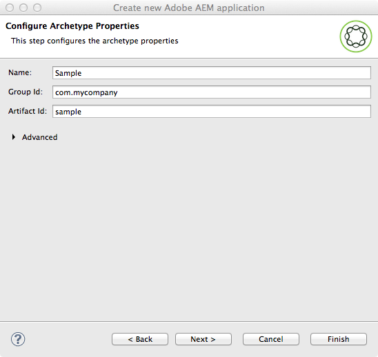

# AEM Developer Tools for Eclipse{#aem-developer-tools-for-eclipse}


## Översikt {#overview}

AEM Developer Tools for Eclipse är en Eclipse-plugin som bygger på [Eclipse-pluginen för Apache Sling](https://sling.apache.org/documentation/development/ide-tooling.html) som lanserats under Apache License 2.

Den har flera funktioner som gör AEM-utvecklingen enklare:

* Smidig integrering med AEM-instanser via Eclipse Server Connector.
* Synkronisering för både innehåll och OSGI-paket.
* Felsökningsstöd med möjlighet att byta kod under drift.
* Enkel start av AEM-projekt via en specifik projektguide.
* Enkel redigering av JCR-egenskaper.

## Krav {#requirements}

Innan du använder AEM Developer Tools måste du:

* Hämta och installera [Eclipse IDE för Java EE-utvecklare](https://eclipse.org/downloads/packages/eclipse-ide-java-ee-developers/lunar). AEM Developer Tools har för närvarande stöd för Eclipse Kepler eller senare

* Kan användas med AEM version 5.6.1 eller senare
* Konfigurera förmörkelseinstallationen för att säkerställa att du har minst 1 gigabyte stackminne genom att redigera din `eclipse.ini` konfigurationsfil enligt beskrivningen i Vanliga frågor om [Eclipse](https://wiki.eclipse.org/FAQ_How_do_I_increase_the_heap_size_available_to_Eclipse%3F).

>[!NOTE]
>
>I macOS måste du högerklicka på **Eclipse.app** och sedan välja **Visa paketinnehåll** för att kunna hitta `eclipse.ini`**.**

## Så här installerar du AEM Developer Tools för Eclipse {#how-to-install-the-aem-developer-tools-for-eclipse}

När du har uppfyllt [kraven](#requirements) ovan kan du installera plugin-programmet på följande sätt:

1. Bläddra på webbplatsen för [**AEM **Developer Tools](https://eclipse.adobe.com/aem/dev-tools/).

1. Kopiera **installationslänken**.

   Observera att du kan hämta ett arkiv i stället för att använda installationslänken. Detta tillåter offlineinstallation men du kommer att sakna automatiska uppdateringsmeddelanden på det här sättet.

1. Öppna **Hjälp** -menyn i Eclipse.
1. Klicka på **Installera ny programvara**.
1. **Klicka på** Lägg till... .
1. I **Namn** skriver du AEM Developer Tools.
1. In **Location** copy the installation URL.
1. Click **Ok**.
1. Kontrollera både **AEM** - och **Sling** -plugin-program.
1. Click **Next**.
1. Click **Next**.
1. Godkänn de linjära avtalen och klicka på **Slutför**.
1. Klicka på **Ja** för att starta om Eclipse.

## Importera befintliga projekt {#how-to-import-existing-projects}

>[!NOTE]
>
>Se [Så här arbetar du med ett paket i Eclipse när det hämtades från AEM](https://stackoverflow.com/questions/29699726/how-to-work-with-a-bundle-in-eclipse-when-it-was-downloaded-from-aem/29705407#29705407).

## AEM-perspektivet {#the-aem-perspective}

AEM Development Tools for Eclipse levereras med ett perspektiv som ger dig full kontroll över dina AEM-projekt och instanser.


## Exempel på flermodulsprojekt {#sample-multi-module-project}

AEM Developer Tools for Eclipse innehåller ett exempel på ett flermodulsprojekt som hjälper dig att snabbt komma igång med en projektkonfiguration i Eclipse, samt är en praktisk guide till flera AEM-funktioner. [Läs mer om Project Archetype](https://github.com/Adobe-Marketing-Cloud/aem-project-archetype).

Så här skapar du exempelprojektet:

1. Gå till **avsnittet** AEM **och välj** AEM Sample Multi-Module Project **på menyn Arkiv** > **Nytt** > **Projekt**.

   

1. Click **Next**.

   >[!NOTE]
   >
   >Det här steget kan ta en stund eftersom m2eclipse behöver genomsöka arkivtypskatalogerna.

   

1. Välj **com.adobe.granite.archietypes: sample-project-architype : (högsta antal)** på menyn och klicka sedan på **Nästa**.

   

1. Fyll i ett **namn**, **grupp-ID** och ett **artefakt-ID** för exempelprojektet. Du kan också välja att ange vissa avancerade egenskaper.

   

1. Du bör sedan konfigurera en AEM-server som Eclipse ska ansluta till.

   Om du vill använda felsökningsfunktionen måste du ha startat AEM i felsökningsläge, vilket du kan göra genom att lägga till följande på kommandoraden:

   ```
       -nofork -agentlib:jdwp=transport=dt_socket,server=y,suspend=n,address=10123
   ```

   

1. Click **Finish**. Projektstrukturen skapas.

   >[!NOTE]
   >
   >I en ny anläggning (närmare bestämt: när större beroenden aldrig har laddats ned) kan det uppstå fel i projektet. I så fall följer du proceduren som beskrivs i [Lösa ogiltig projektdefinition](#resolving-invalid-project-definition).

## Felsökning {#troubleshooting}

### Löser ogiltig projektdefinition {#resolving-invalid-project-definition}

Så här löser du ogiltiga beroenden och projektdefinitioner:

1. Markera alla skapade projekt.
1. Högerklicka. På menyn **Maven** väljer du **Uppdatera projekt**.
1. Markera **Tvinga uppdateringar av ögonblicksbilder/releaser**.
1. Click **OK**. Eclipse försöker hämta nödvändiga beroenden.

### Aktivera automatisk komplettering av taggbibliotek i JSP-filer {#enabling-tag-library-autocompletion-in-jsp-files}

Automatisk komplettering av taggbibliotek går inte att utföra eftersom rätt beroenden läggs till i projektet. Det finns ett känt fel när du använder AEM Uber Jar, som inte innehåller de tld- och TagExtraInfo-filer som behövs.

Se till att artefakten org.apache.sling.scripting.jsp.taglib finns i klassökvägen före AEM Uber Jar för att undvika problemet. För Maven-projekt placerar du följande beroende i pom.xml före Uber Jar.

```xml
<dependency>
  <groupId>org.apache.sling</groupId>
  <artifactId>org.apache.sling.scripting.jsp.taglib</artifactId>
  <scope>provided</scope>
</dependency>
```

Se till att du lägger till rätt version för din distribution av AEM.

## Mer information {#more-information}

Den officiella versionen av Apache Sling IDE-verktygen för Eclipse-webbplatsen innehåller användbar information:

* I [**Apache Sling IDE Tooling for Eclipse **User Guide](https://sling.apache.org/documentation/development/ide-tooling.html)beskrivs de övergripande begreppen, serverintegrering och driftsättningsfunktioner som stöds av AEM Development Tools.
* Avsnittet [Felsökning](https://sling.apache.org/documentation/development/ide-tooling.html#troubleshooting).
* Listan [Kända fel](https://sling.apache.org/documentation/development/ide-tooling.html#known-issues).

Följande officiella [Eclipse](https://eclipse.org/) -dokumentation kan hjälpa dig att konfigurera miljön:

* [Komma igång med Eclipse](https://eclipse.org/users/)
* [Hjälpsystemet Eclipse Luna](https://help.eclipse.org/luna/index.jsp)
* [Maven Integration (m2eclipse)](https://www.eclipse.org/m2e/)

