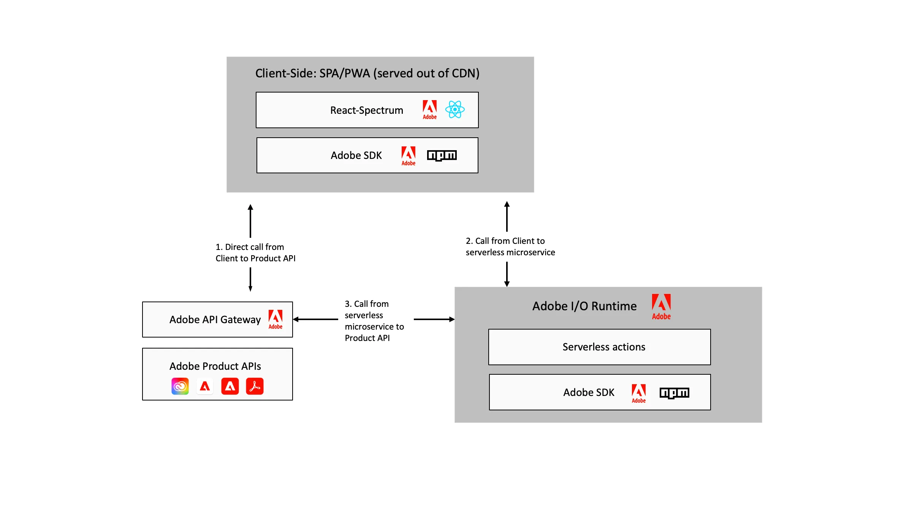

# Utöka [!DNL Adobe Experience Manager] med Adobe Developer App Builder {#extend-using-app-builder}

## Vad är App Builder för AEM {#project-appbuilder}

Med nya Adobe Developer App Builder får utvecklare ett utbyggbart ramverk som underlättar AEM.

App Builder har ett enhetligt ramverk för utbyggbarhet från tredje part för att integrera och skapa anpassade upplevelser som utökar Adobe Experience Manager. Med detta kompletta ramverk för utbyggbarhet, som bygger på Adobe infrastruktur, kan utvecklare skapa anpassade mikrotjänster, utöka och integrera Adobe Experience Manager över Adobe och hela IT-stacken.

App Builder erbjuder ett sätt för kunder att enkelt utöka Adobe Experience Manager i olika fall:

* Utbyggbarhet för mellanvara - Koppla samman externa system med Adobe-program och skapa anpassade anslutningar eller använd en serie färdiga integreringar.
* Utbyggbarhet för bastjänster - Utöka de centrala programfunktionerna genom att utöka standardbeteendet med anpassade funktioner och affärslogik.
* Utbyggbarhet för användarupplevelse - Utöka kärnupplevelsen för att uppfylla verksamhetskrav eller bygga kundspecifika digitala resurser, butiker och back-office-appar.

App Builder har varit tillgängligt för företagskunder och partners via Adobe Developer Preview sedan sommaren 2020. App Builder allmänna tillgänglighet (GA) planeras till december 2021. Adobe välkomnar att utvecklare provar App Builder genom Adobe [Trial Program](https://developer.adobe.com/app-builder/trial/).

>[!NOTE]
>
>För kunder som har AEM as a Cloud Service och vill använda App Builder, se [Utöka Adobe Experience Manager as a Cloud Service med Adobe Developer App Builder](https://experienceleague.adobe.com/docs/experience-manager-65/developing/extending-aem/app-builder.html?lang=sv-SE).

## Arkitektur {#architecture}

I stället för en färdig lösning erbjuder Adobe Developer App Builder en gemensam, konsekvent och standardiserad utvecklingsplattform för utökade Adobe Cloud-lösningar som AEM, inklusive:

* Adobe Developer Console - För utveckling av anpassade mikrotjänster och tillägg kan utvecklare skapa och hantera projekt med tillgång till alla verktyg och API:er de behöver för att skapa plugin-program och integreringar.
* Utvecklingsverktyg - verktyg med öppen källkod, SDK:er och bibliotek som gör det möjligt för utvecklare att enkelt bygga anpassade tillägg och integreringar. Använd React Spectrum (Adobe UI-verktygslådan) om du vill ha ett gemensamt användargränssnitt för alla Adobe-program.
* Tjänster - I/O Runtime för hosting av infrastruktur på Adobe serverless-plattformen och I/O Events för händelsebaserade integreringar. Adobe har också färdiga funktioner för lagring av data och filer.
* Adobe Experience Cloud - Utvecklare kan skicka tillägg och integreringar som ska publiceras i Experience Cloud-organisationen. Systemadministratörer kan sedan granska, hantera och godkänna dessa tillägg. När de publicerats kan du hitta dina anpassade App Builder-tillägg och verktyg tillsammans med andra Adobe Experience Cloud-program.

Följande diagram visar hur ett standardprogram som bygger på App Builder använder dessa funktioner:

Mer information om App Builder-arkitekturen finns i [Översikt över arkitekturen](https://developer.adobe.com/app-builder/docs/guides/).

## Kom igång med App Builder {#additional-resources}

För att hjälpa dig att komma igång med App Builder har en serie dokument skapats som hjälper dig att komma igång:

* [App Builder Komma igång](https://developer.adobe.com/app-builder/docs/getting_started/)

## Fortsätta inlärningen med dokumentation {#appbuilder-documentation}

App Builder tillhandahåller videor och dokumentation för utvecklare, inklusive guider och referensdokumentation som hjälper dig att börja utveckla egna program:

* [App Builder-dokumentation](https://developer.adobe.com/app-builder/docs/overview/)
* [App Builder-videor](https://www.youtube.com/playlist?list=PLcVEYUqU7VRfDij-Jbjyw8S8EzW073F_o)

## Testa ett av exempelprogrammen {#appbuilder-codesamples}

Vill du börja utveckla? Det finns många exempelprogram som hjälper dig att komma igång snabbt:

* [App Builder Code Labs på Adobe Developer webbplats](https://developer.adobe.com/app-builder/docs/resources/)

