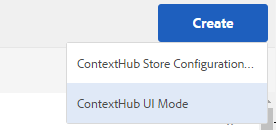

# ContextHub konfigureras {#configuring-contexthub}

ContextHub är ett ramverk för att lagra, ändra och presentera kontextdata. Mer information om ContextHub finns i [dokumentation för utvecklare](/help/sites-developing/contexthub.md). ContextHub-ersättningar [Klientkontext](/help/sites-administering/client-context.md) i pekgränssnittet.

Konfigurera [ContextHub](/help/sites-developing/contexthub.md) för att kontrollera om det visas i förhandsgranskningsläge, för att skapa ContextHub-butiker och lägga till gränssnittsmoduler med det Touch-optimerade användargränssnittet.

## Inaktiverar ContextHub {#disabling-contexthub}

Som standard är ContextHub aktiverat i en AEM installation. ContextHub kan inaktiveras för att förhindra att den läser in js/css och initierar.

<!--
There are two options to disable ContextHub:

* Edit the ContextHub's configuration and check the option **Disable ContextHub**

    1. In the rail click or tap **Tools &gt; Sites &gt; ContextHub**
    1. Click or tap the appropriate **Configuration Container**
    1. Select the **ContextHub Configuration** and click or tap **Edit Selected Element**
    1. Click or tap **Disable ContextHub** and click or tap **Save**

or
-->

* Använd CRXDE Lite för att ange egenskapen `disabled` till **true** under `/libs/settings/cloudsettings/legacy/contexthub`

>[!NOTE]
>
>[På grund av omstrukturering av lager i AEM 6.4](/help/sites-deploying/repository-restructuring.md) platsen för ContextHub-konfigurationer har ändrats från `/etc/cloudsettings` till:
>
>* `/libs/settings/cloudsettings`
>* `/conf/global/settings/cloudsettings`
>* `/conf/<tenant>/settings/cloudsettings`

## Visa och dölja ContextHub-gränssnittet {#showing-and-hiding-the-contexthub-ui}

Konfigurera Adobe Granite ContextHub OSGi-tjänsten för att visa eller dölja [ContextHub-gränssnitt](/help/sites-authoring/ch-previewing.md) på era sidor. Tjänstens PID är `com.adobe.granite.contexthub.impl.ContextHubImpl.`

Du kan antingen använda [Webbkonsol](/help/sites-deploying/configuring-osgi.md#osgi-configuration-with-the-web-console) eller använda [JCR-nod i databasen](/help/sites-deploying/configuring-osgi.md#osgi-configuration-in-the-repository):

* **Webbkonsol:** Om du vill visa användargränssnittet väljer du egenskapen Visa användargränssnitt. Om du vill dölja användargränssnittet avmarkerar du egenskapen Dölj användargränssnitt.
* **JCR-nod:** Ange det booleska värdet för att visa användargränssnittet `com.adobe.granite.contexthub.show_ui` egenskap till `true`. Om du vill dölja användargränssnittet anger du egenskapen till `false`.

När du visar ContextHub-gränssnittet visas det bara på sidor AEM författarinstanser. Gränssnittet visas inte på sidor med publiceringsinstanser.

## Lägga till gränssnittslägen och moduler för ContextHub {#adding-contexthub-ui-modes-and-modules}

Konfigurera de gränssnittslägen och moduler som visas i ContextHub-verktygsfältet i förhandsgranskningsläget:

* Gränssnittslägen: Grupper av relaterade moduler
* Moduler: Widgetar som visar kontextdata från en butik och gör att författare kan ändra kontexten

Gränssnittslägen visas som en serie ikoner till vänster i verktygsfältet. När du väljer det här alternativet visas modulerna för ett användargränssnittsläge till höger.


Ikoner är referenser från [Coral UI icon library](https://helpx.adobe.com/experience-manager/6-4/sites/developing/using/reference-materials/coral-ui/coralui3/Coral.Icon.html#availableIcons).

### Lägga till ett gränssnittsläge {#adding-a-ui-mode}

Lägg till ett gränssnittsläge för att gruppera relaterade ContextHub-moduler. När du skapar gränssnittsläget anger du den titel och ikon som visas i ContextHub-verktygsfältet.

1. Klicka eller tryck på Verktyg > Platser > Kontextnav på Experience Manager-listen.
1. Klicka på eller tryck på standardkonfigurationsbehållaren.
1. Klicka eller tryck på Kontextnavkonfigurationen.
1. Klicka på eller tryck på knappen Skapa och klicka sedan på eller tryck på gränssnittsläget för kontextnav.

   

1. Ange värden för följande egenskaper:

   * Rubrik för användargränssnittsläge: Den titel som identifierar användargränssnittsläget
   * Lägesikon: Väljaren för [Coral UI icon](https://helpx.adobe.com/experience-manager/6-4/sites/developing/using/reference-materials/coral-ui/coralui3/Coral.Icon.html#availableIcons) att använda, till exempel `coral-Icon--user`
   * Aktiverad: Välj det här alternativet om du vill visa användargränssnittsläget i verktygsfältet ContextHub

1. Klicka på eller tryck på Spara.

### Lägga till en gränssnittsmodul {#adding-a-ui-module}

Lägg till en ContextHub-gränssnittsmodul i ett UI-läge så att den visas i ContextHub-verktygsfältet för förhandsgranskning av sidinnehåll. När du lägger till en UI-modul skapar du en instans av en modultyp som är registrerad med ContextHub. Om du vill lägga till en gränssnittsmodul måste du känna till namnet på den associerade modultypen.

AEM innehåller en grundläggande gränssnittsmodultyp samt flera exempeltyper av gränssnittsmodul som du kan basera en gränssnittsmodul på. Följande tabell innehåller en kort beskrivning av vart och ett av dem. Mer information om hur du utvecklar en anpassad gränssnittsmodul finns i [Skapa gränssnittsmoduler för ContextHub](/help/sites-developing/ch-extend.md#creating-contexthub-ui-module-types).

Egenskaperna för användargränssnittsmodulen innehåller en detaljkonfiguration där du kan ange värden för modulspecifika egenskaper. Du anger detaljkonfigurationen i JSON-format. Kolumnen Modultyp i tabellen innehåller länkar till information om den JSON-kod som krävs för varje gränssnittsmodultyp.

| Modultyp | Beskrivning | Butik |
|---|---|---|
| [contexthub.base](/help/sites-developing/ch-samplemodules.md#contexthub-base-ui-module-type) | En allmän gränssnittsmodultyp | Konfigureras i gränssnittsmodulens egenskaper |
| [contexthub.browserinfo](/help/sites-developing/ch-samplemodules.md#contexthub-browserinfo-ui-module-type) | Visar information om webbläsaren | surferinfo |
| [contexthub.datetime](/help/sites-developing/ch-samplemodules.md#contexthub-datetime-ui-module-type) | Visar datum- och tidsinformation | datetime |
| [contexthub.device](/help/sites-developing/ch-samplemodules.md#contexthub-device-ui-module-type) | Visa klientenheten | emulatorer |
| [contexthub.location](/help/sites-developing/ch-samplemodules.md#contexthub-location-ui-module-type) | Visar klientens latitud och longitud samt platsen på en karta. Gör att du kan ändra platsen. | geolokalisering |
| [contexthub.screen-orientation](/help/sites-developing/ch-samplemodules.md#contexthub-screen-orientation-ui-module-type) | Visar enhetens skärmorientering (liggande eller stående) | emulatorer |
| [contexthub.tagcloud](/help/sites-developing/ch-samplemodules.md#contexthub-tagcloud-ui-module-type) | Visar statistik om sidtaggar | tagcloud |
| [granite.profile](/help/sites-developing/ch-samplemodules.md#granite-profile-ui-module-type) | Visar profilinformationen för den aktuella användaren, inklusive authorizedID, displayName och familyName. Du kan ändra värdet för displayName och familyName. | profil |

1. Klicka eller tryck på Verktyg > Platser > ContextHub på Experience Manager-listen.
1. Klicka på eller tryck på den konfigurationsbehållare som du vill lägga till en gränssnittsmodul i.
1. Klicka på eller skriv den ContextHub-konfiguration som du vill lägga till gränssnittsmodulen i.
1. Klicka eller tryck på det användargränssnittsläge som du lägger till användargränssnittsmodulen i.
1. Klicka på eller tryck på knappen Skapa och sedan på eller tryck på ContextHub UI Module (generisk).

   

1. Ange värden för följande egenskaper:

   * Modultitel för användargränssnitt: En titel som identifierar användargränssnittsmodulen
   * Modultyp: Modultypen
   * Aktiverad: Välj det här alternativet om du vill visa gränssnittsmodulen i ContextHub-verktygsfältet

1. (Valfritt) Om du vill åsidosätta standardkonfigurationen för lagring anger du ett JSON-objekt för att konfigurera UI-modulen.
1. Klicka på eller tryck på Spara.

## Skapa ett ContextHub Store {#creating-a-contexthub-store}

Skapa ett kontextnavlager för att behålla användardata och komma åt data efter behov. ContextHub-butikerna baseras på registrerade butikskandidater. När du skapar butiken behöver du värdet för den storeType som butikskandidaten registrerats med. (Se [Skapa anpassade butikskandidater](/help/sites-developing/ch-extend.md#creating-custom-store-candidates).)

### Detaljerad lagringskonfiguration {#detailed-store-configuration}

När du konfigurerar en butik kan du med egenskapen Detaljkonfiguration ange värden för butiksspecifika egenskaper. Värdet baseras på `config` parameter för butikens `init` funktion. Därför beror det på butiken om du behöver ange det här värdet och värdeformatet.

Värdet för egenskapen Detaljkonfiguration är en `config` -objekt i JSON-format.

### Exempelarkivsökande {#sample-store-candidates}

AEM innehåller följande exempel på butikskandidater som du kan basera en butik på.

| Butikstyp | Beskrivning |
|---|---|
| [aem.segmentation](/help/sites-developing/ch-samplestores.md#aem-segmentation-sample-store-candidate) | Lagra för lösta och olösta ContextHub-segment. Hämtar automatiskt segment från ContextHub SegmentManager |
| [aem.resolvedsegments](/help/sites-developing/ch-samplestores.md#aem-resolvedsegments-sample-store-candidate) | Lagrar de segment som är lösta just nu. Lyssnar på tjänsten ContextHub SegmentManager för att automatiskt uppdatera butiken |
| [contexthub.geolocation](/help/sites-developing/ch-samplestores.md#contexthub-geolocation-sample-store-candidate) | Lagrar latitud- och longitudvärdena för webbläsarplatsen. |
| [contexthub.datetime](/help/sites-developing/ch-samplestores.md#contexthub-datetime-sample-store-candidate) | Lagrar aktuellt datum, aktuell tid och aktuell säsong för webbläsarplatsen |
| [granite.emulators](/help/sites-developing/ch-samplestores.md#granite-emulators-sample-store-candidate) | Definierar egenskaper och funktioner för ett antal enheter och identifierar den aktuella klientenheten |
| [contexthub.generic-jsonp](/help/sites-developing/ch-samplestores.md#contexthub-generic-jsonp-sample-store-candidate) | Hämtar och lagrar data från en JSONP-tjänst |
| [granite.profile](/help/sites-developing/ch-samplestores.md#granite-profile-sample-store-candidate) | Lagrar profildata för den aktuella användaren |
| [contexthub.surferinfo](/help/sites-developing/ch-samplestores.md#contexthub-surferinfo-sample-store-candidate) | Lagrar information om klienten, till exempel enhetsinformation, webbläsartyp och fönsterorientering |
| [contexthub.tagcloud](/help/sites-developing/ch-samplestores.md#contexthub-tagcloud-sample-data-store) | Lagrar sidtaggar och antal taggar |

1. Klicka eller tryck på Verktyg > Platser > ContextHub på Experience Manager-listen.
1. Klicka eller tryck på standardkonfigurationsbehållaren.
1. Klicka på Kontexthub-konfiguration
1. Om du vill lägga till en butik klickar eller trycker du på ikonen Skapa och sedan på eller trycker du på ContexHub Store Configuration.

   

1. Ange värden för de grundläggande konfigurationsegenskaperna och klicka eller tryck sedan på Nästa:

   * **Konfigurationstitel:** Titeln som identifierar butiken
   * **Lagringstyp:** Värdet på egenskapen storeType för butikskandidaten som butiken ska baseras på
   * **Obligatoriskt:** Välj
   * **Aktiverad:** Markera för att aktivera butiken

1. (Valfritt) Om du vill åsidosätta standardarkivkonfigurationen anger du ett JSON-objekt i rutan Detaljkonfiguration (JSON).
1. Klicka på eller tryck på Spara.

## Exempel: Använda en JSONP-tjänst  {#example-using-a-jsonp-service}

I det här exemplet visas hur du konfigurerar en lagringsplats och visar data i en gränssnittsmodul. I det här exemplet används MD5-tjänsten på jsontest.com webbplats som datakälla för en butik. Tjänsten returnerar MD5-hash-koden för en sträng i JSON-format.

Ett contextHub.generic-jsonp-arkiv har konfigurerats så att det lagrar data för serviceanropet `https://md5.jsontest.com/?text=%22text%20to%20md5%22`. Tjänsten returnerar följande data som visas i en gränssnittsmodul:

```xml
{
   "md5": "919a56ab62b6d5e1219fe1d95248a2c5",
   "original": "\"text to md5\""
}
```

### Skapa ett kontexthub.generic-jsonp-arkiv {#creating-a-contexthub-generic-jsonp-store}

Med exempelarkivkandidaten contexthub.generic-jsonp kan du hämta data från en JSONP-tjänst eller en webbtjänst som returnerar JSON-data. För den här butikskandidaten använder du butikskonfigurationen för att ange information om den JSONP-tjänst som ska användas.

The [init](/help/sites-developing/contexthub-api.md#init-name-config) funktionen i `ContextHub.Store.JSONPStore` JavaScript-klassen definierar en `config` objekt som initierar den här lagringskanalen. The `config` objektet innehåller `service` -objekt som innehåller information om JSONP-tjänsten. Om du vill konfigurera butiken anger du `service` -objekt i JSON-format som värde för egenskapen Detaljkonfiguration.

Om du vill spara data från MD5-tjänsten på jsontest.com här webbplatsen ska du göra så här: [Skapa ett ContextHub Store](/help/sites-developing/ch-configuring.md#creating-a-contexthub-store) med följande egenskaper:

* **Konfigurationstitel:** md5
* **Lagringstyp:** contexthub.generic-jsonp
* **Obligatoriskt:** Välj
* **Aktiverad:** Välj
* **Detaljkonfiguration (JSON):**

  ```xml
  {
   "service": {
   "jsonp": false,
   "timeout": 1000,
   "ttl": 1800000,
   "secure": false,
   "host": "md5.jsontest.com",
   "port": 80,
   "params":{
   "text":"text to md5"
       }
     }
   }
  ```

### Lägga till en gränssnittsmodul för md5-data {#adding-a-ui-module-for-the-md-data}

Lägg till en gränssnittsmodul i ContextHub-verktygsfältet för att visa data som lagras i exempelarkivet md5. I det här exemplet används modulen contexthub.base för att skapa följande gränssnittsmodul:


Använd proceduren i [Lägga till en gränssnittsmodul](#adding-a-ui-module) om du vill lägga till gränssnittsmodulen i ett befintligt användargränssnittsläge, t.ex. ett exempel på användargränssnittsläge. Använd följande egenskapsvärden för UI-modulen:

* **Modultitel för användargränssnitt:** MD5
* **Modultyp:** contexthub.base
* **Detaljkonfiguration (JSON):**

  ```xml
  {
   "icon": "coral-Icon--data",
   "title": "MD5 Converstion",
   "storeMapping": { "md5": "md5" },
   "template": "<p> {{md5.original}}</p>;
                <p>{{md5.md5}}</p>"
  }
  ```

## Debugging ContextHub {#debugging-contexthub}

Ett felsökningsläge för ContextHub kan aktiveras för att tillåta felsökning. Felsökningsläget kan aktiveras antingen via ContextHub-konfigurationen eller via CRXDE.

### Via konfigurationen {#via-the-configuration}

Redigera ContextHub-konfigurationen och markera alternativet **Felsök**

1. Klicka eller tryck i rälen **Verktyg > Sites > ContextHub**
1. Klicka eller tryck på standardinställningen **Konfigurationsbehållare**
1. Välj **KontextHub-konfiguration** och klicka eller trycka **Redigera markerat element**
1. Klicka eller tryck **Felsök** och klicka eller trycka **Spara**

### Via CRXDE {#via-crxde}

Använd CRXDE Lite för att ange egenskapen `debug` till **true** under:

* `/conf/global/settings/cloudsettings` eller
* `/conf/<tenant>/settings/cloudsettings`

>[!NOTE]
>
>För ContextHub-konfigurationer som fortfarande finns under de äldre sökvägarna anger platsen den `debug property` är `/libs/settings/cloudsettings/legacy/contexthub`.

### Tyst läge {#silent-mode}

I tyst läge inaktiveras all felsökningsinformation. Till skillnad från det normala felsökningsalternativet, som kan anges separat för varje ContextHub-konfiguration, är tyst läge en global inställning som har företräde framför eventuella felsökningsinställningar på ContextHub-konfigurationsnivån.

Detta är användbart för din publiceringsinstans där du inte vill ha någon felsökningsinformation alls. Eftersom det är en global inställning aktiveras den via OSGi.

1. Öppna **Konfiguration av Adobe Experience Manager Web Console** på `http://<host>:<port>/system/console/configMgr`
1. Sök efter **Adobe Granite ContextHub**
1. Klicka på konfigurationen **Adobe Granite ContextHub** för att redigera dess egenskaper
1. Markera alternativet **Tyst läge** och klicka **Spara**

## Återställer ContextHub-konfigurationer efter uppgradering {#recovering-contexthub-configurations-after-upgrading}

När en [uppgradera till AEM](/help/sites-deploying/upgrade.md) utförs säkerhetskopieras ContextHub-konfigurationerna och lagras på en säker plats. Under uppgraderingen installeras ContextHub-standardkonfigurationerna, vilket ersätter de befintliga konfigurationerna. Säkerhetskopieringen krävs för att bevara ändringar eller tillägg som du har gjort.

ContextHub-konfigurationer lagras i en mapp med namnet `contexthub` under följande noder:

* `/conf/global/settings/cloudsettings`
* `/conf/<tenant>/settings/cloudsettings`

Efter en uppgradering lagras säkerhetskopian i en mapp med namnet `contexthub` nedanför en nod med namnet:

`/conf/global/settings/cloudsettings/default-pre-upgrade_yyyymmdd_xxxxxxx` eller
`/conf/<tenant>/settings/cloudsettings/default-pre-upgrade_yyyymmdd_xxxxxxx`

The `yyyymmdd` del av nodnamnet är det datum då uppgraderingen utfördes.

Om du vill återställa dina ContextHub-konfigurationer använder du CRXDE Lite för att kopiera noderna som representerar dina butiker, gränssnittslägen och gränssnittsmoduler nedanför `default-pre-upgrade_yyyymmdd_xxxxxx` nod till nedan:

* `/conf/global/settings/cloudsettings` eller
* `/conf/<tenant>/settings/cloudsettings`
