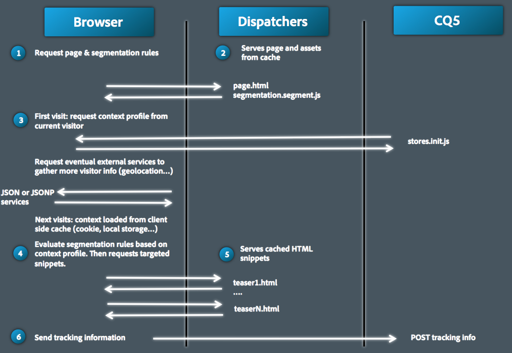
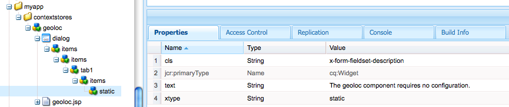

# Klientkontext i detalj{#client-context-in-detail}

>[!NOTE]
>
>Klientkontext har ersatts av ContextHub. Mer information finns i den [relaterade dokumentationen](/help/sites-developing/contexthub.md) .

Klientkontexten representerar en dynamiskt sammansatt samling med användardata. Du kan använda data för att avgöra vilket innehåll som ska visas på en webbsida i en viss situation (målinriktning av innehåll). Data är också tillgängliga för webbplatsanalys och för alla javascript-skript på sidan.

Klientkontext består huvudsakligen av följande aspekter:

* Sessionsarkivet som innehåller användardata.
* Användargränssnittet som visar användardata och innehåller verktyg för att simulera användarupplevelsen.
* Ett [javascript-API](/help/sites-developing/ccjsapi.md) för interaktion med sessionslager.

Om du vill skapa ett fristående sessionsarkiv och lägga till det i klientkontexten, eller skapa ett sessionsarkiv som är kopplat till en Context Store-komponent. AEM installerar flera Context Store-komponenter som du kan använda direkt. Du kan använda de här komponenterna som bas för dina komponenter.

Mer information om hur du öppnar klientkontext, konfigurerar den information som visas och simulerar användarupplevelsen finns i [Klientkontext](/help/sites-administering/client-context.md).

## Sessionslager {#session-stores}

Klientkontexten innehåller olika sessionslager som innehåller användardata. Lagringsdata kommer från följande källor:

* Klientens webbläsare.
* Servern (se [JSONP Store](/help/sites-administering/client-context.md#main-pars-variable-8) för lagring av information från tredjepartskällor)

Client Context Framework innehåller ett [javascript-API](/help/sites-developing/ccjsapi.md) som du kan använda för att interagera med sessionslager för att läsa och skriva användardata, samt för att avlyssna och reagera på butikshändelser. Du kan också skapa sessionsarkiv för användardata som du använder för innehåll som är avsett för målinriktning eller andra syften.

Sessionsarkivdata finns kvar på klienten. Klientkontexten skriver inte tillbaka data till servern. Använd ett formulär eller utveckla ett anpassat javascript om du vill skicka data till servern.

Varje sessionsarkiv är en samling egenskapspar. Sessionsarkivet representerar en samling data (av alla slag) vars konceptuella betydelse kan bestämmas av designern och/eller utvecklaren. I följande exempel definieras javascript-koden som ett objekt som representerar profildata som sessionslagringen kan innehålla:

```
{
  age: 20,
  authorizableId: "aparker@geometrixx.info",
  birthday: "27 Feb 1992",
  email: "aparker@geometrixx.info",
  formattedName: "Alison Parker",
  gender: "female",
  path: "/home/users/geometrixx/aparker@geometrixx.info/profile"
}
```

Ett sessionsarkiv kan sparas mellan olika webbläsarsessioner eller kan bara vara i den webbläsarsession som det skapades i.

>[!NOTE]
>
>Butikens beständighet använder antingen webbläsarlagring eller cookies ( `SessionPersistence` cookie). Webbläsarlagring är vanligare.
>
>När webbläsaren stängs och öppnas igen kan ett sessionsarkiv läsas in med värdena från ett beständigt arkiv. Du behöver sedan rensa webbläsarens cache för att ta bort de gamla värdena.

### Context Store-komponenter {#context-store-components}

En kontextlagringskomponent är en CQ-komponent som kan läggas till i klientkontexten. Komponenter i kontextarkivet visar vanligtvis data från ett sessionsarkiv som de är associerade med. Informationen som visas i kontextlagringskomponenter är dock inte begränsad till sessionsarkivdata.

Context Store-komponenter kan innehålla följande objekt:

* JSP-skript som definierar utseendet i klientkontexten.
* Egenskaper för att lista komponenten i Sidekick.
* Redigera dialogrutor för att konfigurera komponentinstanser.
* Javascript som initierar sessionsarkivet.

En beskrivning av de installerade Context Store-komponenterna som du kan lägga till i Context Store finns i [Tillgängliga klientkontextkomponenter](/help/sites-administering/client-context.md#available-client-context-components).

>[!NOTE]
>
>Siddata är inte längre en standardkomponent i klientkontexten. Om det behövs kan du lägga till detta genom att redigera klientkontexten, lägga till **den allmänna lagringsegenskapen** och sedan konfigurera den för att definiera **butiken** som `pagedata`.

### Målanpassad innehållsleverans {#targeted-content-delivery}

Profilinformation används också för att leverera [riktat innehåll](/help/sites-authoring/content-targeting-touch.md).

 

## Lägga till klientkontext på en sida {#adding-client-context-to-a-page}

Inkludera klientkontextkomponenten i huvudavsnittet på dina webbsidor för att aktivera klientkontext. Sökvägen för klientkontextkomponentnoden är `/libs/cq/personalization/components/clientcontext`. Om du vill ta med komponenten lägger du till följande kod i JSP-filen för sidkomponenten, som finns precis nedanför sidans `body` element:

```java
<cq:include path="clientcontext" resourceType="cq/personalization/components/clientcontext"/>
```

Klientkontextkomponenten gör att sidan läser in klientbiblioteken som implementerar klientkontext.

* Klientkontextens javascript-API.
* Client Context Framework som stöder sessionsarkiv, händelsehantering osv.
* Segment som är definierade.
* Init.js-skripten som genereras för varje kontextlagringskomponent som har lagts till i Client Context.
* (Endast författarinstans) Användargränssnittet för klientkontexten.

Användargränssnittet för klientkontext är bara tillgängligt på författarinstansen.

## Utöka klientkontext {#extending-client-context}

Om du vill utöka klientkontexten skapar du ett sessionsarkiv och kan även visa lagringsdata:

* Skapa ett sessionsarkiv för de användardata ni behöver för målinriktning och webbanalys.
* Skapa en kontextlagringskomponent som gör det möjligt för administratörer att konfigurera det associerade sessionsarkivet och att visa lagringsdata i klientkontexten för testning.

>[!NOTE]
>
>Om du har (eller skapar) en `JSONP` tjänst som kan tillhandahålla data kan du helt enkelt använda `JSONP` kontextlagringskomponenten och mappa den till JSONP-tjänsten. Detta hanterar sessionsarkivet.

### Skapa ett sessionsarkiv {#creating-a-session-store}

Skapa ett sessionsarkiv för data som du behöver lägga till i och hämta från klientkontext. I allmänhet använder du följande procedur för att skapa ett sessionsarkiv:

1. Skapa en klientbiblioteksmapp som har `categories` egenskapsvärdet `personalization.stores.kernel`. Klientkontext läser automatiskt in klientbiblioteken i den här kategorin.

1. Konfigurera klientbiblioteksmappen så att den är beroende av `personalization.core.kernel` klientbiblioteksmappen. Klientbiblioteket innehåller API:t för klientkontext javascript `personalization.core.kernel` .

1. Lägg till det javascript-skript som skapar och initierar sessionsarkivet.

Om javascript inkluderas i klientbiblioteket personalization.stores.kernel skapas arkivet när klientkontextramverket läses in.

>[!NOTE]
>
>Om du skapar ett sessionsarkiv som en del av en kontextlagringskomponent, kan du alternativt placera javascript i komponentens init.js.jsp-fil. I det här fallet skapas endast sessionsarkivet om komponenten läggs till i klientkontexten.

#### Olika typer av sessionslager {#types-of-session-stores}

Sessionsarkiv skapas och är tillgängliga under en webbläsarsession, eller lagras i webbläsarlagring eller cookies. Klientkontextens javascript-API definierar flera klasser som representerar båda typerna av datalager:

* ` [CQ_Analytics.SessionStore](/help/sites-developing/ccjsapi.md#cq-analytics-sessionstore)`: De här objekten finns bara på sidan DOM. Data skapas och sparas under sidans livstid.
* ` [CQ_Analytics.PerstistedSessionStore](/help/sites-developing/ccjsapi.md#cq-analytics-persistedsessionstore)`: Objekten finns på sidan DOM och sparas antingen i webbläsarlagringen eller i cookies. Data är tillgängliga på olika sidor och mellan användarsessioner.

API:t innehåller även tillägg för dessa klasser som är specialiserade för att lagra JSON-data eller JSONP-data:

* Objekt som endast är för session: [CQ_Analytics.JSONStore](/help/sites-developing/ccjsapi.md#cq-analytics-jsonstore) och [CQ_Analytics.JSONPStore](/help/sites-developing/ccjsapi.md#cq-analytics-jsonpstore).

* Beständiga objekt: [CQ_Analytics.PersistedJSONStore](/help/sites-developing/ccjsapi.md#cq-analytics-persistedjsonstore) och [CQ_Analytics.PersistedJSONPStore](/help/sites-developing/ccjsapi.md#cq-analyics-persistedjsonpstore).

#### Skapar objektet för sessionsarkivet {#creating-the-session-store-object}

JavaScript-skriptet för klientbiblioteksmappen skapar och initierar sessionsarkivet. Sessionsarkivet måste sedan registreras med Context Store Manager. I följande exempel skapas och registreras ett [CQ_Analytics.SessionStore](/help/sites-developing/ccjsapi.md#cq-analytics-sessionstore) -objekt.

```
//Create the session store
if (!CQ_Analytics.MyStore) {
    CQ_Analytics.MyStore = new CQ_Analytics.SessionStore();
    CQ_Analytics.MyStore.STOREKEY = "MYSTORE";
    CQ_Analytics.MyStore.STORENAME = "mystore";
    CQ_Analytics.MyStore.data={};
}
//register the session store
if (CQ_Analytics.ClientContextMgr){
    CQ_Analytics.ClientContextMgr.register(CQ_Analytics.MyStore)
}
```

För lagring av JSON-data skapar och registrerar följande exempel ett [CQ_Analytics.JSONStore](/help/sites-developing/ccjsapi.md#cq-analytics-sessionstore) -objekt.

```
if (!CQ_Analytics.myJSONStore) {
    CQ_Analytics.myJSONStore = CQ_Analytics.JSONStore.registerNewInstance("myjsonstore",{});
}
```

### Skapa en Context Store-komponent {#creating-a-context-store-component}

Skapa en kontextlagringskomponent som återger sessionsarkivdata i klientkontexten. När du har skapat en kontextlagringskomponent kan du dra den till klientkontexten för att återge data från ett sessionsarkiv. Context Store-komponenter består av följande objekt:

* JSP-skript för återgivning av data.
* En redigeringsdialogruta.
* Ett JSP-skript för initiering av sessionsarkivet.
* (Valfritt) En biblioteksmapp för klienten som skapar sessionsarkivet. Klientbiblioteksmappen behöver inte inkluderas om komponenten använder ett befintligt sessionsarkiv.

#### Utöka de medföljande komponenterna i Context Store {#extending-the-provided-context-store-components}

AEM innehåller komponenterna genericstore och genericstoreproperties context store som du kan utöka. Strukturen för dina lagringsdata avgör vilken komponent du utökar:

* Egenskapsvärdepar: Utöka `GenericStoreProperties` komponenten. Den här komponenten återger automatiskt lager med egenskapspar. Flera interaktionspunkter finns:

   * `prolog.jsp` och `epilog.jsp`: -komponenten som gör att du kan lägga till serversidans logik före eller efter komponentåtergivningen.

* Komplexa data: Utöka `GenericStore` komponenten. Din sessionsbutik behöver sedan en renderingsmetod som anropas varje gång komponenten behöver renderas. Återgivningsfunktionen anropas med två parametrar:

   * `@param {String} store`
Det arkiv som ska återges

   * `@param {String} divId`
ID för den div som butiken ska återges i.

>[!NOTE]
>
>Alla klientkontextkomponenter är tillägg till antingen den allmänna lagringsplatsen eller den allmänna lagringsegenskapen. Flera exempel installeras i `/libs/cq/personalization/components/contextstores` mappen.

#### Konfigurera utseende i Sidekick {#configuring-the-appearance-in-sidekick}

När du redigerar klientkontext visas kontextlagringskomponenter i Sidekick. Precis som för alla komponenter avgör `componentGroup` - och `jcr:title` -egenskaperna för klientkontextkomponenten gruppen och komponentens namn.

Alla komponenter som har `componentGroup` egenskapsvärdet `Client Context` visas som standard i Sidespark. Om du använder ett annat värde för `componentGroup` egenskapen måste du manuellt lägga till komponenten i Sidekick i designläge.

#### Context Store-komponentinstanser {#context-store-component-instances}

När du lägger till en kontextlagringskomponent i klientkontexten skapas en nod som representerar komponentinstansen nedan `/etc/clientcontext/default/content/jcr:content/stores`. Den här noden innehåller egenskapsvärden som har konfigurerats med komponentens redigeringsdialogruta.

När klientkontexten initieras bearbetas dessa noder.

#### Initierar associerat sessionsarkiv {#initializing-the-associated-session-store}

Lägg till en init.js.jsp-fil i komponenten för att generera javascript-kod som initierar det sessionsarkiv som din kontextlagringskomponent använder. Använd till exempel initieringsskriptet för att hämta konfigurationsegenskaper för komponenten och använda dem för att fylla i sessionsarkivet.

Det javascript som genereras läggs till på sidan när klientkontext initieras vid sidinläsning på både författaren och publiceringsinstanser. Denna JSP körs innan kontextlagringskomponentinstansen läses in och återges.

Koden måste ange mime-typen för filen till `text/javascript`, annars körs den inte.

>[!CAUTION]
>
>Skriptet init.js.jsp körs på författaren och publiceringsinstansen, men bara om kontextlagringskomponenten läggs till i klientkontexten.

Följande procedur skapar init.js.jsp-skriptfilen och lägger till koden som anger rätt MIME-typ. Koden som utför butiksinitieringen följer.

1. Högerklicka på kontextlagringskomponentnoden och klicka på Skapa > Skapa fil.
1. I fältet Namn skriver du `init.js.jsp` och klickar sedan på OK.
1. Lägg till följande kod högst upp på sidan och klicka sedan på Spara alla.

   ```java
   <%@page contentType="text/javascript" %>
   ```

### Återger sessionsarkivdata för genericstoreproperties-komponenter {#rendering-session-store-data-for-genericstoreproperties-components}

Visa sessionsarkivdata i klientkontext i ett konsekvent format.

#### Visa egenskapsdata {#displaying-property-data}

Personaliseringstagglib tillhandahåller den `personalization:storePropertyTag` tagg som visar värdet för en egenskap från ett sessionsarkiv. Om du vill använda taggen inkluderar du följande kodrad i JSP-filen:

```xml
<%@taglib prefix="personalization" uri="https://www.day.com/taglibs/cq/personalization/1.0" %>
```

Taggen har följande format:

```xml
<personalization:storePropertyTag propertyName="property_name" store="session_store_name"/>
```

Attributet `propertyName` är namnet på butiksegenskapen som ska visas. Attributet `store` är namnet på det registrerade arkivet. I följande exempeltagg visas värdet för egenskapen `authorizableId` för `profile` butiken:

```xml
<personalization:storePropertyTag propertyName="authorizableId" store="profile"/>
```

#### HTML-struktur {#html-structure}

Klientbiblioteksmappen personalization.ui (/etc/clientlibs/foundation/personalization/ui/themes/default) innehåller de CSS-format som används i Client Context för att formatera HTML-koden. I följande kod visas den föreslagna strukturen som används för att visa butiksdata:

```xml
<div class="cq-cc-store">
   <div class="cq-cc-thumbnail">
      <div class="cq-cc-store-property">
           <!-- personalization:storePropertyTag for the store thumbnail image goes here -->
      </div>
   </div>
   <div class="cq-cc-content">
       <div class="cq-cc-store-property cq-cc-store-property-level0">
           <!-- personalization:storePropertyTag for a store property goes here -->
       </div>
       <div class="cq-cc-store-property cq-cc-store-property-level1">
           <!-- personalization:storePropertyTag for a store property goes here -->
       </div>
       <div class="cq-cc-store-property cq-cc-store-property-level2">
           <!-- personalization:storePropertyTag for a store property goes here -->
       </div>
       <div class="cq-cc-store-property cq-cc-store-property-level3">
           <!-- personalization:storePropertyTag for a store property goes here -->
       </div>
   </div>
   <div class="cq-cc-clear"></div>
</div>
```

Komponenten för `/libs/cq/personalization/components/contextstores/profiledata` kontextarkivet använder den här strukturen för att visa data från profilens sessionsarkiv. Klassen placerar `cq-cc-thumbnail` miniatyrbilden. Klasserna `cq-cc-store-property-level*x*` formaterar alfanumeriska data:

* level0, level1 och level2 fördelas lodrätt och ett vitt teckensnitt används.
* level3 och eventuella ytterligare nivåer fördelas vågrätt och ett vitt teckensnitt används med mörkare bakgrund.


### Återger sessionsarkivdata för genericstore-komponenter {#rendering-session-store-data-for-genericstore-components}

Om du vill återge butiksdata med en genericstore-komponent måste du:

* Lägg till taggen personalization:storeRendererTag i komponent-JSP-skriptet för att identifiera namnet på sessionsarkivet.
* Implementera en återgivningsmetod i sessionslagerklassen.

#### Identifiera genericstore-sessionsarkivet {#identifying-the-genericstore-session-store}

Personaliseringstagglib tillhandahåller den `personalization:storePropertyTag` tagg som visar värdet för en egenskap från ett sessionsarkiv. Om du vill använda taggen inkluderar du följande kodrad i JSP-filen:

```xml
<%@taglib prefix="personalization" uri="https://www.day.com/taglibs/cq/personalization/1.0" %>
```

Taggen har följande format:

```java
<personalization:storeRendererTag store="store_name"/>
```

#### Implementera återgivningsmetoden för sessionslager {#implementing-the-session-store-renderer-method}

Din sessionsbutik behöver sedan en renderingsmetod som anropas varje gång komponenten behöver renderas. Återgivningsfunktionen anropas med två parametrar:

* @param {String} storeDet arkiv som ska återges
* @param {String} divIdId för den div som arkivet ska återges i.

## Interagera med sessionslager {#interacting-with-session-stores}

Använd javascript för att interagera med sessionslager.

### Åtkomst till sessionslager {#accessing-session-stores}

Hämta ett sessionsarkivobjekt för att läsa eller skriva data till arkivet. [CQ_Analytics.ClientContextMgr](/help/sites-developing/ccjsapi.md#cq-analytics-clientcontextmgr) ger åtkomst till butiker baserat på butiksnamnet. Använd metoderna i [CQ_Analytics.SessionStore](/help/sites-developing/ccjsapi.md#cq-analytics-sessionstore) eller [CQ_Analytics.PersistedSessionStore](/help/sites-developing/ccjsapi.md#cq-analytics-persistedsessionstore) för att interagera med butiksdata när de har hämtats.

I följande exempel hämtas `profile` butiken och sedan hämtas `formattedName` egenskapen från butiken.

```
function getName(){
   var profilestore = CQ_Analytics.ClientContextMgr.getRegisteredStore("profile");
   if(profilestore){
      return profilestore.getProperty("formattedName", false);
   } else {
      return null;
   }
}
```

### Skapa en avlyssnare som ska reagera på en uppdatering av ett sessionsarkiv {#creating-a-listener-to-react-to-a-session-store-update}

Sessionen lagrar brandhändelser, så det är möjligt att lägga till avlyssnare och utlösa händelser baserat på dessa händelser.

Sessionslagren bygger på `Observable` mönstret. De utökar [ som innehåller `CQ_Analytics.Observable`](/help/sites-developing/ccjsapi.md#cq-analytics-observable) ` [addListener](/help/sites-developing/ccjsapi.md#addlistener-event-fct-scope)` metoden.

I följande exempel läggs en avlyssnare till i `update` händelsen i `profile` sessionsarkivet.

```
var profileStore = ClientContextMgr.getRegisteredStore("profile");
if( profileStore ) {
  //callback execution context
  var executionContext = this;

  //add "update" event listener to store
  profileStore.addListener("update",function(store, property) {
    //do something on store update

  },executionContext);
}
```

### Kontrollera att ett sessionsarkiv har definierats och initierats {#checking-that-a-session-store-is-defined-and-initialized}

Sessionsarkiv är inte tillgängliga förrän de har lästs in och initierats med data. Följande faktorer kan påverka tillgängligheten för sessionsarkivet:

* Sidinläsning
* Inläsning av JavaScript
* Körningstid för JavaScript
* Svarstider för XHR-begäranden
* Dynamiska ändringar i sessionsarkivet

Använd [CQ_Analytics.ClientContextUtils](/help/sites-developing/ccjsapi.md#cq-analytics-clientcontextutils) -objektets [onStoreRegistered](/help/sites-developing/ccjsapi.md#onstoreregistered-storename-callback) - och [onStoreInitialized](/help/sites-developing/ccjsapi.md#onstoreinitialized-storename-callback-delay) -metoder för att komma åt sessionsarkiv endast när de är tillgängliga. Med dessa metoder kan du registrera händelseavlyssnare som reagerar på sessionens registrerings- och initieringshändelser.

>[!CAUTION]
>
>Om du är beroende av en annan butik måste du ta hänsyn till när butiken aldrig registreras.

I följande exempel används händelsen `onStoreRegistered` för `profile` sessionsarkivet. När arkivet har registrerats läggs en avlyssnare till i `update` händelsen för sessionsarkivet. När butiken uppdateras uppdateras innehållet i `<div class="welcome">` elementet på sidan med namnet från `profile` butiken.

```
//listen for the store registration
CQ_Analytics.ClientContextUtils.onStoreRegistered("profile", listen);

//listen for the store's update event
function listen(){
 var profilestore = CQ_Analytics.ClientContextMgr.getRegisteredStore("profile");
    profilestore.addListener("update",insertName);
}

//insert the welcome message
function insertName(){
 $("div.welcome").text("Welcome "+getName());
}

//obtain the name from the profile store
function getName(){
 var profilestore = CQ_Analytics.ClientContextMgr.getRegisteredStore("profile");
 if(profilestore){
  return profilestore.getProperty("formattedName", false);
    } else {
        return null;
    }
}
```

### Exkludera en egenskap från sessionpersistence Cookie {#excluding-a-property-from-the-sessionpersistence-cookie}

Om du vill förhindra att en egenskap för en `PersistedSessionStore` beständig sparas (d.v.s. utelämnas från `sessionpersistence` cookien) lägger du till egenskapen i den beständiga egenskapslistan för det beständiga sessionsarkivet.

Se ` [CQ_Analytics.PersistedSessionStore.setNonPersisted(propertyName)](/help/sites-developing/ccjsapi.md#setnonpersisted-name)`

```
CQ_Analytics.ClientContextUtils.onStoreRegistered("surferinfo", function(store) {
  //this will exclude the browser, OS and resolution properties of the surferinfo session store from the
  store.setNonPersisted("browser");
  store.setNonPersisted("OS");
  store.setNonPersisted("resolution");
});
```

## Konfigurera enhetens skjutreglage {#configuring-the-device-slider}

### Villkor {#conditions}

Den aktuella sidan måste ha en motsvarande mobilsida. detta bestäms endast om sidan har en LiveCopy konfigurerad med en mobil utrullningskonfiguration ( `rolloutconfig.path.toLowerCase` innehåller `mobile`).

#### Konfiguration {#configuration}

När du växlar från skrivbordssidan till dess mobila motsvarighet:

* DOM för mobilsidan läses in.
* Huvudsidan `div` (som krävs) som innehåller innehållet extraheras och injiceras på den aktuella skrivbordssidan.

* CSS- och body-klasserna som måste läsas in måste konfigureras manuellt.

Exempel:

```
window.CQMobileSlider["geometrixx-outdoors"] = {
  //CSS used by desktop that need to be removed when mobile
  DESKTOP_CSS: [
    "/etc/designs/${app}/clientlibs_desktop_v1.css"
  ],

  //CSS used by mobile that need to be removed when desktop
  MOBILE_CSS: [
    "/etc/designs/${app}/clientlibs_mobile_v1.css"
  ],

  //id of the content that needs to be removed when mobile
  DESKTOP_MAIN_ID: "main",

  //id of the content that needs to be removed when desktop
  MOBILE_MAIN_ID: "main",

  //body classes used by desktop that need to be removed when mobile
  DESKTOP_BODY_CLASS: [
    "page"
  ],

  //body classes used by mobile that need to be removed when desktop
  MOBILE_BODY_CLASS: [
    "page-mobile"
  ]
};
```

## Exempel: Skapa en anpassad kontextlagringskomponent {#example-creating-a-custom-context-store-component}

I det här exemplet skapar du en kontextlagringskomponent som hämtar data från en extern tjänst och lagrar dem i sessionsarkivet:

* Utökar komponenten genericstoreproperties.
* Initierar en butik med ett CQ_Analytics.JSONPStore javascript-objekt.
* Anropar en JSONP-tjänst för att hämta data och lägga till dem i arkivet.
* Återger data i klientkontexten.

### Lägg till geoloc-komponenten {#add-the-geoloc-component}

Skapa ett CQ-program och lägg till den geologiska komponenten.

1. Öppna CRXDE Lite i webbläsaren ([https://localhost:4502/crx/de](https://localhost:4502/crx/de)).
1. Högerklicka på `/apps` mappen och klicka på Skapa > Skapa mapp. Ange ett namn på `myapp` och klicka sedan på OK.
1. Skapa en mapp med namnet nedan `myapp`på samma sätt som `contextstores`. &quot;
1. Högerklicka på `/apps/myapp/contextstores` mappen och klicka på Skapa > Skapa komponent. Ange följande egenskapsvärden och klicka på Nästa:

   * Etikett: geoloc
   * Titel: Platsarkiv
   * Supertyp: cq/personalization/components/contextstores/genericstoreproperties
   * Grupp:Klientkontext

1. I dialogrutan Skapa komponent klickar du på Nästa på varje sida tills knappen OK är aktiverad och sedan på OK.
1. Klicka på Spara alla.

### Skapa den geologiska redigeringsdialogrutan {#create-the-geoloc-edit-dialog}

Kontextlagringskomponenten kräver en redigeringsdialogruta. Dialogrutan för geologisk redigering innehåller ett statiskt meddelande som anger att det inte finns några egenskaper att konfigurera.

1. Högerklicka på `/libs/cq/personalization/components/contextstores/genericstoreproperties/dialog` noden och klicka på Kopiera.
1. Högerklicka på `/apps/myapp/contextstores/geoloc` noden och klicka på Klistra in.
1. Ta bort alla underordnade noder under noden /apps/myapp/contextstores/geoloc/dialog/items/items/tab1/items:

   * store
   * egenskaper
   * miniatyrbild

1. Högerklicka på `/apps/myapp/contextstores/geoloc/dialog/items/items/tab1/items` noden och klicka på Skapa > Skapa nod. Ange följande egenskapsvärden och klicka på OK:

   * Namn: static
   * Typ: cq:Widget

1. Lägg till följande egenskaper i noden:

   | Namn | Typ | Värde |
   |---|---|---|
   | cls | Sträng | x-form-fields-set-description |
   | text | Sträng | Geoloc-komponenten kräver ingen konfiguration. |
   | xtype | Sträng | Statisk |

1. Klicka på Spara alla.

   

### Skapa initieringsskriptet {#create-the-initialization-script}

Lägg till en init.js.jsp-fil i den geoloc-komponenten och använd den för att skapa sessionsarkivet, hämta platsdata och lägga till dem i arkivet.

init.js.jsp-filen körs när klientkontexten läses in av sidan. Nu är Client Context javascript API inläst och tillgänglig för skriptet.

1. Högerklicka på noden /apps/myapp/contextstores/geoloc och klicka på Skapa > Skapa fil. Ange ett namn på init.js.jsp och klicka på OK.
1. Lägg till följande kod högst upp på sidan och klicka sedan på Spara alla.

   ```java
   <%@page contentType="text/javascript;charset=utf-8" %><%
   %><%@include file="/libs/foundation/global.jsp"%><%
   log.info("***** initializing geolocstore ****");
   String store = "locstore";
   String jsonpurl = "https://api.wipmania.com/jsonp?callback=${callback}";
   
   %>
   var locstore = CQ_Analytics.StoreRegistry.getStore("<%= store %>");
   if(!locstore){
    locstore = CQ_Analytics.JSONPStore.registerNewInstance("<%= store %>", "<%= jsonpurl %>",{});
   }
   <% log.info(" ***** done initializing geoloc ************"); %>
   ```

### Återge data för den geoloc Session Store {#render-the-geoloc-session-store-data}

Lägg till koden i JSP-filen för den geologiska komponenten för att återge lagringsdata i klientkontexten.


1. Öppna `/apps/myapp/contextstores/geoloc/geoloc.jsp` filen i CRXDE Lite.
1. Lägg till följande HTML-kod under stub-koden:

   ```xml
   <%@taglib prefix="personalization" uri="https://www.day.com/taglibs/cq/personalization/1.0" %>
   <div class="cq-cc-store">
      <div class="cq-cc-content">
          <div class="cq-cc-store-property cq-cc-store-property-level0">
              Continent: <personalization:storePropertyTag propertyName="address/continent" store="locstore"/>
          </div>
          <div class="cq-cc-store-property cq-cc-store-property-level1">
              Country: <personalization:storePropertyTag propertyName="address/country" store="locstore"/>
          </div>
          <div class="cq-cc-store-property cq-cc-store-property-level2">
              City: <personalization:storePropertyTag propertyName="address/city" store="locstore"/>
          </div>
          <div class="cq-cc-store-property cq-cc-store-property-level3">
              Latitude: <personalization:storePropertyTag propertyName="latitude" store="locstore"/>
          </div>
          <div class="cq-cc-store-property cq-cc-store-property-level4">
              Longitude: <personalization:storePropertyTag propertyName="longitude" store="locstore"/>
          </div>
      </div>
       <div class="cq-cc-clear"></div>
   </div>
   ```

1. Klicka på Spara alla.

### Lägg till komponenten i klientkontexten {#add-the-component-to-client-context}

Lägg till komponenten Location Store i klientkontexten så att den initieras när sidan läses in.

1. Öppna startsidan för Geometrixx Outdoor på författarinstansen ([https://localhost:4502/content/geometrixx-outdoors/en.html](https://localhost:4502/content/geometrixx-outdoors/en.html)).
1. Klicka på Ctrl-Alt-c (Windows) eller Ctrl-Option-c (Mac) för att öppna Klientkontext.
1. Klicka på redigeringsikonen högst upp i klientkontexten för att öppna Client Context Designer.

   

1. Dra komponenten Location Store till Client Context.

### Se platsinformationen i klientkontexten {#see-the-location-information-in-client-context}

Öppna startsidan för Geometrixx Outdoor i redigeringsläge och öppna sedan Client Context för att se data från komponenten Location Store.

1. Öppna den engelska sidan på webbplatsen Geometrixx Outdoor. ([https://localhost:4502/content/geometrixx-outdoors/en.html](https://localhost:4502/content/geometrixx-outdoors/en.html))
1. Om du vill öppna klientkontexten trycker du på Ctrl-Alt-c (Windows) eller Ctrl-Option-c (Mac).

## Skapa en anpassad klientkontext {#creating-a-customized-client-context}

Om du vill skapa en andra klientkontext måste du duplicera grenen:

`/etc/clientcontext/default`

* Undermappen:
   `/content`
innehåller innehållet i den anpassade klientkontexten.

* Mappen:
   `/contextstores`
gör att du kan definiera olika konfigurationer för kontextbutikerna.

Om du vill använda din anpassade klientkontext redigerar du egenskapen`path`i designstilen för klientkontextkomponenten, som ingår i sidmallen. Som standardplats för:
`/libs/cq/personalization/components/clientcontext/design_dialog/items/path`
