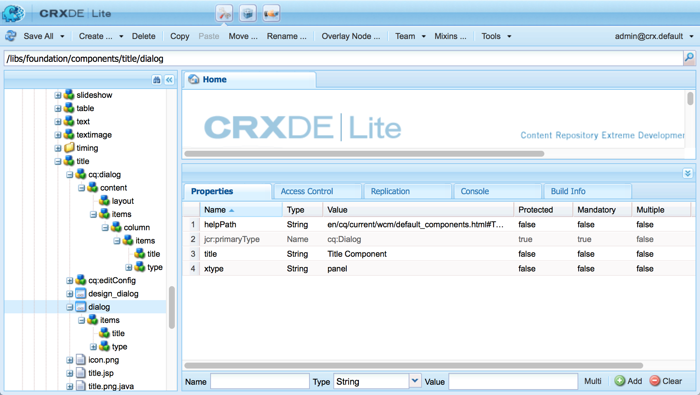

# Adobe Experience Manager-komponenter (AEM) - Grunderna{#aem-components-the-basics}

När du börjar utveckla nya komponenter måste du förstå grunderna i deras struktur och konfiguration.

Denna process innebär att läsa teorin och titta på ett stort antal komponentimplementeringar i en standardinstans av AEM. Det senare tillvägagångssättet är något komplicerat av det faktum att AEM, trots att man har gått över till ett nytt standardgränssnitt med pekfunktioner, fortfarande har stöd för det klassiska användargränssnittet.

## Ökning {#overview}

I det här avsnittet beskrivs viktiga koncept och problem som en introduktion till den information som behövs när du utvecklar egna komponenter.

### Planering {#planning}

Innan du börjar konfigurera eller koda komponenten bör du fråga:

* Vad behöver du den nya komponenten till?
   * En tydlig specifikation hjälper till i alla faser av utveckling, testning och överlämning. Detaljerna kan förändras över tid, men specifikationen kan uppdateras (men ändringarna bör också dokumenteras).
* Behöver du skapa komponenten från grunden, eller kan du ärva grunderna från en befintlig komponent?
   * Man behöver inte förnya hjulet.
   * Det finns flera mekanismer från AEM som gör att du kan ärva och utöka information från en annan komponentdefinition, till exempel åsidosättning, övertäckning och [Sling Resource Merger](/help/sites-developing/sling-resource-merger.md).
* Kräver komponenten logik för att markera eller ändra innehållet?
   * Logiken ska hållas åtskild från användargränssnittslagret. HTML är utformat för att säkerställa att detta sker.
* Behöver komponenten CSS-formatering?
   * CSS-formateringen ska hållas åtskild från komponentdefinitionerna. Definiera konventioner för att namnge dina HTML-element så att du kan ändra dem via externa CSS-filer.
* Vilka säkerhetsaspekter bör jag tänka på?
   * Mer information finns i [Säkerhetschecklista - Bästa metoder för utveckling](/help/sites-administering/security-checklist.md#development-best-practices).

### Pekaktiverat jämfört med klassiskt gränssnitt {#touch-enabled-vs-classic-ui}

Innan något allvarligt samtal börjar om att utveckla komponenter måste du veta vilket gränssnitt författarna använder:

* **Pekaktiverat gränssnitt**
  [Standardanvändargränssnittet](/help/sites-developing/touch-ui-concepts.md) baseras på den enhetliga användarupplevelsen för Adobe Experience Cloud med hjälp av de underliggande teknikerna i [Coral UI](/help/sites-developing/touch-ui-concepts.md#coral-ui) och [Granite-gränssnittet](/help/sites-developing/touch-ui-concepts.md#granite-ui).
* **Klassiskt användargränssnitt**
Användargränssnitt som bygger på ExtJS-teknik som har ersatts med AEM 6.4.

Mer information finns i [Gränssnittsrekommendationer för kunder](/help/sites-deploying/ui-recommendations.md).

Komponenter kan implementeras för att stödja det beröringsaktiverade användargränssnittet, det klassiska användargränssnittet eller båda. När du tittar på en standardinstans ser du även färdiga komponenter som ursprungligen designats för det klassiska användargränssnittet, det pekaktiverade användargränssnittet eller båda.

Grunderna för båda beskrivs på den här sidan och hur du känner igen dem.

>[!NOTE]
>
>Adobe rekommenderar att du använder användargränssnittet med pekskärm för att utnyttja den senaste tekniken. [AEM moderniseringsverktyg](modernization-tools.md) kan göra en migrering enklare.

### Innehållslogik och återgivningsmarkeringar  {#content-logic-and-rendering-markup}

Adobe rekommenderar att koden som ansvarar för kod och återgivning hålls åtskild från koden som styr logiken som används för att markera komponentens innehåll.

Den här filosofin stöds av [HTL](https://experienceleague.adobe.com/docs/experience-manager-htl/content/overview.html), ett mallspråk som är avsiktligt begränsat för att säkerställa att ett verkligt programmeringsspråk används för att definiera den underliggande affärslogiken. Den här (valfria) logiken anropas från HTML med ett specifikt kommando. Den här mekanismen markerar koden som anropas för en viss vy och, om det behövs, tillåter specifik logik för olika vyer av samma komponent.

### HTL vs JSP {#htl-vs-jsp}

HTL är ett mallspråk från HTML som introducerades med AEM 6.0.

Diskussionen om du ska använda [HTML](https://experienceleague.adobe.com/docs/experience-manager-htl/content/overview.html) eller JSP (Java™ Server Pages) när du utvecklar egna komponenter bör vara enkel eftersom HTML nu är det rekommenderade skriptspråket för AEM.

Både HTML och JSP kan användas för att utveckla komponenter för både det klassiska och det beröringskänsliga användargränssnittet. Även om det finns en tendens att anta att HTML bara är för det beröringsaktiverade användargränssnittet och JSP för det klassiska användargränssnittet, är detta en missuppfattning och beror mer på timing. Användargränssnittet med pekfunktion och HTML integrerades i AEM under ungefär samma period. Eftersom HTML nu är det rekommenderade språket används det för nya komponenter, som ofta används för användargränssnittet med pekfunktioner.

>[!NOTE]
>
>Undantagen är formulärfält för GRE UI Foundation (som används i dialogrutor). Dessa kräver fortfarande JSP.

### Utveckla egna komponenter {#developing-your-own-components}

Information om hur du skapar egna komponenter för rätt användargränssnitt finns i (efter att du har läst den här sidan):

* [AEM Components for the Touch-Enabled UI](/help/sites-developing/developing-components.md)
* [AEM-komponenter för det klassiska användargränssnittet](/help/sites-developing/developing-components-classic.md)

Ett snabbt sätt att komma igång är att kopiera en befintlig komponent och sedan göra de ändringar du vill. Mer information om hur du skapar egna komponenter och lägger till dem i styckesystemet finns i:

* [Utveckla komponenter](/help/sites-developing/developing-components-samples.md) (fokuserat på det beröringsaktiverade användargränssnittet)

### Flytta komponenter till publiceringsinstansen {#moving-components-to-the-publish-instance}

Komponenterna som återger innehåll måste distribueras på samma AEM-instans som innehållet. Därför måste alla komponenter som används för att skapa och återge sidor på författarinstansen distribueras på publiceringsinstansen. När de distribueras är komponenterna tillgängliga för återgivning av aktiverade sidor.

Använd följande verktyg för att flytta dina komponenter till publiceringsinstansen:

* [Använd Package Manager](/help/sites-administering/package-manager.md) för att lägga till dina komponenter i ett paket och flytta dem till en annan AEM-instans.
* [Använd verktyget Aktivera trädreplikering](/help/sites-authoring/publishing-pages.md#manage-publication) för att replikera komponenterna.

>[!NOTE]
>
>Dessa mekanismer kan också användas för att överföra komponenten mellan andra instanser, till exempel från utvecklingen till testinstansen.

### Komponenter som ska vara medvetna om från Start {#components-to-be-aware-of-from-the-start}

* Sida:

   * AEM har komponenten *page* ( `cq:Page`).
   * Detta är en specifik typ av resurs som är viktig för innehållshantering.
      * En sida motsvarar en webbsida med innehåll för webbplatsen.

* Styckesystem:

   * Styckesystemet är en viktig del av en webbplats när det hanterar en lista med stycken. Den används för att hålla kvar och strukturera de enskilda komponenterna som innehåller det faktiska innehållet.
   * Du kan skapa, flytta, kopiera och ta bort stycken i styckesystemet.
   * Du kan också välja vilka komponenter som ska vara tillgängliga för användning i ett visst styckesystem.
   * Det finns olika styckesystem tillgängliga i en standardinstans (till exempel `parsys`, ` [responsivegrid](/help/sites-authoring/responsive-layout.md)`).

## Struktur {#structure}

Strukturen i en AEM-komponent är kraftfull och flexibel, de viktigaste aspekterna är:

* Resurstyp
* Komponentdefinition
* Egenskaper och underordnade noder för en komponent
* Dialogrutor
* Designdialogrutor
* Komponenttillgänglighet
* Komponenter och det innehåll de skapar

### Resurstyp {#resource-type}

Ett nyckelelement i strukturen är resurstypen.

* Innehållsstrukturen deklarerar avsikter.
* Resurstypen implementerar dem.

Detta är en abstraktion som säkerställer att även när utseendet och känslan förändras över tid så stannar avsikten.

### Komponentdefinition {#component-definition}

#### Grundläggande om komponenter {#component-basics}

Definitionen av en komponent kan delas upp enligt följande:

* AEM-komponenter baseras på [Sling](https://sling.apache.org/documentation.html).
* AEM-komponenterna finns (vanligtvis) under:

   * HTML: `/libs/wcm/foundation/components`
   * JSP: `/libs/foundation/components`

* Projekt-/platsspecifika komponenter finns (vanligtvis) under:

   * `/apps/<myApp>/components`

* AEM standardkomponenter definieras som `cq:Component` och har nyckelelementen:

   * jcr-egenskaper:

     En lista med jcr-egenskaper. Dessa är variabla och vissa kan vara valfria genom att grundstrukturen för en komponentnod, dess egenskaper och undernoder definieras av definitionen `cq:Component`

   * Resurser:

     Dessa definierar statiska element som används av komponenten.

   * Skript:

  Används för att implementera beteendet för den resulterande instansen av komponenten.

* **Rotnod**:

   * `<mycomponent> (cq:Component)` - Komponentens hierarkiska nod.

* **Viktiga egenskaper**:

   * `jcr:title` - Komponenttitel, som till exempel används som etikett när komponenten visas i komponentwebbläsaren eller i sidledaren.
   * `jcr:description` - Beskrivning för komponenten. Kan användas som muspekningstecken i komponentwebbläsaren eller i sidledaren.
   * Klassiskt användargränssnitt:

      * `icon.png` - Ikon för komponenten.
      * `thumbnail.png` - Bild som visas om den här komponenten finns med i styckesystemet.

   * Pekgränssnitt

      * Mer information finns i avsnittet [Komponentikon i Touch-gränssnittet](/help/sites-developing/components-basics.md#component-icon-in-touch-ui).

* **Viktiga underordnade noder**:

   * `cq:editConfig (cq:EditConfig)` - Definierar redigeringsegenskaperna för komponenten och aktiverar komponenten att visas i komponentwebbläsaren eller Sidekick.

     Obs! Om komponenten har en dialogruta visas den automatiskt i komponentwebbläsaren eller Sidekick, även om cq:editConfig inte finns.

   * `cq:childEditConfig (cq:EditConfig)` - Styr gränssnittsaspekter för författare för underordnade komponenter som inte definierar sina egna `cq:editConfig`.
   * Pekaktiverat användargränssnitt:

      * `cq:dialog` ( `nt:unstructured`) - Dialog för den här komponenten. Definierar gränssnittet som tillåter användaren att konfigurera komponenten och/eller redigera innehåll.
      * `cq:design_dialog` ( `nt:unstructured`) - Designredigering för komponenten

   * Klassiskt användargränssnitt:

      * `dialog` ( `cq:Dialog`) - Dialog för den här komponenten. Definierar gränssnittet som låter användaren konfigurera komponenten, redigera innehåll eller båda.
      * `design_dialog` ( `cq:Dialog`) - Designredigering för komponenten.

#### Komponentikon i Touch UI {#component-icon-in-touch-ui}

Ikonen eller förkortningen för komponenten definieras via JCR-egenskaperna för komponenten när komponenten skapas av utvecklaren. Dessa egenskaper utvärderas i följande ordning och den första giltiga egenskapen som hittas används.

1. `cq:icon` - Strängegenskapen pekar på en standardikon i [Coral UI-biblioteket](https://developer.adobe.com/experience-manager/reference-materials/6-5/coral-ui/coralui3/Coral.Icon.html) som ska visas i komponentwebbläsaren
   * Använd värdet för HTML-attributet för ikonen Koral.
1. `abbreviation` - Strängegenskapen för att anpassa förkortningen av komponentnamnet i komponentwebbläsaren
   * Förkortningen ska vara begränsad till två tecken.
   * Om du anger en tom sträng skapas förkortningen från de två första tecknen i egenskapen `jcr:title`.
      * Exempel: &quot;Im&quot; för &quot;Bild&quot;
      * Den lokaliserade titeln används för att skapa förkortningen.
   * Förkortningen översätts bara om komponenten har en `abbreviation_commentI18n`-egenskap, som sedan används som översättningstips.
1. `cq:icon.png` eller `cq:icon.svg` - Ikon för den här komponenten, som visas i komponentwebbläsaren
   * 20 x 20 pixlar är storleken på ikonerna för standardkomponenter.
      * Storleken på större ikoner ändras (klientsidan).
   * Den rekommenderade färgen är rgb(112, 112, 112) > #707070
   * Bakgrunden för standardkomponentikoner är genomskinlig.
   * Endast `.png`- och `.svg`-filer stöds.
   * Om du importerar från filsystemet med Eclipse-plugin-programmet måste filnamnen escape-konverteras till exempel som `_cq_icon.png` eller `_cq_icon.svg`.
   * `.png` har företräde framför `.svg` om båda finns

Om inga av ovanstående egenskaper ( `cq:icon`, `abbreviation`, `cq:icon.png` eller `cq:icon.svg`) hittas i komponenten:

* Systemet söker efter samma egenskaper i de överordnade komponenterna efter egenskapen `sling:resourceSuperType`.
* Om inget eller en tom förkortning hittas på den överordnade komponentnivån skapas förkortningen från de första bokstäverna i egenskapen `jcr:title` för den aktuella komponenten.

Om du vill avbryta arvet av ikoner från superkomponenter återställs standardbeteendet om du anger en tom `abbreviation`-egenskap för komponenten.

[Komponentkonsolen](/help/sites-authoring/default-components-console.md#component-details) visar hur ikonen för en viss komponent definieras.

#### Exempel på SVG-ikoner {#svg-icon-example}

```xml
<?xml version="1.0" encoding="utf-8"?>
<!DOCTYPE svg PUBLIC "-//W3C//DTD SVG 1.1//EN" "https://www.w3.org/Graphics/SVG/1.1/DTD/svg11.dtd">
<svg version="1.1" id="Layer_1" xmlns="https://www.w3.org/2000/svg" xmlns:xlink="https://www.w3.org/1999/xlink" x="0px" y="0px"
     width="20px" height="20px" viewBox="0 0 20 20" enable-background="new 0 0 20 20" xml:space="preserve">
    <ellipse cx="5" cy="5" rx="3" ry="3" fill="#707070"/>
    <ellipse cx="15" cy="5" rx="4" ry="4" fill="#707070"/>
    <ellipse cx="5" cy="15" rx="5" ry="5" fill="#707070"/>
    <ellipse cx="15" cy="15" rx="4" ry="4" fill="#707070"/>
</svg>
```

### Egenskaper och underordnade noder för en komponent {#properties-and-child-nodes-of-a-component}

Många av de noder/egenskaper som behövs för att definiera en komponent är gemensamma för båda gränssnitten, med skillnader som förblir oberoende så att komponenten kan fungera i båda miljöerna.

En komponent är en nod av typen `cq:Component` och har följande egenskaper och underordnade noder:

<table>
 <tbody>
  <tr>
   <td><strong>Namn <br /> </strong></td>
   <td><strong>Typ <br /> </strong></td>
   <td><strong>Beskrivning <br /> </strong></td>
  </tr>
  <tr>
   <td>.<br /> </td>
   <td><code>cq:Component</code></td>
   <td>Aktuell komponent. En komponent är av nodtypen <code>cq:Component</code>.<br /> </td>
  </tr>
  <tr>
   <td><code>componentGroup</code></td>
   <td><code>String</code></td>
   <td>Grupp under vilken komponenten kan väljas i komponentwebbläsaren (användargränssnitt med pekfunktion) eller Sidekick (klassiskt användargränssnitt).<br /> Värdet <code>.hidden</code> används för komponenter som inte är tillgängliga för val från användargränssnittet, till exempel det faktiska styckesystemet.</td>
  </tr>
  <tr>
   <td><code>cq:isContainer</code></td>
   <td><code>Boolean</code></td>
   <td>Anger om komponenten är en behållarkomponent och därför kan innehålla andra komponenter, till exempel ett styckesystem.</td>
  </tr>
  <tr>
   <td> </td>
   <td> </td>
   <td> </td>
  </tr>
  <tr>
   <td><code>cq:dialog</code></td>
   <td><code>nt:unstructured</code><br /> </td>
   <td>Definition av redigeringsdialogrutan för det beröringsaktiverade användargränssnittet.</td>
  </tr>
  <tr>
   <td><code>dialog</code></td>
   <td><code>cq:Dialog</code></td>
   <td>Definition av redigeringsdialogrutan för det klassiska användargränssnittet.</td>
  </tr>
  <tr>
   <td><code>cq:design_dialog</code></td>
   <td><code>nt:unstructured</code></td>
   <td>Definition av designdialogrutan för det beröringskänsliga användargränssnittet.</td>
  </tr>
  <tr>
   <td><code>design_dialog</code></td>
   <td><code>cq:Dialog </code></td>
   <td>Definition av designdialogrutan för det klassiska användargränssnittet.<br /> </td>
  </tr>
  <tr>
   <td><code>dialogPath</code></td>
   <td><code>String</code></td>
   <td>Sökväg till en dialogruta som täcker fallet när komponenten inte har någon dialognod.<br /> </td>
  </tr>
  <tr>
   <td> </td>
   <td> </td>
   <td> </td>
  </tr>
  <tr>
   <td><code>cq:cellName</code></td>
   <td><code>String</code></td>
   <td>Om den här egenskapen anges används den som cell-ID.<br /> </td>
  </tr>
  <tr>
   <td><code>cq:childEditConfig</code></td>
   <td><code>cq:EditConfig</code></td>
   <td>När komponenten är en behållare - till exempel ett styckesystem - kör den redigeringskonfigurationen för de underordnade noderna.<br /> </td>
  </tr>
  <tr>
   <td><code>cq:editConfig</code></td>
   <td><code>cq:EditConfig</code></td>
   <td><a href="#edit-behavior">Redigera konfigurationen för komponenten</a>.<br /> </td>
  </tr>
  <tr>
   <td><code>cq:htmlTag</code></td>
   <td><code>nt:unstructured </code></td>
   <td>Returnerar ytterligare taggattribut som läggs till i den omgivande html-taggen. Möjliggör tillägg av attribut till de automatiskt genererade diven.</td>
  </tr>
  <tr>
   <td><code>cq:noDecoration</code></td>
   <td><code>Boolean</code></td>
   <td>Om true återges inte komponenten med automatiskt genererade div- och css-klasser.<br /> </td>
  </tr>
  <tr>
   <td><code>cq:template</code></td>
   <td><code>nt:unstructured</code></td>
   <td>Om den hittas används den här noden som en innehållsmall när komponenten läggs till från komponentwebbläsaren eller Sidekick.</td>
  </tr>
  <tr>
   <td><code>cq:templatePath</code></td>
   <td><code>String</code></td>
   <td>Sökväg till en nod som ska användas som innehållsmall när komponenten läggs till från komponentwebbläsaren eller Sidekick. Detta måste vara en absolut sökväg, inte relativ till komponentnoden.<br /> Om du inte vill återanvända innehåll som redan är tillgängligt någon annanstans är detta inte nödvändigt och <code>cq:template</code> är tillräckligt (se nedan).</td>
  </tr>
  <tr>
   <td><code>jcr:created</code></td>
   <td><code>Date</code></td>
   <td>Datum när komponenten skapades.<br /> </td>
  </tr>
  <tr>
   <td><code>jcr:description</code></td>
   <td><code>String</code></td>
   <td>Beskrivning av komponenten.<br /> </td>
  </tr>
  <tr>
   <td><code>jcr:title</code></td>
   <td><code>String</code></td>
   <td>Komponentens namn.<br /> </td>
  </tr>
  <tr>
   <td><code>sling:resourceSuperType</code></td>
   <td><code>String</code></td>
   <td>När den anges ärver komponenten från den här komponenten.<br /> </td>
  </tr>
  <tr>
   <td><code>virtual</code></td>
   <td><code>sling:Folder</code></td>
   <td>Gör att virtuella komponenter kan skapas. Om du vill se ett exempel tittar du på kontaktkomponenten på:<br /> <code>/libs/foundation/components/profile/form/contact</code></td>
  </tr>
  <tr>
   <td><code>&lt;breadcrumb.jsp&gt;</code></td>
   <td><code>nt:file</code><br /> </td>
   <td>Skriptfil.<br /> </td>
  </tr>
  <tr>
   <td><code>icon.png</code></td>
   <td><code>nt:file</code></td>
   <td>Ikon för komponenten visas bredvid rubriken i Sidekick.<br /> </td>
  </tr>
  <tr>
   <td><code>thumbnail.png</code></td>
   <td><code>nt:file</code></td>
   <td>Valfri miniatyrbild som visas när komponenten dras på plats från Sidekick.<br /> </td>
  </tr>
 </tbody>
</table>

Om du tittar på komponenten **Text** (någon version) kan du se följande element:

* HTML ( `/libs/wcm/foundation/components/text`)

  

* JSP ( `/libs/foundation/components/text`)

  

Egenskaper av särskilt intresse är:

* `jcr:title` - komponentens titel. Den kan användas för att identifiera komponenten, t.ex. så visas den i komponentlistan i komponentwebbläsaren eller i sidosparken
* `jcr:description` - beskrivning för komponenten; kan användas som muspekare i komponentlistan i sidosparken
* `sling:resourceSuperType`: Detta anger arvssökvägen när en komponent utökas (genom att åsidosätta en definition)

Underordnade noder av särskilt intresse är:

* `cq:editConfig` ( `cq:EditConfig`) - det här styr visuella aspekter, till exempel utseendet på ett fält eller en widget, eller kan lägga till anpassade kontroller
* `cq:childEditConfig` ( `cq:EditConfig`) - Detta styr de visuella aspekterna för underordnade komponenter som inte har egna definitioner
* Pekaktiverat användargränssnitt:
   * `cq:dialog` ( `nt:unstructured`) - definierar dialogrutan för redigering av innehåll i den här komponenten
   * `cq:design_dialog` ( `nt:unstructured`) - anger designredigeringsalternativen för den här komponenten
* Klassiskt användargränssnitt:
   * `dialog` ( `cq:Dialog`) - definierar dialogrutan för redigering av innehåll i den här komponenten (specifik för det klassiska användargränssnittet)
   * `design_dialog` ( `cq:Dialog`) - anger designredigeringsalternativen för den här komponenten
   * `icon.png` - grafikfil som ska användas som ikon för komponenten i Sidekick
   * `thumbnail.png` - grafikfil som ska användas som miniatyrbild för komponenten när den dras från Sidekick

### Dialogrutor {#dialogs}

Dialogrutor är ett nyckelelement i komponenten eftersom de tillhandahåller ett gränssnitt där författare kan konfigurera och ange indata för den komponenten.

Beroende på komponentens komplexitet kan det behövas en eller flera flikar i dialogrutan för att hålla dialogrutan kort och sortera indatafälten.

Dialogrutedefinitioner är specifika för användargränssnittet:

>[!NOTE]
>
>* Av kompatibilitetsskäl kan det beröringsaktiverade användargränssnittet använda definitionen för en klassisk användargränssnittsdialogruta när ingen dialogruta har definierats för det beröringsaktiverade användargränssnittet.
>* [AEM-moderniseringsverktygen](/help/sites-developing/modernization-tools.md) finns även för att hjälpa dig att utöka/konvertera komponenter som bara har dialogrutor definierade för det klassiska användargränssnittet.
>

* Pekaktiverat användargränssnitt
   * `cq:dialog` ( `nt:unstructured`) noder:
      * definiera dialogrutan för redigering av innehåll i den här komponenten
      * specifikt för det pekaktiverade användargränssnittet
      * definieras med gränssnittskomponenter i Granite
      * har egenskapen `sling:resourceType` som standard-Sling-innehållsstruktur
      * kan ha egenskapen `helpPath` för att definiera den sammanhangsberoende hjälpresursen (absolut eller relativ sökväg) som nås när hjälpikonen (ikonen `?` ) väljs.
         * För körklara komponenter refererar detta ofta till en sida i dokumentationen.
         * Om `helpPath` inte anges visas standardwebbadressen (dokumentationsöversiktssidan).

  

  I dialogrutan definieras enskilda fält:

  

* Klassiskt användargränssnitt
   * `dialog` ( `cq:Dialog`) noder
      * definiera dialogrutan för redigering av innehåll i den här komponenten
      * specifikt för det klassiska användargränssnittet
      * definieras med ExtJS-widgetar
      * har egenskapen `xtype` som refererar till ExtJS
      * kan ha egenskapen `helpPath` för att definiera den sammanhangsberoende hjälpresursen (absolut eller relativ sökväg) som nås när knappen **Hjälp** väljs.
         * För körklara komponenter refererar detta ofta till en sida i dokumentationen.
         * Om `helpPath` inte anges visas standardwebbadressen (dokumentationsöversiktssidan).

  

  I dialogrutan definieras enskilda fält:

  

  I en klassisk dialogruta:

   * Du kan skapa dialogrutan som `cq:Dialog`, vilket ger en enda flik, som i textkomponenten, eller om du behöver flera flikar, som med textimagekomponenten, kan dialogrutan definieras som `cq:TabPanel`.
   * a `cq:WidgetCollection` ( `items`) används för att tillhandahålla en bas för antingen inmatningsfält ( `cq:Widget`) eller fler flikar ( `cq:Widget`). Den här hierarkin kan utökas.

### Designdialogrutor {#design-dialogs}

Designdialogrutor liknar dialogrutorna som används för att redigera och konfigurera innehåll, men de tillhandahåller gränssnittet för författare att konfigurera och tillhandahålla designinformation för den komponenten.

[Designdialogrutor är tillgängliga i designläge](/help/sites-authoring/default-components-designmode.md), men de behövs inte för alla komponenter, till exempel har både **Rubrik** och **Bild** designdialogrutor, vilket inte **Text** har.

Designdialogrutan för styckesystemet (till exempel parsys) är ett specialfall eftersom den gör att användaren kan välja specifika andra komponenter (från komponentwebbläsaren eller sidosparken) på sidan.

### Lägga till komponenten i styckesystemet {#adding-your-component-to-the-paragraph-system}

När en komponent har definierats måste den göras tillgänglig för användning. Om du vill göra en komponent tillgänglig för användning i ett styckesystem kan du antingen:

1. Öppna [designläge](/help/sites-authoring/default-components-designmode.md) för en sida och aktivera den nödvändiga komponenten.
1. Lägg till de nödvändiga komponenterna i egenskapen `components` för malldefinitionen under:

   `/etc/designs/<*yourProject*>/jcr:content/<*yourTemplate*>/par`

   Se till exempel:

   `/etc/designs/geometrixx/jcr:content/contentpage/par`

   

### Komponenter och det innehåll de skapar {#components-and-the-content-they-create}

Om du skapar och konfigurerar en instans av komponenten **Title** på sidan: `<content-path>/Prototype.html`

* Pekaktiverat användargränssnitt

  

* Klassiskt användargränssnitt

  

Sedan kan du se strukturen för innehållet som skapas i databasen:


Om du tittar på den faktiska texten för en **titel**:

* definitionen (för båda gränssnitten) har egenskapen `name`= `./jcr:title`

   * `/libs/foundation/components/title/cq:dialog/content/items/column/items/title`
   * `/libs/foundation/components/title/dialog/items/title`

* i innehållet genererar detta egenskapen `jcr:title` med författarens innehåll.

De egenskaper som definieras beror på de enskilda definitionerna. Även om de kan vara mer komplexa än ovan följer de fortfarande samma grundläggande principer.

## Komponenthierarki och arv {#component-hierarchy-and-inheritance}

Komponenterna i AEM har tre olika hierarkier:

* **Hierarki för resurstyper**

  Detta används för att utöka komponenter med egenskapen `sling:resourceSuperType`. Detta gör att komponenten kan ärva. En textkomponent ärver till exempel olika attribut från standardkomponenten.

   * skript (lösta av Sling)
   * dialogrutor
   * beskrivningar (inklusive miniatyrbilder och ikoner)

* **Behållarhierarki**

  Detta används för att fylla i konfigurationsinställningar till den underordnade komponenten och används oftast i ett parsyscenario.

  Till exempel kan konfigurationsinställningar för redigeringsfältsknappar, kontrolluppsättningens layout (redigeringsfält, överrullning) och dialogrutans layout (textbunden, flytande) definieras för den överordnade komponenten och spridas till de underordnade komponenterna.

  Konfigurationsinställningar (som är relaterade till redigeringsfunktioner) i `cq:editConfig` och `cq:childEditConfig` sprids.

* **Inkludera hierarki**

  Detta anges vid körning av sekvensen inkluderingar.

  Den här hierarkin används av Designer, som i sin tur fungerar som bas för olika designaspekter av återgivningen, inklusive layoutinformation, css-information, tillgängliga komponenter på en parsys med flera.

## Redigera beteende {#edit-behavior}

I det här avsnittet beskrivs hur du konfigurerar redigeringsbeteendet för en komponent. Detta inkluderar attribut som åtgärder som är tillgängliga för komponenten, egenskaper för infogningsredigeraren och avlyssnare som relaterar till händelser för komponenten.

Konfigurationen är gemensam för det beröringsaktiverade och klassiska användargränssnittet, men med vissa specifika skillnader.

Redigeringsbeteendet för en komponent konfigureras genom att en `cq:editConfig`-nod av typen `cq:EditConfig` läggs till under komponentnoden (av typen `cq:Component`) och genom att specifika egenskaper och underordnade noder läggs till. Följande egenskaper och underordnade noder är tillgängliga:

* [`cq:editConfig`-nodegenskaper ](#configuring-with-cq-editconfig-properties):

   * `cq:actions` ( `String array`): definierar de åtgärder som kan utföras på komponenten.
   * `cq:layout` ( `String`): definierar hur komponenten redigeras i det klassiska användargränssnittet.
   * `cq:dialogMode` ( `String`): definierar hur komponentdialogen öppnas i det klassiska användargränssnittet

      * I det beröringsaktiverade användargränssnittet flyter dialogrutorna alltid i skrivbordsläge och öppnas automatiskt som helskärm i mobilen.

   * `cq:emptyText` ( `String`): definierar text som visas utan visuellt innehåll.
   * `cq:inherit` ( `Boolean`): definierar om saknade värden ärvs från komponenten som den ärver från.
   * `dialogLayout` (String): definierar hur dialogrutan ska öppnas.

* [`cq:editConfig` underordnade noder ](#configuring-with-cq-editconfig-child-nodes):

   * `cq:dropTargets` (nodtyp `nt:unstructured`): definierar en lista med släppmål som kan acceptera en släppning från en resurs i innehållssökaren

      * Det finns bara flera släppmål i det klassiska användargränssnittet.
      * I det beröringskänsliga användargränssnittet tillåts en enda släppåtgärd.

   * `cq:actionConfigs` (nodtyp `nt:unstructured`): definierar en lista med nya åtgärder som läggs till i cq:actions-listan.
   * `cq:formParameters` (nodtyp `nt:unstructured`): definierar ytterligare parametrar som läggs till i dialogformuläret.
   * `cq:inplaceEditing` (nodtyp `cq:InplaceEditingConfig`): definierar en redigeringskonfiguration på plats för komponenten.
   * `cq:listeners` (nodtyp `cq:EditListenersConfig`): definierar vad som händer före eller efter en åtgärd som utförs på komponenten.

>[!NOTE]
>
>På den här sidan representeras en nod (egenskaper och underordnade noder) som XML, vilket visas i följande exempel.

```
<jcr:root xmlns:cq="https://www.day.com/jcr/cq/1.0" xmlns:jcr="https://www.jcp.org/jcr/1.0"
    cq:actions="[edit]"
    cq:dialogMode="floating"
    cq:layout="editbar"
    jcr:primaryType="cq:EditConfig">
    <cq:listeners
        jcr:primaryType="cq:EditListenersConfig"
        afteredit="REFRESH_PAGE"/>
</jcr:root>
```

Det finns många befintliga konfigurationer i databasen. Du kan enkelt söka efter specifika egenskaper eller underordnade noder:

* Om du vill söka efter en egenskap för noden `cq:editConfig`, till exempel `cq:actions`, kan du använda frågeverktyget i **CRXDE Lite** och söka med följande XPath-frågesträng:

  `//element(cq:editConfig, cq:EditConfig)[@cq:actions]`

* Om du till exempel vill söka efter en underordnad nod till `cq:editConfig` kan du söka efter `cq:dropTargets` som är av typen `cq:DropTargetConfig`. Du kan använda frågeverktyget i* CRXDE Lite** och söka med följande XPath-frågesträng:

  `//element(cq:dropTargets, cq:DropTargetConfig)`

### Komponentplatshållare {#component-placeholders}

Komponenter måste alltid återge viss HTML som är synlig för författaren, även när komponenten inte har något innehåll. I annat fall försvinner det visuellt från redigerarens gränssnitt, vilket gör det tekniskt möjligt men osynligt på sidan och i redigeraren. I så fall kan författarna inte markera och interagera med den tomma komponenten.

Därför bör komponenter återge en platshållare så länge de inte återger några synliga utdata när sidan återges i sidredigeraren (när WCM-läget är `edit` eller `preview`).
Den typiska HTML-koden för en platshållare är följande:

```HTML
<div class="cq-placeholder" data-emptytext="Component Name"></div>
```

Det typiska HTML-skriptet som återger platshållaren HTML är följande:

```HTML
<div class="cq-placeholder" data-emptytext="${component.properties.jcr:title}"
     data-sly-test="${(wcmmode.edit || wcmmode.preview) && isEmpty}"></div>
```

I föregående exempel är `isEmpty` en variabel som bara är true när komponenten inte har något innehåll och är osynlig för författaren.

För att undvika upprepningar rekommenderar Adobe att implementerare av komponenter använder en HTML-mall för dessa platshållare, [som den som finns i Core-komponenterna.](https://github.com/adobe/aem-core-wcm-components/blob/master/content/src/content/jcr_root/apps/core/wcm/components/commons/v1/templates.html)

Mallen i den föregående länken används sedan med följande rad i HTML:

```HTML
<sly data-sly-use.template="core/wcm/components/commons/v1/templates.html"
     data-sly-call="${template.placeholder @ isEmpty=!model.text}"></sly>
```

I det föregående exemplet är `model.text` variabeln som är sann bara när innehållet har innehåll och är synligt.

Ett exempel på hur den här mallen används visas i kärnkomponenterna, [t.ex. i titelkomponenten.](https://github.com/adobe/aem-core-wcm-components/blob/master/content/src/content/jcr_root/apps/core/wcm/components/title/v2/title/title.html#L27)

### Konfigurera med cq:EditConfig-egenskaper {#configuring-with-cq-editconfig-properties}

### cq:åtgärder {#cq-actions}

Egenskapen `cq:actions` ( `String array`) definierar en eller flera åtgärder som kan utföras på komponenten. Följande värden är tillgängliga för konfiguration:

<table>
 <tbody>
  <tr>
   <td><strong>Egenskapsvärde</strong></td>
   <td><strong>Beskrivning</strong></td>
  </tr>
  <tr>
   <td><code>text:&lt;some text&gt;</code></td>
   <td>Visar det statiska textvärdet &lt;text&gt;<br /> Endast synligt i det klassiska användargränssnittet. Det beröringskänsliga användargränssnittet visar inte åtgärder på en sammanhangsberoende meny, så detta är inte tillämpligt.</td>
  </tr>
  <tr>
   <td>-</td>
   <td>Lägger till ett mellanrum.<br /> Endast synlig i klassiskt användargränssnitt. Det beröringskänsliga användargränssnittet visar inte åtgärder på en sammanhangsberoende meny, så detta är inte tillämpligt.</td>
  </tr>
  <tr>
   <td><code>edit</code></td>
   <td>Lägger till en knapp för att redigera komponenten.</td>
  </tr>
      <tr>
    <td><code>editannotate</code></td>
    <td>Lägger till en knapp för att redigera komponenten och tillåter <a href="/help/sites-authoring/annotations.md">anteckningar</a>.</td>
   </tr>
  <tr>
   <td><code>delete</code></td>
   <td>Lägger till en knapp för att ta bort komponenten.</td>
  </tr>
  <tr>
   <td><code>insert</code></td>
   <td>Lägger till en knapp för att infoga en ny komponent före den aktuella komponenten.</td>
  </tr>
  <tr>
   <td><code>copymove</code></td>
   <td>Lägger till en knapp för att kopiera och klippa ut komponenten.</td>
  </tr>
 </tbody>
</table>

I följande konfiguration läggs en redigeringsknapp, ett mellanrum, en borttagningsknapp och en infogningsknapp till i komponentens redigeringsfält:

```
<jcr:root xmlns:cq="https://www.day.com/jcr/cq/1.0" xmlns:jcr="https://www.jcp.org/jcr/1.0"
    cq:actions="[edit,-,delete,insert]"
    cq:layout="editbar"
    jcr:primaryType="cq:EditConfig"/>
```

Följande konfiguration lägger till texten&quot;Ärvda konfigurationer från basramverket&quot; i komponentens redigeringsfält:

```
<jcr:root xmlns:cq="https://www.day.com/jcr/cq/1.0" xmlns:jcr="https://www.jcp.org/jcr/1.0"
    cq:actions="[text:Inherited Configurations from Base Framework]"
    cq:layout="editbar"
    jcr:primaryType="cq:EditConfig"/>
```

### cq:layout (endast Classic UI) {#cq-layout-classic-ui-only}

Egenskapen `cq:layout` ( `String`) definierar hur komponenten kan redigeras i det klassiska användargränssnittet. Följande värden är tillgängliga:

<table>
 <tbody>
  <tr>
   <td><strong>Egenskapsvärde</strong></td>
   <td><strong>Beskrivning</strong></td>
  </tr>
  <tr>
   <td><code>rollover</code></td>
   <td>Standardvärde. Komponentutgåvan är tillgänglig"när du för muspekaren över" genom att klicka och/eller snabbmenyn.<br /> För avancerad användning är motsvarande objekt på klientsidan: <code>CQ.wcm.EditRollover</code>.</td>
  </tr>
  <tr>
   <td><code>editbar</code></td>
   <td>Komponentutgåvan är tillgänglig via ett verktygsfält.<br /> För avancerad användning är motsvarande objekt på klientsidan: <code>CQ.wcm.EditBar</code>.</td>
  </tr>
  <tr>
   <td><code>auto</code></td>
   <td>Det är bara klientkoden som bestämmer.</td>
  </tr>
 </tbody>
</table>

>[!NOTE]
>
>Begreppen överrullning och redigeringsfält kan inte användas i det beröringsaktiverade gränssnittet.

I följande konfiguration läggs en redigeringsknapp till i komponentens redigeringsfält:

```
<jcr:root xmlns:cq="https://www.day.com/jcr/cq/1.0" xmlns:jcr="https://www.jcp.org/jcr/1.0"
    cq:actions="[edit]"
    cq:layout="editbar"
    jcr:primaryType="cq:EditConfig">
</jcr:root>
```

### cq:dialogMode (endast Classic UI) {#cq-dialogmode-classic-ui-only}

Komponenten kan länkas till en redigeringsdialogruta. Egenskapen `cq:dialogMode` ( `String`) definierar hur komponentdialogen öppnas i det klassiska användargränssnittet. Följande värden är tillgängliga:

<table>
 <tbody>
  <tr>
   <td><strong>Egenskapsvärde</strong></td>
   <td><strong>Beskrivning</strong></td>
  </tr>
  <tr>
   <td><code>floating</code></td>
   <td>Dialogrutan är flytande.<br /> </td>
  </tr>
  <tr>
   <td><code>inline</code></td>
   <td>(standardvärde). Dialogrutan är förankrad över komponenten.<br /> </td>
  </tr>
  <tr>
   <td><code>auto</code></td>
   <td>Om komponentbredden är mindre än klientsidans <code>CQ.themes.wcm.EditBase.INLINE_MINIMUM_WIDTH</code>-värde flyter dialogrutan, annars är den textbunden.</td>
  </tr>
 </tbody>
</table>

>[!NOTE]
>
>I det beröringsaktiverade användargränssnittet flyter dialogrutorna alltid i skrivbordsläge och öppnas automatiskt som helskärm i mobilen.

I följande konfiguration definieras ett redigeringsfält med en redigeringsknapp och en flytande dialogruta:

```
<jcr:root xmlns:cq="https://www.day.com/jcr/cq/1.0" xmlns:jcr="https://www.jcp.org/jcr/1.0"
    cq:actions="[edit]"
    cq:dialogMode="floating"
    cq:layout="editbar"
    jcr:primaryType="cq:EditConfig">
</jcr:root>
```

### cq:emptyText {#cq-emptytext}

Egenskapen `cq:emptyText` ( `String`) definierar text som visas utan visuellt innehåll. Standardvärdet är: `Drag components or assets here`.

### cq:inherit {#cq-inherit}

Egenskapen `cq:inherit` ( `boolean`) definierar om saknade värden ärvs från komponenten som den ärver från. Standardvärdet är `false`.

### dialogLayout {#dialoglayout}

Egenskapen `dialogLayout` definierar hur en dialogruta ska öppnas som standard.

* Värdet `fullscreen` öppnar dialogrutan i helskärmsläge.
* Ett tomt värde eller en frånvaro av egenskapen öppnar normalt dialogrutan.
* Användaren kan alltid växla helskärmsläge i dialogrutan.
* Gäller inte det klassiska användargränssnittet.

### Konfigurera med cq:EditConfig-underordnade noder {#configuring-with-cq-editconfig-child-nodes}

### cq:dropTargets {#cq-droptargets}

Noden `cq:dropTargets` (nodtypen `nt:unstructured`) definierar en lista med släppmål som kan acceptera en släppning från en resurs som dras från innehållssökaren. Den fungerar som en samling noder av typen `cq:DropTargetConfig`.

>[!NOTE]
>
>Det finns bara flera släppmål i det klassiska användargränssnittet.
>
>I det beröringskänsliga användargränssnittet används endast det första målet.

Varje underordnad nod av typen `cq:DropTargetConfig` definierar ett släppmål i komponenten. Nodnamnet är viktigt eftersom det måste användas i JSP enligt följande för att generera CSS-klassnamnet som tilldelats DOM-elementet som är det gällande släppmålet:

```
<drop target css class> = <drag and drop prefix> +
 <node name of the drop target in the edit configuration>
```

`<drag and drop prefix>` definieras av Java™-egenskapen:

`com.day.cq.wcm.api.components.DropTarget.CSS_CLASS_PREFIX`.

Klassnamnet definieras så här i JSP:n för komponenten Download
( `/libs/foundation/components/download/download.jsp`), där `file` är nodnamnet för släppmålet i redigeringskonfigurationen för hämtningskomponenten:

`String ddClassName = DropTarget.CSS_CLASS_PREFIX + "file";`

Noden av typen `cq:DropTargetConfig` måste ha följande egenskaper:

<table>
 <tbody>
  <tr>
   <td><strong>Egenskapsnamn</strong></td>
   <td><strong>Egenskapsvärde<br /> </strong></td>
  </tr>
  <tr>
   <td><code>accept</code></td>
   <td>Regex används på resursens MIME-typ för att validera om släppning är tillåten.</td>
  </tr>
  <tr>
   <td><code>groups</code></td>
   <td>Matris med släppmålgrupper. Varje grupp måste matcha den grupptyp som definieras i tillägget för innehållssökning och som är kopplad till resurserna.</td>
  </tr>
  <tr>
   <td><code>propertyName</code></td>
   <td>Namnet på den egenskap som ska uppdateras efter en giltig släppning.</td>
  </tr>
 </tbody>
</table>

Följande konfiguration hämtas från komponenten Download. Det gör att alla resurser (mime-typen kan vara valfri sträng) från gruppen `media` kan tas bort från innehållssökaren till komponenten. Efter släppningen uppdateras komponentegenskapen `fileReference`:

```
    <cq:dropTargets jcr:primaryType="nt:unstructured">
        <file
            jcr:primaryType="cq:DropTargetConfig"
            accept="[.*]"
            groups="[media]"
            propertyName="./fileReference"/>
    </cq:dropTargets>
```

### cq:actionConfigs (endast Classic UI) {#cq-actionconfigs-classic-ui-only}

Noden `cq:actionConfigs` (nodtypen `nt:unstructured`) definierar en lista med nya åtgärder som läggs till i listan som definieras av egenskapen `cq:actions`. Varje underordnad nod till `cq:actionConfigs` definierar en ny åtgärd genom att definiera en widget.

I följande exempelkonfiguration definieras en ny knapp (med en avgränsare för det klassiska användargränssnittet):

* en avgränsare, definierad av xtype `tbseparator`;

   * Detta används endast av det klassiska användargränssnittet.
   * Den här definitionen ignoreras av det beröringsaktiverade användargränssnittet eftersom xtypes ignoreras (och separatorer är inte nödvändiga eftersom åtgärdsverktygsfältet konstrueras på ett annat sätt i det beröringsaktiverade användargränssnittet).

* en knapp med namnet **Hantera kommentarer** som kör hanterarfunktionen `CQ_collab_forum_openCollabAdmin()`.

```
<jcr:root xmlns:cq="https://www.day.com/jcr/cq/1.0" xmlns:jcr="https://www.jcp.org/jcr/1.0" xmlns:nt="https://www.jcp.org/jcr/nt/1.0"
    cq:actions="[EDIT,COPYMOVE,DELETE,INSERT]"
    jcr:primaryType="cq:EditConfig">
    <cq:actionConfigs jcr:primaryType="nt:unstructured">
        <separator0
            jcr:primaryType="nt:unstructured"
            xtype="tbseparator"/>
        <manage
            jcr:primaryType="nt:unstructured"
            handler="function(){CQ_collab_forum_openCollabAdmin();}"
            text="Manage comments"/>
    </cq:actionConfigs>
</jcr:root>
```

>[!NOTE]
>
>Se [Lägg till ny åtgärd i ett komponentverktygsfält](/help/sites-developing/customizing-page-authoring-touch.md#add-new-action-to-a-component-toolbar) som exempel för det beröringsaktiverade användargränssnittet.

### cq:formParameters {#cq-formparameters}

Noden `cq:formParameters` (nodtypen `nt:unstructured`) definierar ytterligare parametrar som läggs till i dialogformuläret. Varje egenskap mappas till en formulärparameter.

Följande konfiguration lägger till en parameter med namnet `name` som anges med värdet `photos/primary` i dialogformuläret:

```
    <cq:formParameters
        jcr:primaryType="nt:unstructured"
        name="photos/primary"/>
```

### cq:inplaceEditing {#cq-inplaceediting}

Noden `cq:inplaceEditing` (nodtypen `cq:InplaceEditingConfig`) definierar en redigeringskonfiguration för komponenten på plats. Den kan ha följande egenskaper:

<table>
 <tbody>
  <tr>
   <td><strong>Egenskapsnamn</strong></td>
   <td><strong>Egenskapsvärde<br /> </strong></td>
  </tr>
  <tr>
   <td><code>active</code></td>
   <td>(<code>boolean</code>) True för att aktivera redigering på plats av komponenten.</td>
  </tr>
  <tr>
   <td><code>configPath</code></td>
   <td>(<code>String</code>) Sökväg till redigerarkonfigurationen. Konfigurationen kan anges av en konfigurationsnod.</td>
  </tr>
  <tr>
   <td><code>editorType</code></td>
   <td><p>(<code>String</code>) Typ av redigerare. De tillgängliga typerna är:</p>
    <ul>
     <li>plaintext: ska användas för icke-HTML-innehåll.<br /> </li>
     <li>title: är en förbättrad textredigerare som konverterar grafiska titlar till klartext innan redigeringen börjar. Används av Geometrixx titelkomponent.<br /> </li>
     <li>text: som ska användas för HTML-innehåll (använder RTF-redigeraren).<br /> </li>
    </ul> </td>
  </tr>
 </tbody>
</table>

Följande konfiguration aktiverar redigering på plats av komponenten och definierar `plaintext` som redigerartyp:

```
    <cq:inplaceEditing
        jcr:primaryType="cq:InplaceEditingConfig"
        active="{Boolean}true"
        editorType="plaintext"/>
```

### cq:avlyssnare {#cq-listeners}

Noden `cq:listeners` (nodtyp `cq:EditListenersConfig`) definierar vad som händer före eller efter en åtgärd på komponenten. I följande tabell definieras dess möjliga egenskaper.

<table>
 <tbody>
  <tr>
   <td><strong>Egenskapsnamn</strong></td>
   <td><strong>Egenskapsvärde<br /> </strong></td>
   <td><p><strong>Standardvärde</strong></p> <p>(Endast Classic UI)</p> </td>
  </tr>
  <tr>
   <td><code>beforedelete</code></td>
   <td>Hanteraren aktiveras innan komponenten tas bort.<br /> </td>
   <td> </td>
  </tr>
  <tr>
   <td><code>beforeedit</code></td>
   <td>Hanteraren aktiveras innan komponenten redigeras.</td>
   <td> </td>
  </tr>
  <tr>
   <td><code>beforecopy</code></td>
   <td>Hanteraren aktiveras innan komponenten kopieras.</td>
   <td> </td>
  </tr>
  <tr>
   <td><code>beforemove</code></td>
   <td>Hanteraren aktiveras innan komponenten flyttas.</td>
   <td> </td>
  </tr>
  <tr>
   <td><code>beforeinsert</code></td>
   <td>Hanteraren aktiveras innan komponenten infogas.<br /> Kan endast användas för det beröringskänsliga användargränssnittet.</td>
   <td> </td>
  </tr>
  <tr>
   <td><code>beforechildinsert</code></td>
   <td>Hanteraren aktiveras innan komponenten infogas i en annan komponent (endast behållare).</td>
   <td> </td>
  </tr>
  <tr>
   <td><code>afterdelete</code></td>
   <td>Hanteraren aktiveras när komponenten har tagits bort.</td>
   <td><code>REFRESH_SELF</code></td>
  </tr>
  <tr>
   <td><code>afteredit</code></td>
   <td>Hanteraren aktiveras när komponenten har redigerats.</td>
   <td><code>REFRESH_SELF</code></td>
  </tr>
  <tr>
   <td><code>aftercopy</code></td>
   <td>Hanteraren aktiveras när komponenten har kopierats.</td>
   <td><code>REFRESH_SELF</code></td>
  </tr>
  <tr>
   <td><code>afterinsert</code></td>
   <td>Hanteraren aktiveras när komponenten har infogats.</td>
   <td><code>REFRESH_INSERTED</code></td>
  </tr>
  <tr>
   <td><code>aftermove</code></td>
   <td>Hanteraren aktiveras när komponenten har flyttats.</td>
   <td><code>REFRESH_SELFMOVED</code></td>
  </tr>
  <tr>
   <td><code>afterchildinsert</code></td>
   <td>Hanteraren aktiveras när komponenten har infogats i en annan komponent (endast behållare).</td>
   <td> </td>
  </tr>
 </tbody>
</table>

>[!NOTE]
>
>Hanterarna `REFRESH_INSERTED` och `REFRESH_SELFMOVED` är bara tillgängliga i det klassiska användargränssnittet.

>[!NOTE]
>
>Standardvärden för avlyssnarna anges bara i det klassiska användargränssnittet.

>[!NOTE]
>
>Om det finns kapslade komponenter finns det vissa begränsningar för åtgärder som definierats som egenskaper på noden `cq:listeners`:
>
>* För kapslade komponenter måste värdena för följande egenskaper *vara*: `REFRESH_PAGE`: >
>  * `aftermove`
>  * `aftercopy`

Händelsehanteraren kan implementeras med en anpassad implementering. Där `project.customerAction` till exempel är en statisk metod:

`afteredit = "project.customerAction"`

Följande exempel motsvarar konfigurationen `REFRESH_INSERTED`:

`afterinsert="function(path, definition) { this.refreshCreated(path, definition); }"`

>[!NOTE]
>
>Det klassiska användargränssnittet visar vilka parametrar som kan användas i hanterarna i avsnittet `before<action>` och `after<action>` händelser i dokumentationen för [`CQ.wcm.EditBar`](https://developer.adobe.com/experience-manager/reference-materials/6-5/widgets-api/index.html?class=CQ.wcm.EditBar) och [`CQ.wcm.EditRollover`](https://developer.adobe.com/experience-manager/reference-materials/6-5/widgets-api/index.html?class=CQ.wcm.EditRollover)-widgeten.

Med följande konfiguration uppdateras sidan när komponenten har tagits bort, redigerats, infogats eller flyttats:

```
    <cq:listeners
        jcr:primaryType="cq:EditListenersConfig"
        afterdelete="REFRESH_PAGE"
        afteredit="REFRESH_PAGE"
        afterinsert="REFRESH_PAGE"
        afterMove="REFRESH_PAGE"/>
```
