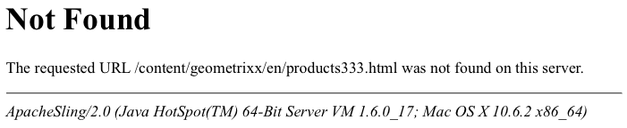

# Anpassa sidor som visas av felhanteraren{#customizing-pages-shown-by-the-error-handler}

AEM har en standardfelhanterare för hantering av HTTP-fel. genom att till exempel visa:

Det finns systemtilldelade skript (under `/libs/sling/servlet/errorhandler`) som kan svara på felkoder. Som standard är följande tillgängliga med en CQ-standardinstans:

* 403.jsp
* 404.jsp

>[!NOTE]
>
>AEM baseras på Apache Sling, så se [https://sling.apache.org/site/errorhandling.html](https://sling.apache.org/site/errorhandling.html) för detaljerad information om Hantering av Sling-fel.

>[!NOTE]
>
>På en författarinstans är [CQ WCM Debug Filter](/help/sites-deploying/osgi-configuration-settings.md) aktiverat som standard. Detta resulterar alltid i svarskoden 200. Standardfelhanteraren svarar genom att skriva den fullständiga stackspårningen till svaret.
>
>I en publiceringsinstans är CQ WCM-felsökningsfiltret *alltid* inaktiverat (även om det har konfigurerats som aktiverat).

## Anpassa sidor som visas av felhanteraren {#how-to-customize-pages-shown-by-the-error-handler}

Du kan utveckla egna skript för att anpassa sidorna som visas i felhanteraren när ett fel inträffar. Dina anpassade sidor skapas under `/apps` och täcker över standardsidorna (som är under `/libs`).

>[!NOTE]
>
>Mer information finns i [Använda övertäckningar](/help/sites-developing/overlays.md).

1. Kopiera standardskripten i databasen:

   * från `/libs/sling/servlet/errorhandler/`
   * till `/apps/sling/servlet/errorhandler/`

   Eftersom målsökvägen inte finns som standard måste du skapa den första gången.

1. Navigera till `/apps/sling/servlet/errorhandler`. Här kan du antingen:

   * redigera lämpligt skript för att ge den information som behövs.
   * skapa och redigera ett nytt skript för den kod som behövs.

1. Spara ändringarna och testa.

>[!CAUTION]
>
>Hanterarna 404.jsp och 403.jsp har utformats särskilt för att hantera CQ5-autentisering. särskilt för att möjliggöra systeminloggning vid dessa fel.
>
>Därför bör dessa två hanterare bytas ut med stor försiktighet.

### Anpassa svaret till HTTP 500-fel {#customizing-the-response-to-http-errors}

HTTP 500-fel orsakas av serversidans undantag.

* **[500 internt serverfel ](https://www.w3.org/Protocols/rfc2616/rfc2616-sec10.html)**
Servern påträffade ett oväntat tillstånd som gjorde att den inte kunde utföra begäran.

När bearbetningen av en begäran resulterar i ett undantag, är Apache Sling-ramverket (som AEM bygger på):

* loggar undantaget
* returnerar:

   * HTTP-svarskod 500
   * stackspårning för undantag

   i svarets brödtext.

Genom att [anpassa de sidor som visas av felhanteraren](#how-to-customize-pages-shown-by-the-error-handler) kan ett `500.jsp`-skript skapas. Den används dock bara om `HttpServletResponse.sendError(500)` körs explicit; d.v.s. från en undantagskatalog.

Annars är svarskoden inställd på 500, men `500.jsp`-skriptet körs inte.

Om du vill hantera 500 fel måste filnamnet för felhanterarskriptet vara detsamma som undantagsklassen (eller superklassen). Om du vill hantera alla sådana undantag kan du skapa ett skript `/apps/sling/servlet/errorhandler/Throwable.js`p eller `/apps/sling/servlet/errorhandler/Exception.jsp`.

>[!CAUTION]
>
>På en författarinstans är [CQ WCM Debug Filter](/help/sites-deploying/osgi-configuration-settings.md) aktiverat som standard. Detta resulterar alltid i svarskoden 200. Standardfelhanteraren svarar genom att skriva den fullständiga stackspårningen till svaret.
>
>För en anpassad felhanterare krävs svar med kod 500, så [CQ WCM Debug Filter måste inaktiveras](/help/sites-deploying/osgi-configuration-settings.md). Detta garanterar att svarskoden 500 returneras, vilket i sin tur utlöser rätt Sling-felhanterare.
>
>I en publiceringsinstans är CQ WCM-felsökningsfiltret *alltid* inaktiverat (även om det har konfigurerats som aktiverat).

