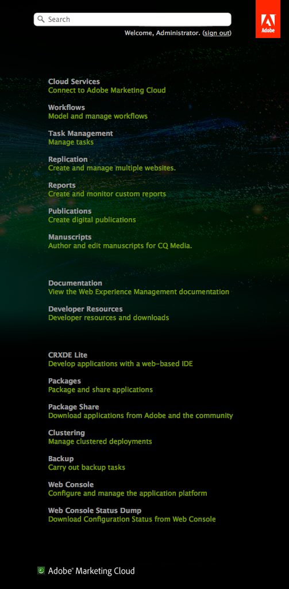

# Anpassa välkomstkonsolen (Classic UI){#customizing-the-welcome-console-classic-ui}

>[!CAUTION]
>
>Den här sidan behandlar det klassiska användargränssnittet.
>
>Se [Anpassa konsolerna](/help/sites-developing/customizing-consoles-touch.md) för mer information om det pekaktiverade standardgränssnittet.

Välkomstkonsolen innehåller en lista med länkar till de olika konsolerna och funktionerna i AEM.

Det går att konfigurera synliga länkar. Detta kan definieras för specifika användare och/eller grupper. Vilka åtgärder som ska vidtas beror på måltypen (som motsvarar den del av konsolen som de finns i):

* [Huvudkonsoler](#links-in-main-console-left-pane) - Länkar i huvudkonsolen (vänster ruta)
* [Resurser, Dokumentation och referens, Funktioner](#links-in-sidebar-right-pane) - Länkar i sidofältet (den högra rutan)

## Länkar i huvudkonsolen (vänster ruta) {#links-in-main-console-left-pane}

Här visas huvudkonsolerna för AEM.

### Konfigurera om huvudkonsollänkar är synliga {#configuring-whether-main-console-links-are-visible}

Nodnivåbehörigheter avgör om länken kan ses eller inte. De aktuella noderna är:

* **** Webbplatser: `/libs/wcm/core/content/siteadmin`

* **** Digital Assets: `/libs/wcm/core/content/damadmin`

* **** Community: `/libs/collab/core/content/admin`

* **** Kampanjer: `/libs/mcm/content/admin`

* **** Inkorg: `/libs/cq/workflow/content/inbox`

* **** Användare: `/libs/cq/security/content/admin`

* **** Systemutvärdering: `/libs/wcm/core/content/misc`

* **** Taggning: `/libs/cq/tagging/content/tagadmin`

Exempel:

* Om du vill begränsa åtkomst till **verktyg** tar du bort läsåtkomst från

   `/libs/wcm/core/content/misc`

Mer information om hur du anger behörigheter finns i avsnittet  Säkerhet.

### Länkar i sidofältet (höger ruta) {#links-in-sidebar-right-pane}

Länkarna baseras på att noder finns *och* läses under följande sökväg:

`/libs/cq/core/content/welcome`

Det finns tre avsnitt (med ett mellanrum) som standard:

<table>
 <tbody>
  <tr>
   <td><strong>Resurser</strong></td>
   <td> </td>
  </tr>
  <tr>
   <td> Molntjänster</td>
   <td><code>/libs/cq/core/content/welcome/resources/cloudservices</code></td>
  </tr>
  <tr>
   <td> Arbetsflöden</td>
   <td><code>/libs/cq/core/content/welcome/resources/workflows</code></td>
  </tr>
  <tr>
   <td> Aktivitetshantering</td>
   <td><code>/libs/cq/core/content/welcome/resources/taskmanager</code></td>
  </tr>
  <tr>
   <td> Replikering</td>
   <td><code>/libs/cq/core/content/welcome/resources/replication</code></td>
  </tr>
  <tr>
   <td> Rapporter</td>
   <td><code>/libs/cq/core/content/welcome/resources/reports</code></td>
  </tr>
  <tr>
   <td> Publikationer</td>
   <td><code>/libs/cq/core/content/welcome/resources/publishingadmin</code></td>
  </tr>
  <tr>
   <td> Manuscript</td>
   <td><code>/libs/cq/core/content/welcome/resources/manuscriptsadmin</code></td>
  </tr>
  <tr>
   <td><strong>Dokumentation och referens</strong></td>
   <td> </td>
  </tr>
  <tr>
   <td> Dokumentation</td>
   <td><code>/libs/cq/core/content/welcome/docs/docs</code></td>
  </tr>
  <tr>
   <td> Resurser för utvecklare</td>
   <td><code>/libs/cq/core/content/welcome/docs/dev</code></td>
  </tr>
  <tr>
   <td><strong>Funktioner</strong></td>
   <td> </td>
  </tr>
  <tr>
   <td> CRXDE Lite</td>
   <td><code>/libs/cq/core/content/welcome/features/crxde</code></td>
  </tr>
  <tr>
   <td> Paket</td>
   <td><code>/libs/cq/core/content/welcome/features/packages</code></td>
  </tr>
  <tr>
   <td> Paketresurs</td>
   <td><code>/libs/cq/core/content/welcome/features/share</code></td>
  </tr>
  <tr>
   <td> Klustring</td>
   <td><code>/libs/cq/core/content/welcome/features/cluster</code></td>
  </tr>
  <tr>
   <td> Säkerhetskopiera</td>
   <td><code>/libs/cq/core/content/welcome/features/backup</code></td>
  </tr>
  <tr>
   <td> Webbkonsol  </td>
   <td><code>/libs/cq/core/content/welcome/features/config</code></td>
  </tr>
  <tr>
   <td> Statusdump för webbkonsol  </td>
   <td><code>/libs/cq/core/content/welcome/features/statusdump</code></td>
  </tr>
 </tbody>
</table>

#### Konfigurera om sidofältslänkar är synliga {#configuring-whether-sidebar-links-are-visible}

Du kan dölja en länk för specifika användare eller grupper genom att ta bort läsåtkomst till de noder som representerar länken.

* Resurser - ta bort åtkomst till:

   `/libs/cq/core/content/welcome/resources/<link-target>`

* Dokument - ta bort åtkomst till:

   `/libs/cq/core/content/welcome/docs/<link-target>`

* Funktioner - ta bort åtkomst till:

   `/libs/cq/core/content/welcome/features/<link-target>`

Exempel:

* Ta bort länken till **rapporter** genom att ta bort läsåtkomst från

   `/libs/cq/core/content/welcome/resources/reports`

* Om du vill ta bort länken till **paket** tar du bort läsåtkomst från

   `/libs/cq/core/content/welcome/features/packages`

Mer information om hur du anger behörigheter finns i avsnittet  Säkerhet.

### Länkmarkeringsmekanism {#link-selection-mechanism}

ConsoleUtil `/libs/cq/core/components/welcome/welcome.jsp` används och kör en fråga på noder som har egenskapen:

* `jcr:mixinTypes` med värdet: `cq:Console`

>[!NOTE]
>
>Kör följande fråga för att se den befintliga listan:
>
>* `select * from cq:Console`
>

När en användare eller grupp inte har läsbehörighet för en nod med mixin `cq:Console`hämtas inte den noden av `ConsoleUtil` sökningen och visas därför inte på konsolen.

### Lägga till ett anpassat objekt {#adding-a-custom-item}

Du kan använda [länkmarkeringsfunktionen](#link-selection-mechanism) för att lägga till egna objekt i länklistan.

Lägg till ditt anpassade objekt i listan genom att lägga till `cq:Console` mixen i widgeten eller resursen. Detta görs genom att definiera egenskapen:

* `jcr:mixinTypes` med värdet: `cq:Console`

