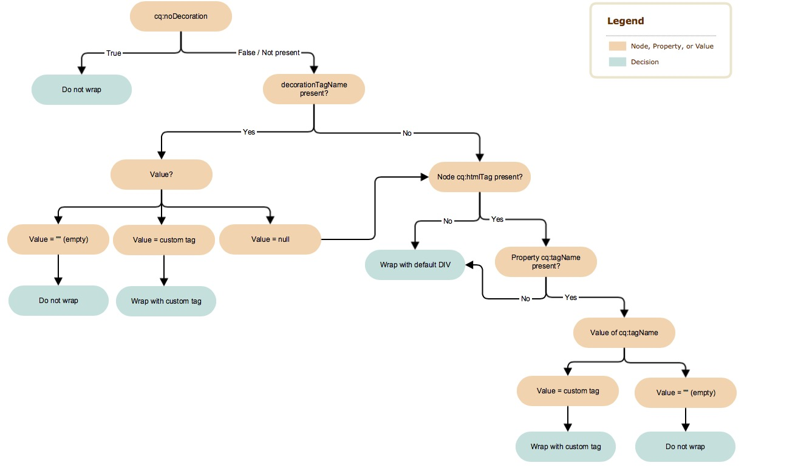

# Dekoration-tagg{#decoration-tag}

>[!NOTE]
>
>Beteendet för dekorationstaggen och alternativen som beskrivs i den här artikeln baseras på [AEM 6.3 CFP1](https://helpx.adobe.com/experience-manager/release-notes--aem-6-3-cumulative-fix-pack.html).
>
>Beteendet hos dekorationstaggen i 6.3 före CFP1 liknar beteendet hos AEM 6.2.

När en komponent på en webbsida återges kan ett HTML-element genereras och den återgivna komponenten kapslas in i sig själv. Detta har främst två syften:

* En komponent kan bara redigeras när den kapslas med ett HTML-element.
* Omslutningselementet används för att tillämpa HTML-klasser som innehåller:

   * layoutinformation
   * formatinformation

För utvecklare erbjuder AEM tydlig och enkel logik som styr de dekorationstaggar som omsluter de inkluderade komponenterna. Om och hur dekorationstaggen återges definieras av en kombination av två faktorer som den här sidan kommer att dyka upp i:

* Själva komponenten kan konfigurera sin dekorationstagg med en uppsättning egenskaper.
* De skript som innehåller komponenter (HTL, JSP, dispatcher osv.) kan definiera aspekterna för dekorationstaggen med include-parametrar.

## Rekommendationer {#recommendations}

Här följer några allmänna rekommendationer för när wrapper-elementet ska tas med, som hjälper dig att undvika att stöta på oväntade problem:

* Närvaron av wrapper-elementet får inte skilja sig mellan WCMModes (redigerings- eller förhandsgranskningsläge), instanser (författare eller publicering) eller miljö (staging eller produktion), så att sidans CSS och JavaScript fungerar likadant i alla fall.
* Radbrytningselementet bör läggas till i alla komponenter som är redigerbara, så att sidredigeraren kan initiera och uppdatera dem på rätt sätt.
* För icke-redigerbara komponenter kan wrapper-elementet undvikas om det inte har någon speciell funktion, så att den resulterande koden inte blir onödigt utdragen.

## Komponentkontroller {#component-controls}

Följande egenskaper och noder kan tillämpas på komponenterna för att styra beteendet för deras dekorationstagg:

* **`cq:noDecoration {boolean}`**: Den här egenskapen kan läggas till i en komponent och ett true-värde tvingar AEM att inte generera några wrapper-element över komponenten.

* **`cq:htmlTag`**node : Den här noden kan läggas till under en komponent och kan ha följande egenskaper:

   * **`cq:tagName {String}`**: Detta kan användas för att ange en anpassad HTML-tagg som ska användas för att kapsla in komponenterna i stället för DIV-standardelementet.
   * **`class {String}`**: Detta kan användas för att ange CSS-klassnamn som ska läggas till i wrapper.
   * Andra egenskapsnamn läggs till som HTML-attribut med samma String-värde som anges.

## Skriptkontroller {#script-controls}

Omslutningsbeteendet skiljer sig dock åt beroende på om [HTML](/help/sites-developing/decoration-tag.md#htl) eller [JSP](/help/sites-developing/decoration-tag.md#jsp) används för att inkludera elementet.

### HTL {#htl}

I allmänhet kan omslutningsbeteendet i HTML sammanfattas på följande sätt:

* Ingen wrapper-DIV återges som standard (när du bara gör `data-sly-resource="foo"`).
* Alla wcm-lägen (inaktiverade, förhandsgranska, redigera både på författare och publicerade) återges identiskt.

Omslagets beteende kan också styras helt.

* HTL-skriptet har fullständig kontroll över det resulterande beteendet för wrapper-taggen.
* Komponentegenskaper (som `cq:noDecoration` och `cq:tagName`) kan också definiera wrapper-taggen.

Det går att helt styra beteendet för wrapper-taggarna från HTML-skript och tillhörande logik.

Mer information om hur du utvecklar i HTML finns i [HTML-dokumentationen](https://docs.adobe.com/content/help/en/experience-manager-htl/using/overview.html).

#### Beslutsträd {#decision-tree}

Detta beslutsträd sammanfattar logiken som bestämmer beteendet för wrapper-taggarna.


#### Användningsexempel {#use-cases}

Följande tre exempel innehåller exempel på hur wrapper-taggarna hanteras, och visar också hur enkelt det är att styra det önskade beteendet för wrapper-taggarna.

Alla exempel som följer förutsätter följande innehållsstruktur och komponenter:

```
/content/test/
  @resourceType = "test/components/one"
  child/
    @resourceType = "test/components/two"
```

```
/apps/test/components/
  one/
    one.html
  two/
    two.html
    cq:htmlTag/
      @cq:tagName = "article"
      @class = "component-two"
```

#### Användningsfall 1: Inkludera en komponent för återanvändning av kod {#use-case-include-a-component-for-code-reuse}

Det vanligaste användningsfallet är när en komponent innehåller en annan komponent av kodskäl. I så fall är den inkluderade komponenten inte nödvändig för att kunna redigeras med ett eget verktygsfält och en egen dialogruta. Därför behövs ingen wrapper och komponentens `cq:htmlTag` kommer att ignoreras. Detta kan betraktas som standardbeteendet.

`one.html: <sly data-sly-resource="child"></sly>`

`two.html: Hello World!`

Resultat av utdata på `/content/test.html`:

**`Hello World!`**

Ett exempel är en komponent som innehåller en huvudbildkomponent för att visa en bild, vanligtvis med hjälp av en syntetisk resurs, som består i att ta med en virtuell underordnad komponent genom att skicka ett Map-objekt som representerar alla egenskaper som komponenten skulle ha till en dataunderordnad resurs.

#### Användningsfall 2: Inkludera en redigerbar komponent {#use-case-include-an-editable-component}

Ett annat vanligt användningsfall är när behållarkomponenter innehåller redigerbara underordnade komponenter, som en layoutbehållare. I det här fallet behöver varje inkluderat underordnat objekt en wrapper för att redigeraren ska fungera (om de inte uttryckligen inaktiveras med `cq:noDecoration` egenskapen).

Eftersom den inkluderade komponenten i det här fallet är en fristående komponent, behöver den ett wrapper-element för att redigeraren ska kunna arbeta och för att definiera dess layout och format som ska användas. Det finns ett alternativ för att aktivera det här beteendet `decoration=true` .

`one.html: <sly data-sly-resource="${'child' @ decoration=true}"></sly>`

`two.html: Hello World!`

Resultat av utdata på `/content/test.html`:

**`<article class="component-two">Hello World!</article>`**

#### Användningsfall 3: Anpassat beteende {#use-case-custom-behavior}

Det kan finnas ett obegränsat antal komplexa fall, som enkelt kan uppnås genom möjligheten att HTML uttryckligen anger:

* **`decorationTagName='ELEMENT_NAME'`** För att definiera elementnamnet för wrapper.
* **`cssClassName='CLASS_NAME'`** För att definiera CSS-klassnamn som ska anges för den.

`one.html: <sly data-sly-resource="${'child' @ decorationTagName='aside', cssClassName='child'}"></sly>`

`two.html: Hello World!`

Resultat `/content/test.html`:

**`<aside class="child">Hello World!</aside>`**

## JSP {#jsp}

När du inkluderar en komponent som använder `cq:includ`e eller `sling:include`e är standardbeteendet i AEM att använda en DIV för att kapsla in elementet. Denna radbrytning kan dock anpassas på två sätt:

* Säg uttryckligen åt AEM att inte kapsla in komponenten med `cq:noDecoration`.
* Använd en anpassad HTML-tagg för att kapsla in komponenten med `cq:htmlTag`/ `cq:tagName` eller `decorationTagName`.

### Beslutsträd {#decision-tree-1}

Följande beslutsträd visar hur `cq:noDecoration`, `cq:htmlTag`, `cq:tagName`och `decorationTagName` påverkar radbrytningens beteende.



