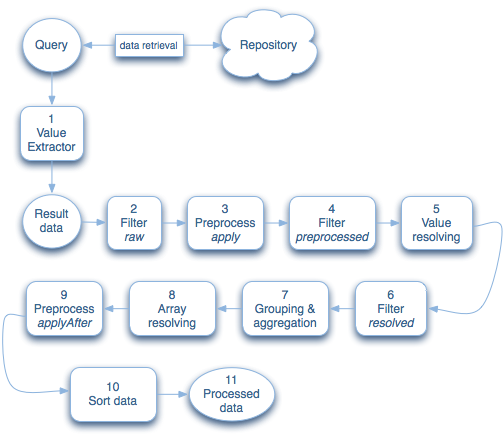

# Utveckla rapporter {#developing-reports}

Adobe Experience Manager (AEM) innehåller ett urval av [standardrapporter](/help/sites-administering/reporting.md) De flesta bygger på ett ramverk för rapportering.

Med hjälp av ramverket kan du antingen utöka dessa standardrapporter eller utveckla egna, nya rapporter. Rapporteringsramverket är nära integrerat med befintliga CQ5-koncept och CQ5-principer så att utvecklarna kan använda sina befintliga kunskaper om CQ5 som en språngbräda för att utveckla rapporter.

För standardrapporter som levereras med AEM:

* Rapporterna bygger på rapporteringsramverket:

   * [Komponentrapport](/help/sites-administering/reporting.md#component-report)
   * [Sidaktivitetsrapport](/help/sites-administering/reporting.md#page-activity-report)
   * [Användarrapport](/help/sites-administering/reporting.md#user-report)
   * [Instansrapport för arbetsflöde](/help/sites-administering/reporting.md#workflow-instance-report)

* Följande rapporter bygger på individuella principer och kan därför inte utökas:

   * [Diskanvändning](/help/sites-administering/reporting.md#disk-usage)
   * [Hälsokontroll](/help/sites-administering/reporting.md#health-check)
   * [Arbetsflödesrapport](/help/sites-administering/reporting.md#workflow-report)

>[!NOTE]
>
>Självstudiekurs [Skapa en egen rapport - ett exempel](#creating-your-own-report-an-example) visar också hur många av nedanstående principer som kan användas.
>
>Du kan även läsa standardrapporterna för att se andra exempel på implementering.

>[!NOTE]
>
>I exemplen och definitionerna nedan används följande notering:
>
>* Varje rad definierar en nod eller en egenskap där:
>  `N:<name> [<nodeType>]` : Beskriver en nod med namnet `<*name*>` och nodtyp för `<*nodeType*>`*.*
>  `P:<name> [<propertyType]` : Beskriver en egenskap med namnet `<*name*>` och en egenskapstyp för `<*propertyType*>`.
>  `P:<name> = <value>` : Beskriver en egenskap `<name>` som måste anges till värdet för `<value>`.
>
>* Indrag visar hierarkiska beroenden mellan noderna.
>* Objekt avgränsade med | betecknar en lista med möjliga objekt, t.ex. typer eller namn, t.ex. `String|String[]` betyder att egenskapen kan vara String eller String[].
>
>* `[]` avbildar en array, till exempel String[] eller en array med noder som i [Frågedefinition](#query-definition).
>
>Om inget annat anges är standardtyperna:
>
>* Noder - `nt:unstructured`
>* Egenskaper - `String`

## Reporting Framework {#reporting-framework}

Rapporteringsramen fungerar enligt följande principer:

* Den är helt baserad på resultatuppsättningar som returneras av en fråga som körs av CQ5 QueryBuilder.
* Resultatuppsättningen definierar de data som visas i rapporten. Varje rad i resultatmängden motsvarar en rad i rapportens tabellvy.
* De åtgärder som är tillgängliga för körning i resultatuppsättningen liknar RDBMS-begrepp, främst *gruppera* och *aggregering*.

* De flesta datahämtningar och databearbetningar görs på serversidan.
* Klienten ansvarar själv för att visa förbehandlade data. Endast mindre bearbetningsuppgifter (till exempel att skapa länkar i cellinnehåll) utförs på klientsidan.

Rapporteringsramverket (illustrerat av strukturen i en standardrapport) använder följande byggstenar som matas av bearbetningskön:


### Rapportsida {#report-page}

Rapportsidan är:

* En CQ5-standardsida.
* Baserat på en [standard-CQ5-mall, konfigurerad för rapporten](#report-template).

### Rapportbas {#report-base}

The [`reportbase` komponent](#report-base-component) utgör grunden för en rapport eftersom den

* Bevarar definitionen av [fråga](#the-query-and-data-retrieval) som levererar den underliggande resultatmängden med data.

* Det är ett anpassat styckesystem som innehåller alla kolumner ( `columnbase`) har lagts till i rapporten.
* Definierar vilka diagramtyper som är tillgängliga och vilka som är aktiva.
* Definierar dialogrutan Redigera, där användaren kan konfigurera vissa aspekter av rapporten.

### Kolumnbas {#column-base}

Varje kolumn är en instans av [`columnbase` komponent](#column-base-component) som

* Är ett stycke som används av parsytan ( `reportbase`) i respektive rapport.
* Definierar länken till [underliggande resultatuppsättning](#the-query-and-data-retrieval). Det innebär att den definierar de specifika data som refereras i den här resultatuppsättningen och hur den bearbetas.
* Bevarar ytterligare definitioner, t.ex. de aggregat och filter som är tillgängliga, tillsammans med eventuella standardvärden.

### Fråga och datahämtning {#the-query-and-data-retrieval}

Frågan:

* Definieras som en del av [`reportbase`](#report-base) -komponenten.
* Baseras på [CQ QueryBuilder](https://developer.adobe.com/experience-manager/reference-materials/6-5/javadoc/com/day/cq/search/QueryBuilder.html).
* Hämtar data som används som grund för rapporten. Varje rad i resultatmängden (tabellen) är kopplad till en nod som returneras av frågan. Specifik information för [enskilda kolumner](#column-base-component) extraheras sedan från denna datauppsättning.

* Oftast består de av

   * En rotsökväg.

     Detta anger det underträd i databasen som ska genomsökas.

     För att minimera prestandapåverkan är det tillrådligt att (försöka) begränsa frågan till ett specifikt underträd i databasen. Rotsökvägen kan antingen vara fördefinierad i [rapportmall](#report-template) eller anges av användaren i [Dialogrutan Konfiguration (Redigera)](#configuration-dialog).

   * [Ett eller flera villkor](#query-definition).

     Dessa används för att skapa den (inledande) resultatuppsättningen. De innehåller till exempel begränsningar för nodtypen eller egenskapsbegränsningar.

**Nyckelpunkten här är att varje enskild nod som returneras i frågans resultatuppsättning används för att generera en enda rad i rapporten (så att relationen 1:1).**

Utvecklaren måste se till att den fråga som definierats för en rapport returnerar en noduppsättning som är lämplig för den rapporten. Noden behöver dock inte innehålla all nödvändig information, den kan också härledas från överordnade och/eller underordnade noder. Den fråga som till exempel används för [Användarrapport](/help/sites-administering/reporting.md#user-report) markerar noder baserat på nodtyp (i det här fallet `rep:user`). De flesta kolumner i den här rapporten tar emellertid inte sina data direkt från dessa noder, utan från de underordnade noderna `profile`.

### Bearbetar kö {#processing-queue}

The [fråga](#the-query-and-data-retrieval) returnerar en resultatuppsättning med data som ska visas som rader i rapporten. Varje rad i resultatuppsättningen bearbetas (på serversidan), i [flera faser](#phases-of-the-processing-queue)innan den överförs till klienten för visning i rapporten.

Detta gör att:

* Extrahera och härleda värden från den underliggande resultatmängden.

  Du kan till exempel bearbeta två egenskapsvärden som ett enda värde genom att beräkna skillnaden mellan dem.

* Lösa extraherade värden. Detta kan göras på olika sätt.

  Sökvägar kan t.ex. mappas till en titel (som i det mer läsbara innehållet i respektive *jcr:title* egenskap).

* Använda filter vid olika punkter.
* Skapa sammansatta värden, om det behövs.

  Exempel: en text som visas för användaren, ett värde som ska användas för sortering och en extra URL som används (på klientsidan) för att skapa en länk.

#### Bearbetningsköns arbetsflöde {#workflow-of-the-processing-queue}

Följande arbetsflöde representerar arbetskön:



#### Bearbetningsköns faser {#phases-of-the-processing-queue}

Där detaljerade steg och element är:

1. Omvandlar resultaten som returneras av [inledande fråga (rapportbas)](#query-definition) i den grundläggande resultatmängden med hjälp av värdeextraherare.

   Värdeextraherare väljs automatiskt beroende på [kolumntyp](#column-specific-definitions). De används för att läsa värden från den underliggande JCR-frågan och skapa en resultatuppsättning från dem. Därefter kan ytterligare bearbetning användas. För `diff` type läser värdeextraheraren två egenskaper och beräknar det enskilda värdet som sedan läggs till i resultatuppsättningen. Det går inte att konfigurera värdeextraherarna.

1. Till den ursprungliga resultatmängden, som innehåller rådata, [inledande filtrering](#column-specific-definitions) (*råformat* fas) används.

1. Värdena är [förbearbetad](#processing-queue); enligt definition för *apply* fas.

1. [Filtrering](#column-specific-definitions) (tilldelat till *förbearbetad* fas) körs på de förbearbetade värdena.

1. Värdena löses, enligt [definierad lösare](#processing-queue).
1. [Filtrering](#column-specific-definitions) (tilldelat till *löst* fas) körs på de lösta värdena.

1. Data är [grupperade och aggregerade](#column-specific-definitions).
1. Matrisdata löses genom att de konverteras till en (strängbaserad) lista.

   Detta är ett implicit steg som konverterar ett flervärdesresultat till en lista som kan visas. Det krävs för (oaggregerade) cellvärden som baseras på JCR-egenskaper med flera värden.

1. Värdena är igen [förbearbetad](#processing-queue); enligt definition för *afterApply* fas.

1. Data sorteras.
1. De bearbetade data överförs till klienten.

>[!NOTE]
>
>Den inledande frågan som returnerar basdataresultatuppsättningen definieras på `reportbase` -komponenten.
>
>Andra element i bearbetningskön definieras på `columnbase` -komponenter.

## Rapportkonstruktion och konfiguration {#report-construction-and-configuration}

Följande krävs för att skapa och konfigurera en rapport:

* a [plats för definition av rapportkomponenter](#location-of-report-components)
* a [`reportbase` komponent](#report-base-component)
* en eller flera, [`columnbase` komponenter](#column-base-component)
* a [sidkomponent](#page-component)
* a [rapportdesign](#report-design)
* a [rapportmall](#report-template)

### Plats för rapportkomponenter {#location-of-report-components}

Standardkomponenter för rapportering hålls under `/libs/cq/reporting/components`.

Vi rekommenderar dock att du inte uppdaterar dessa noder, utan skapar egna komponentnoder under `/apps/cq/reporting/components` eller om det är mer lämpligt `/apps/<yourProject>/reports/components`.

Var (som ett exempel):

```
N:apps
    N:cq [nt:folder]
        N:reporting|reports [sling:Folder]
            N:components [sling:Folder]
```

I det här exemplet skapar du roten för rapporten och under det här komponenterna för rapportbasen och kolumnbaskomponenterna:

```
N:apps
    N:cq [nt:folder]
        N:reporting|reports [sling:Folder]
            N:components [sling:Folder]
                N:<reportname> [sling:Folder]
                        N:<reportname> [cq:Component]  // report base component
                        N:<columnname> [cq:Component]  // column base component
```

### Sidkomponent {#page-component}

En rapportsida måste använda `sling:resourceType` av `/libs/cq/reporting/components/reportpage`.

En anpassad sidkomponent ska inte vara nödvändig (vanligtvis).

## Rapportbaskomponent {#report-base-component}

Varje rapporttyp kräver en behållarkomponent som härleds från `/libs/cq/reporting/components/reportbase`.

Den här komponenten fungerar som en behållare för rapporten som helhet och ger information om:

* The [frågedefinition](#query-definition).
* An [(valfritt) dialogruta](#configuration-dialog) för att konfigurera rapporten.
* Alla [Diagram](#chart-definitions) som är integrerade med rapporten.

```
N:<reportname> [cq:Component]
    P:sling:resourceSuperType = "cq/reporting/components/reportbase"
    N:charting
    N:dialog [cq:Dialog]
    N:queryBuilder
```

### Frågedefinition {#query-definition}

```xml
N:queryBuilder
    N:propertyConstraints
    [
        N:<name> // array of nodes (name irrelevant), each with the following properties:
            P:name
            P:value
    ]
    P:nodeTypes [String|String[]]
    P:mandatoryProperties [String|String[]
  ]
```

* `propertyConstraints`

  Begränsar resultatet som angetts till noder som har specifika egenskaper med specifika värden. Om flera begränsningar anges måste noden uppfylla alla (AND-åtgärd).

  Till exempel:

  ```
  N:propertyConstraints
   [
   N:0
   P:sling:resourceType
   P:foundation/components/textimage
   N:1
   P:jcr:modifiedBy
   P:admin
   ]
  ```

  Returnerar alla `textimage` komponenter som senast ändrades av `admin` användare.

* `nodeTypes`

  Används för att begränsa resultatet som angetts till de angivna nodtyperna. Du kan ange flera nodtyper.

* `mandatoryProperties`

  Begränsar resultatet som angetts till noder som har *alla* de angivna egenskaperna. Egenskapernas värde räknas inte.

Alla är valfria och kan kombineras om det behövs, men du måste definiera minst en av dem.

### Diagramdefinitioner {#chart-definitions}

```xml
N:charting
    N:settings
        N:active [cq:WidgetCollection]
        [
            N:<name> // array of nodes, each with the following property
                P:id   // must match the id of a child node of definitions
        ]
    N:definitions [cq:WidgetCollection]
    [
        N:<name> // array of nodes, each with the following properties
            P:id
            P:type
            // additional, chart type specific configurations
    ]
```

* `settings`

  Innehåller definitioner för aktiva diagram.

   * `active`

     Eftersom det går att definiera flera inställningar kan du använda den här för att definiera vilka som är aktiva. Dessa definieras av en array med noder (det finns ingen obligatorisk namnkonvention för dessa noder, men standardrapporterna använder ofta `0`, `1`.. `x`) med följande egenskaper:

      * `id`

        Identifiering för aktiva diagram. Detta måste matcha ID:t för ett av diagrammen `definitions`.

* `definitions`

  Definierar de diagramtyper som är tillgängliga för rapporten. The `definitions` som ska användas anges av `active` inställningar.

  Definitionerna anges med en array med noder (även här namnges de ofta) `0`, `1`.. `x`) med följande egenskaper:

   * `id`

     Diagrammets identifiering.

   * `type`

     Diagramtyp som är tillgänglig. Välj bland:

      * `pie`
Cirkeldiagram. Genereras endast från aktuella data.

      * `lineseries`
En serie linjer (anslutningspunkter som representerar de faktiska fixeringarna). Genereras endast från historikdata.

   * Ytterligare egenskaper är tillgängliga, beroende på diagramtyp:

      * för diagramtypen `pie`:

         * `maxRadius` ( `Double/Long`)

           Den maximala radie som tillåts för cirkeldiagrammet. Därför är den maximala storlek som tillåts för diagrammet (utan teckenförklaring). Ignoreras om `fixedRadius` är definierad.

         * `minRadius` ( `Double/Long`)

           Den minsta radie som tillåts för cirkeldiagrammet. Ignoreras om `fixedRadius` är definierad.

         * `fixedRadius` ( `Double/Long`) Definierar en fast radie för cirkeldiagrammet.

      * för diagramtypen [`lineseries`](/help/sites-administering/reporting.md#display-limits):

         * `totals` ( `Boolean`)

           True om en extra rad visar **Totalt** bör visas.
standard: `false`

         * `series` ( `Long`)

           Antal rader/serier som ska visas.
standard: `9` (detta är också tillåtet)

         * `hoverLimit` ( `Long`)

           Maximalt antal aggregerade ögonblicksbilder (punkter som visas på varje vågrät linje, som representerar distinkta värden) som popup-fönster ska visas för. Det vill säga när användaren för musen över ett distinkt värde eller motsvarande etikett i diagramförklaringen.

           standard: `35` (d.v.s. inga popup-fönster visas alls om fler än 35 distinkta värden gäller för de aktuella diagraminställningarna).

           Det finns ytterligare en begränsning på tio popup-fönster som kan visas parallellt (flera popup-fönster kan visas när muspekaren förs över förklaringstexterna).

### Konfigurationsdialogruta {#configuration-dialog}

Varje rapport kan ha en konfigurationsdialogruta där användaren kan ange olika parametrar för rapporten. Dialogrutan är tillgänglig via **Redigera** när rapportsidan är öppen.

Den här dialogrutan är en standard-CQ [dialog](/help/sites-developing/components-basics.md#dialogs) och kan konfigureras som sådana (se [CQ.Dialog](https://developer.adobe.com/experience-manager/reference-materials/6-5/widgets-api/index.html?class=CQ.Dialog) för mer information).

En exempeldialogruta kan se ut så här:

```xml
<?xml version="1.0" encoding="UTF-8"?>
<jcr:root xmlns:cq="https://www.day.com/jcr/cq/1.0" xmlns:jcr="https://www.jcp.org/jcr/1.0"
    jcr:primaryType="cq:Dialog"
    height="{Long}424">
    <items jcr:primaryType="cq:WidgetCollection">
        <props jcr:primaryType="cq:Panel">
            <items jcr:primaryType="cq:WidgetCollection">
                <title
                    jcr:primaryType="cq:Widget"
                    path="/libs/cq/reporting/components/commons/title.infinity.json"
                    xtype="cqinclude"/>
                <description
                    jcr:primaryType="cq:Widget"
                    path="/libs/cq/reporting/components/commons/description.infinity.json"
                    xtype="cqinclude"/>
                <rootPath
                    jcr:primaryType="cq:Widget"
                    fieldLabel="Root path"
                    name="./report/rootPath"
                    rootPath=""
                    rootTitle="Repository root"
                    xtype="pathfield"/>
                <processing
                    jcr:primaryType="cq:Widget"
                    path="/libs/cq/reporting/components/commons/processing.infinity.json"
                    xtype="cqinclude"/>
                <scheduling
                    jcr:primaryType="cq:Widget"
                    path="/libs/cq/reporting/components/commons/scheduling.infinity.json"
                    xtype="cqinclude"/>
            </items>
        </props>
    </items>
</jcr:root>
```

Flera förkonfigurerade komponenter finns tillgängliga. De kan refereras i dialogrutan med hjälp av `xtype` egenskap med värdet `cqinclude`:

* **`title`**

  `/libs/cq/reporting/components/commons/title`

  Textfält som definierar rapportrubriken.

* **`description`**

  `/libs/cq/reporting/components/commons/description`

  Textområde som definierar rapportbeskrivningen.

* **`processing`**

  `/libs/cq/reporting/components/commons/processing`

  Väljare för rapportens behandlingsläge (läsa in data manuellt/automatiskt).

* **`scheduling`**

  `/libs/cq/reporting/components/commons/scheduling`

  Väljare för schemaläggning av ögonblicksbilder för det historiska diagrammet.

>[!NOTE]
>
>De refererade komponenterna måste inkluderas med `.infinity.json` suffix (se exempel ovan).

### Rotsökväg {#root-path}

En rotsökväg kan också definieras för rapporten:

* **`rootPath`**

  Detta begränsar rapporten till ett visst avsnitt (träd eller underträd) i databasen, vilket rekommenderas för prestandaoptimering. Rotsökvägen anges av `rootPath` egenskapen för `report` noden för varje rapportsida (hämtas från mallen när sidan skapas).

  Den kan anges av:

   * den [rapportmall](#report-template) (antingen som ett fast värde eller som standardvärde för konfigurationsdialogrutan).
   * användaren (med den här parametern)

## Kolumnbaskomponent {#column-base-component}

Varje kolumntyp kräver en komponent som härleds från `/libs/cq/reporting/components/columnbase`.

En kolumnkomponent definierar en kombination av följande:

* The [Kolumnspecifik fråga](#column-specific-query) konfiguration.
* The [Lösning och förbearbetning](#resolvers-and-preprocessing).
* The [Kolumnspecifika definitioner](#column-specific-definitions) (t.ex. filter och aggregat, `definitions` underordnad nod).
* [Standardvärden för kolumn](#column-default-values).
* The [Klientfilter](#client-filter) för att extrahera informationen för visning från data som returneras av servern.
* En kolumnkomponent måste dessutom tillhandahålla en lämplig instans av `cq:editConfig`. för att definiera [Händelser och åtgärder](#events-and-actions) krävs.
* Konfigurationen för [generiska kolumner](#generic-columns).

```
N:<columnname> [cq:Component]
    P:componentGroup
    P:jcr:title
    P:sling:resourceSuperType = "cq/reporting/components/columnbase"
    N:cq:editConfig [cq:EditConfig] // <a href="#events-and-actions">Events and Actions</a>
    N:defaults // <a href="#column-default-values">Column Default Values</a>
    N:definitions
      N:queryBuilder // <a href="#column-specific-query">Column Specific Query</a>
        P:property [String|String[]] // Column Specific Query
        P:subPath // Column Specific Query
        P:secondaryProperty [String|String[]] // Column Specific Query
        P:secondarySubPath // Column Specific Query
      N:data
        P:clientFilter [String] // <a href="#client-filter">Client Filter</a>
        P:resolver // <a href="#resolvers-and-preprocessing">Resolvers and Preprocessing</a>
        N:resolverConfig // Resolvers and Preprocessing
        N:preprocessing // Resolvers and Preprocessing
      P:type // <a href="#column-specific-definitions">Column Specific Definitions</a>
      P:groupable [Boolean] // Column Specific Definitions
      N:filters [cq:WidgetCollection] // Column Specific Definitions
      N:aggregates [cq:WidgetCollection] // Column Specific Definitions
```

Se även [Definiera din nya rapport](#defining-your-new-report).

### Kolumnspecifik fråga {#column-specific-query}

Detta definierar den specifika dataextraheringen (från [rapportdataresultatuppsättning](#the-query-and-data-retrieval)) för användning i den enskilda kolumnen.

```xml
N:definitions
    N:queryBuilder
        P:property [String|String[]]
        P:subPath
        P:secondaryProperty [String|String[]]
        P:secondarySubPath
```

* `property`

  Definierar den egenskap som ska användas för att beräkna det faktiska cellvärdet.

  Om en egenskap definieras som String[], skannas flera egenskaper (i ordning) för att hitta det faktiska värdet.

  Om det till exempel finns:

  `property = [ "jcr:lastModified", "jcr:created" ]`

  Motsvarande värdeextraherare (som kontrolleras här):

   * Kontrollerar om det finns en jcr:lastModified-egenskap och använd den i så fall.
   * Om ingen jcr:lastModified-egenskap är tillgänglig används innehållet i jcr:created i stället.

* `subPath`

  Om resultatet inte finns på noden som returneras av frågan, `subPath` definierar var egenskapen finns.

* `secondaryProperty`

  En andra egenskap som måste användas för att beräkna det faktiska cellvärdet. Den här definitionen används bara för vissa kolumntyper (diff och sortable).

  Om det till exempel finns en rapport över arbetsflödesinstanser används den angivna egenskapen för att lagra det faktiska värdet för tidsskillnaden (i millisekunder) mellan start- och sluttider.

* `secondarySubPath`

  Liknar subPath, när `secondaryProperty` används.

Vanligtvis bara `property` används.

### Klientfilter {#client-filter}

Klientfiltret extraherar informationen som ska visas från data som returneras av servern.

>[!NOTE]
>
>Filtret körs på klientsidan när hela serverbearbetningen har tillämpats.

```xml
N:definitions
    N:data
        P:clientFilter [String]
```

The `clientFilter` är en JavaScript-funktion som:

* som indata, tar emot en parameter; data som returneras från servern (så fullständigt förbearbetad)
* som utdata, returnerar det filtrerade (bearbetade) värdet, de data som extraherats eller härletts från indatainformationen

I följande exempel extraheras motsvarande sidsökväg från en komponentsökväg:

```
function(v) {
    var sepPos = v.lastIndexOf('/jcr:content');
    if (sepPos < 0) {
        return v;
    }
    return v.substring(sepPos + '/jcr:content'.length, v.length);
}
```

### Lösning och förbearbetning {#resolvers-and-preprocessing}

The [bearbetningskön](#processing-queue) definierar de olika lösarna och konfigurerar förbearbetningen:

```xml
N:definitions
    N:data
        P:resolver
        N:resolverConfig
        N:preprocessing
            N:apply
            N:applyAfter
```

* `resolver`

  Definierar den lösare som ska användas. Följande lösare är tillgängliga:

   * `const`

     Kopplar värden till andra värden. Detta används till exempel för att matcha konstanter som `en` till dess motsvarande värde `English`.

   * `default`

     Standardlösaren. Det här är en dummy-lösare som faktiskt inte löser någonting.

   * `page`

     Matchar ett sökvägsvärde till sökvägen för rätt sida, närmare bestämt till motsvarande `jcr:content` nod. Till exempel: `/content/.../page/jcr:content/par/xyz` har lösts till `/content/.../page/jcr:content`.

   * `path`

     Löser ett sökvägsvärde genom att lägga till en delbana och ta det faktiska värdet från en egenskap i noden (enligt definition i `resolverConfig`) på den lösta sökvägen. Till exempel en `path` av `/content/.../page/jcr:content` kan matchas med innehållet i `jcr:title` -egenskapen innebär det att en sidsökväg tolkas som sidans titel.

   * `pathextension`

     Löser ett värde genom att föregå en sökväg och ta det faktiska värdet från en egenskap för noden vid den lösta sökvägen. Ett värde till exempel `de` kan föregås av en bana som `/libs/wcm/core/resources/languages`, med värdet från egenskapen `language`för att lösa landskoden `de` till språkbeskrivningen `German`.

* `resolverConfig`

  Innehåller definitioner för lösaren. Vilka alternativ som är tillgängliga beror på `resolver` markerat:

   * `const`

     Använd egenskaper för att ange konstanter för matchning. Egenskapens namn definierar konstanten som ska lösas. Egenskapens värde definierar det lösta värdet.

     En egenskap med **Namn**= `1` och **Värde** `=One` löser 1 till 1.

   * `default`

     Det finns ingen tillgänglig konfiguration.

   * `page`

      * `propertyName` (valfritt)

        Definierar namnet på egenskapen som ska användas för att matcha värdet. Om inget anges används standardvärdet *jcr:title* (sidrubriken) används; för `page` resolver betyder det att först tolkas sökvägen till sidsökvägen och sedan matchas ytterligare till sidans rubrik.

   * `path`

      * `propertyName` (valfritt)

        Anger namnet på egenskapen som ska användas för att matcha värdet. Om inget anges används standardvärdet `jcr:title` används.

      * `subPath` (valfritt)

        Den här egenskapen kan användas för att ange ett suffix som ska läggas till i sökvägen innan värdet löses.

   * `pathextension`

      * `path` (obligatoriskt)

        Definierar den sökväg som ska användas som prepended.

      * `propertyName` (obligatoriskt)

        Definierar egenskapen på den lösta sökvägen där det faktiska värdet finns.

      * `i18n` (valfritt; typ Boolean)

        Avgör om det lösta värdet ska anges *internationaliserad* (d.v.s. använder [CQ5:s internationaliseringstjänster](/help/sites-administering/tc-manage.md)).

* `preprocessing`

  Förbearbetningen är valfri och kan bindas (separat) till bearbetningsfaserna *apply* eller *applyAfter*:

   * `apply`

     Den inledande förbehandlingsfasen ([steg 3 i återgivningen av arbetskön](#processing-queue)).

   * `applyAfter`

     Använd efter förbehandling ([steg 9 i återgivningen av bearbetningskön](#processing-queue)).

#### Resolvers {#resolvers}

Upplösarna används för att extrahera den information som krävs. Exempel på olika lösare är:

**Konstant**

Följande löser ett konstant värde på `VersionCreated` till strängen `New version created`.

Se `/libs/cq/reporting/components/auditreport/typecol/definitions/data`.

```xml
N:data
    P:resolver=const
    N:resolverConfig
        P:VersionCreated="New version created"
```

**Sida**

Matchar ett sökvägsvärde till egenskapen jcr:description på noden jcr:content (child) på motsvarande sida.

Se `/libs/cq/reporting/components/compreport/pagecol/definitions/data`.

```xml
N:data
    P:resolver=page
    N:resolverConfig
        P:propertyName="jcr:description"
```

**Bana**

Följande åtgärdar en sökväg med `/content/.../page` till innehållet i `jcr:title` -egenskapen innebär det att en sidsökväg tolkas som sidans titel.

Se `/libs/cq/reporting/components/auditreport/pagecol/definitions/data`.

```xml
N:data
    P:resolver=path
    N:resolverConfig
        P:propertyName="jcr:title"
        P:subPath="/jcr:content"
```

**Bantillägg**

Följande anger ett värde `de` med bantillägget `/libs/wcm/core/resources/languages`tar sedan värdet från egenskapen `language`för att lösa landskoden `de` till språkbeskrivningen `German`.

Se `/libs/cq/reporting/components/userreport/languagecol/definitions/data`.

```xml
N:data
    P:resolver=pathextension
    N:resolverConfig
        P:path="/libs/wcm/core/resources/languages"
        P:propertyName="language"
```

#### Förbehandling {#preprocessing}

The `preprocessing` kan användas på antingen:

* ursprungligt värde:

  Förbearbetningsdefinitionen för det ursprungliga värdet anges på `apply` och/eller `applyAfter` direkt.

* värdet i dess aggregerade tillstånd:

  Vid behov kan en separat definition ges för varje aggregering.

  Om du vill ange explicit förbearbetning för aggregerade värden måste förbearbetningsdefinitionerna finnas på respektive `aggregated` underordnad nod ( `apply/aggregated`, `applyAfter/aggregated`). Om explicit förbearbetning för distinkta aggregat krävs, finns förbearbetningsdefinitionen på en underordnad nod med namnet på respektive aggregat (till exempel `apply/aggregated/min/max` eller andra aggregat).

Du kan ange något av följande för förbearbetning:

* [sök och ersätt mönster](#preprocessing-find-and-replace-patterns)
När det angivna mönstret (som definieras som ett reguljärt uttryck) hittas ersätts det med ett annat mönster. Det kan till exempel användas för att extrahera en delsträng av originalet.

* [datatypsformaterare](#preprocessing-data-type-formatters)

  Konverterar ett numeriskt värde till en relativ sträng. Värdet&quot;som representerar en tidsskillnad på en timme skulle till exempel matchas till en sträng som `1:24PM (1 hour ago)`.

Till exempel:

```xml
N:definitions
    N:data
        N:preprocessing
            N:apply|applyAfter
                P:pattern         // regex
                P:replace         // replacement for regex
                // and/or
                P:format          // data type formatter
```

#### Förbehandling - Sök och ersätt mönster {#preprocessing-find-and-replace-patterns}

För förbearbetning kan du ange en `pattern` (definierad som [reguljärt uttryck](https://en.wikipedia.org/wiki/Regular_expression) eller regex) som finns och sedan ersätts med `replace` mönster:

* `pattern`

  Det reguljära uttryck som används för att hitta en delsträng.

* `replace`

  Strängen, eller representationen av strängen, som används som ersättning för den ursprungliga strängen. Detta representerar ofta en delsträng av strängen som finns i det reguljära uttrycket `pattern`.

En exempelersättning kan delas upp som:

* För noden `definitions/data/preprocessing/apply` med följande två egenskaper:

   * `pattern`: `(.*)(/jcr:content)(/|$)(.*)`
   * `replace`: `$1`

* En sträng kommer fram som:

   * `/content/geometrixx/en/services/jcr:content/par/text`

* Indelad i fyra avsnitt:

   * `$1` - `(.*)` - `/content/geometrixx/en/services`
   * `$2` - `(/jcr:content)` - `/jcr:content`
   * `$3` - `(/|$)` - `/`
   * `$4` - `(.*)` - `par/text`

* Och ersatt med strängen som representeras av `$1`:

   * `/content/geometrixx/en/services`

#### Förbehandling - Datatyper för datafrågor {#preprocessing-data-type-formatters}

Dessa formaterare konverterar ett numeriskt värde till en relativ sträng.

Detta kan till exempel användas för en tidskolumn som tillåter `min`, `avg` och `max` aggregat. Som `min`/ `avg`/ `max` aggregat visas som *tidsskillnad* (till exempel `10 days ago`) krävs en dataformaterare. För det här: `datedelta` formateringen används på `min`/ `avg`/ `max` aggregerade värden. Om en `count` sammanställningen är också tillgänglig, den behöver ingen formaterare, inte heller det ursprungliga värdet.

Följande datatypsformaterare är tillgängliga:

* `format`

  Datatypsformaterare:

   * `duration`

     Varaktighet är tidsintervallet mellan två definierade datum. Exempel: början och slutet av en arbetsflödesåtgärd som tog en timme, med början 11:23 den 13 december och avslutning en timme senare kl. 2.13.11 12:23.

     Det konverterar ett numeriskt värde (tolkas som millisekunder) till en varaktighetssträng, till exempel `30000` är formaterad som * `30s`.*

   * `datedelta`

     DataDelta är tidsintervallet mellan ett tidigare datum och&quot;nu&quot; (vilket ger ett annat resultat om rapporten visas vid en senare tidpunkt).

     Det konverterar det numeriska värdet (tolkas som en tidsskillnad i dagar) till en relativ datumsträng. 1 formateras till exempel som en dag sedan.

I följande exempel definieras `datedelta` formatera för `min` och `max` aggregat:

```xml
N:definitions
    N:data
        N:preprocessing
            N:apply
                N:aggregated
                    N:min
                        P:format = "datedelta"
                    N:max
                        P:format = "datedelta"
```

### Kolumnspecifika definitioner {#column-specific-definitions}

Kolumnspecifika definitioner definierar de filter och aggregat som är tillgängliga för den kolumnen.

```xml
N:definitions
    P:type
    P:groupable [Boolean]
    N:filters [cq:WidgetCollection]
    [
        N:<name> // array of nodes (names irrelevant) with the following properties:
            P:filterType
            P:id
            P:phase
    ]
    N:aggregates [cq:WidgetCollection]
    [
        N:<name> // array of nodes (names irrelevant) with the following properties:
            P:text
            P:type
    ]
```

* `type`

  Följande är tillgängliga som standardalternativ:

   * `string`
   * `number`
   * `int`
   * `date`
   * `diff`
   * `timeslot`

     Används för att extrahera delar av ett datum som behövs för aggregering (t.ex. gruppera efter år för att samla in data för varje år).

   * `sortable`

     Används för värden som använder olika värden (som tagits från olika egenskaper) för sortering och visning.

  Dessutom kan något av ovanstående definieras som multivärde, till exempel `string[]` definierar en array med strängar.

  Värdeextraheraren väljs av kolumntypen. Om en värdeextraherare är tillgänglig för en kolumntyp används den här extraheraren. I annat fall används standardvärdeextraheraren.

  En typ kan (valfritt) ta en parameter. Till exempel: `timeslot:year` hämtar året från ett datumfält. Typer med sina parametrar:

   * `timeslot` - Värdena är jämförbara med motsvarande konstanter i `java.utils.Calendar`.

      * `timeslot:year` - `Calendar.YEAR`
      * `timeslot:month-of-year` - `Calendar.MONTH`
      * `timeslot:week-of-year` - `Calendar.WEEK_OF_YEAR`
      * `timeslot:day-of-month` - `Calendar.DAY_OF_MONTH`
      * `timeslot:day-of-week` - `Calendar.DAY_OF_WEEK`
      * `timeslot:day-of-year` - `Calendar.DAY_OF_YEAR`
      * `timeslot:hour-of-day` - `Calendar.HOUR_OF_DAY`
      * `timeslot:minute-of-hour` - `Calendar.MINUTE`

* `groupable`

  Definierar om rapporten kan grupperas efter den här kolumnen.

* `filters`

  Filterdefinitioner.

   * `filterType`

     Tillgängliga filter:

      * `string`

        Ett strängbaserat filter.

   * `id`

     Filteridentifierare.

   * `phase`

     Tillgängliga faser:

      * `raw`

        Filtret används på rådata.

      * `preprocessed`

        Filtret tillämpas på förbearbetade data.

      * `resolved`

        Filtret används på matchade data.

* `aggregates`

  Sammanställningsdefinitioner.

   * `text`

     Sammanslagningens textnamn. If `text` anges inte, används standardbeskrivningen för sammanställningen. Till exempel: `minimum` används för `min` aggregat.

   * `type`

     Sammanslagningstyp. Tillgängliga aggregat är:

      * `count`

        Räknar antalet rader.

      * `count-nonempty`

        Räknar antalet rader som inte är tomma.

      * `min`

        Det innehåller det minsta värdet.

      * `max`

        Det ger det högsta värdet.

      * `average`

        Det ger det genomsnittliga värdet.

      * `sum`

        Här anges summan av alla värden.

      * `median`

        Det tillhandahåller medianvärdet.

      * `percentile95`

        Använder den 95:e percentilen av alla värden.

### Standardvärden för kolumn {#column-default-values}

Definierar standardvärden för kolumnen:

```xml
N:defaults
    P:aggregate
```

* `aggregate`

  Giltig `aggregate` värdena är desamma som `type` under `aggregates` (se [Kolumnspecifika definitioner (definitioner - filter/aggregat)](#column-specific-definitions) ).

### Händelser och åtgärder {#events-and-actions}

Redigera konfiguration definierar de händelser som krävs för att avlyssnarna ska kunna identifiera och de åtgärder som ska utföras efter att dessa händelser inträffar. Se [introduktion till komponentutveckling](/help/sites-developing/components.md) för bakgrundsinformation.

Följande värden måste definieras för att säkerställa att alla nödvändiga åtgärder hanteras:

```xml
N:cq:editConfig [cq:EditConfig]
    P:cq:actions [String[]] = "insert", "delete"
    P:cq:dialogMode = "floating"
    P:cq:layout = "auto"
    N:cq:listeners [cq:EditListenersConfig]
        P:aftercreate = "REFRESH_INSERTED"
        P:afterdelete = "REFRESH_SELF"
        P:afteredit = "REFRESH_SELF"
        P:afterinsert = "REFRESH_INSERTED"
        P:aftermove = "REFRESH_SELF"
        P:afterremove = "REFRESH_SELF"
```

### Allmänna kolumner {#generic-columns}

Allmänna kolumner är ett tillägg där (de flesta av) kolumndefinitionerna lagras på instansen av kolumnnoden (i stället för komponentnoden).

De använder en (standard) dialogruta som du kan anpassa för den enskilda generiska komponenten. I den här dialogrutan kan rapportanvändaren definiera kolumnegenskaperna för en allmän kolumn på rapportsidan (med menyalternativet **Kolumnegenskaper..**).

Ett exempel är **Allmän** kolumn i **Användarrapport**. Se `/libs/cq/reporting/components/userreport/genericcol`.

Så här gör du en kolumn generisk:

* Ange `type` egenskap för kolumnens `definition` nod till `generic`.

  Se `/libs/cq/reporting/components/userreport/genericcol/definitions`

* Ange en (standard) dialogrutedefinition under kolumnens `definition` nod.

  Se `/libs/cq/reporting/components/userreport/genericcol/definitions/dialog`

   * Fälten i dialogrutan måste referera till samma namn som motsvarande komponentegenskap, inklusive dess sökväg.

     Om du till exempel vill göra den allmänna kolumntypen konfigurerbar via dialogrutan använder du ett fält med namnet `./definitions/type`.

   * Egenskaper som definierats med användargränssnittet/dialogrutan har högre prioritet än de som definierats i `columnbase` -komponenten.

* Definiera redigeringskonfiguration.

  Se `/libs/cq/reporting/components/userreport/genericcol/cq:editConfig`

* Använd AEM standardmetoder för att definiera (ytterligare) kolumnegenskaper.

  För egenskaper som definieras för både komponent- och kolumninstanser har värdet för kolumninstansen företräde.

  De tillgängliga egenskaperna för en allmän kolumn är:

   * `jcr:title` - kolumnnamn
   * `definitions/aggregates` - aggregat
   * `definitions/filters` - filter
   * `definitions/type`- kolumntypen (denna måste definieras i dialogrutan, antingen med en väljare/kombinationsruta eller ett dolt fält)
   * `definitions/data/resolver` och `definitions/data/resolverConfig` (men inte `definitions/data/preprocessing` eller `.../clientFilter`) - lösaren och konfigurationen
   * `definitions/queryBuilder` - konfiguration av frågebyggaren
   * `defaults/aggregate` - standardsammanställningen

  Om det finns en ny instans av den generiska kolumnen på **Användarrapport** kommer de egenskaper som definierats med dialogrutan att finnas kvar under:

  `/etc/reports/userreport/jcr:content/report/columns/genericcol/settings/generic`

## Rapportdesign {#report-design}

Designen definierar vilka kolumntyper som är tillgängliga för att skapa en rapport. Den definierar också det styckesystem som kolumnerna läggs till i.

Adobe rekommenderar att du skapar en individuell design för varje rapport. På så sätt får du full flexibilitet. Se [Definiera din nya rapport](#defining-your-new-report).

Standardkomponenter för rapportering hålls under `/etc/designs/reports`.

Platsen för dina rapporter beror på var komponenterna finns:

* `/etc/designs/reports/<yourReport>` är lämplig om rapporten är under `/apps/cq/reporting`

* `/etc/designs/<yourProject>/reports/<*yourReport*>` för rapporter med `/apps/<yourProject>/reports` mönster

Nödvändiga designegenskaper registreras på `jcr:content/reportpage/report/columns` (till exempel `/etc/designs/reports/<reportName>/jcr:content/reportpage/report/columns`):

* `components`

  Alla komponenter och/eller komponentgrupper som tillåts i rapporten.

* `sling:resourceType`

  Egenskap med värde `cq/reporting/components/repparsys`.

Ett exempel på designutdrag (som tagits från komponentrapportens design) är:

```xml
<!-- ... -->
    <jcr:content
        jcr:primaryType="nt:unstructured"
        jcr:title="Component Report"
        sling:resourceType="wcm/core/components/designer">
        <reportpage jcr:primaryType="nt:unstructured">
            <report jcr:primaryType="nt:unstructured">
                <columns
                    jcr:primaryType="nt:unstructured"
                    sling:resourceType="cq/reporting/components/repparsys"
                    components="group:Component Report"/>
            </report>
        </reportpage>
    </jcr:content>
<!-- ... -->
```

Du behöver inte ange designer för enskilda kolumner. Tillgängliga kolumner kan definieras i designläge.

>[!NOTE]
>
>Adobe rekommenderar att du inte ändrar standardrapportdesignen. Detta för att säkerställa att du inte förlorar några ändringar när du uppgraderar eller installerar snabbkorrigeringar.
>
>Kopiera rapporten och dess design om du vill anpassa en standardrapport.

>[!NOTE]
>
>Standardkolumner kan skapas automatiskt när en rapport skapas. Dessa anges i mallen.

## Rapportmall {#report-template}

Varje rapporttyp måste innehålla en mall. Dessa är standard [CQ-mallar](/help/sites-developing/templates.md) och kan konfigureras som sådana.

Mallen måste:

* ange `sling:resourceType` till `cq/reporting/components/reportpage`

* ange vilken symbol som ska användas
* skapa en `report` underordnad nod som refererar till behållaren ( `reportbase`) med `sling:resourceType` property

Ett exempelmallutdrag (taget från komponentrapportmallen) är:

```xml
<!-- ... -->
    <jcr:content
        cq:designPath="/etc/designs/reports/compreport"
        jcr:primaryType="cq:PageContent"
        sling:resourceType="cq/reporting/components/reportpage">
        <report
            jcr:primaryType="nt:unstructured"
            sling:resourceType="cq/reporting/components/compreport/compreport"/>
    </jcr:content>
<!-- .. -->
```

Ett exempelmallutdrag som visar definitionen av rotsökvägen (som hämtats från användarrapportmallen) är:

```xml
<!-- ... -->
    <jcr:content
        cq:designPath="/etc/designs/reports/userreport"
        jcr:primaryType="cq:PageContent"
        sling:resourceType="cq/reporting/components/reportpage">
        <report
            jcr:primaryType="nt:unstructured"
            rootPath="/home/users"
            sling:resourceType="cq/reporting/components/compreport/compreport"/>
    </jcr:content>
<!-- .. -->
```

Standardmallar för rapportering finns under `/libs/cq/reporting/templates`.

Adobe rekommenderar dock att du inte uppdaterar dessa noder. Skapa i stället egna komponentnoder under `/apps/cq/reporting/templates` eller om det är mer lämpligt `/apps/<yourProject>/reports/templates`.

Var, som ett exempel (se även [Plats för rapportkomponenter](#location-of-report-components)):

```xml
N:apps
    N:cq [nt:folder]
        N:reporting|reports [sling:Folder]
            N:templates [sling:Folder]
```

Skapa roten för mallen under detta:

```xml
N:apps
    N:cq [nt:folder]
        N:reporting|reports [sling:Folder]
            N:templates [sling:Folder]
                N:<reportname> [sling:Folder]
```

## Skapa en egen rapport - ett exempel {#creating-your-own-report-an-example}

### Definiera din nya rapport {#defining-your-new-report}

Om du vill definiera en rapport skapar och konfigurerar du:

1. Roten för rapportkomponenterna.
1. Rapportbaskomponenten.
1. En eller flera kolumnbaskomponenter.
1. Rapportdesignen.
1. Roten för rapportmallen.
1. Rapportmallen.

För att illustrera dessa steg definierar följande exempel en rapport som visar alla OSGi-konfigurationer i databasen. Det vill säga alla instanser av `sling:OsgiConfig` nod.

>[!NOTE]
>
>Att kopiera en befintlig rapport och sedan anpassa den nya versionen är en alternativ metod.

1. Skapa rotnoden för den nya rapporten.

   Till exempel under `/apps/cq/reporting/components/osgireport`.

   ```xml
   N:cq [nt:folder]
       N:reporting [sling:Folder]
           N:components [sling:Folder]
               N:osgireport [sling:Folder]
   ```

1. Definiera din rapportbas. Till exempel: `osgireport[cq:Component]` under `/apps/cq/reporting/components/osgireport`.

   ```xml
   N:osgireport [sling:Folder]
       N:osgireport [cq:Component]
           P:sling:resourceSuperType [String] = "cq/reporting/components/reportbase"
           N:charting [nt:unstructured]
               N:settings [nt:unstructured]
                   N:active [cq:WidgetCollection]
                       N:0 [nt:unstructured]
                           P:id [String] = "pie"
                       N:1 [nt:unstructured]
                           P:id [String] = "lineseries"
               N:definitions [cq:WidgetCollections]
                   N:0 [nt:unstructured]
                       P:id [String] = "pie"
                       P:maxRadius [Long] = 180
                       P:type [String] = "pie"
                   N:1 [nt:unstructured]
                       P:id [String] = "lineseries"
                       P:type [String] = "lineseries"
           N:dialog [cq:Dialog]
               P:height [Long] = 424
               N:items [cq:WidgetCollection]
                   N:props [cq:Panel]
                       N:items [cq:WidgetCollection]
                           N:title [cq:Widget]
                               P:path [String] = "/libs/cq/reporting/components/commons/title.infinity.json"
                               P:xtype [String] = "cqinclude"
                           N:description [cq:Widget]
                               P:path [String] = "/libs/cq/reporting/components/commons/description.infinity.json"
                               P:xtype [String] = "cqinclude"
                           N:rootPath [cq:Widget]
                               P:fieldLabel [String] = "Root path"
                               P:name [String] = "./report/rootPath"
                               P:xtype [String] = "pathfield"
                           N:processing [cq:Widget]
                               P:path [String] = "/libs/cq/reporting/components/commons/processing.infinity.json"
                               P:xtype [String] = "cqinclude"
                           N:scheduling [cq:Widget]
                               P:path [String] = "/libs/cq/reporting/components/commons/scheduling.infinity.json"
                               P:xtype [String] = "cqinclude"
           N:queryBuilder [nt:unstructured]
               P:nodeTypes [String[]] = "sling:OsgiConfig"
   ```

   Detta definierar en rapportbaskomponent som:

   * söker efter alla noder av typen `sling:OsgiConfig`
   * visar båda `pie` och `lineseries` diagram
   * innehåller en dialogruta där användaren kan konfigurera rapporten

1. Definiera den första kolumnkomponenten (columnbase). Till exempel: `bundlecol[cq:Component]` under `/apps/cq/reporting/components/osgireport`.

   ```xml
   N:osgireport [sling:Folder]
       N:bundlecol [cq:Component]
           P:componentGroup [String] = "OSGi Report"
           P:jcr:title = "Bundle"
           P:sling:resourceSuperType [String] = "cq/reporting/components/columnbase"
           N:cq:editConfig [cq:EditConfig]
               P:cq:actions [String[]] = "insert", "delete"
               P:cq:dialogMode [String] = "floating"
               P:cq:layout [String] = "auto"
               N:cq:listeners [cq:EditListenersConfig]
                   P:aftercreate [String] "REFRESH_INSERTED"
                   P:afterdelete [String] "REFRESH_SELF"
                   P:afteredit [String] "REFRESH_SELF"
                   P:afterinsert [String] "REFRESH_INSERTED"
                   P:aftermove [String] "REFRESH_SELF"
                   P:afterremove [String] "REFRESH_SELF"
           N:defaults [nt:unstructured]
               P:aggregate [String] = "count"
           N:definitions [nt:unstructured]
               P:groupable [Boolean] = false
               P:type [String] = "string"
               N:queryBuilder [nt:unstructured]
                   P:property [String] = "jcr:path"
   ```

   Detta definierar en kolumnbaskomponent som:

   * söker efter och returnerar värdet som tas emot från servern, i det här fallet egenskapen `jcr:path` för varje `sling:OsgiConfig` nod
   * ger `count` sammanställd
   * är inte grupperingsbar
   * har rubriken `Bundle` (kolumnrubrik i tabellen)
   * finns i sidospartsgruppen `OSGi Report`
   * uppdaterar vid angivna händelser

   >[!NOTE]
   >
   >I det här exemplet finns det inga definitioner av `N:data` och `P:clientFilter`. Detta beror på att värdet som tas emot från servern returneras på 1:1-basis, vilket är standardbeteendet.
   >
   >Detta är samma som definitionerna:
   >
   >```
   >N:data [nt:unstructured]
   >   P:clientFilter [String] = "function(v) { return v; }"
   >```
   >
   >Där funktionen returnerar värdet som den får.

1. Definiera rapportdesignen. Till exempel: `osgireport[cq:Page]` under `/etc/designs/reports`.

   ```xml
   N:osgireport [cq:Page]
       N:jcr:content [nt:unstructured]
           P:jcr:title [String] = "OSGi report"
           P:sling:resourceType [String] = "wcm/core/components/designer"
           N:reportpage [nt:unstructured]
               N:report [nt:unstructured]
                   N:columns [nt:unstructured]
                       P:components [String] = "group:OSGi Report"
                       P:sling:resourceType [String] = "cq/reporting/components/repparsys"
   ```

1. Skapa rotnoden för den nya rapportmallen.

   Till exempel under `/apps/cq/reporting/templates/osgireport`.

   ```xml
   N:cq [nt:folder]
       N:reporting [sling:Folder]
           N:templates [sling:Folder]
               N:osgireport [cq:Template]
   ```

1. Definiera rapportmallen. Till exempel: `osgireport[cq:Template]` under `/apps/cq/reporting/templates`.

   ```xml
   N:osgireport [cq:Template]
       P:allowedPaths [String[]] = "/etc/reports(/.*)?"
       P:jcr:description [String] = "Use this report generator to create an OSGi report."
       P:jcr:title [String] = "OSGi Report Template"
       P:ranking [Long] = 100
       P:shortTitle [String] = "OSGi Report"
       N:jcr:content [cq:PageContent]
           P:cq:designPath [String] = "/etc/designs/reports/osgireport"
           P:sling:resourceType [String] = "cq/reporting/components/reportpage"
           N:report [nt:unstructured]
               P:rootPath [String] = "/"
               P:sling:resourceType [String] = "cq/reporting/components/osgireport/osgireport"
       N:thumbnail.png [nt:file]
   ```

   Detta definierar en mall som:

   * definierar `allowedPaths` för de resulterande rapporterna - i ovanstående fall var som helst under `/etc/reports`
   * innehåller rubriker och beskrivningar för mallen
   * innehåller en miniatyrbild som kan användas i malllistan (den fullständiga definitionen för den här noden visas inte ovan - det är enklast att kopiera en instans av miniatyrbild.png från en befintlig rapport).

### Skapa en instans av din nya rapport {#creating-an-instance-of-your-new-report}

En instans av din nya rapport kan nu skapas:

1. Öppna **verktyg** konsol.

1. Välj **Rapporter** i den vänstra rutan.
1. Sedan **Nytt...** i verktygsfältet. Definiera en **Titel** och **Namn** väljer du den nya rapporttypen ( **OSGi-rapportmall**) i listan med mallar och klicka sedan på **Skapa**.
1. Den nya rapportinstansen visas i listan. Dubbelklicka här för att öppna.
1. Dra en komponent (till exempel **Paket** i **OSGi-rapport** grupp) från sidosparken för att skapa den första kolumnen och [starta rapportdefinitionen](/help/sites-administering/reporting.md#the-basics-of-report-customization).

   >[!NOTE]
   >
   >Eftersom det här exemplet inte har några grupperbara kolumner är diagrammen inte tillgängliga. Om du vill visa diagram anger du `groupable` till `true`:
   >
   >```
   >N:osgireport [sling:Folder]
   > N:bundlecol [cq:Component]
   > N:definitions [nt:unstructured]
   > P:groupable [Boolean] = true
   >```
   >

## Konfigurera Report Framework Services {#configuring-the-report-framework-services}

I det här avsnittet beskrivs avancerade konfigurationsalternativ för OSGi-tjänster som implementerar rapportramverket.

Du kan visa dessa på Konfiguration-menyn i webbkonsolen (finns på `http://localhost:4502/system/console/configMgr`, till exempel). När du arbetar med AEM finns det flera metoder för att hantera konfigurationsinställningarna för sådana tjänster. Se [Konfigurerar OSGi](/help/sites-deploying/configuring-osgi.md) om du vill ha mer information och rekommenderade rutiner.

### Grundläggande tjänst (dagskonfiguration för CQ-rapportering) {#basic-service-day-cq-reporting-configuration}

* **Tidszon** definierar tidszonens historiska data som skapas för. Detta är för att säkerställa att det historiska diagrammet visar samma data för varje användare runt om i världen.
* **Språk** definierar den språkinställning som ska användas med **Tidszon** för historiska data. Språkinställningen används för att bestämma vissa språkspecifika kalenderinställningar (t.ex. om den första dagen i en vecka är söndag eller måndag).

* **Sökväg för fixering** definierar rotsökvägen där ögonblicksbilder för historiska diagram lagras.
* **Sökväg till rapporter** definierar sökvägen där rapporter finns. Detta används av ögonblicksbildstjänsten för att fastställa vilka rapporter som ska ta ögonblicksbilder.
* **Dagliga bilder** definierar timmen på varje dag då dagliga ögonblicksbilder tas. Den angivna timmen finns i serverns lokala tidszon.
* **Ögonblicksbilder per timme** definierar minuten för varje timme då ögonblicksbilder tas varje timme.
* **Rader (max)** definierar det maximala antalet rader som lagras för varje ögonblicksbild. Detta värde bör väljas på ett rimligt sätt. Om den är för hög påverkar detta databasens storlek, om den är för låg, kanske data inte är korrekta på grund av sättet historikdata hanteras på.
* **Fånga data** om det är aktiverat kan falska historiska data skapas med `fakedata` väljare; om den är inaktiverad används `fakedata` -väljaren genererar ett undantag.

  Eftersom data är falska måste de *endast* användas för testning och felsökning.

  Använda `fakedata` rapportväljaren avslutar rapporten implicit, så att alla befintliga data går förlorade. Data kan återställas manuellt, men det kan ta lång tid.

* **Snapshot-användare** definierar en valfri användare som kan användas för att ta ögonblicksbilder.

  I princip tas ögonblicksbilder för användaren som är klar med rapporten. Det kan finnas situationer (till exempel i ett publiceringssystem där användaren inte finns eftersom kontot inte har replikerats) där du vill ange en reservanvändare som används i stället.

  Att ange en användare kan dessutom innebära en säkerhetsrisk.

* **Tvinga användare av ögonblicksbilder** om det är aktiverat tas alla ögonblicksbilder med användaren som anges under *Snapshot-användare*. Detta kan få allvarliga konsekvenser för säkerheten om det inte hanteras på rätt sätt.

### Cacheinställningar (dagars CQ-rapportcache) {#cache-settings-day-cq-reporting-cache}

* **Aktivera** Med kan du aktivera eller inaktivera cachelagring av rapportdata. Om du aktiverar rapportcachen sparas rapportdata i minnet under flera begäranden. Detta kan öka prestandan, men leder till högre minnesförbrukning och kan i extrema situationer leda till minnesbrist.
* **TTL** definierar den tid (i sekunder) för vilken rapportdata cachelagras. Ett högre tal ökar prestandan, men kan också returnera felaktiga data om data ändras under tidsperioden.
* **Max. poster** definierar det maximala antalet rapporter som ska cachas åt gången.

>[!NOTE]
>
>Rapportdata kan vara olika för olika användare och språk. Därför cachelagras rapportdata per rapport, användare och språk. Detta innebär att **Max. poster** värde för `2` cachelagrar data för antingen
>
>* en rapport för två användare med olika språkinställningar
>* en användare och två rapporter
>
