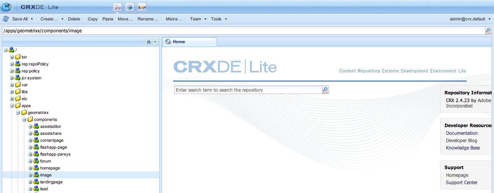

# Utveckla AEM-komponenter (Classic UI){#developing-aem-components-classic-ui}

I det klassiska användargränssnittet används ExtJS för att skapa widgetar som ger komponenternas utseende och känsla. På grund av de här widgetarnas karaktär finns det vissa skillnader mellan hur komponenterna interagerar med det klassiska användargränssnittet och det [pekaktiverade användargränssnittet](/help/sites-developing/developing-components.md).

>[!NOTE]
>
>Många aspekter av komponentutveckling är gemensamma för både det klassiska användargränssnittet och det beröringsaktiverade användargränssnittet, så **du måste läsa[AEM Components - Basics](/help/sites-developing/components-basics.md)(Grundläggande) innan** du använder den här sidan, som handlar om det klassiska användargränssnittet.

>[!NOTE]
>
>Även om både HTML-mallspråket (HTL) och JSP kan användas för att utveckla komponenter för det klassiska användargränssnittet, illustrerar den här sidan utvecklingen med JSP. Detta beror enbart på historiken med att använda JSP i det klassiska användargränssnittet.
>
>HTML är nu det rekommenderade skriptspråket för AEM. Jämför metoderna i [HTML](https://docs.adobe.com/content/help/en/experience-manager-htl/using/overview.html) och [Developing AEM Components](/help/sites-developing/developing-components.md) .

## Struktur {#structure}

En komponents grundläggande struktur beskrivs på sidan [AEM Components - The Basics](/help/sites-developing/components-basics.md#structure), som tillämpar både pekskärmsgränssnittet och det klassiska användargränssnittet. Även om du inte behöver använda inställningarna för det beröringsaktiverade användargränssnittet i den nya komponenten kan det hjälpa att vara medveten om dem när du ärver från befintliga komponenter.

## JSP-skript {#jsp-scripts}

JSP-skript eller -servrar kan användas för att återge komponenter. Enligt reglerna för behandling av begäranden i Sling är standardskriptets namn:

`<*componentname*>.jsp`

## global.jsp {#global-jsp}

JSP-skriptfilen `global.jsp` används för att ge snabb åtkomst till specifika objekt (t.ex. för att komma åt innehåll) till alla JSP-skriptfiler som används för att återge en komponent.

Därför `global.jsp` bör inkluderas i alla komponentåtergivnings-JSP-skript där ett eller flera av objekten i `global.jsp` används.

Standardplatsen `global.jsp` är:

`/libs/foundation/global.jsp`

>[!NOTE]
>
>Sökvägen `/libs/wcm/global.jsp`, som användes av versionerna CQ 5.3 och tidigare, är nu föråldrad.

### Funktion för global.jsp, använda API:er och taglibs {#function-of-global-jsp-used-apis-and-taglibs}

Nedan visas de viktigaste objekten som finns i standardinställningarna `global.jsp`:

Sammanfattning:

* `<cq:defineObjects />`

   * `slingRequest` - det figursatta begäranobjektet ( `SlingHttpServletRequest`).
   * `slingResponse` - det figursatta svarsobjektet ( `SlingHttpServletResponse`).
   * `resource` - Sling Resource-objektet ( `slingRequest.getResource();`).
   * `resourceResolver` - Sling Resource Resolver-objektet ( `slingRequest.getResoucreResolver();`).
   * `currentNode` - Den matchade JCR-noden för begäran.
   * `log` - Standardloggaren ().
   * `sling` - Handledaren i Sling-manuset.
   * `properties` - Den adresserade resursens egenskaper ( `resource.adaptTo(ValueMap.class);`).
   * `pageProperties` - Egenskaperna för sidan för den adresserade resursen.
   * `pageManager` - Sidhanteraren för åtkomst till AEM-innehållssidor ( `resourceResolver.adaptTo(PageManager.class);`).
   * `component` - Komponentobjektet för den aktuella AEM-komponenten.
   * `designer` - Designerobjektet för att hämta designinformation ( `resourceResolver.adaptTo(Designer.class);`).
   * `currentDesign` - Den adresserade resursens design.
   * `currentStyle` - Den adresserade resursens format.

### Åtkomst till innehåll {#accessing-content}

Det finns tre sätt att få åtkomst till innehåll i AEM WCM:

* Via egenskapsobjektet som introducerades i `global.jsp`:

   Egenskapsobjektet är en instans av en ValueMap (se [Sling API](https://sling.apache.org/apidocs/sling5/org/apache/sling/api/resource/ValueMap.html)) och innehåller alla egenskaper för den aktuella resursen.

   Exempel: `String pageTitle = properties.get("jcr:title", "no title");` används i återgivningsskriptet för en sidkomponent.

   Exempel: `String paragraphTitle = properties.get("jcr:title", "no title");` används i återgivningsskriptet för en standardstyckekomponent.

* Via det `currentPage` objekt som introducerades i `global.jsp`:

   Objektet är en instans av en sida (se `currentPage` AEM API [](https://helpx.adobe.com/experience-manager/6-5/sites/developing/using/reference-materials/javadoc/com/day/cq/wcm/api/Page.mhtml)). Klassen page innehåller vissa metoder för att komma åt innehåll.

   Exempel: `String pageTitle = currentPage.getTitle();`

* Via `currentNode` objekt som introducerats i `global.jsp`:

   Objektet är en instans av en nod (se `currentNode` JCR API [](https://jackrabbit.apache.org/api/2.16/org/apache/jackrabbit/standalone/cli/core/CurrentNode.html)). En nods egenskaper kan nås av `getProperty()` metoden.

   Exempel: `String pageTitle = currentNode.getProperty("jcr:title");`

## JSP-taggbibliotek {#jsp-tag-libraries}

CQ- och Sling-taggbiblioteken ger dig tillgång till specifika funktioner som du kan använda i JSP-skriptet för dina mallar och komponenter.

Mer information finns i dokumentets [taggbibliotek](/help/sites-developing/taglib.md).

## Använda HTML-bibliotek på klientsidan {#using-client-side-html-libraries}

Moderna webbplatser är starkt beroende av bearbetning på klientsidan som styrs av komplex JavaScript- och CSS-kod. Det kan vara komplicerat att organisera och optimera serveringen av koden.

För att underlätta hanteringen av det här problemet tillhandahåller AEM biblioteksmappar **på** klientsidan, som gör att du kan lagra koden på klientsidan i databasen, ordna den i kategorier och definiera när och hur varje kodkategori ska skickas till klienten. Klientsidans bibliotekssystem tar sedan hand om att skapa rätt länkar på den slutliga webbsidan för att läsa in rätt kod.

Mer information finns i dokumentet [Använda HTML-bibliotek](/help/sites-developing/clientlibs.md) på klientsidan.

## Dialog {#dialog}

Komponenten måste ha en dialogruta där författare kan lägga till och konfigurera innehållet.

Mer information finns i [AEM Components - Basics](/help/sites-developing/components-basics.md#dialogs) .

## Konfigurera redigeringsbeteendet {#configuring-the-edit-behavior}

Du kan konfigurera redigeringsbeteendet för en komponent. Detta inkluderar attribut som åtgärder som är tillgängliga för komponenten, egenskaper för infogningsredigeraren och avlyssnare som relaterar till händelser för komponenten. Konfigurationen är gemensam för både beröringsaktiverade och klassiska användargränssnitt, men med vissa, specifika skillnader.

En komponents [redigeringsbeteende konfigureras](/help/sites-developing/components-basics.md#edit-behavior) genom att lägga till en `cq:editConfig` nod av typen `cq:EditConfig` nedanför komponentnoden (av typen `cq:Component`) och genom att lägga till specifika egenskaper och underordnade noder.

## Använda och utöka ExtJS-widgetar {#using-and-extending-extjs-widgets}

Mer information finns i [Använda och utöka ExtJS-widgetar](/help/sites-developing/widgets.md) .

## Använda xtypes för ExtJS-widgetar {#using-xtypes-for-extjs-widgets}

Mer information finns i [Använda xtypes](/help/sites-developing/xtypes.md) .

## Utveckla nya komponenter {#developing-new-components}

I det här avsnittet beskrivs hur du skapar egna komponenter och lägger till dem i styckesystemet.

Ett snabbt sätt att komma igång är att kopiera en befintlig komponent och sedan göra de ändringar du vill.

Ett exempel på hur du utvecklar en komponent beskrivs i detalj i [Utöka text- och bildkomponenten - ett exempel.](#extending-the-text-and-image-component-an-example)

### Utveckla en ny komponent (Anpassa befintlig komponent) {#develop-a-new-component-adapt-existing-component}

Om du vill utveckla nya komponenter för AEM baserat på en befintlig komponent kan du kopiera komponenten, skapa en javascript-fil för den nya komponenten och lagra den på en plats som är tillgänglig för AEM (se även [Anpassa komponenter och andra element](/help/sites-developing/dev-guidelines-bestpractices.md#customizing-components-and-other-elements)):

1. Skapa en ny komponentmapp i CRXDE Lite:

   / `apps/<myProject>/components/<myComponent>`

   Återskapa nodstrukturen som i libs och kopiera sedan definitionen av en befintlig komponent, till exempel komponenten Text. Så här anpassar du komponentkopian Text:

   * from `/libs/foundation/components/text`
   * to `/apps/myProject/components/text`

1. Ändra inställningarna så `jcr:title` att de återspeglar det nya namnet.
1. Öppna den nya komponentmappen och gör de ändringar du behöver. Ta även bort eventuell överflödig information i mappen.

   Du kan göra ändringar som:

   * lägga till ett nytt fält i dialogrutan

      * `cq:dialog` - dialogruta för det beröringsaktiverade användargränssnittet
      * `dialog` - dialogruta för det klassiska användargränssnittet
   * ersätta `.jsp` filen (namnge den efter den nya komponenten)
   * eller helt och hållet omarbeta hela komponenten om du vill
   Om du till exempel kopierar standardkomponenten för text kan du lägga till ytterligare ett fält i dialogrutan och sedan uppdatera `.jsp` så att indata som har gjorts där bearbetas.

   >[!NOTE]
   >
   >En komponent för:
   >
   >* Touchaktiverat gränssnitt använder [Granite](https://helpx.adobe.com/experience-manager/6-5/sites/developing/using/reference-materials/granite-ui/api/jcr_root/libs/granite/ui/index.html) -komponenter
   >* Klassiskt gränssnitt använder [ExtJS-widgetar](https://helpx.adobe.com/experience-manager/6-5/sites/developing/using/reference-materials/widgets-api/index.html)


   >[!NOTE]
   >
   >En dialogruta som definieras för det klassiska användargränssnittet fungerar i det beröringsaktiverade användargränssnittet.
   >
   >En dialogruta som definierats för det beröringsaktiverade användargränssnittet fungerar inte i det klassiska användargränssnittet.
   >
   >Beroende på vilken instans- och redigeringsmiljö du använder kan du definiera båda typerna av dialogrutor för komponenten.

1. En av följande noder bör finnas och vara korrekt initierad för att den nya komponenten ska visas:

   * `cq:dialog` - dialogruta för det beröringsaktiverade användargränssnittet
   * `dialog` - dialogruta för det klassiska användargränssnittet
   * `cq:editConfig` - hur komponenterna fungerar i redigeringsmiljön (t.ex. dra och släpp)
   * `design_dialog` - dialogruta för designläge (endast klassiskt användargränssnitt)

1. Aktivera den nya komponenten i styckesystemet genom att antingen:

   * använda CRXDE Lite för att lägga till värdet `<path-to-component>` (till exempel `/apps/geometrixx/components/myComponent`) i nodens egenskapskomponenter `/etc/designs/geometrixx/jcr:content/contentpage/par`
   * följa instruktionerna i [Lägga till nya komponenter i styckesystem](#adding-a-new-component-to-the-paragraph-system-design-mode)

1. I AEM WCM öppnar du en sida på webbplatsen och infogar ett nytt stycke av den typ som du just skapade för att säkerställa att komponenten fungerar som den ska.

>[!NOTE]
>
>Om du vill se tidsstatistik för sidinläsning kan du använda Ctrl-Skift-U med `?debugClientLibs=true` inställningen i URL:en.

### Lägga till en ny komponent i styckesystemet (designläge) {#adding-a-new-component-to-the-paragraph-system-design-mode}

När komponenten har utvecklats lägger du till den i styckesystemet, vilket gör att författare kan markera och använda komponenten när en sida redigeras.

1. Gå till en sida i redigeringsmiljön som t.ex. använder styckesystemet `<contentPath>/Test.html`.
1. Växla till designläge genom att antingen:

   * lägga `?wcmmode=design` till i slutet av URL-adressen och få tillgång till den igen, till exempel:

      `<contextPath>/ Test.html?wcmmode=design`

   * klicka på Design i Sidekick
   Du är nu i designläge och kan redigera styckesystemet.

1. Klicka på Redigera.

   En lista över komponenter som hör till styckesystemet visas. Din nya komponent visas också.

   Komponenterna kan aktiveras (eller inaktiveras) för att bestämma vilka som ska erbjudas författaren när en sida redigeras.

1. Aktivera komponenten och återgå sedan till normalt redigeringsläge för att bekräfta att den är tillgänglig för användning.

### Utöka text- och bildkomponenten - ett exempel {#extending-the-text-and-image-component-an-example}

I det här avsnittet finns ett exempel på hur du kan utöka den ofta använda text- och bildstandardkomponenten med en konfigurerbar bildplaceringsfunktion.

Tillägget till text- och bildkomponenten gör att redigerare kan använda alla befintliga funktioner i komponenten plus ett extra alternativ för att ange bildens placering:

* Till vänster om texten (nuvarande och ny standard)
* samt till höger

När du har utökat den här komponenten kan du konfigurera bildplaceringen via komponentens dialogruta.

Följande tekniker beskrivs i denna övning:

* Kopiera befintlig komponentnod och ändra dess metadata
* Ändra komponentens dialogruta, inklusive arv av widgetar från överordnade dialogrutor
* Ändra komponentens skript för att implementera den nya funktionen

>[!NOTE]
>
>Det här exemplet riktar sig till det klassiska användargränssnittet.

>[!NOTE]
>
>Exemplet baseras på exempelinnehållet i Geometrixx, som inte längre levereras med AEM, som ersatts av We.Retail. I dokumentet [We.Retail Reference Implementation](/help/sites-developing/we-retail.md#we-retail-geometrixx) finns information om hur du hämtar och installerar Geometrixx.

#### Utöka befintlig textimage-komponent {#extending-the-existing-textimage-component}

För att skapa den nya komponenten använder vi standardkomponenten för textimage som bas och ändrar den. Vi lagrar den nya komponenten i exempelprogrammet Geometrixx AEM WCM.

1. Kopiera standardkomponenten för textimage från `/libs/foundation/components/textimage` till komponentmappen Geometrixx `/apps/geometrixx/components`och använd textimage som målnodnamn. (Kopiera komponenten genom att navigera till komponenten, högerklicka och välja Kopiera och bläddra till målkatalogen.)

   

1. Om du vill att det här exemplet ska vara enkelt navigerar du till komponenten som du kopierade och tar bort alla undernoder till den nya textimage-noden förutom följande:

   * dialogdefinition: `textimage/dialog`
   * komponentskript: `textimage/textimage.jsp`
   * redigera konfigurationsnod (tillåter dra och släpp av resurser): `textimage/cq:editConfig`
   >[!NOTE]
   >
   >Dialogrutedefinitionen är beroende av användargränssnittet:
   >
   >* Pekaktiverat användargränssnitt: `textimage/cq:dialog`
   >* Klassiskt användargränssnitt: `textimage/dialog`


1. Redigera komponentmetadata:

   * Komponentnamn

      * Ange `jcr:description` till `Text Image Component (Extended)`
      * Ange `jcr:title` till `Text Image (Extended)`
   * Grupp, där komponenten är listad i sidosparken (lämna som den är)

      * Ändra `componentGroup` inte till `General`
   * Överordnad komponent för den nya komponenten (standardkomponenten för textimage)

      * Ange `sling:resourceSuperType` till `foundation/components/textimage`
   Efter det här steget ser komponentnoden ut så här:

   

1. Ändra egenskapen `sling:resourceType` för redigeringskonfigurationsnoden för bilden (egenskap: `textimage/cq:editConfig/cq:dropTargets/image/parameters/sling:resourceType`) till `geometrixx/components/textimage.`

   På så sätt ställs egenskapen för den utökade textimage-komponenten in på: `sling:resourceType` `geometrixx/components/textimage.`

1. Ändra komponentens dialogruta så att den innehåller det nya alternativet. Den nya komponenten ärver de delar av dialogrutan som är desamma som i originalet. Det enda vi kan göra är att utöka fliken **Avancerat** och lägga till en listruta **Bildposition** med alternativen **Vänster** och **Höger**:

   * Ändra inte `textimage/dialog`egenskaperna.
   Observera hur `textimage/dialog/items` det finns fyra undernoder, tab1 till tab4, som representerar de fyra flikarna i textimagedialogrutan.

   * För de första två flikarna (tab1 och tab2):

      * Ändra xtype till cqinclude (för att ärva från standardkomponenten).
      * Lägg till en sökvägsegenskap med värden `/libs/foundation/components/textimage/dialog/items/tab1.infinity.json`respektive `/libs/foundation/components/textimage/dialog/items/tab2.infinity.json`.
      * Ta bort alla andra egenskaper eller undernoder.
   * För flik3:

      * Lämna egenskaperna och delnoderna utan ändringar
      * Lägg till en ny fältdefinition i `tab3/items`, nodposition av typen `cq:Widget`
      * Ange följande egenskaper (av typen String) för den nya `tab3/items/position`noden:

         * `name`: `./imagePosition`
         * `xtype`: `selection`
         * `fieldLabel`: `Image Position`
         * `type`: `select`
      * Lägg till en undernod `position/options` av typen `cq:WidgetCollection` som representerar de två alternativen för bildplacering, och under den skapas två noder, o1 och o2 av typen `nt:unstructured`.
      * För noden `position/options/o1` anger du egenskaperna: `text` till `Left` och `value` till `left.`
      * För noden `position/options/o2` anger du egenskaperna: `text` till `Right` och `value` till `right`.
   * Ta bort tabb4.
   Bildpositionen bevaras i innehållet som `imagePosition`egenskapen för noden som representerar `textimage` stycket. Efter dessa steg ser komponentdialogrutan ut så här:

   

1. Utöka komponentskriptet `textimage.jsp`med extra hantering av den nya parametern:

   ```xml
   Image image = new Image(resource, "image");
   
   if (image.hasContent() || WCMMode.fromRequest(request) == WCMMode.EDIT) {
        image.loadStyleData(currentStyle);
   ```

   Vi kommer att ersätta det framhävda kodfragmentet *%>&lt;div class=&quot;image&quot;>&lt;%* med ny kod som genererar en egen stil för den här taggen.

   ```xml
   // todo: add new CSS class for the 'right image' instead of using
   // the style attribute
   String style="";
        if (properties.get("imagePosition", "left").equals("right")) {
             style = "style=\"float:right\"";
        }
        %><div <%= style %> class="image"><%
   ```

1. Spara komponenten i databasen. Komponenten är redo att testas.

#### Kontrollera den nya komponenten {#checking-the-new-component}

När komponenten har utvecklats kan du lägga till den i styckesystemet, vilket gör att författare kan markera och använda komponenten när de redigerar en sida. Med de här stegen kan du testa komponenten.

1. Öppna en sida i t.ex. engelska/företag.
1. Växla till designläge genom att klicka på Design i Sidekick.
1. Redigera styckesystemets design genom att klicka på Redigera i styckesystemet mitt på sidan. En lista över komponenter som kan placeras i styckesystemet visas, och den bör innehålla den nyutvecklade komponenten, Text Image (Extended). Aktivera det för styckesystemet genom att markera det och klicka på OK.
1. Växla tillbaka till redigeringsläget.
1. Lägg till stycket Textbild (utökad) i styckesystemet, initiera text och bild med exempelinnehåll. Spara ändringarna.
1. Öppna dialogrutan för text- och bildstycket, ändra bildpositionen på fliken Avancerat till höger och klicka på OK för att spara ändringarna.
1. Stycket återges med bilden till höger.
1. Komponenten är nu klar att användas.

Komponenten lagrar innehållet i ett stycke på företagssidan.

### Inaktivera överförbarhet för bildkomponenten {#disable-upload-capability-of-the-image-component}

Om du vill inaktivera den här funktionen använder vi standardbildkomponenten som grund och ändrar den. Den nya komponenten lagras i exempelprogrammet Geometrixx.

1. Kopiera standardbildkomponenten från `/libs/foundation/components/image` till komponentmappen Geometrixx `/apps/geometrixx/components`och använd image som målnodnamn.

   

1. Redigera komponentmetadata:

   * Ange **jcr:title** till `Image (Extended)`

1. Navigera till `/apps/geometrixx/components/image/dialog/items/image`.
1. Lägg till en ny egenskap:

   * **Namn**: `allowUpload`
   * **Typ**: `String`
   * **Värde**: `false`
   

1. Klicka på **Spara alla**. Komponenten är redo att testas.
1. Öppna en sida i t.ex. engelska/företag.
1. Växla till designläge och aktivera Bild (Extended).
1. Växla tillbaka till redigeringsläget och lägg till det i styckesystemet. På nästa bild ser du skillnaderna mellan den ursprungliga bildkomponenten och den du just skapade.

   Ursprunglig bildkomponent:

   

   Din nya bildkomponent:

   

1. Komponenten är nu klar att användas.

