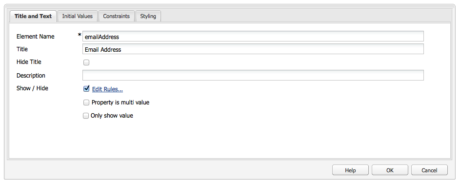

# Utveckla Forms (Classic UI){#developing-forms-classic-ui}

En formulärs grundläggande struktur är:

* Formulärstart
* Formulärelement
* Formulärslut

Alla dessa realiseras med en serie standardinställningar [Formulärkomponenter](/help/sites-authoring/default-components.md#form), som finns i en AEM standardinstallation.

Förutom [utveckla nya komponenter](/help/sites-developing/developing-components-samples.md) för användning i formulären kan man också

* [Läs in formuläret i förväg med värden](#preloading-form-values)
* [Förhandsladda (vissa fält) fält med flera värden](#preloading-form-fields-with-multiple-values)
* [Utveckla nya åtgärder](#developing-your-own-form-actions)
* [Utveckla nya begränsningar](#developing-your-own-form-constraints)
* [Visa eller dölja specifika formulärfält](#showing-and-hiding-form-components)

[Använda skript](#developing-scripts-for-use-with-forms) för att vid behov utöka funktionaliteten.

>[!NOTE]
>
>Det här dokumentet fokuserar på att utveckla formulär med [Foundation Components](/help/sites-authoring/default-components-foundation.md) i det klassiska användargränssnittet. Adobe rekommenderar att du utnyttjar nya [Kärnkomponenter](https://experienceleague.adobe.com/docs/experience-manager-core-components/using/introduction.html) och [Dölj villkor](/help/sites-developing/hide-conditions.md) för formulärutveckling i användargränssnittet med pekfunktion.

## Förhandsladda formulärvärden {#preloading-form-values}

Startkomponenten för formuläret innehåller ett fält för **Läs in bana**, en valfri sökväg som pekar på en nod i databasen.

Läs in sökväg är sökvägen till nodegenskaper som används för att läsa in fördefinierade värden till flera fält i formuläret.

Detta är ett valfritt fält som anger sökvägen till en nod i databasen. När den här noden har egenskaper som matchar fältnamnen förinläses motsvarande fält i formuläret med egenskapsvärdet. Om det inte finns någon matchning innehåller fältet standardvärdet.

>[!NOTE]
>
>A [formuläråtgärd](#developing-your-own-form-actions) kan också ange från vilken resurs de initiala värdena ska läsas in. Detta görs med `FormsHelper#setFormLoadResource` inuti `init.jsp`.
>
>Formuläret fylls i av författaren från den sökväg som angetts i startformulärkomponenten endast om detta inte anges.

### Förhandsladda formulärfält med flera värden {#preloading-form-fields-with-multiple-values}

Olika formulärfält har även **Inläsningssökväg för objekt**, en valfri sökväg som pekar på en nod i databasen.

The **Inläsningssökväg för objekt** är sökvägen till nodegenskaper som används för att läsa in fördefinierade värden i det specifika fältet i formuläret, till exempel en [nedrullningsbar lista](/help/sites-authoring/default-components-foundation.md#dropdown-list), [kryssrutegrupp](/help/sites-authoring/default-components-foundation.md#checkbox-group) eller [alternativgrupp](/help/sites-authoring/default-components-foundation.md#radio-group).

#### Exempel - Förhandsladda en listruta med flera värden {#example-preloading-a-dropdown-list-with-multiple-values}

En nedrullningsbar lista kan konfigureras med ditt värdeintervall för val.

The **Inläsningssökväg för objekt** kan användas för att komma åt en lista från en mapp i databasen och läsa in dessa i fältet i förväg:

1. Skapa en ny försäljningsmapp ( `sling:Folder`), till exempel `/etc/designs/<myDesign>/formlistvalues`

1. Lägg till en ny egenskap (till exempel `myList`) av typen sträng med flera värden ( `String[]`) för att innehålla listan med nedrullningsbara objekt. Innehåll kan också importeras med hjälp av ett skript, till exempel med ett JSP-skript eller cURL i ett gränssnittsskript.

1. Använd hela sökvägen i **Inläsningssökväg för objekt** fält: till exempel `/etc/designs/geometrixx/formlistvalues/myList`

Observera att om värdena i `String[]` har följande format:

* `AL=Alabama`
* `AK=Alaska`
* osv.

kommer AEM att generera listan som:

* `<option value="AL">Alabama</option>`
* `<option value="AK">Alaska</option>`

Den här funktionen kan till exempel användas på ett bra sätt i en flerspråkig inställning.

### Utveckla egna formuläråtgärder {#developing-your-own-form-actions}

Ett formulär behöver en åtgärd. En åtgärd definierar den åtgärd som utförs när formuläret skickas med användardata.

En rad åtgärder ingår i en standardinstallation av AEM, som beskrivs nedan:

`/libs/foundation/components/form/actions`

och i **Åtgärdstyp** listan med **Formulär** komponent:

I det här avsnittet beskrivs hur du kan utveckla egna formuläråtgärder som ska tas med i den här listan.

Du kan lägga till en egen åtgärd under `/apps` enligt följande:

1. Skapa en nod av typen `sling:Folder`. Ange ett namn som återspeglar den åtgärd som ska implementeras.

   Till exempel:

   `/apps/myProject/components/customFormAction`

1. På den här noden definierar du följande egenskaper och klickar sedan på **Spara alla** för att behålla ändringarna:

   * `sling:resourceType` - ange som `foundation/components/form/action`

   * `componentGroup` - definiera som `.hidden`

   * Valfritt:

      * `jcr:title` - ange en valfri titel som visas i den nedrullningsbara listan. Om inget anges visas nodnamnet

      * `jcr:description` - ange en beskrivning av ditt val

1. Skapa en dialognod i mappen:

   1. Lägg till fält så att författaren kan redigera formulärdialogrutan när åtgärden har valts.

1. I mappen skapar du antingen:

   1. Ett postskript.
Skriptnamnet är `post.POST.<extension>`, till exempel `post.POST.jsp`
Bokföringsskriptet anropas när ett formulär skickas för att bearbeta formuläret, det innehåller koden som hanterar data som kommer från formuläret `POST`.

   1. Lägg till ett framåt-skript som anropas när formuläret skickas.
Skriptnamnet är `forward.<extension`>, till exempel `forward.jsp`
Skriptet kan definiera en sökväg. Den aktuella begäran vidarebefordras sedan till den angivna sökvägen.

   Det nödvändiga samtalet är `FormsHelper#setForwardPath` (2 varianter). Ett typiskt fall är att utföra viss validering, eller logik, för att hitta målsökvägen och sedan gå vidare till den sökvägen, så att standardserverservern för Sling-POST kan utföra den faktiska lagringen i JCR.

   Det kan också finnas en annan server som utför själva bearbetningen, i så fall formuläråtgärden och `forward.jsp` fungerar bara som&quot;limkod&quot;. Ett exempel på detta är e-poståtgärden på `/libs/foundation/components/form/actions/mail`som skickar information till `<currentpath>.mail.html`där en e-postserver sitter.

   Så:

   * a `post.POST.jsp` är användbart för små åtgärder som utförs helt och hållet av själva åtgärden
   * while `forward.jsp` är användbart när endast delegering krävs.

   Körningsordningen för skripten är:

   * Vid återgivning av formuläret ( `GET`):

      1. `init.jsp`
      1. för alla fältbegränsningar: `clientvalidation.jsp`
      1. formulärets valideringRT: `clientvalidation.jsp`
      1. formuläret läses in via inläsningsresurs om det är inställt
      1. `addfields.jsp` vid återgivning `<form></form>`

   * vid hantering av ett formulär `POST`:

      1. `init.jsp`
      1. för alla fältbegränsningar: `servervalidation.jsp`
      1. formulärets valideringRT: `servervalidation.jsp`
      1. `forward.jsp`
      1. om en framåtriktad bana har angetts ( `FormsHelper.setForwardPath`), vidarebefordra begäran och sedan ringa `cleanup.jsp`

      1. om ingen framåtriktad sökväg har angetts, ring `post.POST.jsp` (slutar här, nej `cleanup.jsp` anropas)

1. Lägg till igen i mappen om du vill:

   1. Ett skript för att lägga till fält.
Skriptnamnet är `addfields.<extension>`, till exempel `addfields.jsp`
An `addfields` skriptet anropas omedelbart efter att HTML för att starta formuläret har skrivits. Detta gör att åtgärden kan lägga till anpassade inmatningsfält eller andra liknande HTML i formuläret.

   1. Ett initieringsskript.
Skriptnamnet är `init.<extension>`, till exempel `init.jsp`
Skriptet anropas när formuläret återges. Den kan användas för att initiera åtgärdsinformation.

   1. Ett rensningsskript.
Skriptnamnet är `cleanup.<extension>`, till exempel `cleanup.jsp`
Det här skriptet kan användas för att rensa.

1. Använd **Forms** i en parsys. The **Åtgärdstyp** kommer nu att innehålla din nya åtgärd.

   >[!NOTE]
   >
   >Så här visar du standardåtgärder som ingår i produkten:
   >
   >
   >`/libs/foundation/components/form/actions`

### Utveckla egna formulärbegränsningar {#developing-your-own-form-constraints}

Begränsningar kan införas på två nivåer:

* För [enskilda fält (se följande procedur)](#constraints-for-individual-fields)
* Som [global validering](#form-global-constraints)

#### Begränsningar för enskilda fält {#constraints-for-individual-fields}

Du kan lägga till egna begränsningar för ett enskilt fält (under `/apps`) enligt följande:

1. Skapa en nod av typen `sling:Folder`. Ange ett namn som återspeglar den begränsning som ska implementeras.

   Till exempel:

   `/apps/myProject/components/customFormConstraint`

1. På den här noden definierar du följande egenskaper och klickar sedan på **Spara alla** för att behålla ändringarna:

   * `sling:resourceType` - ställs in på `foundation/components/form/constraint`

   * `constraintMessage` - ett anpassat meddelande som visas om fältet inte är giltigt enligt villkoret när formuläret skickas

   * Valfritt:

      * `jcr:title` - ange en valfri titel som visas i urvalslistan. Om inget anges visas nodnamnet
      * `hint` - ytterligare information för användaren om hur fältet används

1. I den här mappen kan du behöva följande skript:

   * Ett klientvalideringsskript: Skriptets namn är `clientvalidation.<extension>`, till exempel `clientvalidation.jsp`
Detta anropas när formulärfältet återges. Den kan användas för att skapa javascript för klienten för att validera fältet på klienten.

   * Ett servervalideringsskript: Skriptets namn är `servervalidation.<extension>`, till exempel `servervalidation.jsp`
Detta anropas när formuläret skickas. Den kan användas för att validera fältet på servern efter att det har skickats.

>[!NOTE]
>
>Exempelbegränsningar finns under:
>
>`/libs/foundation/components/form/constraints`

#### Formulärglobala begränsningar {#form-global-constraints}

Den globala valideringen av formuläret anges genom att en resurstyp konfigureras i startformulärkomponenten ( `validationRT`). Till exempel:

`apps/myProject/components/form/validation`

Sedan kan du definiera:

* a `clientvalidation.jsp` - injicerat efter fältets klientvalideringsskript
* och `servervalidation.jsp` - anropas även efter att den enskilda fältservern validerats på en `POST`.

### Visa och dölja formulärkomponenter {#showing-and-hiding-form-components}

Du kan konfigurera formuläret så att det visar eller döljer formulärkomponenter enligt värdet i andra fält i formuläret.

Att ändra synligheten för ett formulärfält är användbart när fältet bara behövs under specifika förhållanden. Till exempel frågar en fråga kunderna om de vill ha produktinformation som de får via e-post. När du väljer Ja visas ett textfält där kunden kan ange sin e-postadress.

Använd **Redigera Visa/dölj regler** för att ange under vilka förhållanden en formulärkomponent visas eller döljs.

Använd fälten högst upp i dialogrutan för att ange följande information:

* Om du anger villkor för att dölja eller visa komponenten.
* Om något eller alla villkor måste vara true för att komponenten ska kunna visas eller döljas.

Ett eller flera villkor visas under dessa fält. Ett villkor jämför värdet för en annan formulärkomponent (i samma formulär) med ett värde. Om det faktiska värdet i fältet uppfyller villkoret utvärderas villkoret som sant. Villkoren innehåller följande information:

* Titeln på det formulärfält som testas.
* En operator.
* Ett värde jämförs med fältvärdet.

En Radio Group-komponent med titeln `Receive email notifications?`* * innehåller `Yes` och `No` alternativknappar. En textfältskomponent med titeln `Email Address` använder följande villkor så att det syns om `Yes` är markerat:

I JavaScript använder villkor värdet för egenskapen Elementnamn för att referera till fält. I föregående exempel är elementnamnsegenskapen för komponenten Grupp med alternativknappar `contact`. Följande kod motsvarar JavaScript-koden för det exemplet:

`((contact == "Yes"))`

**Så här visar eller döljer du en formulärkomponent:**

1. Redigera den specifika formulärkomponenten.

1. Välj **Visa/dölj** för att öppna **Redigera visa/dölj regler** dialog:

   * I den första listrutan väljer du antingen **Visa** eller **Dölj** för att ange om villkoren ska avgöra om komponenten ska visas eller döljas.

   * I listrutan i slutet av den översta raden väljer du:

      * **alla** - om alla villkor måste vara true för att komponenten ska kunna visas eller döljas
      * **alla** - om bara ett eller flera villkor måste vara true för att komponenten ska kunna visas eller döljas

   * Markera en komponent, operator och ange sedan ett värde på villkorslinjen (en visas som standard).
   * Lägg till fler villkor om det behövs genom att klicka **Lägg till villkor**.

   Till exempel:

   

1. Klicka **OK** för att spara definitionen.

1. När du har sparat definitionen kan du **Redigera regler** länk visas bredvid **Visa/dölj** i formulärkomponentens egenskaper. Klicka på länken för att öppna **Redigera visa/dölj regler** för att göra ändringar.

   Klicka **OK** om du vill spara alla ändringar.

   

   >[!CAUTION]
   >
   >Effekterna av Visa/dölj-definitioner kan ses och testas:
   >
   >* in **Förhandsgranska** läge i redigeringsmiljön (kräver att sidan laddas om när du först växlar till förhandsgranskning)
   >
   >* i publiceringsmiljön

#### Hantera brutna komponentreferenser {#handling-broken-component-references}

Visa/dölj-villkor använder värdet för elementnamnsegenskapen för att referera till andra komponenter i formuläret. Konfigurationen Visa/Dölj är ogiltig när något av villkoren refererar till en komponent som har tagits bort eller har ändrat elementnamnsegenskapen. När detta inträffar måste du uppdatera villkoren manuellt, annars inträffar ett fel när formuläret läses in.

När konfigurationen Visa/Dölj är ogiltig anges konfigurationen bara som JavaScript-kod. Redigera koden för att korrigera problemen.Koden använder elementnamnsegenskapen som ursprungligen användes för att referera till komponenterna.

### Utveckla skript för användning med Forms {#developing-scripts-for-use-with-forms}

Mer information om API-elementen som kan användas när skript skrivs finns i [javadocs för formulär](https://helpx.adobe.com/experience-manager/6-5/sites/developing/using/reference-materials/javadoc/com/day/cq/wcm/foundation/forms/package-summary.html).

Du kan använda detta för åtgärder som att anropa en tjänst innan formuläret skickas och att avbryta tjänsten om den misslyckas:

* Definiera valideringsresurstypen
* Inkludera ett skript för validering:

   * Ring webbtjänsten i din JSP och skapa en `com.day.cq.wcm.foundation.forms.ValidationInfo` -objekt som innehåller dina felmeddelanden. Om fel uppstår bokförs inte formulärdata.
