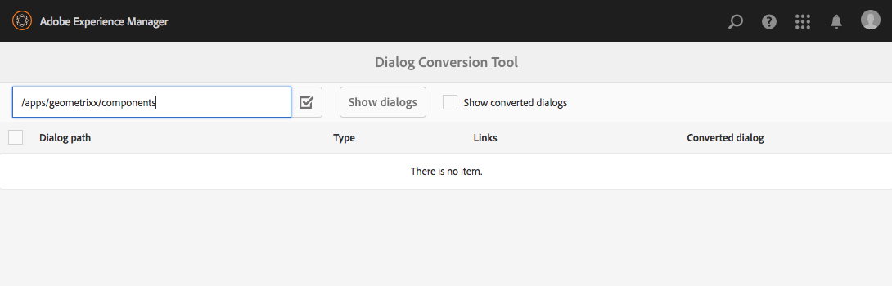

# Verktyget Dialogkonvertering{#dialog-conversion-tool}

Verktyget för konvertering av dialogrutor används för att utöka befintliga komponenter som bara har en dialogruta definierad för det klassiska användargränssnittet (baserat på ExtJS) eller som baseras på GRE och Koral 2. Verktyget använder den ursprungliga dialogrutan för att skapa en dubblettdialogruta som är utformad för standardgränssnittet, baserat på GRE och Koral 3.

Målet med det här verktyget är att så långt det är möjligt automatisera uppgraderingen, öka effektiviteten och minska antalet fel. Eftersom verktyget inte täcker alla scenarier kan processen inte automatiseras helt och användaren måste granska de konverterade dialogrutorna och eventuellt göra ytterligare justeringar. Verktyget är avsett som ett hjälpmedel som hjälper dig att starta konverteringsprocessen, men som inte är avsett att ta full kontroll över konverteringen.

Verktyget skapar den nya dialogrutan med hjälp av standardgränssnittet Granite och det 3-baserade gränssnittet Coral, men hoppar över det som inte kan konverteras. Därför kan den resulterande dialogrutan innehålla noder från den ursprungliga dialogrutan som kopierats som de är om ingen regel matchar den specifika komponenten. Dessutom kan en konverterad komponent ha vissa egenskaper som inte konverterats eftersom det inte fanns någon lämplig regel för att konvertera dem.

>[!CAUTION]
>
>Verktyget kan inte täcka alla scenarier eftersom dess konverteringsregler är icke-uttömmande och fungerar efter bästa förmåga. Den konverterar de element och egenskaper som används oftast, men konverteringen blir ofullständig när du arbetar med anpassningar eller mycket specialiserade dialogrutor. **Konverterade dialogrutor kan kräva ytterligare justeringar och alla konverteringar måste granskas.**

>[!NOTE]
>
>Eftersom det klassiska användargränssnittet inte längre utvecklas eller förbättras rekommenderar Adobe att man uppgraderar till GRI-standardgränssnittet för att utnyttja den senaste tekniken.
>
>Även om det i allmänhet är god praxis att migrera till den senaste plattformen är det inte avgörande att migrera från koral 2 till koral 3. Alla nya projekt bör dock inledas baserat på Coral 3.

## Hämta och installera verktyget för dialogkonvertering {#download-and-install-the-dialog-conversion-tool}

Verktyget för dialogkonvertering har gjorts till öppen källkod och kan nås via GitHub.

KOD PÅ GITHUB

Koden för den här sidan finns på GitHub

* [Öppna aem-dialog-conversion-projekt på GitHub](https://github.com/Adobe-Marketing-Cloud/aem-dialog-conversion)
* Hämta projektet som [en ZIP-fil](https://github.com/Adobe-Marketing-Cloud/aem-dialog-conversion/archive/master.zip)

>[!NOTE]
>
>AEM levereras inte med dialogkonverteringsverktyget. Du måste hämta och installera den för att kunna använda den.

Följ de här stegen för att installera dialogkonverteringsverktyget.

1. Hämta paketet från [Dialog Conversion Tool GitHub-projektet](https://github.com/Adobe-Marketing-Cloud/aem-dialog-conversion/releases).
1. Installera paketet på din instans. Mer information om pakethantering finns i [Arbeta med paket](/help/sites-administering/package-manager.md).

## Konvertera en dialogruta {#converting-a-dialog}

Verktyget konverterar dialogrutor genom att skapa en motsvarande dialogruta för GREND/Koral 3 på samma plats som den ursprungliga dialogrutan i innehållsträdet. I dialogrutorna Granite UI/Coral 2 kopieras dessa till en säkerhetskopieringsplats (ett `.coral2` suffix läggs till i dialogrutans nodnamn) så att de inte åsidosätts. Verktyget kan konvertera såväl designdialogrutor som redigeringsdialogrutor.

Följ de här stegen för att konvertera en eller flera dialogrutor:

1. Öppna konsolen **Dialog Conversion** , som du kommer åt via **Global Navigation** -> **Tools** -> **Operations**:

   `https://<hostname>:<port>/libs/cq/dialogconversion/content/console.html`

   

1. Ange önskad sökväg, t.ex. `/apps/geometrixx/components`. Du kan också ange en direkt sökväg till en dialogruta, t.ex. `/apps/geometrixx/components/lead`.

   

1. Markera **Visa dialogrutor** om du vill visa alla dialogrutor under den platsen.

   

   Tabellen visar alla befintliga äldre dialogrutor under den angivna sökvägen. Varje dialogruta har sin Type. Typer:

   * **** Klassisk: Noder av typen `cq:Dialog` som har nodnamn `dialog` eller `design_dialog`
   * **** Korall 2: Noder med namnet `cq:dialog` eller `cq:design_dialog` som har resurstypen Granite/Coral 2 i sin underordnade innehållsnod
   Varje rad innehåller en länk för att visa dialogrutan och en länk till CRXDE Lite för att visa nodstrukturen.

   >[!NOTE]
   >
   >Komponenter som inte har någon dialogruta för det klassiska användargränssnittet eller koral 2 alls (dvs. de som har utformats med GRA/Coral 3) visas inte.

1. Välj en eller flera dialogrutor för konvertering och klicka eller tryck på **Konvertera X-dialogrutor** för att starta konverteringsprocessen.

   

1. De markerade dialogrutorna visas med resultatet av konverteringen. Om konverteringen lyckades innehåller raden länkar för att visa den konverterade dialogrutan eller för att öppna den i CRXDE Lite.

   Klicka eller tryck på **Bakåt** för att gå tillbaka till verktyget för dialogkonvertering.

   

1. I dialogrutan Conversion Tool visas inte längre de konverterade dialogrutorna i listan. Observera dock att det totala antalet dialogrutor som hittas fortfarande listas, inklusive de som redan konverterats, dvs. antalet rader i tabellen behöver inte matcha antalet som hittats.

   

1. Markera alternativet **Visa konverterade dialogrutor** om du vill visa de dialogrutor som finns på den angivna sökvägen och som redan har konverterats.

   

   Om dialogrutan redan har konverterats finns det också länkar till den konverterade dialogrutan. En dialogruta anses vara konverterad om det redan finns en dialogruta för Granite/Coral 3 på samma nivå.

## Skriv om regler i dialogrutan {#dialog-rewrite-rules}

Verktyget för konvertering av dialog bygger på begreppet **diagramomskrivning**, som består av att omforma ett ämnesdiagram genom att tillämpa omskrivningsregler. En omskrivningsregel är parningen av ett mönster med ett ersättningsdiagram. Regeln matchar förekomster av ett visst deldiagram i ämnesdiagrammet och ersätter dem sedan. Se även [https://en.wikipedia.org/wiki/Graph_rewriting](https://en.wikipedia.org/wiki/Graph_rewriting) för mer information om omskrivning av diagram.

Verktyget för konvertering av dialog använder det här sättet för att skriva om ett visst äldre dialogträd (Classic eller Granite-gränssnitt/koral 2) till dess Granite-gränssnitt/Coral 3-motsvarighet. Detta har fördelen att konverteringen är mycket flexibel och kan ta hänsyn till även komplexa komponenter, eftersom matchning görs på faktiska underträd och inte bara på enstaka noder eller egenskaper.

### Algoritm {#algorithm}

Omskrivningsalgoritmen tar som parameter trädet som ska skrivas om och en uppsättning omskrivningsregler. Trädet genomkorsas i förordning och för varje nod kontrolleras om en regel gäller för det underträd som är rotat i den noden. Den första matchande regeln tillämpas på det underträdet för att det ska kunna skrivas om. Traversalen startar sedan om från roten. Algoritmen stoppas så snart hela trädet har genomkortits och ingen regel har matchat något underträd. Som optimeringsåtgärd håller algoritmen reda på en uppsättning noder som är slutgiltiga och behöver därför inte kontrolleras om det finns matchningar i efterföljande genomgångar. Det är upp till reglerna för omskrivning som definierar vilka noder i det omskrivna trädet som är slutgiltiga och vilka som bör omskrivas av framtida delar av algoritmen.

Startpunkten för konverteringen är `DialogConversionServlet`, som registreras på POST-begäranden till `/libs/cq/dialogconversion/content/convert.json`. Den accepterar en sökvägsparameter, som är en array som innehåller sökvägarna till dialogrutorna som ska konverteras. För varje dialogruta skriver servern sedan om motsvarande dialogträd genom att tillämpa alla definierade regler för omskrivning av dialogrutor.

### Skriv om regeltyper {#rewrite-rule-types}

Omskrivningsreglerna kan definieras på två olika sätt, antingen som:

* JCR-nodstrukturer - [Nodbaserade skrivregler](/help/sites-developing/dialog-conversion.md#node-based-rewrite-rules)

* Java-klasser som implementerar ett specifikt gränssnitt - [Java-baserade skrivregler](/help/sites-developing/dialog-conversion.md#java-based-rewrite-rules)

Vissa [medföljer](#provided-rewrite-rules), men du kan också definiera egna anpassade regler. [Det finns även exempelregler](/help/sites-developing/dialog-conversion.md#sample-rewrite-rules) för omskrivning.

Normalt ansvarar en regel för omskrivning av en dialogruta för att skriva om ett enskilt dialogelement, till exempel sökvägsinmatningsfältet.

>[!CAUTION]
>
>Omskrivningsslingor identifieras inte av algoritmen och **omskrivningsregler får därför inte skriva om träd på ett cirkulärt sätt**.

### Nodbaserade omskrivningsregler {#node-based-rewrite-rules}

En regel för omskrivning av dialogrutor kan definieras i termer av noder och egenskaper.

```xml
rule
  - jcr:primaryType = nt:unstructured
  - cq:rewriteRanking = 4
  + patterns
    - jcr:primaryType = nt:unstructured
    + foo
      - ...
      + ...
    + foo1
      - ...
      + ...
  + replacement
    + bar
      - ...
      + ...
```

I det här exemplet definieras en regel som innehåller två **mönster** (de träd som är roterade vid `foo` och `foo1`) och en **ersättning** (trädet som är roterat vid `bar`). Mönster och ersättningsträd är godtyckliga träd som innehåller noder och egenskaper. Regeln matchar ett underträd om något av de definierade mönstren matchar. Om ett mönster ska matcha måste ämnesträdet innehålla samma noder som mönstret (matchande namn) och alla egenskaper som definieras i mönstret måste matcha trädets egenskaper.

Om det är en matchning ersätts det matchande underträdet (det ursprungliga trädet) med ersättningstexten. Ersättningsträdet kan definiera mappade egenskaper som ärver värdet för en egenskap i det ursprungliga trädet. De måste vara av typen `String` och ha följande format:

`${<path>}`

Om den refererade egenskapen inte finns i det ursprungliga trädet utelämnas egenskapen. Ett standardvärde kan också anges för det fallet (endast möjligt för strängegenskaper):

`${<path>:<default>}`

Egenskaper som innehåller &#39; `:`&#39;-tecken kan anges med enkla citattecken för att undvika konflikter med att ange ett standardvärde. Booleska egenskaper negeras om uttrycket har prefixet &#39; `!`&#39;. Mappade egenskaper kan multivärderas, och i så fall tilldelas de värdet för den första egenskapen som finns i det matchade trädet.

Följande egenskap `one` tilldelas till exempel värdet på egenskapen `./two/three` i det matchande originalträdet.

```xml
...
  + replacement
    + bar
      - one = ${./two/three}
      - negated = !${./some/boolean/prop}
      - default = ${./some/prop:default}
      - multi = [${./prop1}, ${./prop2}]
```

Regler har även stöd för följande valfria egenskaper.

* `cq:rewriteOptional` (boolean)

   Ange den här egenskapen på en mönsternod för att ange att noden inte måste finnas för att mönstret ska matcha

* `cq:rewriteRanking` (integer)

   Ställ in den här egenskapen på regelnoden så att den påverkar ordningen som reglerna tillämpas i. Detta kan vara användbart för att säkerställa att regler som hanterar mer specifika strukturer inte skrivs över av mer allmänna strukturer. Regler med lägre rankning har företräde framför regler med högre rankning. Alla regler får som standard `Integer.MAX_VALUE` sin rankning.

Ersättningsträdet har även stöd för följande specialegenskaper (med namnet begin med `cq:rewrite`):

* `cq:rewriteMapChildren` (sträng)

   Noden som innehåller den här egenskapen får en kopia av nodens underordnade noder i det ursprungliga trädet som egenskapsvärdet refererar till (t.ex. `cq:rewriteMapChildren=./items`).

* `cq:rewriteFinal` (boolean)

   Detta är ett optimeringsmått som anger att noden som innehåller den här egenskapen är slutgiltig och inte behöver kontrolleras om för matchande omskrivningsregler. När det placeras på själva ersättningsnoden betraktas hela ersättningsträdet som slutgiltigt.
* `cq:rewriteCommonAttrs` (boolean)

   Ange den här egenskapen på ersättningsnoden ( `rule`/ `replacement`) för att mappa relevanta egenskaper för den ursprungliga rotnoden till Allite Common-attributmotsvarigheter i kopieringsroten. Den hanterar dataattribut genom att kopiera/skapa `granite:data` undernoden på målet och skriva `data-*` egenskaper där.
* `cq:rewriteRenderCondition` (boolean)

   Ange den här egenskapen på ersättningsnoden ( `rule`/ `replacement`) för att kopiera alla Granite-återgivningsvillkor ( `rendercondition` eller `granite:rendercondition`) från den ursprungliga rotnoden till en `granite:rendercondition` underordnad till kopieringsroten.

Dessutom kan en `cq:rewriteProperties` nod läggas till i en ersättningsnod för att definiera strängomskrivningar för mappade egenskaper i resultatet. Noden tas bort från ersättningen. Egenskaperna för `cq:rewriteProperties` noden måste ha samma namn som de som skrivs om och acceptera en strängarray med två parametrar:

* `pattern`: Regex för att matcha mot, t.ex. `"(?:coral-Icon-)(.+)"`

* `replacement`: Anges till matchande `replaceAll` funktion, t.ex. `"$1"`

Följande är ett exempel på hur du skriver om egenskaper för ikonen Koral 2 till motsvarigheter för Coral 3:

```xml
...
  + replacement
    + bar
      - icon = ${./icon}
      + cq:rewriteProperties
       - icon = [(?:coral-Icon--)(.+), $1]
```

#### Definiera egna nodbaserade skrivregler {#defining-your-own-node-based-rewrite-rules}

Angivna omskrivningsregler definieras på:

`/libs/cq/dialogconversion/rules`

Reglerna delas upp ytterligare på den här platsen i mappar för klassiska omskrivningsregler och koral 2-omskrivningsregler:

`/libs/cq/dialogconversion/rules/classic`

`/libs/cq/dialogconversion/rules/coral2`

Dessa regler kan skrivas över med en uppsättning regler:

`/apps/cq/dialogconversion/rules`

Du kan kopiera `/libs/cq/dialogconversion/rules` och `/apps` sedan ändra befintliga och/eller lägga till nya regler i den nya instansen.

### Java-baserade skrivregler {#java-based-rewrite-rules}

Mer komplexa omskrivningsregler kan definieras som Java-klasser som visar en OSGi-tjänst i gränssnittet `com.adobe.cq.dialogconversion.DialogRewriteRule`.

En sådan klass måste implementera följande metoder:

```java
boolean matches(Node root) throws RepositoryException;
Node applyTo(Node root, Set<Node> finalNodes) throws DialogRewriteException, RepositoryException;
int getRanking();
```

Metoden måste returneras `matches` `true` om regeln matchar det underträd som är rotat i den angivna rotnoden. Om regeln matchar anropar trädomskrivningsalgoritmen sedan `applyTo` metoden, som måste skriva om det underträd som är rotat i den angivna rotnoden. Vanligtvis byter metoden namn på det ursprungliga trädet tillfälligt, skapar det nya trädet som ett nytt underordnat träd till det ursprungliga trädets överordnade nod (med noder och egenskaper) och tar till sist bort det ursprungliga trädet. Mer detaljerad information finns i Javadoc i `com.adobe.cq.dialogconversion.DialogRewriteRule` gränssnittet.

#### Ytterligare information - Javadocs {#further-information-javadocs}

Mer information finns i Javadocs for [`com.adobe.cq.dialogconversion`](https://adobe-marketing-cloud.github.io/aem-touchui-dialogconversion-samples/javadoc/).

#### Definiera egna Java-baserade skrivregler {#defining-your-own-java-based-rewrite-rules}

Följande klass visar ett exempel på en anpassad omskrivningsregel som implementerar `com.adobe.cq.dialogconversion.DialogRewriteRule` gränssnittet.

```java
@Component
@Service
public class CustomDialogRewriteRule implements DialogRewriteRule {

    public boolean matches(Node root) throws RepositoryException {
        // ...
    }

    public Node applyTo(Node root, Set<Node> finalNodes) throws DialogRewriteException, RepositoryException {
        // ...
    }

    int getRanking() {
        // ...
    }

}
```

Du kan också utöka `com.adobe.cq.dialogconversion.AbstractDialogRewriteRule` enligt nedan. Den abstrakta klassen implementerar `getRanking` metoden och använder `service.ranking` OSGi-egenskapen för tjänsten för att fastställa regelns rangordning.

```java
@Component
@Service
@Properties({
        @Property(name="service.ranking", intValue = 10)
})
public class CustomDialogRewriteRule extends AbstractDialogRewriteRule {

    public boolean matches(Node root) throws RepositoryException {
        // ...
    }

    public Node applyTo(Node root, Set<Node> finalNodes) throws RewriteException, RepositoryException {
        // ...
    }

}
```

### Angivna regler för omskrivning {#provided-rewrite-rules}

Paketet innehåller `cq-dialog-conversion-content` flera fördefinierade regler för omskrivning. Klassiska gränssnittswidgetar finns i [Använda xtypes](/help/sites-developing/xtypes.md) (mer information).

<table>
 <tbody>
  <tr>
   <td><strong>Regel</strong></td>
   <td><strong>Äldre komponent</strong></td>
   <td><strong>GRUND FÖR Granite / Koral 3 Ersättning</strong></td>
  </tr>
  <tr>
   <td><code>com.adobe.cq.dialogconversion.rules.CqDialogRewriteRule</code></td>
   <td>Nod av typen <code>cq:Dialog</code>, hanterar olika understrukturer</td>
   <td><p>En <code>granite/ui/components/foundation/container</code> som använder antingen en <code>fixedcolumns</code> layout eller en <code>tabs</code> layout</p> <p>De faktiska komponenterna i dialogrutan kopieras över och skrivs om i efterföljande omgångar av algoritmen.</p> </td>
  </tr>
  <tr>
   <td><code>com.adobe.cq.dialogconversion.rules.IncludeRule</code></td>
   <td>xtype = <code>cqinclude</code></td>
   <td>Noden som refereras kopieras till dialogrutan Granska gränssnitt/Koral 3 och (eventuellt) skrivs sedan om av algoritmen.</td>
  </tr>
  <tr>
   <td><code>com.adobe.cq.dialogconversion.rules.MultifieldRewriteRule</code></td>
   <td>xtype = <code>multifield</code></td>
   <td><p>A <code>granite/ui/components/coral/foundation/form/multifield</code></p> <p>Den underordnade noden (om sådan finns) skrivs om separat, vilket innebär att de komponenter som stöds inte begränsas. <code>fieldConfig</code></p> </td>
  </tr>
  <tr>
   <td><code>/libs/cq/dialogconversion/rules/classic</code></td>
   <td><code class="code">button
      checkbox
      colorfield
      combobox
      componentselector
      datetime
      fieldset
      fileupload
      hidden
      numberfield
      panel
      password
      pathfield
      radio
      radiogroup
      select
      sizefield
      tabpanel
      tags
      textarea
      textfield</code></td>
   <td> </td>
  </tr>
  <tr>
   <td><code>/libs/cq/dialogconversion/rules/coral2</code></td>
   <td><code class="code">actionfield
      autocomplete
      button
      checkbox
      collapsible
      colorpicker
      container
      datepicker
      fieldset
      fileupload
      fixedcolumns
      heading
      hidden
      hyperlink
      include
      multifield
      nestedcheckboxlist
      nestedcheckboxlist-checkbox
      numberfield
      password
      pathbrowser
      radio
      radiogroup
      reset
      select
      submit
      switch
      tabs
      tags
      text
      textarea
      textfield
      userpicker
      well</code></td>
   <td> </td>
  </tr>
 </tbody>
</table>

### Exempelregler för omskrivning {#sample-rewrite-rules}

KOD PÅ GITHUB

Koden för den här sidan finns på GitHub

* [Öppna aem-touchui-dialogconversion-samples-projekt på GitHub](https://github.com/Adobe-Marketing-Cloud/aem-touchui-dialogconversion-samples)
* Hämta projektet som [en ZIP-fil](https://github.com/Adobe-Marketing-Cloud/aem-touchui-dialogconversion-samples/archive/master.zip)

