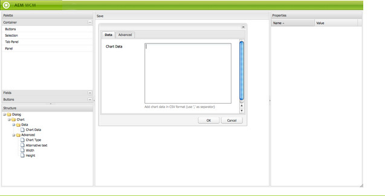

# Dialogruteredigeraren{#dialog-editor}

Dialogruteredigeraren har ett grafiskt gränssnitt för att enkelt skapa och redigera dialogrutor och ställningar.

Om du vill se hur det fungerar går du till CRXDE Lite, öppnar utforskarträdet `/libs/foundation/components/chart` och dubbelklickar på noden `dialog`:

Dialogrutenoden öppnas i **dialogruteredigeraren**:

## Översikt över användargränssnittet {#user-interface-overview}

Dialogrutans redigeringsgränssnitt består av fyra rutor:

* Paletten **** längst upp till vänster. Den här rutan innehåller de widgetar som är tillgängliga för att skapa en dialogruta, t.ex. flikpaneler, textfält, markeringslistor och knappar. Du kan expandera de olika kategorierna på paletten genom att klicka på den avgränsande listen.
* Strukturpanelen **i det nedre vänstra hörnet** av panelen. I den här rutan visas den hierarkiska strukturen för noder som utgör dialogdefinitionen. Du kan se samma struktur genom att expandera dialognoden i CRXDE Lite eller CRX Content Explorer.
* Renderingsrutan **** , mitt i fönstret. I det här fönstret visas hur den dialogrutedefinition som definierats i strukturpanelen återges som en faktisk dialogruta.
* Panelen **Egenskaper** . I den här rutan visas egenskaperna för den nod som är markerad i strukturpanelen.

### Använda Dialog Editor {#using-the-dialog-editor}

Om du vill skapa en dialogruta drar och släpper användaren element från paletten till strukturpanelen på plats i dialogrutans definitionshierarki.

När den önskade strukturen är klar klickar användaren på **Spara** högst upp i återgivningsrutan.

>[!CAUTION]
>
>Observera att dialogredigeraren är avsedd för att skapa är relativt enkla dialogrutor och kanske inte kan redigera mer komplexa dialogrutedefinitioner. Om dialogruteredigeraren inte tillåter redigering av en dialogstruktur, måste dialogdefinitionen skapas och/eller redigeras manuellt genom direkt redigering av nodstrukturen med exempelvis CRXDE Lite eller CRX Content Explorer.

### Skapa en ny dialogruta {#creating-a-new-dialog}

**** Om du vill skapa en ny dialogruta måste du markera den nödvändiga komponenten klickar du på **Skapa... och sedan** Skapa dialogruta.. .

Ange önskade uppgifter och klicka sedan på **Spara alla** . Nu kan du dubbelklicka på dialogrutan för att öppna den med redigeraren.

### Använda Dialogruteredigeraren för skåp {#using-the-dialog-editor-for-scaffolds}

Ett ställningar är en speciell sida som innehåller ett formulär som kan fyllas i och skickas i ett enda steg. På så sätt kan du snabbt skapa en sida med det innehåll som anges.

Formuläret som utgör ett ställningar definieras av en dialogrutedefinition, precis som en vanlig dialogruta, även om det visas på scensidan i ett annat format. Eftersom dialogrutedefinitioner används för att definiera ställningar kan du skapa ställningar med hjälp av dialogruteredigeraren. Observera, att när du använder dialogruteredigeraren på det här sättet visas dialogrutans definition i form av en dialogruta, inte som ett ställningar.

Mer information om hur du använder dialogruteredigeraren för att skapa ställningar finns i [Skällning](/help/sites-authoring/scaffolding.md) .
