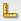
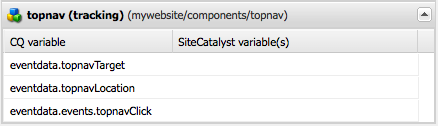

# Lägga till Adobe Analytics-spårning i komponenter{#adding-adobe-analytics-tracking-to-components}

## Inkludera Adobe Analytics-modulen i en sidkomponent {#including-the-adobe-analytics-module-in-a-page-component}

Sidmallskomponenter (t.ex. `head.jsp, body.jsp`) behöver JSP-inkluderingar för att läsa in ContextHub och Adobe Analytics-integreringen (som är en del av molntjänsterna). Alla innehåller inläsning av JavaScript-filer.

ContextHub-posten ska inkluderas direkt under `<head>` -taggen, medan molntjänster ska inkluderas i `<head>` och före `</body>` avsnittet. till exempel:

```xml
<head>
   <sling:include path="contexthub" resourceType="granite/contexthub/components/contexthub" />
...
   <cq:include script="/libs/cq/cloudserviceconfigs/components/servicelibs/servicelibs.jsp"/>
...
</head>
<body>
...
    <cq:include path="cloudservices" resourceType="cq/cloudserviceconfigs/components/servicecomponents"/>
</body>
```

Skriptet som du infogar efter `contexthub` `<head>` elementet lägger till ContextHub-funktionerna på sidan.

De skript som du lägger till i `cloudservices` -avsnitten `<head>` och - `<body>` gäller för de molntjänstkonfigurationer som läggs till på sidan. (Om sidan använder mer än en molntjänstkonfiguration behöver du bara inkludera ContextHub-jsp och Cloud Services-jsp en gång.)

När ett Adobe Analytics-ramverk läggs till på sidan genererar skripten Adobe Analytics-relaterade javascript- `cloudservices` och referenser till klientbibliotek, som i följande exempel:

```xml
<div class="sitecatalyst cloudservice">
<script type="text/javascript" src="/etc/clientlibs/foundation/sitecatalyst/sitecatalyst.js"></script>
<script type="text/javascript" src="/etc/clientlibs/foundation/sitecatalyst/util.js"></script>
<script type="text/javascript" src="/content/geometrixx-outdoors/_jcr_content/analytics.sitecatalyst.js"></script>
<script type="text/javascript" src="/etc/clientlibs/mac/mac-sc.js"></script>
<script type="text/javascript" src="/etc/clientlibs/foundation/sitecatalyst/plugins.js"></script>
<script type="text/javascript">
<!--
CQ_Analytics.Sitecatalyst.frameworkComponents = ['foundation/components/page'];
/**
 * Sets Adobe Analytics variables accordingly to mapped components. If <code>options</code>
 * object is provided only variables matching the options.componentPath are set.
 *
 * @param {Object} options Parameter object from CQ_Analytics.record() call. Optional.
 */
CQ_Analytics.Sitecatalyst.updateEvars = function(options) {
    this.frameworkMappings = [];
 this.frameworkMappings.push({scVar:"pageName",cqVar:"pagedata.title",resourceType:"foundation/components/page"});
    for (var i=0; i<this.frameworkMappings.length; i++){
  var m = this.frameworkMappings[i];
  if (!options || options.compatibility || (options.componentPath == m.resourceType)) {
   CQ_Analytics.Sitecatalyst.setEvar(m);
  }
    }
}

CQ_Analytics.CCM.addListener("storesinitialize", function(e) {
 var collect = true;
    var lte = s.linkTrackEvents;
    s.pageName="content:geometrixx-outdoors:en";
    CQ_Analytics.Sitecatalyst.collect(collect);
    if (collect) {
  CQ_Analytics.Sitecatalyst.updateEvars();
     /************* DO NOT ALTER ANYTHING BELOW THIS LINE ! **************/
     var s_code=s.t();if(s_code)document.write(s_code);
     s.linkTrackEvents = lte;
     if(s.linkTrackVars.indexOf('events')==-1){delete s.events};
     $CQ(document).trigger("sitecatalystAfterCollect");
    }
});
//-->
</script>
<script type="text/javascript">
<!--
if(navigator.appVersion.indexOf('MSIE')>=0)document.write(unescape('%3C')+'\!-'+'-')
//-->
</script>
<noscript></noscript>
<span data-tracking="{event:'pageView', values:{}, componentPath:'foundation/components/page'}"></span>
<div id="cq-analytics-texthint" style="background:white; padding:0 10px; display:none;">
 <h3 class="cq-texthint-placeholder">Component clientcontext is missing or misplaced.</h3>
</div>
<script type="text/javascript">
$CQ(function(){
 if( CQ_Analytics &&
  CQ_Analytics.ClientContextMgr &&
  !CQ_Analytics.ClientContextMgr.isConfigLoaded )
  {
   $CQ("#cq-analytics-texthint").show();
  }
});
</script>
</div>
```

Alla AEM-exempelwebbplatser som Geometrixx Outdoor har den här koden med.

### Händelsen sitecatalystAfterCollect {#the-sitecatalystaftercollect-event}

Skriptet `cloudservices` utlöser `sitecatalystAfterCollect` händelsen:

```
$CQ(document).trigger("sitecatalystAfterCollect");
```

Den här händelsen aktiveras för att ange att sidspårning har slutförts. Om du utför ytterligare spårningsåtgärder på den här sidan bör du lyssna på den här händelsen i stället för dokumentets load- eller dokumentready-händelse. Om du använder händelsen `sitecatalystAfterCollect` undviker du kollisioner eller andra oförutsägbara beteenden.

>[!NOTE]
>
>Biblioteket innehåller koden från Adobe Analytics- `/libs/cq/analytics/clientlibs/sitecatalyst/sitecatalyst.js` `s_code.js` filen.

## Implementera Adobe Analytics-spårning för anpassade komponenter {#implementing-adobe-analytics-tracking-for-custom-components}

Gör det möjligt för dina AEM-komponenter att interagera med Adobe Analytics-ramverket. Konfigurera sedan ramverket så att Adobe Analytics spårar komponentdata.

Komponenter som interagerar med Adobe Analytics-ramverket visas i SideKick när du redigerar ett ramverk. När du har dragit komponenten till ramverket visas komponentegenskaperna och du kan sedan mappa dem med Adobe Analytics-egenskaper. (Se [Konfigurera ett ramverk för grundläggande spårning](/help/sites-administering/adobeanalytics-connect.md#creating-a-adobe-analytics-framework).)

Komponenter kan interagera med Adobe Analytics-ramverket när komponenten har en underordnad nod med namnet `analytics`. Noden har `analytics` följande egenskaper:

* `cq:trackevents`: Identifierar de CQ-händelser som komponenten visar. (Se Anpassade händelser.)
* `cq:trackvars`: Namnger de CQ-variabler som mappas med Adobe Analytics-egenskaper.
* `cq:componentName`: Namnet på komponenten som visas i Sidespark.
* `cq:componentGroup`: Gruppen i Sidekick som innehåller komponenten.

Koden i komponent-JSP lägger till javascript på sidan som utlöser spårningen och definierar data som spåras. Händelsenamnet och datanamnen som används i javascript måste matcha motsvarande värden för `analytics` nodegenskaperna.

* Använd dataspårningsattributet för att spåra händelsedata när en sida läses in. (Se [Spåra anpassade händelser vid sidinläsning](/help/sites-developing/extending-analytics.md#tracking-custom-events-on-page-load).)
* Använd funktionen CQ_Analytics.record för att spåra händelsedata när användarna interagerar med sidfunktioner. (Se [Spåra anpassade händelser efter sidinläsning](/help/sites-developing/extending-analytics.md#tracking-custom-events-after-page-load).)

När du använder dessa dataspårningsmetoder utför Adobe Analytics-integreringsmodulen automatiskt anrop till Adobe Analytics för att registrera händelser och data.

### Exempel: Spåra topnav Clicks {#example-tracking-topnav-clicks}

Utöka grundkomponenten så att Adobe Analytics kan spåra klickningar på navigeringslänkar högst upp på sidan. När användaren klickar på en navigeringslänk registreras länken som användaren klickade på och den sida där den klickades.

Följande procedurer kräver att du redan har utfört följande uppgifter:

* Skapade ett CQ-program.
* Skapade en Adobe Analytics-konfiguration och ett Adobe Analytics-ramverk.

#### Kopiera den övre komponenten {#copy-the-topnav-component}

Kopiera den övre komponenten till CQ-programmet. Proceduren kräver att programmet är konfigurerat i CRXDE Lite.

1. Högerklicka på `/libs/foundation/components/topnav` noden och klicka på Kopiera.
1. Högerklicka på mappen Komponenter under programmappen och klicka på Klistra in.
1. Klicka på Spara alla.

#### Integrera topnav med Adobe Analytics Framework {#integrating-topnav-with-the-adobe-analytics-framework}

Konfigurera den övre komponenten och redigera JSP-filen för att definiera spårningshändelser och data.

1. Högerklicka på den övre noden och klicka på Skapa > Skapa nod. Ange följande egenskapsvärden och klicka sedan på OK:

   * Namn: `analytics`
   * Typ: `nt:unstructured`

1. Lägg till följande egenskap i analysnoden för att namnge spårningshändelsen:

   * Namn: cq:trackevents
   * Typ:Sträng
   * Värde: topnavClick

1. Lägg till följande egenskap i analysnoden för att namnge datavariablerna:

   * Namn: cq:trackvar
   * Typ:Sträng
   * Värde: topnavTarget,topnavLocation

1. Lägg till följande egenskap i analysnoden för att namnge komponenten för Sidespark:

   * Namn: cq:componentName
   * Typ:Sträng
   * Värde: topnav (spärra/knip)

1. Lägg till följande egenskap i analysnoden för att namnge komponentgruppen för Sidespark:

   * Namn: cq:componentGroup
   * Typ:Sträng
   * Värde:Allmänt

1. Klicka på Spara alla.
1. Open the `topnav.jsp` file.
1. Lägg till följande attribut i ett element:

   ```xml
   onclick = "tracknav('<%= child.getPath() %>.html')"
   ```

1. Längst ned på sidan lägger du till följande javascript-kod:

   ```xml
   <script type="text/javascript">
       function tracknav(target) {
               if (CQ_Analytics.Sitecatalyst) {
                   CQ_Analytics.record({
                       event: 'topnavClick',
                       values: {
                           topnavTarget: target,
                           topnavLocation:'<%=currentPage.getPath() %>.html'
                       },
                       componentPath: '<%=resource.getResourceType()%>'
                   });
               }
       }
   </script>
   ```

1. Klicka på Spara alla.

Innehållet i `topnav.jsp` filen ska se ut så här:

```xml
<%@page session="false"%><%--
  Copyright 1997-2008 Day Management AG
  Barfuesserplatz 6, 4001 Basel, Switzerland
  All Rights Reserved.

  This software is the confidential and proprietary information of
  Day Management AG, ("Confidential Information"). You shall not
  disclose such Confidential Information and shall use it only in
  accordance with the terms of the license agreement you entered into
  with Day.

  ==============================================================================

  Top Navigation component

  Draws the top navigation

--%><%@include file="/libs/foundation/global.jsp"%><%
%><%@ page import="java.util.Iterator,
        com.day.text.Text,
        com.day.cq.wcm.api.PageFilter,
        com.day.cq.wcm.api.Page,
        com.day.cq.commons.Doctype,
        org.apache.commons.lang3.StringEscapeUtils" %><%

    // get starting point of navigation
    long absParent = currentStyle.get("absParent", 2L);
    String navstart = Text.getAbsoluteParent(currentPage.getPath(), (int) absParent);

    //if not deep enough take current node
    if (navstart.equals("")) navstart=currentPage.getPath();

    Resource rootRes = slingRequest.getResourceResolver().getResource(navstart);
    Page rootPage = rootRes == null ? null : rootRes.adaptTo(Page.class);
    String xs = Doctype.isXHTML(request) ? "/" : "";
    if (rootPage != null) {
        Iterator<Page> children = rootPage.listChildren(new PageFilter(request));
        while (children.hasNext()) {
            Page child = children.next();
            %><a onclick = "tracknav('<%= child.getPath() %>.html')"  href="<%= child.getPath() %>.html"><%
            %>" src="<%= child.getPath() %>.navimage.png"<%= xs %>></a><%
        }
    }
%><script type="text/javascript">
    function tracknav(target) {
            if (CQ_Analytics.Sitecatalyst) {
                CQ_Analytics.record({
                    event: 'topnavClick',
                    values: {
                        topnavTarget:target,
                        topnavLocation:'<%=currentPage.getPath() %>.html'
                    },
                    componentPath: '<%=resource.getResourceType()%>'
                });
            }
    }
</script>
```

>[!NOTE]
>
>Det är ofta önskvärt att spåra data från ContextHub. Mer information om hur du använder javascript för att hämta den här informationen finns i [Åtkomst av värden i ContextHub](/help/sites-developing/extending-analytics.md#accessing-values-in-the-contexthub).

#### Lägga till spårningskomponenten i Sidekick {#adding-the-tracking-component-to-sidekick}

Lägg till komponenter som är aktiverade för spårning med Adobe Analytics i Sidekick så att ni kan lägga till dem i ert ramverk.

1. Öppna Adobe Analytics-ramverket från din Adobe Analytics-konfiguration. ([http://localhost:4502/etc/cloudservices/sitecatalyst.html](http://localhost:4502/etc/cloudservices/sitecatalyst.html))
1. På Sidekick klickar du på knappen Design.

   

1. Klicka på Konfigurera arv i området Konfiguration av länkspårning.

   

1. I listan Tillåtna komponenter väljer du topnav (spårning) i avsnittet Allmänt och klickar sedan på OK.
1. Expandera Sidekick för att gå över till redigeringsläge. Komponenten är nu tillgänglig i gruppen Allmänt.

#### Lägga till komponenten topnav i ramverket {#adding-the-topnav-component-to-your-framework}

Dra den övre komponenten till Adobe Analytics-ramverket och mappa komponentvariablerna och händelserna till Adobe Analytics-variabler och -händelser. (Se [Konfigurera ett ramverk för grundläggande spårning](/help/sites-administering/adobeanalytics-connect.md).)



Den främsta komponenten är nu integrerad med Adobe Analytics-ramverket. När du lägger till komponenten på en sida skickas spårningsdata till Adobe Analytics om du klickar på objekten i det övre navigeringsfältet.

### Skicka s.products-data till Adobe Analytics {#sending-s-products-data-to-adobe-analytics}

Komponenter kan generera data för variabeln s.products som skickas till Adobe Analytics. Utforma komponenterna för att bidra till variabeln s.products:

* Registrera ett värde med namnet `product` på en viss struktur.
* Exponera värdeets datamedlemmar så att de kan mappas med Adobe Analytics-variabler i Adobe Analytics-ramverket. `product`

Variabeln Adobe Analytics s.products har följande syntax:

```
s.products="category;product;quantity;price;eventY={value}|eventZ={value};evarA={value}|evarB={value}"
```

Integreringsmodulen i Adobe Analytics skapar `s.products` variabeln med de `product` värden som AEM-komponenterna genererar. Värdet i javascript- `product` koden som AEM-komponenter genererar är en array med värden som har följande struktur:

```
"product": [{
    "category": "",
    "sku"     : "path to product node",
    "quantity": quantity,
    "price"   : price,
    "events   : {
      "eventName1": "eventValue1",
      "eventName_n": "eventValue_n"
    }
    "evars"   : {
      "eVarName1": "eVarValue1",
      "eVarName_n": "eVarValue_n"
    }
}]
```

När ett dataobjekt utelämnas från `product` värdet skickas det som en tom sträng i s.products.

>[!NOTE]
>
>När ingen händelse är associerad med ett produktvärde använder Adobe Analytics `prodView` händelsen som standard.

Komponentens `analytics` nod måste visa variabelnamnen med hjälp av `cq:trackvars` egenskapen:

* product.category
* product.sku
* product.quantity
* product.price
* product.events.eventName1
* product.events.eventName_n
* product.evars.eVarName1
* product.evars.eVarName_n

eCommerce-modulen innehåller flera komponenter som genererar variabeldata för s.products. Komponenten Skicka ([http://localhost:4502/crx/de/index.jsp#/libs/commerce/components/submitorder/submitorder.jsp](http://localhost:4502/crx/de/index.jsp#/libs/commerce/components/submitorder/submitorder.jsp)) genererar till exempel javascript som liknar följande exempel:

```
<script type="text/javascript">
    function trackCartPurchase() {
        if (CQ_Analytics.Sitecatalyst) {
            CQ_Analytics.record({
                "event": ["productsCartPurchase"],
                "values": {
                    "product": [
                        {
                            "category": "",
                            "sku"     : "/path/to/prod/1",
                            "quantity": 3,
                            "price"   : 179.7,
                            "evars"   : {
                                "childSku": "/path/to/prod/1/green/xs",
                                "size"    : "XS"
                            }
                        },
                        {
                            "category": "",
                            "sku"     : "/path/to/prod/2",
                            "quantity": 10,
                            "price"   : 150,
                            "evars"   : {
                                "childSku": "/path/to/prod/2",
                                "size"    : ""
                            }
                        },
                        {
                            "category": "",
                            "sku"     : "/path/to/prod/3",
                            "quantity": 2,
                            "price"   : 102,
                            "evars"   : {
                                "childSku": "/path/to/prod/3/m",
                                "size"    : "M"
                            }
                        }
                    ]
                },
                "componentPath": "commerce/components/submitorder"
            });
            CQ_Analytics.record({
                "event": ["discountRedemption"],
                "values": {
                    "discount": "/path/to/discount/1 - /path/to/discount/2",
                    "product" : [{
                        "category": "",
                        "sku"     : "Promotional Discount",
                        "events"  : {"discountRedemption": 20.00}
                    }]
                },
                "componentPath": "commerce/components/submitorder"
            });
            CQ_Analytics.record({
                "event": ["cartPurchase"],
                "values": {
                    "orderId"       : "00e40e2d-13a2-4a00-a8ee-01a9ebb0bf68",
                    "shippingMethod": "overnight",
                    "paymentMethod" : "Amex",
                    "billingState"  : "NY",
                    "billingZip"    : "10458",
                    "product"       : [{"category": "", "sku": "", "quantity": "", "price": ""}]
                },
                "componentPath": "commerce/components/submitorder"
            });
        }
        return true;
    }
</script>
```

#### Begränsa storleken på spårningsanrop {#limiting-the-size-of-tracking-calls}

Webbläsare begränsar i allmänhet storleken på GET-begäranden. Eftersom CQ-produkter och SKU-värden är databassökvägar, kan produktarrayer som innehåller flera värden överskrida storleksgränsen för begäran. Därför bör dina komponenter begränsa antalet objekt i arrayen `product` för varje `CQ_Analytics.record function`. Skapa flera funktioner om antalet objekt som du måste spåra kan överskrida gränsen.

eCommerce-komponenten för indataorder begränsar till exempel antalet objekt i ett anrop till fyra. `product` När vagnen innehåller fler än fyra produkter genereras flera `CQ_Analytics.record` funktioner.
