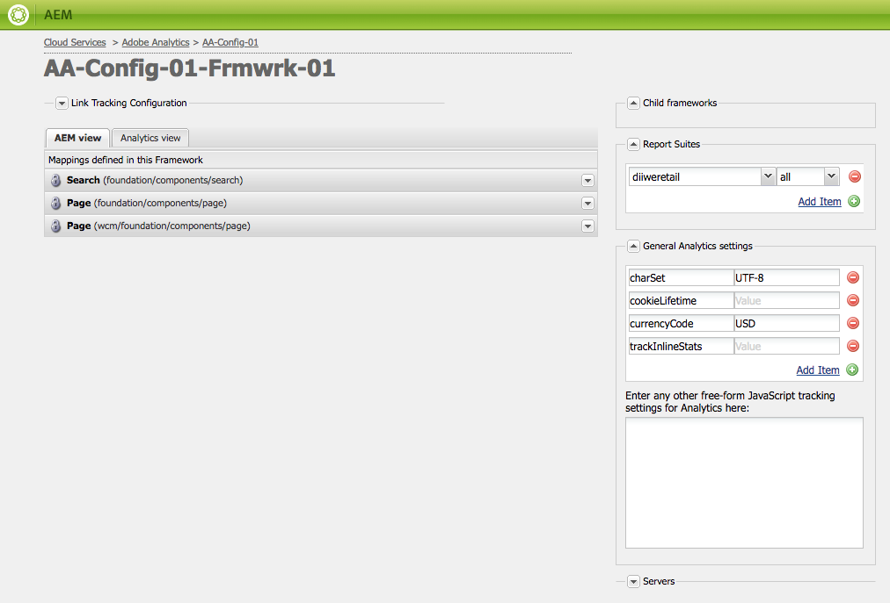

# Anpassa Adobe Analytics Framework{#customizing-the-adobe-analytics-framework}

Adobe Analytics-ramverket avgör vilken information som spåras med Adobe Analytics. Om du vill anpassa standardramverket använder du javascript för att lägga till anpassad spårning, integrera Adobe Analytics-plugin-program och ändra allmänna inställningar i det ramverk som används för spårning.

## Om genererat javascript för ramverk {#about-the-generated-javascript-for-frameworks}

När en sida är kopplad till ett Adobe Analytics-ramverk och sidan innehåller [referenser till analysmodulen](/help/sites-administering/adobeanalytics.md), genereras automatiskt filen analytics.sitecatalyst.js för sidan.

Javascript på sidan skapar ett `s_gi`objekt (som Adobe Analytics-biblioteket s_code.js definierar) och tilldelar värden till dess egenskaper. Namnet på objektinstansen är `s`. De kodexempel som presenteras i det här avsnittet innehåller flera referenser till den här `s` variabeln.

Följande exempelkod liknar koden i en analytics.sitecatalyst.js-fil:

```
var s_account = "my_sitecatalyst_account";
var s = s_gi(s_account);
s.fpCookieDomainPeriods = "3";
s.currencyCode= 'USD';
s.trackInlineStats= true;
s.linkTrackVars= 'None';
s.charSet= 'UTF-8';
s.linkLeaveQueryString= false;
s.linkExternalFilters= '';
s.linkTrackEvents= 'None';
s.trackExternalLinks= true;
s.linkDownloadFileTypes= 'exe,zip,wav,mp3,mov,mpg,avi,wmv,doc,pdf,xls';
s.linkInternalFilters= 'javascript:,'+window.location.hostname;
s.trackDownloadLinks= true;

s.visitorNamespace = "mynamespace";
s.trackingServer = "xxxxxxx.net";
s.trackingServerSecure = "xxxxxxx.net";

/* Plugin Config */
/*
s.usePlugins=false;
function s_doPlugins(s) {
    //add your custom plugin code here
}
s.doPlugins=s_doPlugins;
*/
```

När du använder anpassad javascript-kod för att anpassa ramverket ändrar du innehållet i den här filen.

## Konfigurera Adobe Analytics-egenskaper {#configuring-adobe-analytics-properties}

Det finns ett antal fördefinierade variabler i Adobe Analytics som kan konfigureras i ett ramverk. Variablerna **charset**, **cookieLifetime**, **currencyCode** och **trackInlineStats** ingår som standard i listan Inställningar **för** allmän analys.



Du kan lägga till variabelnamn och värden i listan. Dessa fördefinierade variabler och eventuella variabler som du lägger till används för att konfigurera egenskaperna för `s` objektet i filen analytics.sitecatalyst.js. I följande exempel visas hur värdegenskapen added `prop10` `CONSTANT` representeras i javascript-koden:

```
var s_account = "my_sitecatalyst_account";
var s = s_gi(s_account);
s.fpCookieDomainPeriods = "3";
s.currencyCode= 'USD';
s.trackInlineStats= true;
s.linkTrackVars= 'None';
s.charSet= 'UTF-8';
s.linkLeaveQueryString= false;
s.linkExternalFilters= '';
s.linkTrackEvents= 'None';
s.trackExternalLinks= true;
s.linkDownloadFileTypes= 'exe,zip,wav,mp3,mov,mpg,avi,wmv,doc,pdf,xls';
s.prop10= 'CONSTANT';
s.linkInternalFilters= 'javascript:,'+window.location.hostname;
s.trackDownloadLinks= true;

s.visitorNamespace = "mynamespace";
s.trackingServer = "xxxxxxx.net";
s.trackingServerSecure = "xxxxxxx.net";
```

Använd följande procedur för att lägga till variabler i listan:

1. På din Adobe Analytics-ramverkssida expanderar du området **Allmänna analysinställningar** .
1. Under variabellistan klickar du på Lägg till objekt för att lägga till en ny variabel i listan.
1. I den vänstra cellen skriver du ett namn på variabeln, till exempel `prop10`.

1. I den högra kolumnen anger du till exempel ett värde för variabeln `CONSTANT`.

1. Om du vill ta bort en variabel klickar du på knappen (-) bredvid variabeln.

>[!NOTE]
>
>När du anger variabler och värden måste du se till att de är korrekt formaterade och stavade, annars skickas **inte** anropen med rätt värde/variabelpar. Felstavade variabler och värden kan till och med förhindra anrop.
>
>Kontakta din Adobe Analytics-representant för att kontrollera att dessa variabler är korrekt inställda.

>[!CAUTION]
>
>Vissa av variablerna i den här listan är **obligatoriska** för att Adobe Analytics-anrop ska fungera korrekt (t.ex. **currencyCode**, **charSet**)
>
>Så även om de tas bort från själva ramverket kommer de fortfarande att få ett standardvärde när Adobe Analytics-anropet görs.

### Lägga till egna javascript i ett Adobe Analytics Framework {#adding-custom-javascript-to-an-adobe-analytics-framework}

Med den kostnadsfria javascript-rutan i området **Allmänna analysinställningar** kan du lägga till anpassad kod i ett Adobe Analytics-ramverk.


Koden som du lägger till läggs till i filen analytics.sitecatalyst.js. Därför kan du komma åt variabeln, som är en instans av det `s` javascript-objekt som definieras i `s_gi` `s_code.js`. Att lägga till följande kod motsvarar till exempel att lägga till en variabel med namnet `prop10` på värdet `CONSTANT`som är exemplet i föregående avsnitt:

`s.prop10= 'CONSTANT';`

Koden i filen [analytics.sitecatalyst.js](/help/sites-developing/extending-analytics-components.md) (som innehåller innehållet i Adobe Analytics- `s-code.js` filen) innehåller följande kod:

`if (s.usePlugins) s.doPlugins(s)`

Följande procedur visar hur du använder javascript-rutan för att anpassa Adobe Analytics-spårning. Om ditt javascript behöver använda Adobe Analytics-plugin-program [integrerar du dem](/help/sites-administering/adobeanalytics.md) i AEM.

1. Lägg till följande javascript-kod i rutan så att den `s.doPlugins` körs:

   ```
   s.usePlugins=true;
   function s_doPlugins(s) {
       //add your custom code here
   }
   s.doPlugins=s_doPlugins;
   ```

   >[!CAUTION]
   >
   >Den här koden är nödvändig om du vill skicka variabler i ett Adobe Analytics-anrop som har anpassats på något sätt som inte går att göra via det grundläggande dra&amp;släpp-gränssnittet ELLER via det infogade javascript-objektet i Adobe Analytics-vyn.
   >
   >Om de anpassade variablerna ligger utanför s_doPlugins-funktionen skickas de som *undefined *i Adobe Analytics-anropet

1. Lägg till din javascript-kod i **funktionen s_doPlugins** .

I följande exempel sammanfogas de data som samlats in på en sida i hierarkisk ordning med hjälp av en gemensam avgränsare (|).

Ett Adobe Analytics-ramverk har följande konfigurationer:

* Variabeln `prop2` Adobe Analytics mappas till egenskapen `pagedata.sitesection` site.

* Variabeln `prop3` Adobe Analytics mappas till egenskapen `pagedata.subsection` site.

* Följande kod läggs till i den kostnadsfria javascript-rutan:

   ```
   s.usePlugins=true;
    function s_doPlugins(s) {
    s.prop1 = s.prop2+'|'+s.prop3;
    }
    s.doPlugins=s_doPlugins;
   ```

* När webbsidan som använder ramverket besöktes (eller, i redigeringsläge, sidan läses in igen eller förhandsgranskas), anropas Adobe Analytics.

Följande värden genereras till exempel i Adobe Analytics:


### Lägga till global anpassad kod för alla Adobe Analytics-ramverk {#adding-global-custom-code-for-all-adobe-analytics-frameworks}

Skapa anpassad javascript-kod som är integrerad i alla Adobe Analytics-ramverk. När en sidas Adobe Analytics-ramverk inte innehåller något anpassat Javascript [med](/help/sites-administering/adobeanalytics.md)fri form läggs det javascript som genereras av /libs/cq/analytics/components/sitecatalyst/config.js.jsp-skriptet till i [filen analytics.sitecatalyst.js](/help/sites-administering/adobeanalytics.md) . Skriptet har som standard ingen effekt eftersom det kommenteras ut. Koden anges också `s.usePlugins` till `false`:

```
/* Plugin Config */
/*
s.usePlugins=false;
function s_doPlugins(s) {
    //add your custom plugin code here
}
s.doPlugins=s_doPlugins;
*/
```

Koden i filen analytics.sitecatalyst.js (som innehåller innehållet i Adobe Analytics-filen s_code.js) innehåller följande kod:

if (s.usePlugins) s.doPlugins(s)

Därför bör javascript anges `s.usePlugins` till `true` så att all kod i `s_doPlugins` funktionen körs. Om du vill anpassa koden ska du överlappa config.js.jsp-filen med en som använder ditt eget javascript. Om ditt javascript behöver använda Adobe Analytics-plugin-program [integrerar du dem](/help/sites-administering/adobeanalytics.md) i AEM.

>[!NOTE]
>
>Redigera inte filen /libs/cq/analytics/components/sitecatalyst/config.js.jsp. Vissa AEM-uppgraderings- eller underhållsåtgärder kan installera om originalfilen och ta bort ändringarna.

1. I CRXDE Lite skapar du mappstrukturen /apps/cq/analytics/components:

   1. Högerklicka på mappen /apps och klicka på Create > Create Folder.
   1. Ange `cq` som mappnamn och klicka på OK.
   1. Skapa på samma sätt mapparna `analytics` och `components` .

1. Högerklicka på den `components` mapp du nyss skapade och klicka på Skapa > Skapa komponent. Ange följande egenskapsvärden:

   * Etikett: `sitecatalyst`
   * Titel: `sitecatalyst`
   * Supertyp: `/libs/cq/analytics/components/sitecatalyst`
   * Grupp: `hidden`

1. Klicka på Nästa upprepade gånger tills knappen OK är aktiverad och klicka sedan på OK.

   Komponenten sitecatalyst innehåller den automatiskt skapade filen sitecatalyst.jsp.

1. Högerklicka på filen sitecatalyst.jsp och klicka på Ta bort.

1. Högerklicka på sitecatalyst-komponenten och klicka på Skapa > Skapa fil. Ange namnet `config.js.jsp` och klicka sedan på OK.

   config.js.jsp-filen öppnas automatiskt för redigering.

1. Lägg till följande text i filen och klicka sedan på Spara alla:

   ```java
   <%@page session="true"%>
   /* Plugin Config */
   s.usePlugins=true;
   function s_doPlugins(s) {
       //add your custom plugin code here
   }
   s.doPlugins=s_doPlugins;
   ```

   Den javascript-kod som genereras av /apps/cq/analytics/components/sitecatalyst/config.js.jsp-skriptet infogas nu i filen analytics.sitecatalyst.js för alla sidor som använder ett Adobe Analytics-ramverk.

1. Lägg till den javascript-kod som du vill köra i `s_doPlugins` funktionen och klicka sedan på Spara alla.

>[!CAUTION]
>
>Om det finns text i det friformade javascript-skriptet för en sidas ramverk (även om bara tomt utrymme), ignoreras config.js.jsp.

### Använda Adobe Analytics-plugin-program i AEM {#using-adobe-analytics-plugins-in-aem}

Hämta javascript-koden för Adobe Analytics-pluginer och integrera dem i Adobe Analytics-ramverket i AEM. Lägg till koden i en klientbiblioteksmapp i kategorin `sitecatalyst.plugins` så att den är tillgänglig för din anpassade javascript-kod.

Om du till exempel integrerar `getQueryParams` -plugin-programmet kan du anropa plugin-programmet från funktionen `s_doPlugins` i ditt anpassade javascript. Följande exempelkod skickar frågesträngen i **&quot;pid&quot;** från referentens URL som **eVar1** när ett Adobe Analytics-anrop utlöses.

```
s.usePlugins=true;
function s_doPlugins(s) {
   // take the query string from the referrer
   s.eVar1=s.getQueryParam('pid','',document.referrer);
}
s.doPlugins=s_doPlugins;
```

AEM installerar följande Adobe Analytics-plugin-program så att de är tillgängliga som standard:

* getQueryParam()
* getPreviousValue()
* split()

Klientbiblioteksmappen /libs/cq/analytics/clientlibs/sitecatalyst/plugins innehåller dessa plugin-program i kategorin sitecatalyst.plugins.

>[!NOTE]
>
>Skapa en ny biblioteksmapp för dina plugin-program. Lägg inte till plugin-program i `/libs/cq/analytics/clientlibs/sitecatalyst/plugins` mappen. Detta säkerställer att ditt bidrag till `sitecatalyst.plugins` kategorin inte skrivs över under AEM-ominstallationer eller uppgraderingar.

Använd följande procedur för att skapa klientbiblioteksmappen för dina plugin-program. Du behöver bara utföra den här proceduren en gång. Om du vill lägga till ett plugin-program i klientbiblioteksmappen gör du följande.

1. Öppna CRXDE Lite i en webbläsare. ([http://localhost:4502/crx/de](http://localhost:4502/crx/de))

1. Högerklicka på mappen /apps/my-app/clientlibs och klicka på Skapa > Skapa nod. Ange följande egenskapsvärden och klicka sedan på OK:

   * Namn: Ett namn för klientbiblioteksmappen, till exempel mina plugin-program

   * Typ: cq:ClientLibraryFolder

1. Markera klientbiblioteksmappen som du nyss skapade och använd egenskapsfältet längst ned till höger för att lägga till följande egenskap:

   * Namn: kategorier
   * Typ:Sträng
   * Värde: sitecatalyst.plugins
   * Flera: markerad
   Klicka på OK i redigeringsfönstret för att bekräfta egenskapsvärdet.

1. Högerklicka på klientbiblioteksmappen som du nyss skapade och klicka på Skapa > Skapa fil. För filnamnstypen js.txt och klicka sedan på OK.

1. Klicka på Spara alla.

Gör så här för att hämta plugin-programkoden, lagra koden i AEM-databasen och lägga till koden i klientbiblioteksmappen.

1. Logga in på [sc.omniture.com](https://sc.omniture.com) med ditt Adobe Analytics-konto.
1. På landningssidan går du till Hjälp > Hem för hjälpen.
1. Klicka på Implementeringsplugin-program i innehållsförteckningen till vänster.
1. Klicka på länken till det plugin-program som du vill lägga till, och när sidan öppnas, leta reda på JavaScript-källkoden för plugin-programmet, markera koden och kopiera den.

1. Högerklicka på klientbiblioteksmappen och klicka på Skapa > Skapa fil. För filnamnet skriver du namnet på det plugin-program som du integrerar följt av .js och klickar sedan på OK. Om du till exempel integrerar plugin-programmet getQueryParam ger du filen namnet getQueryParam.js.

   När du skapar filen öppnas den för redigering.

1. Klistra in plugin-programmets javascript-kod i filen, klicka på Spara alla och stäng sedan filen.

1. Öppna filen js.txt från klientbiblioteksmappen.

1. På en ny rad lägger du till namnet på filen som innehåller plugin-programmet, till exempel getQueryParam.js. Klicka sedan på Spara alla och stäng filen.

>[!NOTE]
>
>När du använder plugin-program måste du även integrera eventuella plugin-program, annars känner plugin-programmet inte igen de anrop som görs till funktionerna i det plugin-program som stöds. Plugin-programmet getPreviousValue() kräver till exempel att plugin-programmet split() fungerar korrekt.
>
>Namnet på plugin-programmet för support måste också läggas till i **js.txt** .
