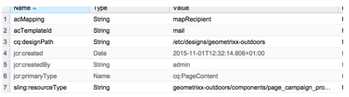

# Skapa en anpassad AEM-sidmall med Adobe Campaign-formulärkomponenter{#creating-custom-aem-page-template-with-adobe-campaign-form-components}

På den här sidan beskrivs hur du skapar en anpassad sidmall som använder [Adobe Campaign-formulärkomponenter](/help/sites-authoring/adobe-campaign-components.md) genom att undersöka hur mallen Geometrixx-outdoor ( `/apps/geometrixx-outdoors/components/page_campaign_profile`) implementeras och pekar på viktig information som du kan behöva när du skapar en egen anpassad mall.

>[!NOTE]
>
>[E-post och formulärexempel är bara tillgängliga i Geometrixx](/help/sites-developing/we-retail.md). Hämta exempelinnehåll för Geometrixx från paketresurs.

Om du vill skapa en anpassad AEM-sidmall med hjälp av Adobe Campaign-formulärkomponenter måste du ha följande:

1. **Korrigera resourceSuperType**

   Kontrollera att sidkomponenten ärver från `mcm/campaign/components/profile`.

   Detta krävs för att servletarna ska kunna hämta och spara information

   * `com.day.cq.mcm.campaign.servlets.TemplateListServlet`
   * `com.day.cq.mcm.campaign.servlets.SaveProfileServlet`
   

1. **Klientkontextinställningar**

   När du tittar på klientkontextinställningarna ( `/etc/designs/geometrixx-outdoors/jcr:content/page_campaign_profile`) ser du följande inställningar:

   * ClientContext pekar på `/etc/clientcontext/campaign`
   * Det finns även en extra *config* -nod.
   

1. **head.jsp (/apps/geometrixx-outdoors/components/page_campaign_profile/head.jsp)**

   I **head.jsp** visas följande rader som använder **clientcontext-config** och **cloudservice-kroken**:

   ```
   <cq:include path="config" resourceType="cq/personalization/components/clientcontext_optimized/config"/>
   <sling:include path="contexthub" resourceType="granite/contexthub/components/contexthub"/>
   <cq:include script="/libs/cq/cloudserviceconfigs/components/servicelibs/servicelibs.jsp"/>
   ```

1. **body.jsp (/apps/geometrixx-outdoors/components/page_campaign_profile/body.jsp)**

   I **body.jsp** läses molntjänsterna in längst ned på sidan:

   ```
   <cq:include path="cloudservices" resourceType="cq/cloudserviceconfigs/components/servicecomponents"/>
   ```

1. **Egenskaper för kampanjsida**

   För att kunna välja en Adobe Campaign-mall utökas sidegenskaperna med fliken **Campaign** :

   `/apps/geometrixx-outdoors/components/page_campaign_profile/dialog/items/tabs/items/campaign`

   

1. **Mallinställningar**.

   I mallen ( `/apps/geometrixx-outdoors/templates/campaign_profile/jcr:content`) visas följande standardvärden:

   | **acMapping** | mapRecipient (för Adobe Campaign 6.1), profile (för Adobe Campaign Standard) |
   |---|---|
   | **acTemplateId** | mail |

   

